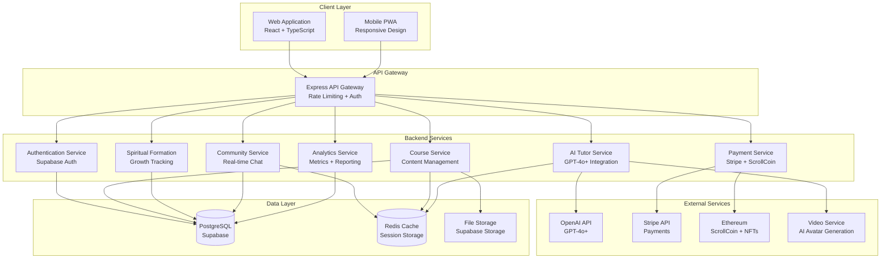
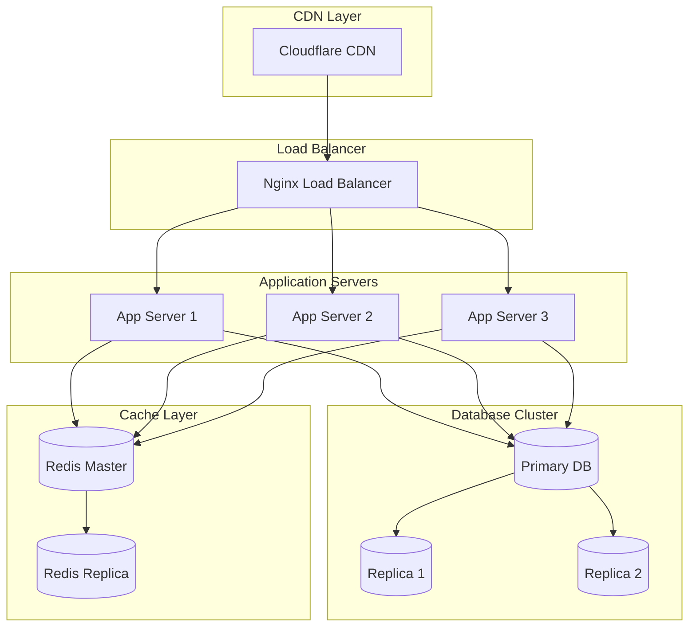

# Complete Production System Design Document

## Overview

The Complete Production System design provides a comprehensive architecture for the Zion-Scroll-FORGE AppSystem, integrating all components into a cohesive, production-ready platform. The system follows microservices principles with a monorepo structure, leveraging Supabase for backend services, React for the frontend, and blockchain technology for credentials and economy.

The architecture prioritizes:
- **Reliability**: 99.9% uptime with graceful degradation
- **Scalability**: Horizontal scaling to support millions of users
- **Security**: End-to-end encryption and compliance with GDPR/FERPA
- **Performance**: Sub-second response times for all operations
- **Spiritual Alignment**: Kingdom-focused features integrated throughout

## Architecture

### High-Level System Architecture



### Technology Stack

**Frontend:**
- React 18.3+ with TypeScript 5.8+
- Tailwind CSS for styling
- Shadcn UI component library
- React Router for navigation
- TanStack Query for data fetching
- Supabase client for real-time features

**Backend:**
- Node.js 20+ with Express.js
- TypeScript with strict mode
- Prisma ORM for database access
- Supabase for authentication and real-time
- Redis for caching and sessions
- Winston for logging

**Database:**
- PostgreSQL 15+ (via Supabase)
- Redis 7+ for caching
- Supabase Storage for files

**External Services:**
- OpenAI GPT-4o+ for AI tutoring
- Stripe for payment processing
- Ethereum for blockchain credentials
- D-ID or Synthesia for AI video avatars

## Components and Interfaces

### 1. Backend API Infrastructure

#### Express Server Configuration

```typescript
interface ServerConfig {
  port: number;
  environment: 'development' | 'production';
  clusterWorkers: number;
  corsOrigins: string[];
  rateLimits: RateLimitConfig;
}

interface RateLimitConfig {
  general: { windowMs: number; max: number };
  auth: { windowMs: number; max: number };
  api: { windowMs: number; max: number };
}
```

**Implementation Details:**
- Clustering enabled in production for horizontal scaling
- Graceful shutdown handling for zero-downtime deployments
- Health check endpoint at `/health` with database connectivity verification
- Metrics endpoint at `/metrics` for monitoring systems
- Request logging with correlation IDs for tracing
- Error handling middleware with proper status codes and messages

#### API Endpoints Structure

```typescript
interface APIEndpoint {
  method: 'GET' | 'POST' | 'PUT' | 'DELETE' | 'PATCH';
  path: string;
  authentication: boolean;
  authorization: UserRole[];
  rateLimit: RateLimitConfig;
  validation: ValidationSchema;
  handler: RequestHandler;
}

// Core API Routes
const routes = {
  auth: '/api/auth/*',
  users: '/api/users/*',
  courses: '/api/courses/*',
  aiTutors: '/api/ai-tutors/*',
  community: '/api/community/*',
  scrollcoin: '/api/scrollcoin/*',
  spiritual: '/api/spiritual-formation/*',
  analytics: '/api/analytics/*',
  admissions: '/api/admissions/*',
  payments: '/api/payments/*'
};
```

### 2. Supabase Integration

#### Database Schema Synchronization

```typescript
interface SupabaseSchema {
  tables: TableDefinition[];
  views: ViewDefinition[];
  functions: FunctionDefinition[];
  triggers: TriggerDefinition[];
  policies: RLSPolicy[];
}

interface RLSPolicy {
  table: string;
  operation: 'SELECT' | 'INSERT' | 'UPDATE' | 'DELETE';
  using: string; // SQL expression
  withCheck?: string; // SQL expression for INSERT/UPDATE
}
```

**Migration Strategy:**
1. Generate Supabase migrations from Prisma schema
2. Apply RLS policies for each table based on user roles
3. Create database functions for complex operations
4. Set up real-time subscriptions for live updates
5. Configure storage buckets with access policies

#### Real-time Subscriptions

```typescript
interface RealtimeSubscription {
  channel: string;
  table: string;
  event: 'INSERT' | 'UPDATE' | 'DELETE' | '*';
  filter?: string;
  callback: (payload: RealtimePayload) => void;
}

// Example subscriptions
const subscriptions = [
  { channel: 'messages', table: 'messages', event: '*' },
  { channel: 'notifications', table: 'notifications', event: 'INSERT' },
  { channel: 'course_progress', table: 'enrollments', event: 'UPDATE' }
];
```

### 3. AI Tutor System with Live Video Avatars

#### AI Tutor Architecture

```typescript
interface AITutor {
  id: string;
  name: string;
  specialty: string;
  personality: AIPersonality;
  avatar: AvatarConfig;
  capabilities: TutorCapabilities;
}

interface AvatarConfig {
  provider: 'did' | 'synthesia' | 'custom';
  avatarId: string;
  voice: VoiceConfig;
  appearance: AppearanceConfig;
}

interface TutorCapabilities {
  realTimeLecture: boolean;
  questionAnswering: boolean;
  slideGeneration: boolean;
  quizCreation: boolean;
  lessonSummarization: boolean;
  visualExplanations: boolean;
}
```

**Implementation Flow:**
1. Student initiates tutoring session
2. System loads AI tutor configuration and context
3. Video avatar stream starts with greeting
4. Student can ask questions via text or voice
5. AI processes question and generates response
6. Avatar speaks response with synchronized lip movements
7. System generates visual aids (slides, diagrams) as needed
8. Session history saved for continuity

#### Video Avatar Integration

```typescript
interface VideoAvatarService {
  createSession(tutorId: string): Promise<SessionToken>;
  streamVideo(sessionToken: string, text: string): Promise<VideoStream>;
  generateSlide(content: string): Promise<SlideImage>;
  endSession(sessionToken: string): Promise<void>;
}

interface VideoStream {
  url: string;
  duration: number;
  format: 'webm' | 'mp4';
}
```

### 4. Complete Course Content System

#### Course Data Model

```typescript
interface CompleteCourse {
  id: string;
  title: string;
  description: string;
  faculty: Faculty;
  instructor: Instructor;
  
  // Content
  modules: CourseModule[];
  syllabus: Syllabus;
  prerequisites: Course[];
  
  // Media
  introVideo: Video;
  promotionalImage: string;
  
  // Metadata
  duration: number; // hours
  difficulty: 'beginner' | 'intermediate' | 'advanced';
  language: string;
  subtitles: string[];
  
  // Pricing
  scrollCoinCost: number;
  usdPrice: number;
  scholarshipEligible: boolean;
}

interface CourseModule {
  id: string;
  title: string;
  order: number;
  
  // Content
  lectures: Lecture[];
  readings: Reading[];
  assignments: Assignment[];
  
  // Progress
  estimatedTime: number;
  completionCriteria: CompletionCriteria;
}

interface Lecture {
  id: string;
  title: string;
  type: 'video' | 'live' | 'interactive';
  
  // Video Content
  videoUrl: string;
  duration: number;
  transcript: string;
  closedCaptions: Caption[];
  
  // Downloadable Materials
  slides: PDF;
  notes: PDF;
  supplementaryMaterials: File[];
  
  // Interactive Elements
  quizzes: Quiz[];
  discussions: DiscussionPrompt[];
}
```

#### Content Delivery System

```typescript
interface ContentDeliveryService {
  streamVideo(lectureId: string): Promise<VideoStream>;
  downloadMaterial(materialId: string): Promise<File>;
  trackProgress(userId: string, lectureId: string, progress: number): Promise<void>;
  generateCertificate(userId: string, courseId: string): Promise<Certificate>;
}
```

### 5. Community and Social Features

#### Real-time Chat System

```typescript
interface ChatSystem {
  channels: ChatChannel[];
  directMessages: DirectMessage[];
  studyGroups: StudyGroup[];
}

interface ChatChannel {
  id: string;
  name: string;
  type: 'public' | 'private' | 'course';
  members: User[];
  messages: Message[];
  
  // Real-time
  subscribe(): Subscription;
  sendMessage(content: string, attachments?: File[]): Promise<Message>;
  typing(userId: string): void;
}

interface Message {
  id: string;
  senderId: string;
  content: string;
  attachments: Attachment[];
  timestamp: Date;
  reactions: Reaction[];
  threadReplies: Message[];
}
```

**WebSocket Implementation:**
- Socket.io for real-time bidirectional communication
- Room-based messaging for channels and groups
- Presence tracking for online/offline status
- Typing indicators and read receipts
- Message persistence in PostgreSQL
- Redis pub/sub for scaling across multiple servers

#### Community Feed

```typescript
interface CommunityFeed {
  posts: Post[];
  filters: FeedFilter;
  pagination: Pagination;
}

interface Post {
  id: string;
  authorId: string;
  content: string;
  media: Media[];
  type: 'text' | 'question' | 'announcement' | 'testimony';
  
  // Engagement
  likes: number;
  comments: Comment[];
  shares: number;
  
  // Moderation
  flagged: boolean;
  moderationStatus: 'approved' | 'pending' | 'rejected';
  
  // Spiritual
  prayerRequests: boolean;
  scriptureReferences: ScriptureReference[];
}
```

### 6. Payment and Billing Integration

#### Stripe Integration

```typescript
interface PaymentService {
  createPaymentIntent(amount: number, currency: string): Promise<PaymentIntent>;
  processPayment(paymentMethodId: string, amount: number): Promise<PaymentResult>;
  createSubscription(userId: string, planId: string): Promise<Subscription>;
  handleWebhook(event: StripeEvent): Promise<void>;
}

interface PaymentIntent {
  id: string;
  clientSecret: string;
  amount: number;
  currency: string;
  status: 'requires_payment_method' | 'requires_confirmation' | 'succeeded';
}
```

#### ScrollCoin Integration

```typescript
interface ScrollCoinService {
  mintTokens(userId: string, amount: number, reason: string): Promise<Transaction>;
  transferTokens(fromId: string, toId: string, amount: number): Promise<Transaction>;
  burnTokens(userId: string, amount: number, reason: string): Promise<Transaction>;
  getBalance(userId: string): Promise<number>;
  getTransactionHistory(userId: string): Promise<Transaction[]>;
}

interface Transaction {
  id: string;
  blockchainTxHash: string;
  from: string;
  to: string;
  amount: number;
  type: 'mint' | 'transfer' | 'burn';
  reason: string;
  timestamp: Date;
  confirmed: boolean;
}
```

### 7. Spiritual Formation Modules

#### Daily Devotion System

```typescript
interface DailyDevotion {
  id: string;
  date: Date;
  scripture: ScripturePassage;
  reflection: string;
  prayerPrompt: string;
  actionStep: string;
  
  // User Interaction
  completed: boolean;
  userNotes: string;
  prayerRequests: PrayerRequest[];
}

interface ScripturePassage {
  reference: string;
  text: string;
  translation: 'NIV' | 'ESV' | 'KJV' | 'NKJV';
  audioUrl: string;
}
```

#### Prayer Journal

```typescript
interface PrayerJournal {
  entries: PrayerEntry[];
  categories: PrayerCategory[];
  answeredPrayers: AnsweredPrayer[];
}

interface PrayerEntry {
  id: string;
  userId: string;
  date: Date;
  content: string;
  category: PrayerCategory;
  isPrivate: boolean;
  
  // Tracking
  answered: boolean;
  answeredDate?: Date;
  testimony?: string;
  
  // Community
  prayerPartners: User[];
  prayerCount: number;
}
```

#### Scripture Memory System

```typescript
interface ScriptureMemorySystem {
  verses: MemoryVerse[];
  progress: MemoryProgress;
  quizzes: MemoryQuiz[];
}

interface MemoryVerse {
  id: string;
  reference: string;
  text: string;
  category: string;
  difficulty: 'easy' | 'medium' | 'hard';
  
  // Spaced Repetition
  nextReviewDate: Date;
  reviewCount: number;
  masteryLevel: number; // 0-100
}
```

### 8. ScrollCoin Economy and Blockchain

#### Blockchain Integration

```typescript
interface BlockchainService {
  // ScrollCoin Operations
  mintScrollCoin(address: string, amount: number): Promise<TransactionReceipt>;
  transferScrollCoin(from: string, to: string, amount: number): Promise<TransactionReceipt>;
  
  // NFT Operations
  mintScrollBadge(metadata: BadgeMetadata): Promise<NFT>;
  transferScrollBadge(tokenId: string, to: string): Promise<TransactionReceipt>;
  verifyScrollBadge(tokenId: string): Promise<VerificationResult>;
  
  // IPFS Storage
  uploadToIPFS(data: any): Promise<IPFSHash>;
  retrieveFromIPFS(hash: string): Promise<any>;
}

interface BadgeMetadata {
  name: string;
  description: string;
  image: string;
  attributes: Attribute[];
  courseId: string;
  studentId: string;
  completionDate: Date;
  grade: number;
}
```

### 9. Assessment and Grading System

#### Automated Grading Engine

```typescript
interface GradingEngine {
  gradeObjectiveQuestions(submission: Submission): Promise<GradeResult>;
  gradeEssay(submission: Submission, rubric: Rubric): Promise<GradeResult>;
  provideFeedback(submission: Submission, grade: GradeResult): Promise<Feedback>;
}

interface GradeResult {
  score: number;
  maxScore: number;
  percentage: number;
  breakdown: ScoreBreakdown[];
  feedback: string;
  suggestions: string[];
}

interface Rubric {
  criteria: RubricCriterion[];
  totalPoints: number;
}

interface RubricCriterion {
  name: string;
  description: string;
  points: number;
  levels: RubricLevel[];
}
```

### 10. Student Lifecycle Management

#### Admissions Workflow

```typescript
interface AdmissionsWorkflow {
  stages: AdmissionStage[];
  currentStage: AdmissionStage;
  
  submitApplication(application: Application): Promise<ApplicationResult>;
  evaluateEligibility(applicationId: string): Promise<EligibilityResult>;
  conductSpiritualEvaluation(applicationId: string): Promise<SpiritualResult>;
  scheduleInterview(applicationId: string, date: Date): Promise<Interview>;
  makeDecision(applicationId: string, decision: Decision): Promise<DecisionResult>;
}

interface AdmissionStage {
  name: string;
  status: 'pending' | 'in_progress' | 'completed';
  dueDate: Date;
  assignedTo: string;
}
```

### 11. Analytics and Reporting

#### Analytics Dashboard

```typescript
interface AnalyticsDashboard {
  metrics: Metric[];
  charts: Chart[];
  reports: Report[];
  
  getMetric(name: string, timeRange: TimeRange): Promise<MetricValue>;
  generateReport(type: ReportType, filters: ReportFilters): Promise<Report>;
  exportData(format: 'csv' | 'pdf' | 'excel'): Promise<File>;
}

interface Metric {
  name: string;
  value: number;
  change: number; // percentage change
  trend: 'up' | 'down' | 'stable';
  unit: string;
}

interface Chart {
  type: 'line' | 'bar' | 'pie' | 'area';
  data: ChartData[];
  xAxis: string;
  yAxis: string;
}
```

## Data Models

### Core Database Schema

The system uses the existing Prisma schema with the following key models:

- **User**: Student, faculty, and admin profiles
- **Course**: Course catalog with modules and content
- **Enrollment**: Student course registrations and progress
- **Assignment**: Assessments and submissions
- **Payment**: Transaction history
- **ScrollCoinTransaction**: Blockchain economy records
- **ScrollBadge**: NFT credentials
- **Application**: Admissions applications
- **Message**: Community chat messages
- **PrayerEntry**: Spiritual formation records

## Error Handling

### Error Response Format

```typescript
interface ErrorResponse {
  success: false;
  error: {
    code: string;
    message: string;
    details?: any;
    timestamp: string;
    requestId: string;
  };
}
```

### Error Recovery Strategies

1. **Database Failures**: Retry with exponential backoff, fallback to read replicas
2. **API Failures**: Circuit breaker pattern, graceful degradation
3. **Payment Failures**: Automatic retry, notification to user
4. **AI Service Failures**: Fallback to cached responses, queue for retry
5. **Network Failures**: Offline mode with sync when reconnected

## Testing Strategy

### Testing Pyramid

1. **Unit Tests** (70%): Individual functions and components
2. **Integration Tests** (20%): API endpoints and service interactions
3. **E2E Tests** (10%): Critical user journeys

### Test Coverage Requirements

- Backend services: 80% minimum
- Frontend components: 70% minimum
- Critical paths: 100% coverage

### Testing Tools

- Jest for unit and integration tests
- React Testing Library for component tests
- Supertest for API endpoint tests
- Playwright for E2E tests

## Deployment Architecture

### Production Infrastructure



### CI/CD Pipeline

1. **Code Push**: Developer pushes to GitHub
2. **Build**: GitHub Actions builds Docker images
3. **Test**: Automated test suite runs
4. **Security Scan**: Vulnerability scanning
5. **Deploy**: Rolling deployment to production
6. **Monitor**: Health checks and metrics collection

This design provides a comprehensive blueprint for implementing the complete Zion-Scroll-FORGE AppSystem with all features fully functional and production-ready.
