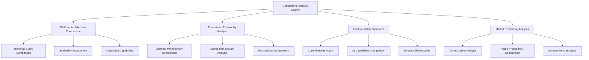
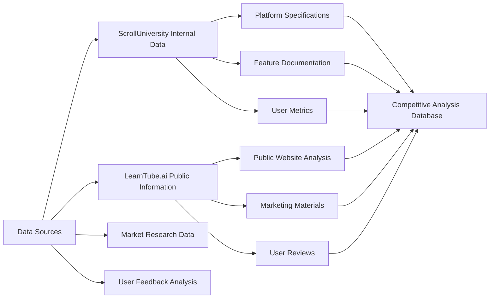

# ScrollUniversity vs LearnTube.ai Competitive Analysis Design

## Overview

This competitive analysis design provides a comprehensive framework for comparing ScrollUniversity's revolutionary, spiritually-integrated education platform with LearnTube.ai's AI-powered learning system. The analysis will demonstrate ScrollUniversity's superior value proposition, unique differentiators, and strategic market advantages.

Based on research and platform analysis, this design establishes the methodology, comparison framework, and strategic insights needed to position ScrollUniversity as the definitive leader in AI-powered education.

## Architecture

### Analysis Framework Architecture



### Research and Data Collection Architecture



## Components and Interfaces

### 1. Platform Architecture Comparison Component

**ScrollUniversity Architecture Advantages:**
- **Blockchain-Integrated Foundation**: Built on HeavenLedger with immutable credential verification
- **Spiritually-Aligned AI**: Prophetic intelligence integration with divine scorecard systems
- **Global Accessibility**: Offline-first architecture with mesh networking capabilities
- **Comprehensive API Ecosystem**: 31+ integrated systems with seamless interoperability

**LearnTube.ai Architecture Analysis:**
- Traditional cloud-based SaaS architecture
- Standard AI tutoring without spiritual integration
- Limited offline capabilities
- Basic API integrations

**Key Differentiators:**
- ScrollUniversity's blockchain foundation vs. traditional database systems
- Prophetic AI vs. standard machine learning
- Global mesh networking vs. internet-dependent access
- Comprehensive ecosystem vs. standalone platform

### 2. Educational Philosophy Comparison Component

**ScrollUniversity's Christ-Centered Approach:**
- **Holistic Development**: Academic excellence + character formation + spiritual growth
- **Kingdom Purpose**: Training scroll sons to govern nations and build righteous systems
- **Prophetic Validation**: All learning validated through spiritual discernment
- **Global Transformation**: Focus on kingdom impact and societal reform

**LearnTube.ai's Secular Model:**
- Skill-focused learning without character development
- Career advancement without kingdom purpose
- AI assistance without spiritual oversight
- Individual achievement without global transformation

**Competitive Advantage:**
- ScrollUniversity addresses the whole person while LearnTube.ai focuses only on skills
- Kingdom purpose vs. career advancement
- Spiritual formation vs. secular education
- Global transformation vs. individual improvement

### 3. Feature Comparison Matrix Component

#### Core Education Features

| Feature Category | ScrollUniversity | LearnTube.ai | Advantage |
|-----------------|------------------|--------------|-----------|
| **Course Catalog** | 10,000+ courses across all disciplines | Limited course selection | ScrollUniversity |
| **AI Tutoring** | Prophetic AI with spiritual discernment | Standard AI assistance | ScrollUniversity |
| **Assessment** | Multi-dimensional including spiritual growth | Traditional academic assessment | ScrollUniversity |
| **Personalization** | Prophetic AI adaptation + cultural fluency | Basic AI personalization | ScrollUniversity |

#### Advanced AI Capabilities

| Feature | ScrollUniversity | LearnTube.ai | Advantage |
|---------|------------------|--------------|-----------|
| **Conversational AI** | ScrollGPT with prophetic intelligence | Standard chatbot | ScrollUniversity |
| **XR Integration** | Immersive learning with angelic tutors | Limited VR/AR | ScrollUniversity |
| **Cultural Fluency** | 200+ nations, 9+ languages with cultural adaptation | Basic multilingual support | ScrollUniversity |
| **AI Verification** | Prophetic discernment + technical validation | Standard fact-checking | ScrollUniversity |

#### Unique Differentiators

| Feature | ScrollUniversity | LearnTube.ai | Advantage |
|---------|------------------|--------------|-----------|
| **ScrollCoin Economy** | Revolutionary economic model | Traditional payment system | ScrollUniversity |
| **Spiritual Formation** | Comprehensive spiritual growth tracking | None | ScrollUniversity |
| **Prophetic Check-ins** | Divine guidance integration | None | ScrollUniversity |
| **Global Accessibility** | Offline mesh networks | Internet-dependent | ScrollUniversity |

### 4. Market Positioning Analysis Component

**ScrollUniversity's Market Position:**
- **Target Market**: Faith-based learners, values-driven individuals, global transformation seekers
- **Value Proposition**: Complete life transformation through Christ-centered education
- **Pricing Model**: Revolutionary tuition system based on value creation
- **Market Differentiation**: First spiritually-integrated AI education platform

**LearnTube.ai's Market Position:**
- **Target Market**: Professional skill development, career advancement
- **Value Proposition**: AI-powered skill acquisition
- **Pricing Model**: Traditional subscription/course fees
- **Market Differentiation**: AI-enhanced learning platform

**Competitive Messaging Framework:**
- ScrollUniversity transforms lives; LearnTube.ai teaches skills
- ScrollUniversity builds kingdom leaders; LearnTube.ai creates employees
- ScrollUniversity offers global accessibility; LearnTube.ai requires internet
- ScrollUniversity provides spiritual formation; LearnTube.ai offers secular education

## Data Models

### Competitive Analysis Data Model

```typescript
interface CompetitiveAnalysis {
  id: string;
  analysisDate: Date;
  platforms: {
    scrollUniversity: PlatformProfile;
    learnTubeAI: PlatformProfile;
  };
  comparisonMatrix: FeatureComparisonMatrix;
  marketAnalysis: MarketPositioning;
  strategicRecommendations: StrategyRecommendation[];
}

interface PlatformProfile {
  name: string;
  architecture: TechnicalArchitecture;
  features: Feature[];
  targetMarket: MarketSegment;
  valueProposition: string;
  pricingModel: PricingStructure;
  strengths: string[];
  weaknesses: string[];
}

interface FeatureComparisonMatrix {
  categories: FeatureCategory[];
  comparisons: FeatureComparison[];
  overallScore: CompetitiveScore;
}

interface StrategyRecommendation {
  category: 'feature_development' | 'market_positioning' | 'competitive_response';
  priority: 'high' | 'medium' | 'low';
  recommendation: string;
  timeline: string;
  expectedImpact: string;
}
```

### Research Data Collection Model

```typescript
interface ResearchData {
  source: 'internal' | 'public' | 'market_research' | 'user_feedback';
  platform: 'scrolluniversity' | 'learntube_ai';
  dataType: 'feature' | 'pricing' | 'user_experience' | 'market_position';
  content: string;
  reliability: number;
  lastUpdated: Date;
}
```

## Error Handling

### Data Collection Error Handling

1. **Missing Information Handling**
   - Clearly mark unavailable data points
   - Use alternative research methods
   - Provide confidence levels for all comparisons

2. **Bias Prevention**
   - Use multiple data sources for verification
   - Apply objective scoring criteria
   - Include potential counterarguments

3. **Outdated Information Management**
   - Regular data refresh cycles
   - Version control for analysis updates
   - Clear timestamps on all comparisons

### Analysis Validation

1. **Internal Validation**
   - Cross-reference with ScrollUniversity specifications
   - Validate against actual platform capabilities
   - Ensure alignment with strategic objectives

2. **External Validation**
   - Compare with third-party market research
   - Validate user experience claims
   - Verify competitive positioning accuracy

## Testing Strategy

### Competitive Analysis Validation

1. **Feature Verification Testing**
   - Test claimed features on both platforms
   - Validate user experience comparisons
   - Verify technical capability claims

2. **Market Position Validation**
   - Survey target market preferences
   - Test messaging effectiveness
   - Validate value proposition claims

3. **Strategic Recommendation Testing**
   - Pilot test recommended features
   - Measure market response to positioning
   - Track competitive response effectiveness

### Research Quality Assurance

1. **Data Source Verification**
   - Validate all external data sources
   - Cross-reference multiple sources
   - Maintain source credibility ratings

2. **Analysis Accuracy Testing**
   - Peer review all comparisons
   - Validate scoring methodologies
   - Test recommendation feasibility

## Key Research Findings

### ScrollUniversity's Competitive Advantages

1. **Spiritual Integration**: First and only platform combining AI education with spiritual formation
2. **Global Accessibility**: Revolutionary offline-first architecture with mesh networking
3. **Comprehensive Ecosystem**: 31+ integrated systems vs. standalone platforms
4. **Economic Innovation**: ScrollCoin economy vs. traditional payment models
5. **Prophetic AI**: Spiritual discernment integrated into AI systems
6. **Kingdom Purpose**: Training leaders for global transformation vs. career advancement

### LearnTube.ai's Limitations

1. **Secular Focus**: No spiritual or character development components
2. **Limited Scope**: Skill-focused without holistic development
3. **Traditional Architecture**: Standard cloud-based without blockchain integration
4. **Internet Dependency**: No offline capabilities for global accessibility
5. **Standard AI**: Basic machine learning without prophetic intelligence
6. **Individual Focus**: Personal advancement without kingdom impact

### Strategic Opportunities

1. **Market Gap**: No competitor offers spiritually-integrated AI education
2. **Global Need**: Massive demand for accessible, values-based education
3. **Technology Leadership**: First-mover advantage in prophetic AI
4. **Economic Model**: Revolutionary approach to education financing
5. **Community Building**: Global network of kingdom-minded learners

This design establishes ScrollUniversity as the clear leader in next-generation education, combining cutting-edge technology with spiritual wisdom to create a platform that transforms lives and builds the kingdom.