# Design Document

## Overview

The ScrollAccreditation and Recognition System represents a revolutionary paradigm in educational validation that transcends traditional accreditation models. This comprehensive platform integrates divine revelation with empirical excellence, creating the world's first Spirit-aligned, data-grounded accreditation authority. The system operates as a complete ecosystem encompassing institutional validation, credential verification, AI faculty development, automated research publication, and global employer partnerships.

Built on a hybrid blockchain-cloud architecture, the platform ensures immutable credential verification while providing real-time access to AI-powered educational services. The design emphasizes global scalability, cultural sensitivity, and seamless integration with existing ScrollUniversity infrastructure while establishing new standards for educational excellence that combine prophetic wisdom with scientific rigor.

## Architecture

### High-Level System Architecture

```mermaid
graph TB
    subgraph "Client Layer"
        ADMIN[Admin Portal - React]
        FACULTY[Faculty Dashboard - React]
        STUDENT[Student Portal - React]
        EMPLOYER[Employer Platform - React]
        VALIDATOR[Validator Interface - React]
        MOBILE[Mobile Apps - Flutter]
        API_CLIENTS[Third-Party API Clients]
    end
    
    subgraph "API Gateway & Authentication"
        GATEWAY[API Gateway]
        AUTH[Authentication Service]
        RBAC[Role-Based Access Control]
    end
    
    subgraph "Core Accreditation Services"
        SAA[ScrollAccreditation Authority Service]
        TRANSCRIPT[ScrollXP Transcript Service]
        VALIDATION[Prophetic-Data Validation Service]
        IMPACT[Impact Measurement Service]
    end
    
    subgraph "AI Faculty & Research Services"
        AVATAR[AI Faculty Avatar Service]
        RESEARCH[AutoResearch Engine]
        PUBLICATION[Publication Management Service]
        KNOWLEDGE[Knowledge Base Service]
    end
    
    subgraph "Employer & Partnership Services"
        SCROLLPACT[ScrollPact Network Service]
        MATCHING[Talent Matching Service]
        PROJECT[Project Collaboration Service]
        ANALYTICS[Employer Analytics Service]
    end
    
    subgraph "Blockchain & Verification Layer"
        BLOCKCHAIN[Blockchain Network]
        CREDENTIAL[Credential Verification Service]
        SMART_CONTRACTS[Smart Contracts]
        IPFS[IPFS Storage]
    end
    
    subgraph "AI & ML Services"
        GPT4[GPT-4o Integration]
        CLAUDE[Claude-3 Integration]
        WHISPER[Speech Processing]
        VISION[Computer Vision]
        NLP[Natural Language Processing]
    end
    
    subgraph "Data Layer"
        POSTGRES[(PostgreSQL)]
        REDIS[(Redis Cache)]
        VECTOR_DB[(Vector Database)]
        BLOCKCHAIN_DB[(Blockchain Storage)]
        MEDIA_STORAGE[(Media Storage)]
    end
    
    subgraph "External Integrations"
        OPENAI[OpenAI API]
        ANTHROPIC[Anthropic API]
        DATA_SOURCES[External Data Sources]
        SOCIAL_PLATFORMS[Social Media APIs]
        BLOCKCHAIN_NETWORKS[Public Blockchains]
    end
    
    ADMIN --> GATEWAY
    FACULTY --> GATEWAY
    STUDENT --> GATEWAY
    EMPLOYER --> GATEWAY
    VALIDATOR --> GATEWAY
    MOBILE --> GATEWAY
    API_CLIENTS --> GATEWAY
    
    GATEWAY --> AUTH
    AUTH --> RBAC
    
    GATEWAY --> SAA
    GATEWAY --> TRANSCRIPT
    GATEWAY --> VALIDATION
    GATEWAY --> IMPACT
    
    GATEWAY --> AVATAR
    GATEWAY --> RESEARCH
    GATEWAY --> PUBLICATION
    GATEWAY --> KNOWLEDGE
    
    GATEWAY --> SCROLLPACT
    GATEWAY --> MATCHING
    GATEWAY --> PROJECT
    GATEWAY --> ANALYTICS
    
    SAA --> BLOCKCHAIN
    TRANSCRIPT --> CREDENTIAL
    VALIDATION --> SMART_CONTRACTS
    
    AVATAR --> GPT4
    RESEARCH --> CLAUDE
    AVATAR --> WHISPER
    PUBLICATION --> VISION
    
    RESEARCH --> DATA_SOURCES
    PUBLICATION --> SOCIAL_PLATFORMS
    CREDENTIAL --> BLOCKCHAIN_NETWORKS
    
    SAA --> POSTGRES
    TRANSCRIPT --> REDIS
    AVATAR --> VECTOR_DB
    CREDENTIAL --> BLOCKCHAIN_DB
    PUBLICATION --> MEDIA_STORAGE
```



### Microservices Architecture Pattern

**Service Decomposition Strategy:**
- Domain-driven design with bounded contexts for each major function
- Event-driven architecture using Redis Streams for inter-service communication
- CQRS (Command Query Responsibility Segregation) for complex validation workflows
- Saga pattern for distributed transactions across blockchain and traditional databases

**Scalability Design:**
- Horizontal scaling for all stateless services
- Database sharding for global distribution
- CDN integration for media and static content
- Load balancing with geographic routing

## Components and Interfaces

### 1. ScrollAccreditation Authority (SAA) Service

**Core Components:**
```typescript
interface ScrollAccreditationService {
  // Institution accreditation management
  submitAccreditationApplication(application: AccreditationApplication): Promise<ApplicationResult>;
  evaluateRevelationIntegrity(curriculum: CurriculumData): Promise<RevelationAssessment>;
  validateEmpiricalExcellence(researchData: ResearchData): Promise<EmpiricalValidation>;
  assessNationImpact(impactData: ImpactData): Promise<ImpactAssessment>;
  
  // Joint validation process
  initiateScrollSealValidation(applicationId: string): Promise<ValidationProcess>;
  submitPropheticValidation(validationId: string, assessment: PropheticAssessment): Promise<void>;
  submitDataScienceValidation(validationId: string, assessment: DataScienceAssessment): Promise<void>;
  finalizeAccreditation(validationId: string): Promise<AccreditationResult>;
  
  // Accreditation management
  issueAccreditationCertificate(institutionId: string): Promise<BlockchainCertificate>;
  renewAccreditation(institutionId: string, renewalData: RenewalData): Promise<RenewalResult>;
  revokeAccreditation(institutionId: string, reason: RevocationReason): Promise<RevocationResult>;
  
  // Public verification
  verifyInstitutionAccreditation(institutionId: string): Promise<AccreditationStatus>;
  getPublicAccreditationRegistry(): Promise<AccreditationRegistry>;
}

interface AccreditationApplication {
  institutionId: string;
  institutionName: string;
  curriculum: CurriculumData;
  faculty: FacultyData[];
  researchPortfolio: ResearchPortfolio;
  impactEvidence: ImpactEvidence[];
  spiritualAlignment: SpiritualAlignmentData;
  dataIntegrity: DataIntegrityEvidence;
  submissionDate: Date;
  applicantContact: ContactInfo;
}

interface RevelationAssessment {
  scriptureAlignment: ScriptureAlignmentScore;
  propheticIntegration: PropheticIntegrationScore;
  kingdomPrinciples: KingdomPrinciplesScore;
  spiritualObjectives: SpiritualObjectiveScore;
  overallRevelationScore: number;
  recommendations: string[];
  validatorComments: string;
}

interface EmpiricalValidation {
  dataQuality: DataQualityScore;
  reproducibility: ReproducibilityScore;
  ethicalStandards: EthicalStandardsScore;
  methodologicalRigor: MethodologicalRigorScore;
  overallEmpiricalScore: number;
  validationEvidence: ValidationEvidence[];
  reviewerNotes: string;
}
```

**Blockchain Integration:**
- Smart contracts for immutable accreditation records
- IPFS storage for large documents and evidence
- Multi-signature validation requiring both prophetic and data science approval
- Automated certificate issuance upon validation completion

### 2. ScrollXP Transcript Service

**Core Components:**
```typescript
interface ScrollXPTranscriptService {
  // Transcript generation and management
  generateScrollTranscript(studentId: string): Promise<ScrollTranscript>;
  updateScrollXP(studentId: string, xpData: ScrollXPData): Promise<void>;
  calculateInnovationScore(studentId: string, projects: Project[]): Promise<InnovationScore>;
  recordPropheticDefense(studentId: string, defenseData: PropheticDefenseData): Promise<void>;
  trackCommunityImpact(studentId: string, impactData: CommunityImpactData): Promise<void>;
  
  // Blockchain credential management
  issueBlockchainCredential(studentId: string, credentialType: CredentialType): Promise<BlockchainCredential>;
  verifyCredential(credentialHash: string): Promise<CredentialVerification>;
  updateCredentialStatus(credentialId: string, status: CredentialStatus): Promise<void>;
  
  // Degree and certification issuance
  issueDSGEIDegree(studentId: string, degreeData: DSGEIDegreeData): Promise<DSGEIDegree>;
  issueBScrollCertification(studentId: string, certificationData: BScrollData): Promise<BScrollCertification>;
  
  // Transcript sharing and verification
  shareTranscriptWithEmployer(studentId: string, employerId: string, permissions: SharingPermissions): Promise<SharedTranscript>;
  generatePublicVerificationLink(credentialId: string): Promise<VerificationLink>;
}

interface ScrollTranscript {
  studentId: string;
  studentName: string;
  institutionId: string;
  issueDate: Date;
  
  // Traditional metrics
  gpa: number;
  creditHours: number;
  courses: CourseRecord[];
  
  // ScrollUniversity metrics
  scrollXP: number;
  innovationScore: InnovationScore;
  propheticDefenseOutcome: PropheticDefenseOutcome;
  communityImpactScore: CommunityImpactScore;
  
  // Certifications and degrees
  degrees: Degree[];
  certifications: Certification[];
  
  // Blockchain verification
  blockchainHash: string;
  verificationUrl: string;
  digitalSignature: string;
  
  // Additional data
  researchPublications: ResearchPublication[];
  projectPortfolio: ProjectPortfolio;
  languageProficiencies: LanguageProficiency[];
  culturalCompetencies: CulturalCompetency[];
}

interface InnovationScore {
  totalScore: number;
  breakdown: {
    technicalInnovation: number;
    socialImpact: number;
    spiritualIntegration: number;
    systemicChange: number;
    collaborativeLeadership: number;
  };
  projects: InnovationProject[];
  peerRecognition: PeerRecognitionScore;
  industryValidation: IndustryValidationScore;
}
```

**Blockchain Architecture:**
- Ethereum-based smart contracts for credential issuance
- IPFS for storing detailed transcript data
- Zero-knowledge proofs for selective disclosure
- Cross-chain compatibility for global recognition

### 3. AI Faculty Avatar Service

**Core Components:**
```typescript
interface AIFacultyAvatarService {
  // Avatar creation and management
  createScrollProfessorAvatar(facultyId: string, avatarConfig: AvatarConfig): Promise<ScrollProfessorAvatar>;
  trainAvatarWithContent(avatarId: string, trainingData: AvatarTrainingData): Promise<TrainingResult>;
  updateAvatarKnowledge(avatarId: string, newContent: ContentUpdate): Promise<void>;
  
  // Specialized avatar deployment
  deploySpecializedGPT(specialty: FacultySpecialty, config: SpecializedGPTConfig): Promise<SpecializedGPT>;
  createDrScrollHealerGPT(medicalKnowledge: MedicalKnowledgeBase): Promise<DrScrollHealerGPT>;
  createScrollEthicsGPT(ethicsFramework: EthicsFramework): Promise<ScrollEthicsGPT>;
  createAmbassadorGPT(diplomacyKnowledge: DiplomacyKnowledgeBase): Promise<AmbassadorGPT>;
  
  // Multi-modal interaction
  processTextInteraction(avatarId: string, query: string, context: ConversationContext): Promise<AvatarResponse>;
  processVoiceInteraction(avatarId: string, audioData: AudioData, language: string): Promise<VoiceResponse>;
  processVisualInteraction(avatarId: string, imageData: ImageData, query: string): Promise<VisualResponse>;
  
  // Livestream integration
  enableLivestreamMode(avatarId: string, streamConfig: StreamConfig): Promise<LivestreamAvatar>;
  handleLivestreamInteraction(avatarId: string, interaction: LiveInteraction): Promise<LiveResponse>;
  
  // 24/7 availability management
  scheduleAvatarAvailability(avatarId: string, schedule: AvailabilitySchedule): Promise<void>;
  handleConcurrentSessions(avatarId: string, sessions: StudentSession[]): Promise<SessionManagement>;
}

interface ScrollProfessorAvatar {
  id: string;
  facultyId: string;
  name: string;
  specialty: FacultySpecialty;
  
  // Avatar configuration
  appearance: AvatarAppearance;
  personality: AvatarPersonality;
  teachingStyle: TeachingStyle;
  
  // Knowledge base
  lectureTranscripts: LectureTranscript[];
  visualAids: VisualAid[];
  courseContent: CourseContent[];
  researchPapers: ResearchPaper[];
  
  // Capabilities
  languageSupport: Language[];
  voiceSettings: VoiceSettings;
  interactionModes: InteractionMode[];
  
  // Performance metrics
  studentSatisfaction: SatisfactionScore;
  learningEffectiveness: EffectivenessMetrics;
  usageStatistics: UsageStatistics;
}

interface AvatarTrainingData {
  lectureTranscripts: LectureTranscript[];
  visualAids: VisualAid[];
  voiceRecordings: VoiceRecording[];
  teachingMethodology: TeachingMethodology;
  assessmentStrategies: AssessmentStrategy[];
  culturalAdaptations: CulturalAdaptation[];
  spiritualIntegration: SpiritualIntegrationData;
}
```

**AI Architecture:**
- GPT-4o fine-tuning for each faculty member's teaching style
- Vector embeddings for course content and lecture materials
- Multi-modal processing for text, voice, and visual interactions
- Real-time conversation management with context preservation
- Scalable inference infrastructure for concurrent sessions

### 4. AutoResearch Engine

**Core Components:**
```typescript
interface AutoResearchEngine {
  // Research pipeline management
  initializeResearchProject(problem: ResearchProblem): Promise<ResearchProject>;
  importRealWorldData(sources: DataSource[], filters: DataFilter[]): Promise<DataImportResult>;
  performGPTAnalysis(data: ResearchData, analysisType: AnalysisType): Promise<AnalysisResult>;
  integratePropheticInsights(researchId: string, insights: PropheticInsight[]): Promise<IntegrationResult>;
  
  // Report generation and formatting
  generateResearchReport(researchId: string, format: ReportFormat): Promise<ResearchReport>;
  createVisualDashboard(researchId: string, visualizations: VisualizationType[]): Promise<Dashboard>;
  formatForPublication(reportId: string, platform: PublicationPlatform): Promise<FormattedPublication>;
  
  // Publication and distribution
  publishToScrollJournal(reportId: string, metadata: PublicationMetadata): Promise<PublicationResult>;
  publishToLinkedIn(reportId: string, linkedInConfig: LinkedInConfig): Promise<SocialPublicationResult>;
  publishToScrollTube(reportId: string, videoConfig: VideoConfig): Promise<VideoPublicationResult>;
  
  // Weekly publication management
  scheduleWeeklyResearch(teamId: string, schedule: ResearchSchedule): Promise<ScheduleResult>;
  trackPublicationDeadlines(teamId: string): Promise<DeadlineStatus[]>;
  generateWeeklyReports(teamId: string, week: WeekIdentifier): Promise<WeeklyReport>;
}

interface ResearchProject {
  id: string;
  title: string;
  problem: ResearchProblem;
  hypothesis: string;
  methodology: ResearchMethodology;
  
  // Data sources
  realWorldData: RealWorldDataSource[];
  propheticInsights: PropheticInsight[];
  literatureReview: LiteratureSource[];
  
  // Analysis components
  gptAnalysis: GPTAnalysisConfig;
  statisticalAnalysis: StatisticalAnalysisConfig;
  visualAnalysis: VisualizationConfig;
  
  // Publication settings
  targetPlatforms: PublicationPlatform[];
  publicationSchedule: PublicationSchedule;
  collaborators: Collaborator[];
  
  // Progress tracking
  milestones: ResearchMilestone[];
  currentStatus: ResearchStatus;
  completionPercentage: number;
}

interface PropheticInsight {
  id: string;
  source: PropheticSource;
  content: string;
  relevanceScore: number;
  validationStatus: ValidationStatus;
  integrationMethod: IntegrationMethod;
  spiritualContext: SpiritualContext;
  applicationGuidance: ApplicationGuidance;
}
```

**Research Infrastructure:**
- Automated data ingestion from multiple external sources
- GPT-4o integration for analysis and insight generation
- Citation management and academic integrity verification
- Multi-format publication pipeline (PDF, blog, video, dashboard)
- Collaborative research environment with version control

### 5. ScrollPact Employer Network Service

**Core Components:**
```typescript
interface ScrollPactNetworkService {
  // Employer onboarding and management
  registerEmployer(employerData: EmployerRegistrationData): Promise<EmployerProfile>;
  customizeEmployerInvitation(employerId: string, customization: InvitationCustomization): Promise<CustomInvitation>;
  manageEmployerSubscription(employerId: string, subscription: SubscriptionPlan): Promise<SubscriptionResult>;
  
  // Talent matching and recruitment
  searchScrollGraduates(criteria: SearchCriteria): Promise<GraduateProfile[]>;
  matchTalentToOpportunity(opportunityId: string, requirements: JobRequirements): Promise<TalentMatch[]>;
  facilitateIntroductions(employerId: string, graduateIds: string[]): Promise<IntroductionResult>;
  
  // Project collaboration
  createCollaborativeProject(projectData: CollaborativeProjectData): Promise<CollaborativeProject>;
  inviteStudentsToProject(projectId: string, studentIds: string[]): Promise<InvitationResult>;
  trackProjectProgress(projectId: string): Promise<ProjectProgress>;
  
  // Research and innovation access
  provideEarlyResearchAccess(employerId: string, researchCategories: ResearchCategory[]): Promise<ResearchAccess>;
  shareEmergingTechInsights(employerId: string, techAreas: TechArea[]): Promise<TechInsights>;
  facilitateInnovationPartnerships(employerId: string, partnershipType: PartnershipType): Promise<Partnership>;
  
  // Analytics and reporting
  generateTalentAnalytics(employerId: string, timeframe: Timeframe): Promise<TalentAnalytics>;
  trackHiringSuccess(employerId: string, hires: HireData[]): Promise<SuccessMetrics>;
  provideBenchmarkingData(employerId: string, industry: Industry): Promise<BenchmarkData>;
}

interface EmployerProfile {
  id: string;
  organizationName: string;
  organizationType: OrganizationType; // NGO, Startup, Government, Multinational
  industry: Industry;
  size: OrganizationSize;
  
  // Contact and location
  primaryContact: ContactInfo;
  headquarters: Location;
  operatingRegions: Region[];
  
  // Hiring preferences
  talentRequirements: TalentRequirement[];
  preferredSkills: Skill[];
  culturalFit: CulturalFitCriteria;
  spiritualAlignment: SpiritualAlignmentPreference;
  
  // Partnership details
  subscriptionPlan: SubscriptionPlan;
  accessLevel: AccessLevel;
  partnershipStartDate: Date;
  
  // Performance metrics
  hiringSuccess: HiringSuccessMetrics;
  graduateFeedback: GraduateFeedbackScore;
  partnershipSatisfaction: PartnershipSatisfactionScore;
}

interface GraduateProfile {
  studentId: string;
  name: string;
  graduationDate: Date;
  
  // Academic credentials
  scrollTranscript: ScrollTranscript;
  degrees: Degree[];
  certifications: Certification[];
  
  // Skills and competencies
  technicalSkills: TechnicalSkill[];
  softSkills: SoftSkill[];
  languageProficiencies: LanguageProficiency[];
  culturalCompetencies: CulturalCompetency[];
  
  // Portfolio and achievements
  gptCertifiedPortfolio: Portfolio;
  researchPublications: ResearchPublication[];
  projectDeployments: ProjectDeployment[];
  communityImpact: CommunityImpactRecord[];
  
  // Preferences and availability
  careerPreferences: CareerPreference[];
  locationPreferences: LocationPreference[];
  availabilityStatus: AvailabilityStatus;
  salaryExpectations: SalaryRange;
}
```

**Network Architecture:**
- Intelligent matching algorithms using machine learning
- Real-time collaboration tools for project co-design
- Secure communication channels between employers and graduates
- Analytics dashboard for hiring success tracking
- Integration with professional networks and job platforms

## Data Models

### Core Accreditation Data Models

```typescript
// Accreditation application and validation
interface AccreditationRecord {
  id: string;
  institutionId: string;
  applicationDate: Date;
  status: AccreditationStatus;
  
  // Validation components
  revelationAssessment: RevelationAssessment;
  empiricalValidation: EmpiricalValidation;
  impactAssessment: ImpactAssessment;
  scrollSealValidation: ScrollSealValidation;
  
  // Validation team
  propheticValidators: PropheticValidator[];
  dataScienceValidators: DataScienceValidator[];
  
  // Results
  accreditationDecision: AccreditationDecision;
  certificateHash: string;
  validityPeriod: ValidityPeriod;
  
  // Audit trail
  validationHistory: ValidationHistoryEntry[];
  renewalHistory: RenewalHistoryEntry[];
}

// ScrollXP transcript and credential data
interface StudentCredentialRecord {
  studentId: string;
  institutionId: string;
  
  // Academic performance
  courses: CourseRecord[];
  gpa: number;
  creditHours: number;
  
  // ScrollUniversity metrics
  scrollXP: ScrollXPRecord;
  innovationScore: InnovationScoreRecord;
  propheticDefense: PropheticDefenseRecord;
  communityImpact: CommunityImpactRecord;
  
  // Blockchain credentials
  blockchainCredentials: BlockchainCredential[];
  verificationHashes: string[];
  
  // Portfolio and achievements
  researchPublications: ResearchPublicationRecord[];
  projects: ProjectRecord[];
  certifications: CertificationRecord[];
}

// AI Faculty avatar configuration
interface FacultyAvatarRecord {
  avatarId: string;
  facultyId: string;
  institutionId: string;
  
  // Avatar configuration
  avatarType: AvatarType; // Real, AI-Generated, Hybrid
  specialization: FacultySpecialization;
  knowledgeDomains: KnowledgeDomain[];
  
  // Training data
  trainingContent: TrainingContentRecord[];
  voiceModel: VoiceModelRecord;
  personalityProfile: PersonalityProfile;
  
  // Capabilities
  supportedLanguages: LanguageSupport[];
  interactionModes: InteractionModeSupport[];
  availabilitySchedule: AvailabilityScheduleRecord;
  
  // Performance metrics
  studentInteractions: StudentInteractionRecord[];
  satisfactionRatings: SatisfactionRatingRecord[];
  learningOutcomes: LearningOutcomeRecord[];
}

// Research project and publication data
interface ResearchProjectRecord {
  projectId: string;
  teamId: string;
  institutionId: string;
  
  // Project details
  title: string;
  researchProblem: ResearchProblemRecord;
  methodology: MethodologyRecord;
  
  // Data sources
  realWorldDataSources: DataSourceRecord[];
  propheticInsights: PropheticInsightRecord[];
  
  // Analysis and results
  gptAnalysisResults: GPTAnalysisRecord[];
  statisticalAnalysis: StatisticalAnalysisRecord;
  findings: FindingsRecord;
  
  // Publication
  publications: PublicationRecord[];
  citationMetrics: CitationMetricsRecord;
  impactMetrics: ImpactMetricsRecord;
}

// Employer and partnership data
interface EmployerPartnershipRecord {
  employerId: string;
  organizationName: string;
  partnershipType: PartnershipType;
  
  // Organization details
  industry: Industry;
  size: OrganizationSize;
  locations: LocationRecord[];
  
  // Hiring and collaboration
  talentRequirements: TalentRequirementRecord[];
  activeProjects: CollaborativeProjectRecord[];
  hiredGraduates: HiredGraduateRecord[];
  
  // Access and benefits
  researchAccess: ResearchAccessRecord;
  techInsightsAccess: TechInsightsAccessRecord;
  networkingOpportunities: NetworkingOpportunityRecord[];
  
  // Performance metrics
  hiringSuccessMetrics: HiringSuccessMetricsRecord;
  partnershipSatisfaction: PartnershipSatisfactionRecord;
  renewalHistory: PartnershipRenewalRecord[];
}
```

### Database Schema Extensions

```sql
-- Accreditation system tables
CREATE TABLE accreditation_records (
    id UUID PRIMARY KEY DEFAULT gen_random_uuid(),
    institution_id UUID REFERENCES institutions(id),
    application_date TIMESTAMP DEFAULT NOW(),
    status VARCHAR(50) NOT NULL,
    revelation_assessment JSONB DEFAULT '{}',
    empirical_validation JSONB DEFAULT '{}',
    impact_assessment JSONB DEFAULT '{}',
    scroll_seal_validation JSONB DEFAULT '{}',
    prophetic_validators JSONB DEFAULT '[]',
    data_science_validators JSONB DEFAULT '[]',
    accreditation_decision JSONB DEFAULT '{}',
    certificate_hash VARCHAR(256),
    validity_period JSONB DEFAULT '{}',
    validation_history JSONB DEFAULT '[]',
    created_at TIMESTAMP DEFAULT NOW(),
    updated_at TIMESTAMP DEFAULT NOW()
);

CREATE TABLE scroll_transcripts (
    id UUID PRIMARY KEY DEFAULT gen_random_uuid(),
    student_id UUID REFERENCES users(id),
    institution_id UUID REFERENCES institutions(id),
    gpa DECIMAL(3,2),
    credit_hours INTEGER,
    scroll_xp INTEGER DEFAULT 0,
    innovation_score JSONB DEFAULT '{}',
    prophetic_defense JSONB DEFAULT '{}',
    community_impact JSONB DEFAULT '{}',
    blockchain_credentials JSONB DEFAULT '[]',
    verification_hashes TEXT[],
    research_publications JSONB DEFAULT '[]',
    projects JSONB DEFAULT '[]',
    certifications JSONB DEFAULT '[]',
    issued_at TIMESTAMP DEFAULT NOW(),
    updated_at TIMESTAMP DEFAULT NOW()
);

CREATE TABLE faculty_avatars (
    id UUID PRIMARY KEY DEFAULT gen_random_uuid(),
    faculty_id UUID REFERENCES users(id),
    institution_id UUID REFERENCES institutions(id),
    avatar_type VARCHAR(50) NOT NULL,
    specialization VARCHAR(100) NOT NULL,
    knowledge_domains JSONB DEFAULT '[]',
    training_content JSONB DEFAULT '[]',
    voice_model JSONB DEFAULT '{}',
    personality_profile JSONB DEFAULT '{}',
    supported_languages JSONB DEFAULT '[]',
    interaction_modes JSONB DEFAULT '[]',
    availability_schedule JSONB DEFAULT '{}',
    performance_metrics JSONB DEFAULT '{}',
    created_at TIMESTAMP DEFAULT NOW(),
    updated_at TIMESTAMP DEFAULT NOW()
);

CREATE TABLE research_projects (
    id UUID PRIMARY KEY DEFAULT gen_random_uuid(),
    team_id UUID NOT NULL,
    institution_id UUID REFERENCES institutions(id),
    title VARCHAR(500) NOT NULL,
    research_problem JSONB NOT NULL,
    methodology JSONB DEFAULT '{}',
    data_sources JSONB DEFAULT '[]',
    prophetic_insights JSONB DEFAULT '[]',
    analysis_results JSONB DEFAULT '{}',
    findings JSONB DEFAULT '{}',
    publications JSONB DEFAULT '[]',
    citation_metrics JSONB DEFAULT '{}',
    impact_metrics JSONB DEFAULT '{}',
    status VARCHAR(50) DEFAULT 'active',
    created_at TIMESTAMP DEFAULT NOW(),
    updated_at TIMESTAMP DEFAULT NOW()
);

CREATE TABLE employer_partnerships (
    id UUID PRIMARY KEY DEFAULT gen_random_uuid(),
    organization_name VARCHAR(255) NOT NULL,
    partnership_type VARCHAR(100) NOT NULL,
    industry VARCHAR(100),
    organization_size VARCHAR(50),
    locations JSONB DEFAULT '[]',
    talent_requirements JSONB DEFAULT '[]',
    active_projects JSONB DEFAULT '[]',
    hired_graduates JSONB DEFAULT '[]',
    research_access JSONB DEFAULT '{}',
    tech_insights_access JSONB DEFAULT '{}',
    networking_opportunities JSONB DEFAULT '[]',
    performance_metrics JSONB DEFAULT '{}',
    partnership_start_date TIMESTAMP DEFAULT NOW(),
    created_at TIMESTAMP DEFAULT NOW(),
    updated_at TIMESTAMP DEFAULT NOW()
);

-- Blockchain integration tables
CREATE TABLE blockchain_credentials (
    id UUID PRIMARY KEY DEFAULT gen_random_uuid(),
    student_id UUID REFERENCES users(id),
    credential_type VARCHAR(100) NOT NULL,
    blockchain_hash VARCHAR(256) UNIQUE NOT NULL,
    smart_contract_address VARCHAR(256),
    verification_url VARCHAR(500),
    issue_date TIMESTAMP DEFAULT NOW(),
    expiry_date TIMESTAMP,
    status VARCHAR(50) DEFAULT 'active',
    metadata JSONB DEFAULT '{}'
);

-- Indexes for performance
CREATE INDEX idx_accreditation_records_institution ON accreditation_records(institution_id);
CREATE INDEX idx_accreditation_records_status ON accreditation_records(status);
CREATE INDEX idx_scroll_transcripts_student ON scroll_transcripts(student_id);
CREATE INDEX idx_faculty_avatars_faculty ON faculty_avatars(faculty_id);
CREATE INDEX idx_research_projects_team ON research_projects(team_id);
CREATE INDEX idx_employer_partnerships_type ON employer_partnerships(partnership_type);
CREATE INDEX idx_blockchain_credentials_hash ON blockchain_credentials(blockchain_hash);
```

## Error Handling

### Comprehensive Error Management Strategy

**1. Accreditation Process Errors:**
```typescript
enum AccreditationError {
  INCOMPLETE_APPLICATION = 'ACCREDITATION_INCOMPLETE_APPLICATION',
  VALIDATION_CONFLICT = 'ACCREDITATION_VALIDATION_CONFLICT',
  BLOCKCHAIN_FAILURE = 'ACCREDITATION_BLOCKCHAIN_FAILURE',
  VALIDATOR_UNAVAILABLE = 'ACCREDITATION_VALIDATOR_UNAVAILABLE',
  CERTIFICATE_GENERATION_FAILED = 'ACCREDITATION_CERTIFICATE_GENERATION_FAILED'
}

interface AccreditationErrorHandler {
  handleIncompleteApplication(applicationId: string): Promise<ApplicationGuidance>;
  handleValidationConflict(validationId: string): Promise<ConflictResolution>;
  handleBlockchainFailure(transactionId: string): Promise<BlockchainRecovery>;
  handleValidatorUnavailability(validatorId: string): Promise<ValidatorReplacement>;
  handleCertificateGenerationFailure(certificateId: string): Promise<CertificateRecovery>;
}
```

**2. AI Avatar Service Errors:**
```typescript
enum AvatarError {
  TRAINING_DATA_INSUFFICIENT = 'AVATAR_TRAINING_DATA_INSUFFICIENT',
  VOICE_MODEL_FAILURE = 'AVATAR_VOICE_MODEL_FAILURE',
  CONCURRENT_SESSION_LIMIT = 'AVATAR_CONCURRENT_SESSION_LIMIT',
  KNOWLEDGE_BASE_CORRUPTION = 'AVATAR_KNOWLEDGE_BASE_CORRUPTION',
  LANGUAGE_NOT_SUPPORTED = 'AVATAR_LANGUAGE_NOT_SUPPORTED'
}

interface AvatarErrorHandler {
  handleInsufficientTrainingData(avatarId: string): Promise<TrainingDataSupplement>;
  handleVoiceModelFailure(avatarId: string): Promise<VoiceModelRecovery>;
  handleConcurrentSessionLimit(avatarId: string): Promise<SessionLoadBalancing>;
  handleKnowledgeBaseCorruption(avatarId: string): Promise<KnowledgeBaseRestore>;
  handleUnsupportedLanguage(language: string): Promise<LanguageSupport>;
}
```

**3. Research Pipeline Errors:**
```typescript
enum ResearchError {
  DATA_SOURCE_UNAVAILABLE = 'RESEARCH_DATA_SOURCE_UNAVAILABLE',
  ANALYSIS_TIMEOUT = 'RESEARCH_ANALYSIS_TIMEOUT',
  PUBLICATION_PLATFORM_ERROR = 'RESEARCH_PUBLICATION_PLATFORM_ERROR',
  PROPHETIC_INSIGHT_VALIDATION_FAILED = 'RESEARCH_PROPHETIC_INSIGHT_VALIDATION_FAILED',
  CITATION_VERIFICATION_FAILED = 'RESEARCH_CITATION_VERIFICATION_FAILED'
}

interface ResearchErrorHandler {
  handleDataSourceUnavailability(sourceId: string): Promise<AlternativeDataSource>;
  handleAnalysisTimeout(analysisId: string): Promise<AnalysisOptimization>;
  handlePublicationPlatformError(platformId: string): Promise<AlternativePlatform>;
  handlePropheticInsightValidationFailure(insightId: string): Promise<ValidationRetry>;
  handleCitationVerificationFailure(citationId: string): Promise<CitationCorrection>;
}
```

**Error Recovery Strategies:**
- Graceful degradation with alternative service providers
- Automatic retry mechanisms with exponential backoff
- Comprehensive logging and monitoring for all error scenarios
- User notification with clear next steps and estimated resolution times
- Fallback to manual processes for critical operations

## Testing Strategy

### 1. Accreditation System Testing

**Unit Testing:**
- Individual validation algorithm accuracy
- Blockchain smart contract functionality
- Certificate generation and verification
- Prophetic and data science assessment scoring

**Integration Testing:**
- End-to-end accreditation workflow
- Blockchain integration with traditional databases
- Multi-validator consensus mechanisms
- Cross-service communication and data consistency

**Performance Testing:**
- Concurrent accreditation application processing
- Blockchain transaction throughput
- Certificate verification response times
- Global accessibility and load distribution

**Security Testing:**
- Credential tampering prevention
- Unauthorized access prevention
- Data privacy and GDPR compliance
- Blockchain security and smart contract auditing

### 2. AI Avatar System Testing

**Functional Testing:**
- Avatar conversation quality and accuracy
- Multi-language support validation
- Voice synthesis and recognition accuracy
- Knowledge base completeness and currency

**Performance Testing:**
- Concurrent student session handling (1000+ simultaneous)
- Response time optimization (<2 seconds)
- Resource usage monitoring and optimization
- Scalability testing across different avatar types

**User Experience Testing:**
- Student satisfaction with avatar interactions
- Learning effectiveness compared to human instruction
- Accessibility compliance for diverse learners
- Cultural sensitivity and appropriateness

### 3. Research Pipeline Testing

**Data Quality Testing:**
- External data source reliability and accuracy
- Data integration and transformation accuracy
- Citation verification and academic integrity
- Prophetic insight validation and integration

**Publication Testing:**
- Multi-platform publication accuracy
- Format conversion and quality preservation
- Automated scheduling and deadline management
- Analytics and impact measurement accuracy

### 4. Employer Network Testing

**Matching Algorithm Testing:**
- Talent-opportunity matching accuracy
- Recommendation system effectiveness
- Search and filter functionality
- Performance under large dataset conditions

**Collaboration Testing:**
- Project co-design workflow functionality
- Real-time collaboration tool performance
- Communication and notification systems
- Progress tracking and reporting accuracy

This comprehensive design provides the technical foundation for implementing the revolutionary ScrollAccreditation and Recognition System, ensuring it can deliver on its promise of creating the world's first Spirit-aligned, data-grounded accreditation authority while maintaining the highest standards of technical excellence and global scalability.