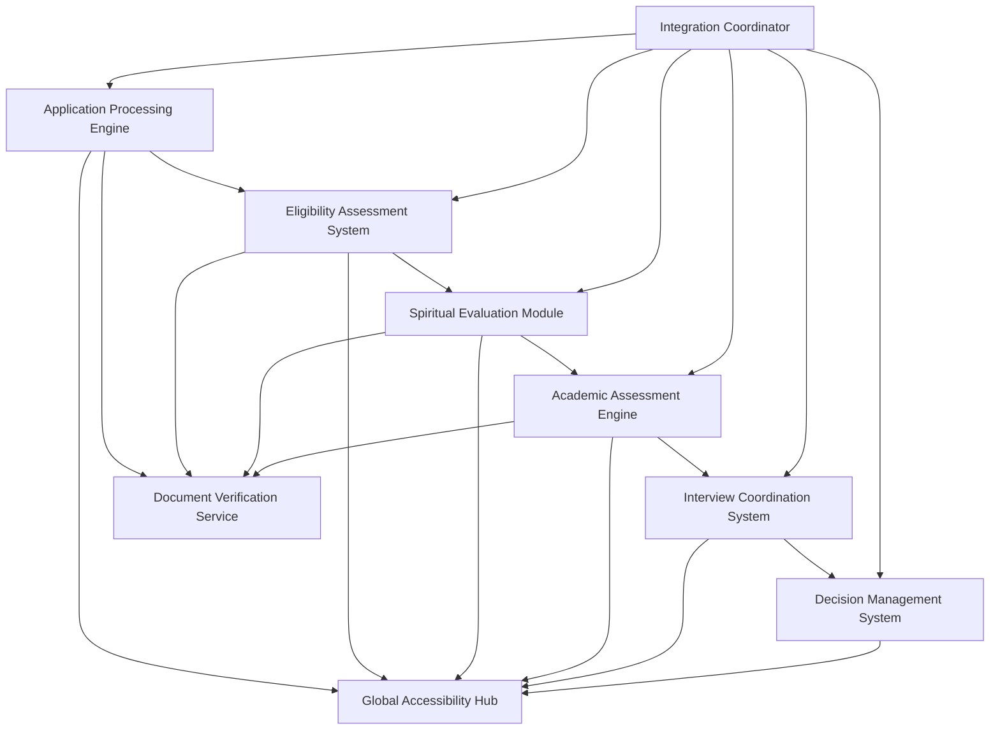
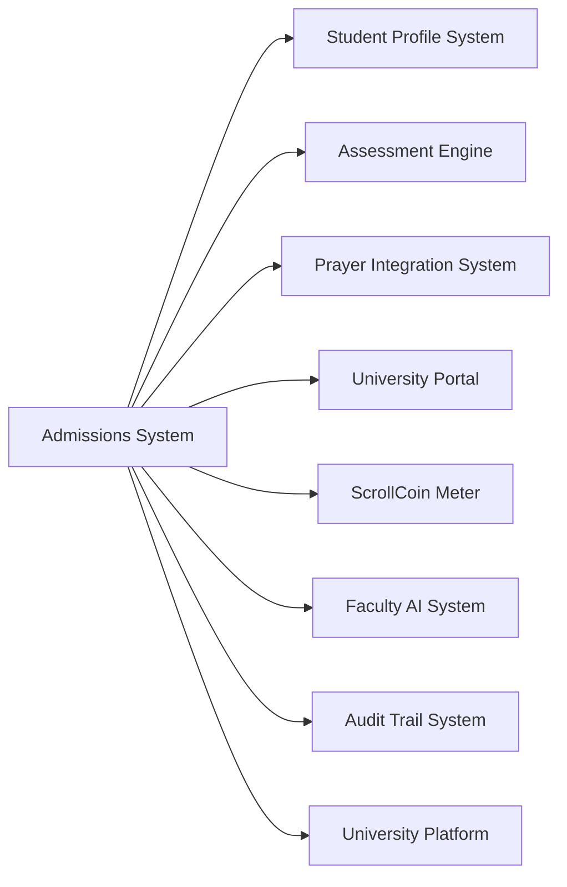

# ScrollUniversity Admissions System Design

## Overview

The Admissions System serves as the gateway to ScrollUniversity, managing the comprehensive evaluation and enrollment process for prospective students. This system ensures that only qualified, spiritually aligned candidates are admitted while maintaining accessibility and fairness across global populations.

## Architecture

### Core Components



### System Integration Architecture



## Components and Interfaces

### 1. Application Processing Engine

**Purpose:** Manages the complete application lifecycle from submission to decision

**Key Interfaces:**
- `ApplicationService`: CRUD operations for applications
- `DocumentProcessor`: Application document handling
- `StatusTracker`: Application progress monitoring
- `NotificationManager`: Applicant communication

**Data Models:**
```typescript
interface Application {
  id: string;
  applicantId: string;
  submissionDate: Date;
  status: ApplicationStatus;
  documents: ApplicationDocument[];
  assessments: AssessmentResult[];
  interviews: InterviewRecord[];
  spiritualEvaluation: SpiritualEvaluation;
  academicEvaluation: AcademicEvaluation;
  decision: AdmissionDecision;
  timeline: ApplicationTimeline[];
}

enum ApplicationStatus {
  SUBMITTED = 'submitted',
  UNDER_REVIEW = 'under_review',
  ASSESSMENT_PENDING = 'assessment_pending',
  INTERVIEW_SCHEDULED = 'interview_scheduled',
  DECISION_PENDING = 'decision_pending',
  ACCEPTED = 'accepted',
  REJECTED = 'rejected',
  WAITLISTED = 'waitlisted'
}
```

### 2. Eligibility Assessment System

**Purpose:** Evaluates basic eligibility requirements and prerequisites

**Key Interfaces:**
- `EligibilityChecker`: Requirement validation
- `PrerequisiteValidator`: Academic prerequisite verification
- `AccessibilityEvaluator`: Special needs assessment
- `GlobalComplianceChecker`: International requirement validation

**Data Models:**
```typescript
interface EligibilityAssessment {
  id: string;
  applicationId: string;
  basicRequirements: RequirementCheck[];
  academicPrerequisites: PrerequisiteCheck[];
  languageProficiency: LanguageAssessment;
  technicalRequirements: TechnicalCheck[];
  accessibilityNeeds: AccessibilityAssessment;
  globalCompliance: ComplianceCheck[];
  overallEligibility: EligibilityStatus;
}

interface RequirementCheck {
  requirement: string;
  status: CheckStatus;
  evidence: string[];
  notes: string;
}
```

### 3. Spiritual Evaluation Module

**Purpose:** Assesses spiritual maturity and alignment with ScrollUniversity values

**Key Interfaces:**
- `SpiritualAssessor`: Spiritual maturity evaluation
- `TestimonyValidator`: Personal testimony verification
- `CharacterEvaluator`: Character assessment
- `CallingDiscerner`: Ministry calling identification

**Data Models:**
```typescript
interface SpiritualEvaluation {
  id: string;
  applicationId: string;
  personalTestimony: TestimonyAssessment;
  spiritualMaturity: MaturityLevel;
  characterTraits: CharacterAssessment[];
  ministryExperience: MinistryExperience[];
  callingClarity: CallingAssessment;
  scrollAlignment: AlignmentScore;
  recommendations: SpiritualRecommendation[];
}

interface TestimonyAssessment {
  authenticity: number;
  clarity: number;
  depth: number;
  transformation: number;
  kingdomFocus: number;
  overallScore: number;
}
```

### 4. Academic Assessment Engine

**Purpose:** Evaluates academic readiness and intellectual capacity

**Key Interfaces:**
- `AcademicEvaluator`: Academic performance assessment
- `SkillAssessor`: Core skill evaluation
- `PotentialAnalyzer`: Learning potential analysis
- `CredentialValidator`: Academic credential verification

**Data Models:**
```typescript
interface AcademicEvaluation {
  id: string;
  applicationId: string;
  previousEducation: EducationRecord[];
  academicPerformance: PerformanceMetrics;
  coreSkills: SkillAssessment[];
  learningPotential: PotentialScore;
  intellectualCapacity: CapacityAssessment;
  recommendedLevel: AcademicLevel;
  supportNeeds: SupportRequirement[];
}

interface SkillAssessment {
  skill: CoreSkill;
  currentLevel: SkillLevel;
  assessment: AssessmentResult;
  developmentPlan: DevelopmentPlan;
}
```

### 5. Interview Coordination System

**Purpose:** Manages interview scheduling and evaluation process

**Key Interfaces:**
- `InterviewScheduler`: Interview appointment management
- `InterviewerMatcher`: Interviewer assignment
- `InterviewEvaluator`: Interview assessment processing
- `VideoConferenceManager`: Remote interview facilitation

**Data Models:**
```typescript
interface InterviewRecord {
  id: string;
  applicationId: string;
  interviewType: InterviewType;
  scheduledDate: Date;
  interviewer: InterviewerProfile;
  format: InterviewFormat;
  duration: number;
  evaluation: InterviewEvaluation;
  recording: InterviewRecording;
  followUpRequired: boolean;
}

interface InterviewEvaluation {
  communication: number;
  spiritualMaturity: number;
  academicReadiness: number;
  characterAssessment: number;
  motivationLevel: number;
  culturalFit: number;
  overallRecommendation: RecommendationType;
  notes: string;
}
```

### 6. Decision Management System

**Purpose:** Processes admission decisions and manages enrollment

**Key Interfaces:**
- `DecisionProcessor`: Admission decision logic
- `CommitteeCoordinator`: Admission committee management
- `EnrollmentManager`: Accepted student enrollment
- `AppealHandler`: Decision appeal processing

**Data Models:**
```typescript
interface AdmissionDecision {
  id: string;
  applicationId: string;
  decision: DecisionType;
  decisionDate: Date;
  decisionMakers: DecisionMaker[];
  reasoning: DecisionReasoning;
  conditions: AdmissionCondition[];
  enrollmentDeadline: Date;
  appealEligible: boolean;
  nextSteps: NextStep[];
}

interface DecisionReasoning {
  strengths: string[];
  concerns: string[];
  recommendations: string[];
  overallAssessment: string;
  futureConsiderations: string[];
}
```

## Data Models

### Core Admissions Entities

```sql
-- Applications Table
CREATE TABLE applications (
    id UUID PRIMARY KEY DEFAULT gen_random_uuid(),
    applicant_id UUID NOT NULL REFERENCES users(id),
    submission_date TIMESTAMP NOT NULL DEFAULT CURRENT_TIMESTAMP,
    status application_status NOT NULL DEFAULT 'submitted',
    program_applied program_type NOT NULL,
    intended_start_date DATE NOT NULL,
    application_data JSONB NOT NULL,
    created_at TIMESTAMP DEFAULT CURRENT_TIMESTAMP,
    updated_at TIMESTAMP DEFAULT CURRENT_TIMESTAMP
);

-- Eligibility Assessments Table
CREATE TABLE eligibility_assessments (
    id UUID PRIMARY KEY DEFAULT gen_random_uuid(),
    application_id UUID NOT NULL REFERENCES applications(id),
    basic_requirements JSONB NOT NULL,
    academic_prerequisites JSONB NOT NULL,
    language_proficiency JSONB NOT NULL,
    technical_requirements JSONB NOT NULL,
    accessibility_needs JSONB NOT NULL,
    global_compliance JSONB NOT NULL,
    overall_eligibility eligibility_status NOT NULL,
    assessed_at TIMESTAMP DEFAULT CURRENT_TIMESTAMP
);

-- Spiritual Evaluations Table
CREATE TABLE spiritual_evaluations (
    id UUID PRIMARY KEY DEFAULT gen_random_uuid(),
    application_id UUID NOT NULL REFERENCES applications(id),
    personal_testimony JSONB NOT NULL,
    spiritual_maturity maturity_level NOT NULL,
    character_traits JSONB NOT NULL,
    ministry_experience JSONB NOT NULL,
    calling_clarity JSONB NOT NULL,
    scroll_alignment DECIMAL(3,2) NOT NULL,
    recommendations JSONB NOT NULL,
    evaluated_at TIMESTAMP DEFAULT CURRENT_TIMESTAMP
);

-- Academic Evaluations Table
CREATE TABLE academic_evaluations (
    id UUID PRIMARY KEY DEFAULT gen_random_uuid(),
    application_id UUID NOT NULL REFERENCES applications(id),
    previous_education JSONB NOT NULL,
    academic_performance JSONB NOT NULL,
    core_skills JSONB NOT NULL,
    learning_potential DECIMAL(3,2) NOT NULL,
    intellectual_capacity JSONB NOT NULL,
    recommended_level academic_level NOT NULL,
    support_needs JSONB NOT NULL,
    evaluated_at TIMESTAMP DEFAULT CURRENT_TIMESTAMP
);

-- Interview Records Table
CREATE TABLE interview_records (
    id UUID PRIMARY KEY DEFAULT gen_random_uuid(),
    application_id UUID NOT NULL REFERENCES applications(id),
    interview_type interview_type NOT NULL,
    scheduled_date TIMESTAMP NOT NULL,
    interviewer_id UUID NOT NULL REFERENCES users(id),
    format interview_format NOT NULL,
    duration INTEGER NOT NULL,
    evaluation JSONB NOT NULL,
    recording_url VARCHAR(500),
    follow_up_required BOOLEAN DEFAULT FALSE,
    conducted_at TIMESTAMP DEFAULT CURRENT_TIMESTAMP
);

-- Admission Decisions Table
CREATE TABLE admission_decisions (
    id UUID PRIMARY KEY DEFAULT gen_random_uuid(),
    application_id UUID NOT NULL REFERENCES applications(id),
    decision decision_type NOT NULL,
    decision_date TIMESTAMP NOT NULL DEFAULT CURRENT_TIMESTAMP,
    decision_makers JSONB NOT NULL,
    reasoning JSONB NOT NULL,
    conditions JSONB NOT NULL,
    enrollment_deadline DATE,
    appeal_eligible BOOLEAN DEFAULT TRUE,
    next_steps JSONB NOT NULL
);
```

## Error Handling

### Application Processing Errors
- **ApplicationSubmissionFailed**: When application submission fails
- **DocumentVerificationFailed**: When document validation fails
- **ApplicationNotFound**: When accessing non-existent applications
- **StatusUpdateFailed**: When application status update fails

### Assessment Errors
- **EligibilityCheckFailed**: When eligibility assessment fails
- **SpiritualEvaluationIncomplete**: When spiritual evaluation cannot be completed
- **AcademicAssessmentError**: When academic evaluation fails
- **InterviewSchedulingConflict**: When interview scheduling fails

### Decision Errors
- **DecisionProcessingFailed**: When admission decision processing fails
- **CommitteeUnavailable**: When admission committee is not available
- **EnrollmentCapacityExceeded**: When enrollment capacity is reached
- **AppealProcessingError**: When appeal processing fails

## Testing Strategy

### Unit Testing
- Application processing workflows
- Eligibility assessment algorithms
- Spiritual evaluation scoring
- Academic assessment calculations
- Interview scheduling logic

### Integration Testing
- University system integration
- Document verification services
- Video conferencing platforms
- Email notification systems
- Database transaction handling

### User Experience Testing
- Application submission process
- Multi-language support
- Mobile application compatibility
- Accessibility compliance
- Cross-cultural usability

### Performance Testing
- High-volume application processing
- Concurrent assessment handling
- Interview scheduling optimization
- Decision processing speed
- Database query performance

### Security Testing
- Application data protection
- Document security validation
- Interview recording security
- Personal information encryption
- Access control verification