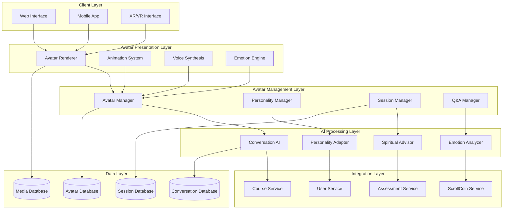

# Design Document

## Overview

The AI Avatar Lecturers system creates lifelike, interactive virtual instructors that serve as the primary teaching interface for Scroll University. These AI-powered avatars combine advanced conversational AI, realistic 3D rendering, real-time animation, and spiritual discernment to deliver personalized, engaging educational experiences. The system integrates with existing Scroll University services while introducing new capabilities for avatar management, real-time interaction, and live Q&A facilitation.

## Architecture

### High-Level Architecture



### System Components

#### 1. Avatar Presentation Layer
- **Avatar Renderer**: Real-time 3D avatar rendering with WebGL/WebXR
- **Animation System**: Lip-sync, gesture, and expression animation
- **Voice Synthesis**: Neural text-to-speech with emotional modulation
- **Emotion Engine**: Real-time emotional expression and visual effects

#### 2. AI Processing Layer
- **Conversation AI**: Advanced language processing and response generation
- **Personality Adapter**: Cultural and personality-based response adaptation
- **Spiritual Advisor**: Biblical alignment and spiritual guidance integration
- **Emotion Analyzer**: Real-time emotional state detection and response

#### 3. Avatar Management Layer
- **Avatar Manager**: Avatar lifecycle, configuration, and deployment
- **Personality Manager**: Personality profiles and customization
- **Session Manager**: Live session orchestration and state management
- **Q&A Manager**: Real-time question handling and queue management

## Components and Interfaces

### Core Services

#### AvatarLecturerService
```typescript
interface AvatarLecturerService {
  // Avatar Management
  createAvatar(config: AvatarConfiguration): Promise<AvatarLecturer>;
  updateAvatar(id: string, updates: Partial<AvatarConfiguration>): Promise<void>;
  deleteAvatar(id: string): Promise<void>;
  getAvatar(id: string): Promise<AvatarLecturer>;
  listAvatars(filters?: AvatarFilters): Promise<AvatarLecturer[]>;
  
  // Session Management
  startLectureSession(avatarId: string, courseId: string, config: SessionConfig): Promise<LectureSession>;
  endLectureSession(sessionId: string): Promise<SessionSummary>;
  joinSession(sessionId: string, userId: string): Promise<SessionParticipant>;
  leaveSession(sessionId: string, userId: string): Promise<void>;
  
  // Real-time Interaction
  sendMessage(sessionId: string, userId: string, message: string): Promise<AvatarResponse>;
  raiseHand(sessionId: string, userId: string): Promise<void>;
  askQuestion(sessionId: string, userId: string, question: string): Promise<QuestionResponse>;
  
  // Live Q&A
  startQASession(sessionId: string): Promise<QASession>;
  submitQuestion(sessionId: string, userId: string, question: QAQuestion): Promise<void>;
  moderateQuestion(sessionId: string, questionId: string, action: ModerationAction): Promise<void>;
  answerQuestion(sessionId: string, questionId: string): Promise<AvatarResponse>;
}
```

#### AvatarRenderingService
```typescript
interface AvatarRenderingService {
  // Rendering Management
  initializeRenderer(containerId: string, config: RenderConfig): Promise<AvatarRenderer>;
  loadAvatar(renderer: AvatarRenderer, avatarId: string): Promise<void>;
  updateAvatarAppearance(renderer: AvatarRenderer, appearance: AvatarAppearance): Promise<void>;
  
  // Animation Control
  playAnimation(renderer: AvatarRenderer, animation: AnimationType, params?: AnimationParams): Promise<void>;
  speakText(renderer: AvatarRenderer, text: string, voiceConfig: VoiceConfiguration): Promise<void>;
  expressEmotion(renderer: AvatarRenderer, emotion: EmotionType, intensity: number): Promise<void>;
  
  // Real-time Updates
  updateLipSync(renderer: AvatarRenderer, audioData: AudioData): Promise<void>;
  updateGestures(renderer: AvatarRenderer, gestures: GestureSequence): Promise<void>;
  updateEnvironment(renderer: AvatarRenderer, environment: EnvironmentConfig): Promise<void>;
}
```

#### ConversationAIService
```typescript
interface ConversationAIService {
  // Message Processing
  processMessage(message: string, context: ConversationContext): Promise<AIResponse>;
  generateResponse(prompt: string, personality: PersonalityProfile): Promise<string>;
  analyzeIntent(message: string): Promise<MessageIntent>;
  
  // Emotional Intelligence
  detectEmotion(message: string, context: ConversationContext): Promise<EmotionalState>;
  adaptResponseTone(response: string, targetEmotion: EmotionType): Promise<string>;
  generateEmpatheticResponse(userEmotion: EmotionalState, context: ConversationContext): Promise<string>;
  
  // Spiritual Integration
  addSpiritualGuidance(response: string, context: SpiritualContext): Promise<string>;
  validateBiblicalAlignment(content: string): Promise<AlignmentResult>;
  generatePrayerResponse(request: PrayerRequest): Promise<string>;
}
```

### Data Models

#### AvatarLecturer
```typescript
interface AvatarLecturer {
  id: string;
  name: string;
  title: string;
  description: string;
  
  // Appearance Configuration
  appearance: AvatarAppearance;
  voiceProfile: VoiceProfile;
  personalityProfile: PersonalityProfile;
  
  // Teaching Configuration
  subjects: string[];
  teachingStyle: TeachingStyle;
  spiritualApproach: SpiritualApproach;
  culturalAdaptation: CulturalProfile;
  
  // Capabilities
  capabilities: AvatarCapability[];
  languages: SupportedLanguage[];
  interactionModes: InteractionMode[];
  
  // Metadata
  createdAt: Date;
  updatedAt: Date;
  createdBy: string;
  isActive: boolean;
  version: string;
}
```

#### LectureSession
```typescript
interface LectureSession {
  id: string;
  avatarId: string;
  courseId: string;
  title: string;
  description: string;
  
  // Session Configuration
  config: SessionConfig;
  status: SessionStatus;
  startTime: Date;
  endTime?: Date;
  
  // Participants
  participants: SessionParticipant[];
  maxParticipants: number;
  
  // Content
  lectureContent: LectureContent;
  qaQueue: QAQuestion[];
  chatHistory: ChatMessage[];
  
  // Analytics
  engagement: EngagementMetrics;
  learningOutcomes: LearningOutcome[];
  
  // Spiritual Formation
  spiritualInsights: SpiritualInsight[];
  prayerRequests: PrayerRequest[];
}
```

#### AvatarResponse
```typescript
interface AvatarResponse {
  id: string;
  sessionId: string;
  userId?: string;
  
  // Response Content
  textResponse: string;
  audioResponse?: AudioData;
  visualEffects?: VisualEffect[];
  
  // Animation Instructions
  animations: AnimationInstruction[];
  emotions: EmotionExpression[];
  gestures: GestureInstruction[];
  
  // Metadata
  responseTime: number;
  confidence: number;
  spiritualAlignment: number;
  
  // Follow-up
  suggestedActions: string[];
  relatedQuestions: string[];
  
  timestamp: Date;
}
```

## Error Handling

### Error Categories

1. **Avatar Rendering Errors**
   - WebGL initialization failures
   - 3D model loading errors
   - Animation system failures
   - Audio/video synchronization issues

2. **AI Processing Errors**
   - Conversation AI service timeouts
   - Personality adaptation failures
   - Spiritual alignment validation errors
   - Emotion detection inaccuracies

3. **Session Management Errors**
   - Session capacity exceeded
   - Network connectivity issues
   - User authentication failures
   - Real-time synchronization problems

4. **Integration Errors**
   - Course service unavailability
   - User service authentication failures
   - ScrollCoin transaction errors
   - Assessment service integration issues

### Error Handling Strategy

```typescript
class AvatarErrorHandler {
  // Graceful Degradation
  async handleRenderingError(error: RenderingError): Promise<FallbackResponse> {
    switch (error.type) {
      case 'webgl_not_supported':
        return this.provideFallbackInterface();
      case 'model_load_failure':
        return this.useDefaultAvatar();
      case 'animation_failure':
        return this.useStaticPresentation();
      default:
        return this.provideTextOnlyMode();
    }
  }
  
  // AI Service Resilience
  async handleAIError(error: AIError, context: ConversationContext): Promise<AIResponse> {
    const fallbackResponse = await this.generateFallbackResponse(context);
    await this.logErrorForImprovement(error, context);
    return fallbackResponse;
  }
  
  // Session Recovery
  async handleSessionError(error: SessionError, sessionId: string): Promise<void> {
    await this.saveSessionState(sessionId);
    await this.notifyParticipants(sessionId, error);
    await this.attemptSessionRecovery(sessionId);
  }
}
```

## Testing Strategy

### Unit Testing
- Avatar configuration validation
- Personality profile generation
- Conversation AI response quality
- Animation system accuracy
- Voice synthesis quality

### Integration Testing
- Avatar-to-service communication
- Real-time session management
- Multi-user interaction handling
- Cross-platform compatibility
- Spiritual alignment validation

### Performance Testing
- Concurrent session handling
- Real-time rendering performance
- AI response latency
- Memory usage optimization
- Network bandwidth efficiency

### User Experience Testing
- Avatar realism and engagement
- Conversation flow naturalness
- Emotional response appropriateness
- Cultural sensitivity validation
- Spiritual formation effectiveness

### Accessibility Testing
- Screen reader compatibility
- Keyboard navigation support
- Visual impairment accommodations
- Hearing impairment support
- Cognitive accessibility features

## Implementation Architecture

### Technology Stack

#### Ultra-Realistic Avatar Technologies
- **3D Rendering**: Unreal Engine 5 with Nanite virtualized geometry + Lumen global illumination
- **Avatar Creation**: MetaHuman Creator for photorealistic faces + custom body modeling
- **Facial Animation**: NVIDIA Omniverse Audio2Face for perfect lip-sync
- **Motion Capture**: Real-time mocap with Rokoko suits for natural gestures
- **Neural Animation**: NVIDIA's neural animation pipeline for micro-expressions
- **Hair/Clothing Physics**: Advanced physics simulation for realistic movement

#### Advanced AI Technologies
- **Conversation AI**: GPT-4 Turbo + Claude 3 Opus ensemble for maximum intelligence
- **Voice Synthesis**: ElevenLabs ultra-realistic voice cloning + emotional modulation
- **Emotion Recognition**: Multi-modal emotion detection (text, voice, facial analysis)
- **Personality Engine**: Custom transformer models trained on personality psychology
- **Spiritual AI**: Fine-tuned models on biblical texts and Christian theology
- **Real-time Processing**: NVIDIA Triton Inference Server for sub-100ms responses

#### Real-time Infrastructure
- **WebRTC**: Ultra-low latency streaming with adaptive bitrate
- **Edge Computing**: Cloudflare Workers for global sub-20ms response times
- **GPU Acceleration**: NVIDIA A100 clusters for real-time rendering
- **Network Optimization**: Custom UDP protocols for minimal latency
- **Predictive Caching**: AI-powered content pre-loading based on conversation flow

#### Quality Assurance Technologies
- **Motion Smoothing**: Advanced interpolation algorithms for seamless animation
- **Glitch Detection**: Real-time anomaly detection with automatic correction
- **Fallback Systems**: Multi-tier redundancy for zero-downtime interactions
- **Performance Monitoring**: Sub-millisecond performance tracking and optimization

#### Infrastructure
- **Container Orchestration**: Docker with Kubernetes
- **CDN**: CloudFlare for avatar assets
- **Monitoring**: Prometheus with Grafana
- **Logging**: ELK Stack (Elasticsearch, Logstash, Kibana)

### Deployment Strategy

#### Development Environment
- Local development with Docker Compose
- Mock AI services for rapid iteration
- Simplified avatar rendering for testing

#### Staging Environment
- Full feature testing environment
- Production-like AI service integration
- Performance and load testing

#### Production Environment
- Multi-region deployment for global access
- Auto-scaling based on session demand
- High availability with failover systems
- Comprehensive monitoring and alerting

### Security Considerations

#### Data Protection
- End-to-end encryption for sensitive conversations
- GDPR compliance for EU users
- FERPA compliance for educational records
- Secure storage of spiritual formation data

#### Access Control
- Role-based access for avatar management
- Session-based authentication for participants
- API rate limiting and abuse prevention
- Audit logging for all administrative actions

#### Content Safety
- Real-time content moderation
- Spiritual alignment validation
- Inappropriate content detection
- Emergency intervention protocols

### Scalability Design

#### Horizontal Scaling
- Microservices architecture for independent scaling
- Load balancing across avatar rendering nodes
- Database sharding for conversation history
- CDN distribution for avatar assets

#### Ultra-Performance Optimization
- **Zero-Latency Architecture**: Pre-computed response trees with instant delivery
- **Predictive AI**: Conversation flow prediction for pre-rendered responses
- **Neural Compression**: AI-powered compression maintaining visual fidelity
- **Quantum-Ready Optimization**: Future-proof architecture for quantum computing
- **Real-time Ray Tracing**: Hardware-accelerated lighting for photorealism
- **Advanced LOD Systems**: Dynamic quality scaling maintaining 60+ FPS
- **Memory Pool Management**: Zero-garbage collection for smooth interactions
- **Bandwidth Adaptation**: Dynamic quality adjustment for any connection speed

#### Resource Management
- Dynamic resource allocation based on demand
- Automatic cleanup of inactive sessions
- Memory management for long-running conversations
- Bandwidth optimization for mobile users
## Ult
ra-Realistic Interaction Design

### Seamless Conversation Flow
- **Interrupt Handling**: Natural conversation interruptions without glitches
- **Context Preservation**: Perfect memory of conversation context across interruptions
- **Emotional Continuity**: Smooth emotional state transitions
- **Multi-turn Coherence**: Maintaining topic coherence across extended conversations
- **Real-time Adaptation**: Instant personality and teaching style adjustments

### Advanced Animation Systems
- **Micro-expression Engine**: Subtle facial expressions for maximum realism
- **Breathing Simulation**: Natural chest movement and breathing patterns
- **Eye Tracking**: Realistic eye movement and contact with students
- **Gesture Prediction**: AI-powered gesture generation matching speech content
- **Posture Dynamics**: Natural body language shifts based on conversation tone

### Glitch Prevention Architecture
- **Redundant Processing**: Multiple AI models running in parallel for reliability
- **Seamless Failover**: Instant switching between processing nodes without interruption
- **Animation Buffering**: Pre-computed animation sequences for smooth playback
- **Error Prediction**: ML models detecting potential issues before they occur
- **Self-Healing Systems**: Automatic correction of minor rendering anomalies

### Ultra-Low Latency Design
- **Edge AI Processing**: Distributed AI inference at network edge locations
- **Predictive Rendering**: Pre-rendering likely responses based on conversation context
- **Streaming Optimization**: Chunked response delivery for immediate feedback
- **Hardware Acceleration**: GPU-optimized pipelines for all processing stages
- **Network Prediction**: AI-powered network condition prediction and adaptation

### Quality Assurance Metrics
- **Response Time**: Target <50ms for text responses, <100ms for full avatar animation
- **Animation Smoothness**: Minimum 60 FPS with no frame drops or stutters
- **Lip Sync Accuracy**: <10ms audio-visual synchronization tolerance
- **Emotional Authenticity**: 95%+ accuracy in emotional expression matching
- **Conversation Coherence**: 99%+ context retention across session duration
- **Spiritual Alignment**: 100% biblical accuracy with real-time validation

### Advanced Features for Seamless Interaction
- **Predictive Text Processing**: AI anticipates user questions for instant responses
- **Dynamic Personality Scaling**: Real-time personality adjustments based on user needs
- **Contextual Memory**: Perfect recall of all previous interactions with each student
- **Multi-modal Input**: Simultaneous processing of text, voice, and visual cues
- **Emotional Intelligence**: Advanced empathy modeling for appropriate responses
- **Cultural Sensitivity**: Real-time cultural adaptation without losing authenticity