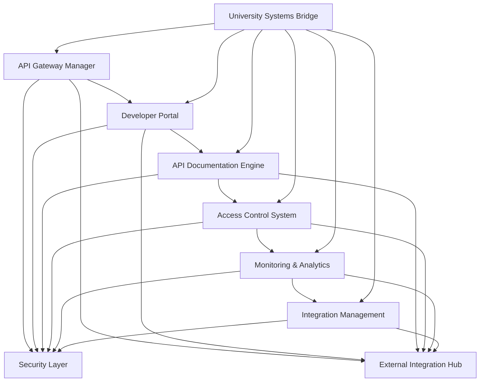
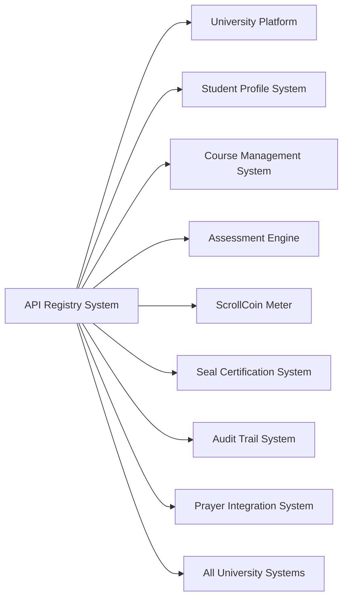

# ScrollUniversity API Registry System Design

## Overview

The API Registry System serves as the central hub for managing, documenting, and providing access to all ScrollUniversity APIs. This system enables third-party integrations, developer access, and external system connectivity while maintaining security, monitoring, and scroll alignment across all API interactions.

## Architecture

### Core Components



### System Integration Architecture



## Components and Interfaces

### 1. API Gateway Manager

**Purpose:** Central gateway for all API traffic with routing and management

**Key Interfaces:**
- `APIGatewayService`: Core API routing and management
- `RequestRouter`: API request routing and load balancing
- `ResponseProcessor`: API response handling and formatting
- `VersionManager`: API versioning and compatibility management

**Data Models:**
```typescript
interface APIEndpoint {
  id: string;
  name: string;
  path: string;
  method: HTTPMethod;
  version: string;
  description: string;
  parameters: APIParameter[];
  responses: APIResponse[];
  authentication: AuthenticationRequirement;
  rateLimit: RateLimit;
  permissions: Permission[];
  status: EndpointStatus;
  documentation: EndpointDocumentation;
}

interface APIParameter {
  name: string;
  type: ParameterType;
  required: boolean;
  description: string;
  validation: ValidationRule[];
  example: any;
  schema: JSONSchema;
}

interface APIResponse {
  statusCode: number;
  description: string;
  schema: JSONSchema;
  examples: ResponseExample[];
  headers: ResponseHeader[];
}
```

### 2. Developer Portal

**Purpose:** Self-service portal for developers to access APIs and documentation

**Key Interfaces:**
- `DeveloperRegistration`: Developer account management
- `ApplicationManager`: Developer application registration
- `KeyManager`: API key generation and management
- `UsageTracker`: API usage monitoring and reporting

**Data Models:**
```typescript
interface DeveloperAccount {
  id: string;
  developerId: string;
  organizationName: string;
  contactEmail: string;
  verificationStatus: VerificationStatus;
  applications: DeveloperApplication[];
  apiKeys: APIKey[];
  usageQuotas: UsageQuota[];
  permissions: DeveloperPermission[];
  registrationDate: Date;
  lastActivity: Date;
}

interface DeveloperApplication {
  id: string;
  developerId: string;
  applicationName: string;
  description: string;
  category: ApplicationCategory;
  intendedUse: string;
  requestedAPIs: string[];
  approvalStatus: ApprovalStatus;
  reviewNotes: string[];
  approvedBy: string;
  approvalDate: Date;
}

interface APIKey {
  id: string;
  developerId: string;
  applicationId: string;
  keyValue: string;
  keyType: KeyType;
  permissions: APIPermission[];
  rateLimit: RateLimit;
  expirationDate: Date;
  status: KeyStatus;
  createdAt: Date;
  lastUsed: Date;
}
```

### 3. API Documentation Engine

**Purpose:** Generates and maintains comprehensive API documentation

**Key Interfaces:**
- `DocumentationGenerator`: Automated documentation generation
- `SpecificationManager`: OpenAPI specification management
- `ExampleGenerator`: Code example generation
- `InteractiveConsole`: API testing interface

**Data Models:**
```typescript
interface APIDocumentation {
  id: string;
  apiId: string;
  version: string;
  title: string;
  description: string;
  baseURL: string;
  authentication: AuthenticationDoc;
  endpoints: EndpointDocumentation[];
  schemas: SchemaDefinition[];
  examples: CodeExample[];
  changelog: ChangelogEntry[];
  lastUpdated: Date;
}

interface EndpointDocumentation {
  endpoint: string;
  method: HTTPMethod;
  summary: string;
  description: string;
  parameters: ParameterDoc[];
  requestBody: RequestBodyDoc;
  responses: ResponseDoc[];
  codeExamples: CodeExample[];
  scrollAlignment: ScrollAlignmentNote[];
}

interface CodeExample {
  language: ProgrammingLanguage;
  title: string;
  description: string;
  code: string;
  response: string;
  explanation: string;
}
```

### 4. Access Control System

**Purpose:** Manages API access permissions and security policies

**Key Interfaces:**
- `PermissionManager`: API permission management
- `AuthenticationService`: API authentication handling
- `AuthorizationEngine`: API authorization processing
- `SecurityPolicyEnforcer`: Security policy enforcement

**Data Models:**
```typescript
interface AccessPolicy {
  id: string;
  name: string;
  description: string;
  apiEndpoints: string[];
  permissions: Permission[];
  restrictions: AccessRestriction[];
  conditions: AccessCondition[];
  scrollAlignmentRequired: boolean;
  spiritualOversight: boolean;
  approvalRequired: boolean;
  reviewPeriod: number;
}

interface Permission {
  resource: string;
  action: Action;
  scope: PermissionScope;
  conditions: PermissionCondition[];
  timeRestrictions: TimeRestriction[];
  dataAccess: DataAccessLevel;
  scrollAlignment: AlignmentRequirement;
}

interface AccessRestriction {
  type: RestrictionType;
  value: string;
  reason: string;
  duration: number;
  exceptions: string[];
  overrideAuthority: string[];
}
```

### 5. Monitoring & Analytics

**Purpose:** Monitors API usage, performance, and provides analytics

**Key Interfaces:**
- `UsageMonitor`: API usage tracking and monitoring
- `PerformanceAnalyzer`: API performance analysis
- `AlertManager`: API monitoring alerts and notifications
- `ReportGenerator`: Usage and performance reporting

**Data Models:**
```typescript
interface APIUsageMetrics {
  apiId: string;
  developerId: string;
  applicationId: string;
  endpoint: string;
  method: HTTPMethod;
  timestamp: Date;
  responseTime: number;
  statusCode: number;
  requestSize: number;
  responseSize: number;
  userAgent: string;
  ipAddress: string;
  geolocation: Geolocation;
}

interface PerformanceMetrics {
  apiId: string;
  endpoint: string;
  period: TimePeriod;
  totalRequests: number;
  successfulRequests: number;
  failedRequests: number;
  averageResponseTime: number;
  p95ResponseTime: number;
  p99ResponseTime: number;
  errorRate: number;
  throughput: number;
}

interface UsageAnalytics {
  period: TimePeriod;
  totalAPICalls: number;
  uniqueDevelopers: number;
  topEndpoints: EndpointUsage[];
  geographicDistribution: GeographicUsage[];
  errorAnalysis: ErrorAnalysis[];
  trendAnalysis: TrendAnalysis[];
}
```

### 6. Integration Management

**Purpose:** Manages third-party integrations and external system connections

**Key Interfaces:**
- `IntegrationOrchestrator`: Integration workflow management
- `WebhookManager`: Webhook configuration and delivery
- `DataSyncManager`: Data synchronization coordination
- `PartnershipManager`: Partner integration management

**Data Models:**
```typescript
interface Integration {
  id: string;
  partnerId: string;
  integrationType: IntegrationType;
  name: string;
  description: string;
  configuration: IntegrationConfig;
  endpoints: IntegrationEndpoint[];
  webhooks: WebhookConfig[];
  dataMapping: DataMapping[];
  status: IntegrationStatus;
  healthCheck: HealthCheckConfig;
  lastSync: Date;
}

interface WebhookConfig {
  id: string;
  integrationId: string;
  event: WebhookEvent;
  url: string;
  method: HTTPMethod;
  headers: WebhookHeader[];
  authentication: WebhookAuth;
  retryPolicy: RetryPolicy;
  status: WebhookStatus;
  lastDelivery: Date;
}

interface DataMapping {
  sourceField: string;
  targetField: string;
  transformation: DataTransformation;
  validation: ValidationRule[];
  scrollAlignment: AlignmentCheck;
  required: boolean;
}
```

## Data Models

### Core API Registry Entities

```sql
-- API Endpoints Table
CREATE TABLE api_endpoints (
    id UUID PRIMARY KEY DEFAULT gen_random_uuid(),
    name VARCHAR(255) NOT NULL,
    path VARCHAR(500) NOT NULL,
    method http_method NOT NULL,
    version VARCHAR(50) NOT NULL,
    description TEXT NOT NULL,
    parameters JSONB NOT NULL,
    responses JSONB NOT NULL,
    authentication JSONB NOT NULL,
    rate_limit JSONB NOT NULL,
    permissions JSONB NOT NULL,
    status endpoint_status NOT NULL DEFAULT 'active',
    documentation JSONB NOT NULL,
    created_at TIMESTAMP DEFAULT CURRENT_TIMESTAMP,
    updated_at TIMESTAMP DEFAULT CURRENT_TIMESTAMP
);

-- Developer Accounts Table
CREATE TABLE developer_accounts (
    id UUID PRIMARY KEY DEFAULT gen_random_uuid(),
    developer_id VARCHAR(255) UNIQUE NOT NULL,
    organization_name VARCHAR(255) NOT NULL,
    contact_email VARCHAR(255) NOT NULL,
    verification_status verification_status NOT NULL DEFAULT 'pending',
    usage_quotas JSONB NOT NULL,
    permissions JSONB NOT NULL,
    registration_date TIMESTAMP DEFAULT CURRENT_TIMESTAMP,
    last_activity TIMESTAMP DEFAULT CURRENT_TIMESTAMP
);

-- API Keys Table
CREATE TABLE api_keys (
    id UUID PRIMARY KEY DEFAULT gen_random_uuid(),
    developer_id UUID NOT NULL REFERENCES developer_accounts(id),
    application_id UUID NOT NULL REFERENCES developer_applications(id),
    key_value VARCHAR(255) UNIQUE NOT NULL,
    key_type key_type NOT NULL,
    permissions JSONB NOT NULL,
    rate_limit JSONB NOT NULL,
    expiration_date TIMESTAMP,
    status key_status NOT NULL DEFAULT 'active',
    created_at TIMESTAMP DEFAULT CURRENT_TIMESTAMP,
    last_used TIMESTAMP
);

-- API Usage Metrics Table
CREATE TABLE api_usage_metrics (
    id UUID PRIMARY KEY DEFAULT gen_random_uuid(),
    api_id UUID NOT NULL REFERENCES api_endpoints(id),
    developer_id UUID NOT NULL REFERENCES developer_accounts(id),
    application_id UUID REFERENCES developer_applications(id),
    endpoint VARCHAR(500) NOT NULL,
    method http_method NOT NULL,
    timestamp TIMESTAMP NOT NULL DEFAULT CURRENT_TIMESTAMP,
    response_time INTEGER NOT NULL,
    status_code INTEGER NOT NULL,
    request_size INTEGER NOT NULL,
    response_size INTEGER NOT NULL,
    user_agent TEXT,
    ip_address INET,
    geolocation JSONB
);

-- Integrations Table
CREATE TABLE integrations (
    id UUID PRIMARY KEY DEFAULT gen_random_uuid(),
    partner_id UUID NOT NULL REFERENCES developer_accounts(id),
    integration_type integration_type NOT NULL,
    name VARCHAR(255) NOT NULL,
    description TEXT NOT NULL,
    configuration JSONB NOT NULL,
    endpoints JSONB NOT NULL,
    webhooks JSONB NOT NULL,
    data_mapping JSONB NOT NULL,
    status integration_status NOT NULL DEFAULT 'pending',
    health_check JSONB NOT NULL,
    last_sync TIMESTAMP,
    created_at TIMESTAMP DEFAULT CURRENT_TIMESTAMP,
    updated_at TIMESTAMP DEFAULT CURRENT_TIMESTAMP
);
```

## Error Handling

### API Gateway Errors
- **EndpointNotFound**: When requested API endpoint doesn't exist
- **VersionNotSupported**: When API version is not supported
- **RateLimitExceeded**: When API rate limit is exceeded
- **AuthenticationFailed**: When API authentication fails

### Developer Portal Errors
- **DeveloperRegistrationFailed**: When developer registration fails
- **ApplicationApprovalPending**: When application approval is pending
- **APIKeyGenerationFailed**: When API key generation fails
- **UsageQuotaExceeded**: When usage quota is exceeded

### Integration Errors
- **IntegrationConfigurationError**: When integration configuration is invalid
- **WebhookDeliveryFailed**: When webhook delivery fails
- **DataMappingError**: When data mapping fails
- **PartnerConnectionFailed**: When partner connection fails

## Testing Strategy

### Unit Testing
- API endpoint routing and processing
- Authentication and authorization logic
- Rate limiting and quota management
- Documentation generation accuracy
- Usage metrics collection

### Integration Testing
- University system API integration
- Third-party service connections
- Webhook delivery and processing
- Developer portal functionality
- Mobile application API access

### Performance Testing
- High-volume API request handling
- Concurrent developer access
- Real-time monitoring and analytics
- Large-scale integration processing
- Database query optimization

### Security Testing
- API authentication and authorization
- Rate limiting effectiveness
- Data encryption and protection
- Access control validation
- Vulnerability assessment

### Developer Experience Testing
- API documentation clarity and completeness
- Developer portal usability
- Code example accuracy
- Integration ease and efficiency
- Support and troubleshooting effectiveness