# ScrollAssessmentEngine Design Document

## Overview

ScrollAssessmentEngine is a comprehensive evaluation system that assesses complete development of scroll-aligned learners across academic knowledge, spiritual formation, practical skills, character development, and kingdom impact. The system integrates AI-powered evaluation, peer assessment, mentor validation, and prophetic confirmation to provide holistic assessment that serves both educational accountability and spiritual formation.

## Architecture

The system follows a multi-dimensional architecture with AI-powered assessment, real-time feedback, and comprehensive validation. It integrates with all ScrollUniversity systems through event-driven communication and maintains assessment integrity through multiple validation layers.

```mermaid
graph TB
    A[ScrollAssessmentEngine] --> B[Multi-Dimensional Framework]
    A --> C[AI Assessment System]
    A --> D[Practical Skills Evaluator]
    A --> E[Spiritual Formation Assessor]
    
    B --> F[Academic Knowledge]
    B --> G[Character Development]
    B --> H[Kingdom Impact]
    B --> I[Competency Validation]
    
    C --> J[Adaptive Questioning]
    C --> K[Response Analysis]
    C --> L[Feedback Generation]
    C --> M[Bias Prevention]
    
    D --> N[Project Evaluation]
    D --> O[Portfolio Assessment]
    D --> P[Skill Demonstration]
    D --> Q[Innovation Measurement]
    
    E --> R[Spiritual Growth Tracking]
    E --> S[Character Assessment]
    E --> T[Prophetic Validation]
    E --> U[Mentor Confirmation]
    
    A --> V[Peer Assessment System]
    A --> W[Anti-Cheating Engine]
    A --> X[Analytics Dashboard]
```



## Components and Interfaces

### Core Data Schema

```json
{
  "assessment": {
    "assessment_id": "uuid",
    "course_id": "uuid",
    "student_id": "uuid",
    "assessment_type": "quiz | project | peer_evaluation | mentor_assessment | prophetic_confirmation",
    "dimensions": {
      "academic_knowledge": "decimal",
      "spiritual_formation": "decimal",
      "practical_skills": "decimal",
      "character_development": "decimal",
      "kingdom_impact": "decimal"
    },
    "overall_score": "decimal",
    "status": "draft | in_progress | completed | validated",
    "created_at": "timestamp",
    "completed_at": "timestamp",
    "validated_by": "uuid"
  },
  "assessment_question": {
    "question_id": "uuid",
    "assessment_id": "uuid",
    "question_type": "multiple_choice | essay | practical | spiritual_reflection | character_scenario",
    "question_text": "text",
    "options": ["string"],
    "correct_answer": "string",
    "difficulty_level": "basic | intermediate | advanced | expert",
    "dimension_weights": {
      "academic": "decimal",
      "spiritual": "decimal",
      "practical": "decimal",
      "character": "decimal"
    },
    "ai_evaluation_criteria": "json"
  },
  "assessment_response": {
    "response_id": "uuid",
    "question_id": "uuid",
    "student_id": "uuid",
    "response_text": "text",
    "response_data": "json",
    "ai_score": "decimal",
    "human_score": "decimal",
    "final_score": "decimal",
    "feedback": "text",
    "validation_status": "pending | validated | disputed",
    "submitted_at": "timestamp"
  }
}
```

### AI Assessment Schema

```json
{
  "ai_evaluation": {
    "evaluation_id": "uuid",
    "response_id": "uuid",
    "ai_model": "string",
    "confidence_score": "decimal",
    "evaluation_criteria": {
      "accuracy": "decimal",
      "completeness": "decimal",
      "creativity": "decimal",
      "spiritual_insight": "decimal",
      "practical_application": "decimal"
    },
    "feedback_generated": "text",
    "human_review_required": "boolean",
    "evaluation_timestamp": "timestamp"
  },
  "competency_assessment": {
    "competency_id": "uuid",
    "student_id": "uuid",
    "skill_area": "string",
    "proficiency_level": "novice | developing | proficient | advanced | expert",
    "evidence": ["assessment_id"],
    "validation_method": "ai | peer | mentor | practical_demonstration",
    "last_assessed": "timestamp",
    "next_assessment_due": "timestamp"
  }
}
```

### Spiritual Formation Schema

```json
{
  "spiritual_assessment": {
    "spiritual_assessment_id": "uuid",
    "student_id": "uuid",
    "mentor_id": "uuid",
    "assessment_period": "string",
    "spiritual_disciplines": {
      "prayer_consistency": "decimal",
      "scripture_study": "decimal",
      "worship_engagement": "decimal",
      "service_participation": "decimal"
    },
    "character_indicators": {
      "integrity": "decimal",
      "humility": "decimal",
      "servant_leadership": "decimal",
      "kingdom_focus": "decimal"
    },
    "prophetic_development": {
      "prophetic_accuracy": "decimal",
      "spiritual_discernment": "decimal",
      "divine_encounters": "integer"
    },
    "mentor_notes": "text",
    "prophetic_confirmation": "text",
    "assessment_date": "timestamp"
  }
}
```

## Data Models

### Assessment Entity
- **Primary Key:** assessment_id
- **Foreign Keys:** course_id, student_id
- **Relationships:** One-to-many with Questions and Responses
- **Indexes:** student_id, course_id, assessment_type, completed_at
- **Constraints:** overall_score between 0 and 100

### Assessment Question Entity
- **Primary Key:** question_id
- **Foreign Key:** assessment_id
- **Relationships:** Many-to-one with Assessment, One-to-many with Responses
- **Indexes:** assessment_id, question_type, difficulty_level
- **Constraints:** valid question_type, difficulty_level values

### Assessment Response Entity
- **Primary Key:** response_id
- **Foreign Keys:** question_id, student_id
- **Relationships:** Many-to-one with Question and Student
- **Indexes:** student_id, question_id, submitted_at
- **Constraints:** final_score between 0 and 100

## Error Handling

### Assessment Creation Errors
- **Invalid Assessment Configuration:** Return 400 with configuration requirements
- **Missing Prerequisites:** Return 422 with prerequisite completion needs
- **Unauthorized Access:** Return 403 with permission requirements

### AI Evaluation Errors
- **AI Service Unavailable:** Fall back to human evaluation queue
- **Low Confidence Score:** Escalate to human reviewers automatically
- **Evaluation Timeout:** Retry with exponential backoff, then queue for manual review

### Validation Errors
- **Integrity Violation Detected:** Flag for investigation and provide alternative assessment
- **Bias Detection:** Adjust scoring and provide bias-corrected evaluation
- **System Inconsistency:** Trigger reconciliation process and alert administrators

## Testing Strategy

### Unit Tests
- Multi-dimensional scoring algorithms and weight calculations
- AI evaluation accuracy and consistency across different response types
- Spiritual formation assessment logic and mentor integration
- Anti-cheating detection algorithms and false positive prevention

### Integration Tests
- End-to-end assessment creation, completion, and validation workflows
- Cross-system integration with course-spec, student-profile-spec, and degree-engine
- Real-time feedback delivery and progress tracking
- Peer assessment coordination and validation

### Performance Tests
- Large-scale concurrent assessment processing
- AI evaluation speed and accuracy under high load
- Real-time feedback delivery performance
- Database performance with complex multi-dimensional queries

## Inter-Agent Channels

### Dependencies (Incoming)
- **scroll-course-spec:** Course content and learning objectives for assessment alignment
- **scroll-student-profile-spec:** Student learning preferences and historical performance
- **scroll-faculty-ai:** AI tutoring context and personalized learning data
- **scroll-projects-spec:** Project submissions and practical work for evaluation

### Data Flow (Outgoing)
- **scroll-degree-engine:** Assessment results for competency tracking and degree progress
- **scroll-transcript-generator:** Assessment scores and achievements for transcript inclusion
- **scroll-scrollcoin-meter:** Assessment completion rewards and performance bonuses
- **scroll-audit-trail-spec:** All assessment activities and integrity monitoring

## Guardrails

### Oath-Based Constraints
- All assessments must promote genuine learning over grade achievement
- Assessment methods must encourage character development alongside academic growth
- Evaluation criteria must align with kingdom values and scroll principles
- Assessment feedback must build up students while maintaining honest evaluation

### GPT Anti-Drift Checks
- AI evaluation must maintain consistency with scroll-aligned educational values
- Automated feedback must encourage spiritual formation and character development
- AI scoring must not discriminate against diverse learning styles or cultural backgrounds
- System recommendations must promote wisdom and understanding over mere knowledge

### Role-Based Access Rules
- Students: Take assessments, view results, access feedback and improvement suggestions
- Mentors: Create spiritual assessments, validate character development, provide prophetic input
- Instructors: Design assessments, review results, adjust evaluation criteria
- Administrators: Monitor system integrity, investigate violations, adjust policies

## Embedded GPT Roles

### Primary GPT: ScrollEvaluatorGPT
- **Persona:** Fair, thorough assessor focused on holistic development and growth
- **Responsibilities:** Evaluate responses, generate feedback, identify learning gaps
- **Constraints:** Must balance encouragement with honest assessment
- **Training:** Assessment methodology, feedback psychology, scroll-aligned evaluation

### Secondary GPT: ScrollFeedbackGPT
- **Persona:** Encouraging mentor focused on student growth and improvement
- **Responsibilities:** Generate personalized feedback, suggest improvement strategies
- **Constraints:** Must provide constructive guidance while maintaining accuracy
- **Training:** Educational psychology, personalized learning, character development

## Runtime Triggers

### Assessment Events
- **onAssessmentCreate:** Initialize multi-dimensional scoring framework and validation rules
- **onResponseSubmit:** Trigger AI evaluation and integrity checking
- **onAssessmentComplete:** Calculate final scores and generate comprehensive feedback
- **onValidationRequired:** Escalate to human reviewers and mentor confirmation

### Learning Events
- **onCompetencyAchieved:** Update skill tracking and trigger advancement opportunities
- **onLearningGapIdentified:** Generate targeted learning recommendations and resources
- **onSpiritualMilestone:** Celebrate spiritual growth and update formation tracking
- **onCharacterDevelopment:** Recognize character growth and provide continued guidance

### System Events
- **onIntegrityViolation:** Implement protective measures and initiate investigation
- **onBiasDetected:** Adjust evaluation and provide corrected assessment
- **onSystemAnomaly:** Alert administrators and implement backup evaluation methods

## Billing/Coin Logic

### Assessment Rewards
- **Basic Assessment Completion:** 10-25 ScrollCoins based on effort and accuracy
- **Excellence Bonuses:** 50-100 ScrollCoins for exceptional performance and insight
- **Improvement Recognition:** 15-30 ScrollCoins for significant progress and growth
- **Peer Assessment Participation:** 5-15 ScrollCoins for quality peer evaluations

### Premium Assessment Features
- **Detailed Feedback Reports:** 25 ScrollCoins for comprehensive analysis and improvement plans
- **Mentor Assessment Sessions:** 50 ScrollCoins for one-on-one evaluation and guidance
- **Competency Certification:** 100 ScrollCoins for verified skill certification
- **Portfolio Assessment:** 75 ScrollCoins for comprehensive portfolio evaluation

### Assessment Creation Costs
- **Basic Assessment Creation:** Free for instructors (included in course development)
- **AI-Enhanced Assessments:** 50 ScrollCoins for advanced AI evaluation features
- **Multi-Dimensional Assessments:** 75 ScrollCoins for comprehensive holistic evaluation
- **Custom Assessment Design:** 100 ScrollCoins for specialized assessment creation

### Quality Incentives
- **High Student Satisfaction:** Instructors earn 25 ScrollCoins for well-designed assessments
- **Accurate AI Evaluation:** System earns efficiency points for consistent AI performance
- **Peer Assessment Quality:** Students earn 10 ScrollCoins for helpful peer evaluations
- **Mentor Validation Accuracy:** Mentors earn 30 ScrollCoins for accurate spiritual assessments