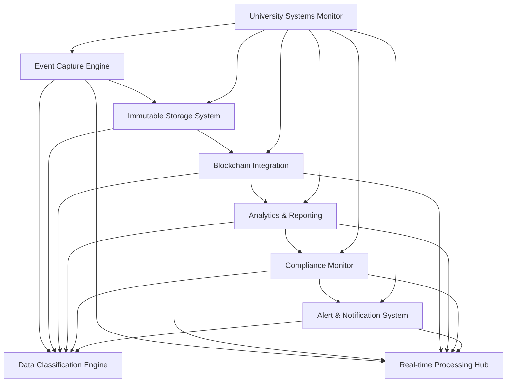
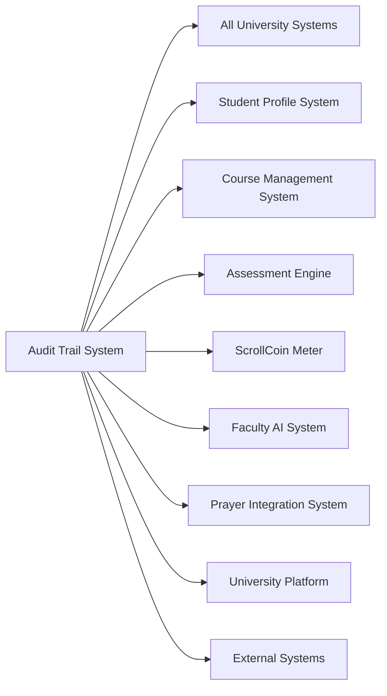

# ScrollUniversity Audit Trail System Design

## Overview

The Audit Trail System provides comprehensive, immutable logging and monitoring capabilities for all ScrollUniversity operations. This system ensures complete accountability, regulatory compliance, and spiritual oversight through blockchain-based record storage and advanced analytics.

## Architecture

### Core Components



### System Integration Architecture



## Components and Interfaces

### 1. Event Capture Engine

**Purpose:** Captures and processes all system events and user activities

**Key Interfaces:**
- `EventCollector`: Universal event collection and processing
- `ActivityTracker`: User activity monitoring and logging
- `SystemMonitor`: System operation monitoring and recording
- `SecurityEventProcessor`: Security-related event handling

**Data Models:**
```typescript
interface AuditEvent {
  id: string;
  timestamp: Date;
  eventType: EventType;
  source: EventSource;
  actor: Actor;
  target: EventTarget;
  action: Action;
  outcome: EventOutcome;
  details: EventDetails;
  context: EventContext;
  severity: SeverityLevel;
  classification: DataClassification;
  hash: string;
  signature: string;
}

interface Actor {
  id: string;
  type: ActorType;
  name: string;
  role: string[];
  permissions: Permission[];
  ipAddress: string;
  userAgent: string;
  geolocation: Geolocation;
  sessionId: string;
}

interface EventTarget {
  id: string;
  type: TargetType;
  name: string;
  properties: TargetProperty[];
  sensitivity: SensitivityLevel;
  owner: string;
  classification: DataClassification;
}

enum EventType {
  USER_ACTION = 'user_action',
  SYSTEM_OPERATION = 'system_operation',
  SECURITY_EVENT = 'security_event',
  DATA_ACCESS = 'data_access',
  CONFIGURATION_CHANGE = 'configuration_change',
  SPIRITUAL_EVENT = 'spiritual_event'
}
```

### 2. Immutable Storage System

**Purpose:** Provides tamper-proof storage for all audit records

**Key Interfaces:**
- `ImmutableStore`: Tamper-proof record storage
- `RecordValidator`: Record integrity validation
- `StorageManager`: Storage optimization and management
- `RetrievalService`: Secure record retrieval and access

**Data Models:**
```typescript
interface AuditRecord {
  id: string;
  eventId: string;
  blockNumber: number;
  blockHash: string;
  previousHash: string;
  merkleRoot: string;
  timestamp: Date;
  data: EncryptedData;
  metadata: RecordMetadata;
  witnesses: Witness[];
  integrity: IntegrityProof;
  retention: RetentionPolicy;
}

interface IntegrityProof {
  algorithm: HashAlgorithm;
  hash: string;
  signature: DigitalSignature;
  witnesses: WitnessSignature[];
  timestamp: Date;
  certificate: Certificate;
}

interface EncryptedData {
  algorithm: EncryptionAlgorithm;
  encryptedContent: string;
  keyId: string;
  iv: string;
  authTag: string;
  metadata: EncryptionMetadata;
}
```

### 3. Blockchain Integration

**Purpose:** Integrates with blockchain for ultimate immutability and verification

**Key Interfaces:**
- `BlockchainConnector`: Blockchain network integration
- `SmartContractManager`: Smart contract deployment and management
- `ConsensusManager`: Consensus mechanism coordination
- `VerificationService`: Blockchain-based verification

**Data Models:**
```typescript
interface BlockchainRecord {
  id: string;
  transactionHash: string;
  blockNumber: number;
  blockHash: string;
  contractAddress: string;
  gasUsed: number;
  timestamp: Date;
  confirmations: number;
  status: TransactionStatus;
  auditEventIds: string[];
  merkleProof: MerkleProof;
}

interface SmartContract {
  id: string;
  name: string;
  address: string;
  abi: ContractABI;
  bytecode: string;
  version: string;
  deploymentTransaction: string;
  functions: ContractFunction[];
  events: ContractEvent[];
  permissions: ContractPermission[];
}

interface MerkleProof {
  leaf: string;
  proof: string[];
  root: string;
  index: number;
  verified: boolean;
}
```

### 4. Analytics & Reporting

**Purpose:** Provides comprehensive analytics and reporting capabilities

**Key Interfaces:**
- `AnalyticsEngine`: Advanced audit data analysis
- `ReportGenerator`: Automated report generation
- `TrendAnalyzer`: Pattern and trend identification
- `ComplianceReporter`: Regulatory compliance reporting

**Data Models:**
```typescript
interface AuditAnalytics {
  period: TimePeriod;
  totalEvents: number;
  eventsByType: EventTypeMetrics[];
  userActivity: UserActivityMetrics[];
  systemPerformance: SystemPerformanceMetrics;
  securityMetrics: SecurityMetrics;
  complianceMetrics: ComplianceMetrics;
  anomalies: AnomalyDetection[];
  trends: TrendAnalysis[];
}

interface EventTypeMetrics {
  eventType: EventType;
  count: number;
  percentage: number;
  trend: TrendDirection;
  severity: SeverityDistribution;
  outcomes: OutcomeDistribution;
}

interface AnomalyDetection {
  id: string;
  type: AnomalyType;
  description: string;
  severity: SeverityLevel;
  confidence: number;
  affectedEvents: string[];
  detectionTime: Date;
  status: AnomalyStatus;
  investigation: Investigation;
}
```

### 5. Compliance Monitor

**Purpose:** Monitors compliance with regulations and spiritual standards

**Key Interfaces:**
- `ComplianceChecker`: Regulatory compliance validation
- `PolicyEnforcer`: Policy compliance enforcement
- `SpiritualOversight`: Spiritual compliance monitoring
- `ViolationDetector`: Compliance violation detection

**Data Models:**
```typescript
interface ComplianceRule {
  id: string;
  name: string;
  description: string;
  category: ComplianceCategory;
  regulation: Regulation;
  requirements: ComplianceRequirement[];
  violations: ViolationType[];
  severity: SeverityLevel;
  enforcement: EnforcementAction[];
  spiritualAlignment: SpiritualRequirement;
}

interface ComplianceViolation {
  id: string;
  ruleId: string;
  eventId: string;
  violationType: ViolationType;
  severity: SeverityLevel;
  description: string;
  evidence: Evidence[];
  detectionTime: Date;
  status: ViolationStatus;
  remediation: RemediationAction[];
  spiritualImplications: SpiritualImplication[];
}

interface SpiritualRequirement {
  principle: KingdomPrinciple;
  alignment: AlignmentLevel;
  oversight: OversightRequirement;
  validation: ValidationMethod;
  consequences: SpiritualConsequence[];
}
```

### 6. Alert & Notification System

**Purpose:** Provides real-time alerts and notifications for critical events

**Key Interfaces:**
- `AlertManager`: Alert generation and management
- `NotificationService`: Multi-channel notification delivery
- `EscalationEngine`: Alert escalation and routing
- `ResponseTracker`: Alert response tracking

**Data Models:**
```typescript
interface Alert {
  id: string;
  type: AlertType;
  severity: SeverityLevel;
  title: string;
  description: string;
  source: AlertSource;
  triggerEvent: string;
  conditions: AlertCondition[];
  recipients: AlertRecipient[];
  channels: NotificationChannel[];
  escalation: EscalationRule[];
  status: AlertStatus;
  createdAt: Date;
  acknowledgedAt: Date;
  resolvedAt: Date;
}

interface NotificationChannel {
  type: ChannelType;
  configuration: ChannelConfig;
  priority: Priority;
  retryPolicy: RetryPolicy;
  deliveryStatus: DeliveryStatus;
  deliveredAt: Date;
}

interface EscalationRule {
  level: EscalationLevel;
  delay: number;
  recipients: AlertRecipient[];
  conditions: EscalationCondition[];
  actions: EscalationAction[];
  spiritualAuthority: SpiritualAuthority[];
}
```

## Data Models

### Core Audit Trail Entities

```sql
-- Audit Events Table
CREATE TABLE audit_events (
    id UUID PRIMARY KEY DEFAULT gen_random_uuid(),
    timestamp TIMESTAMP NOT NULL DEFAULT CURRENT_TIMESTAMP,
    event_type event_type NOT NULL,
    source VARCHAR(255) NOT NULL,
    actor JSONB NOT NULL,
    target JSONB NOT NULL,
    action VARCHAR(255) NOT NULL,
    outcome event_outcome NOT NULL,
    details JSONB NOT NULL,
    context JSONB NOT NULL,
    severity severity_level NOT NULL,
    classification data_classification NOT NULL,
    hash VARCHAR(255) NOT NULL,
    signature VARCHAR(500) NOT NULL,
    UNIQUE(hash)
);

-- Audit Records Table
CREATE TABLE audit_records (
    id UUID PRIMARY KEY DEFAULT gen_random_uuid(),
    event_id UUID NOT NULL REFERENCES audit_events(id),
    block_number BIGINT NOT NULL,
    block_hash VARCHAR(255) NOT NULL,
    previous_hash VARCHAR(255) NOT NULL,
    merkle_root VARCHAR(255) NOT NULL,
    timestamp TIMESTAMP NOT NULL DEFAULT CURRENT_TIMESTAMP,
    encrypted_data JSONB NOT NULL,
    metadata JSONB NOT NULL,
    witnesses JSONB NOT NULL,
    integrity_proof JSONB NOT NULL,
    retention_policy JSONB NOT NULL
);

-- Blockchain Records Table
CREATE TABLE blockchain_records (
    id UUID PRIMARY KEY DEFAULT gen_random_uuid(),
    transaction_hash VARCHAR(255) UNIQUE NOT NULL,
    block_number BIGINT NOT NULL,
    block_hash VARCHAR(255) NOT NULL,
    contract_address VARCHAR(255) NOT NULL,
    gas_used INTEGER NOT NULL,
    timestamp TIMESTAMP NOT NULL,
    confirmations INTEGER NOT NULL DEFAULT 0,
    status transaction_status NOT NULL,
    audit_event_ids UUID[] NOT NULL,
    merkle_proof JSONB NOT NULL
);

-- Compliance Violations Table
CREATE TABLE compliance_violations (
    id UUID PRIMARY KEY DEFAULT gen_random_uuid(),
    rule_id UUID NOT NULL REFERENCES compliance_rules(id),
    event_id UUID NOT NULL REFERENCES audit_events(id),
    violation_type violation_type NOT NULL,
    severity severity_level NOT NULL,
    description TEXT NOT NULL,
    evidence JSONB NOT NULL,
    detection_time TIMESTAMP NOT NULL DEFAULT CURRENT_TIMESTAMP,
    status violation_status NOT NULL DEFAULT 'open',
    remediation JSONB NOT NULL,
    spiritual_implications JSONB NOT NULL
);

-- Alerts Table
CREATE TABLE alerts (
    id UUID PRIMARY KEY DEFAULT gen_random_uuid(),
    type alert_type NOT NULL,
    severity severity_level NOT NULL,
    title VARCHAR(255) NOT NULL,
    description TEXT NOT NULL,
    source VARCHAR(255) NOT NULL,
    trigger_event UUID REFERENCES audit_events(id),
    conditions JSONB NOT NULL,
    recipients JSONB NOT NULL,
    channels JSONB NOT NULL,
    escalation JSONB NOT NULL,
    status alert_status NOT NULL DEFAULT 'active',
    created_at TIMESTAMP DEFAULT CURRENT_TIMESTAMP,
    acknowledged_at TIMESTAMP,
    resolved_at TIMESTAMP
);
```

## Error Handling

### Event Capture Errors
- **EventCaptureFailure**: When event capture fails
- **InvalidEventFormat**: When event format is invalid
- **EventProcessingTimeout**: When event processing times out
- **StorageCapacityExceeded**: When storage capacity is exceeded

### Immutable Storage Errors
- **RecordCorruption**: When record integrity is compromised
- **HashMismatch**: When hash validation fails
- **EncryptionFailure**: When encryption/decryption fails
- **StorageAccessDenied**: When storage access is denied

### Blockchain Integration Errors
- **BlockchainConnectionFailure**: When blockchain connection fails
- **TransactionFailure**: When blockchain transaction fails
- **ConsensusFailure**: When consensus mechanism fails
- **SmartContractError**: When smart contract execution fails

### Compliance Monitoring Errors
- **ComplianceCheckFailure**: When compliance check fails
- **PolicyViolationDetected**: When policy violation is detected
- **RegulatoryComplianceFailure**: When regulatory compliance fails
- **SpiritualAlignmentViolation**: When spiritual alignment is violated

## Testing Strategy

### Unit Testing
- Event capture and processing logic
- Immutable storage mechanisms
- Blockchain integration functions
- Compliance rule validation
- Alert generation and delivery

### Integration Testing
- University system integration
- Blockchain network connectivity
- External compliance system integration
- Multi-channel notification delivery
- Cross-system event correlation

### Security Testing
- Data encryption and protection
- Access control validation
- Tamper detection and prevention
- Blockchain security verification
- Compliance audit validation

### Performance Testing
- High-volume event processing
- Real-time monitoring capabilities
- Large-scale data retrieval
- Concurrent system access
- Blockchain transaction throughput

### Compliance Testing
- Regulatory requirement validation
- Audit trail completeness
- Data retention compliance
- Privacy protection verification
- Spiritual oversight effectiveness