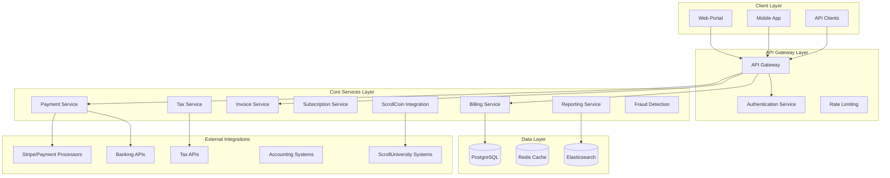

# ScrollBillingAgent Design Document

## Overview

The ScrollBillingAgent is architected as a comprehensive financial management system that serves as the economic backbone of ScrollUniversity. Built on microservices architecture with event-driven communication, the system integrates traditional financial operations with ScrollCoin economics while maintaining kingdom principles of transparency, stewardship, and service. The design emphasizes scalability, security, and seamless integration with the broader ScrollUniversity ecosystem.

The system operates on three core architectural layers: the Financial Operations Layer (billing, payments, invoicing), the Integration Layer (ScrollCoin, external systems, APIs), and the Intelligence Layer (analytics, fraud detection, compliance). This design ensures robust financial operations while maintaining the flexibility to adapt to evolving educational and economic needs.

## Architecture

### System Architecture Overview



### Service Architecture

The system follows a domain-driven design approach with bounded contexts for each major financial function:

**Financial Operations Domain:**
- Billing Service: Manages billing cycles, invoice generation, and payment scheduling
- Payment Service: Handles payment processing, multi-currency support, and payment method management
- Invoice Service: Creates, delivers, and tracks invoices with professional formatting
- Subscription Service: Manages recurring payments, subscription lifecycle, and dunning management

**Integration Domain:**
- ScrollCoin Integration Service: Manages hybrid payments and coin-to-currency conversions
- External Payment Gateway Service: Interfaces with Stripe, PayPal, and banking systems
- Accounting Integration Service: Syncs with QuickBooks, Xero, and enterprise ERP systems
- Tax Service: Handles tax calculations, compliance, and reporting across jurisdictions

**Intelligence Domain:**
- Analytics Service: Provides financial reporting, forecasting, and business intelligence
- Fraud Detection Service: AI-powered fraud prevention and security monitoring
- Compliance Service: Ensures regulatory compliance and audit trail maintenance
- Customer Financial Service: Manages student accounts, payment plans, and financial aid integration

## Components and Interfaces

### Core Components

#### BillingEngine
```typescript
interface BillingEngine {
  generateInvoices(billingCycle: BillingCycle): Promise<Invoice[]>
  processBillingSchedule(schedule: BillingSchedule): Promise<BillingResult>
  calculateCharges(services: Service[], discounts: Discount[]): Promise<ChargeCalculation>
  handleBillingDisputes(dispute: BillingDispute): Promise<DisputeResolution>
}
```

#### PaymentProcessor
```typescript
interface PaymentProcessor {
  processPayment(payment: PaymentRequest): Promise<PaymentResult>
  handleMultiCurrency(amount: Money, targetCurrency: Currency): Promise<ConversionResult>
  processHybridPayment(scrollCoins: number, traditionalAmount: Money): Promise<HybridPaymentResult>
  validatePaymentMethod(method: PaymentMethod): Promise<ValidationResult>
}
```

#### ScrollCoinIntegrator
```typescript
interface ScrollCoinIntegrator {
  processScrollCoinPayment(coins: number, studentId: string): Promise<CoinPaymentResult>
  convertCoinsToFiat(coins: number, targetCurrency: Currency): Promise<ConversionResult>
  checkCoinBalance(studentId: string): Promise<CoinBalance>
  recordCoinTransaction(transaction: CoinTransaction): Promise<TransactionRecord>
}
```

#### TaxCalculator
```typescript
interface TaxCalculator {
  calculateTax(amount: Money, location: Location, serviceType: ServiceType): Promise<TaxCalculation>
  updateTaxRates(jurisdiction: string): Promise<TaxRateUpdate>
  generateTaxReports(period: ReportingPeriod): Promise<TaxReport[]>
  handleTaxExemptions(exemption: TaxExemption): Promise<ExemptionResult>
}
```

### API Interfaces

#### REST API Endpoints

**Billing Management:**
- `POST /api/v1/billing/invoices` - Generate invoices
- `GET /api/v1/billing/invoices/{id}` - Retrieve invoice details
- `PUT /api/v1/billing/invoices/{id}/status` - Update invoice status
- `POST /api/v1/billing/schedules` - Create billing schedules
- `GET /api/v1/billing/disputes` - List billing disputes

**Payment Processing:**
- `POST /api/v1/payments/process` - Process payments
- `POST /api/v1/payments/hybrid` - Process hybrid ScrollCoin/fiat payments
- `GET /api/v1/payments/methods` - List available payment methods
- `POST /api/v1/payments/refunds` - Process refunds
- `GET /api/v1/payments/history/{studentId}` - Payment history

**Subscription Management:**
- `POST /api/v1/subscriptions` - Create subscriptions
- `PUT /api/v1/subscriptions/{id}` - Modify subscriptions
- `DELETE /api/v1/subscriptions/{id}` - Cancel subscriptions
- `GET /api/v1/subscriptions/analytics` - Subscription analytics

**Financial Reporting:**
- `GET /api/v1/reports/revenue` - Revenue reports
- `GET /api/v1/reports/tax` - Tax reports
- `GET /api/v1/reports/analytics` - Financial analytics
- `POST /api/v1/reports/custom` - Generate custom reports

#### Event-Driven Architecture

**Published Events:**
- `InvoiceGenerated` - When new invoices are created
- `PaymentProcessed` - When payments are successfully processed
- `PaymentFailed` - When payment processing fails
- `SubscriptionCreated` - When new subscriptions are established
- `FraudDetected` - When suspicious activity is identified
- `TaxCalculated` - When tax calculations are completed

**Consumed Events:**
- `StudentEnrolled` - From enrollment system to create billing records
- `CourseCompleted` - From course system to trigger completion-based billing
- `ScrollCoinsEarned` - From ScrollCoin system to update student balances
- `ServiceActivated` - From various systems to trigger billing

## Data Models

### Core Financial Entities

#### Invoice Model
```typescript
interface Invoice {
  id: string
  studentId: string
  invoiceNumber: string
  issueDate: Date
  dueDate: Date
  amount: Money
  currency: Currency
  lineItems: InvoiceLineItem[]
  taxAmount: Money
  totalAmount: Money
  status: InvoiceStatus
  paymentTerms: PaymentTerms
  billingAddress: Address
  metadata: Record<string, any>
}
```

#### Payment Model
```typescript
interface Payment {
  id: string
  invoiceId: string
  studentId: string
  amount: Money
  currency: Currency
  paymentMethod: PaymentMethod
  scrollCoinsUsed?: number
  traditionalAmount?: Money
  status: PaymentStatus
  processedAt: Date
  transactionId: string
  gatewayResponse: GatewayResponse
  metadata: Record<string, any>
}
```

#### Subscription Model
```typescript
interface Subscription {
  id: string
  studentId: string
  planId: string
  status: SubscriptionStatus
  currentPeriodStart: Date
  currentPeriodEnd: Date
  billingCycle: BillingCycle
  amount: Money
  currency: Currency
  paymentMethod: PaymentMethod
  trialEnd?: Date
  canceledAt?: Date
  metadata: Record<string, any>
}
```

### Financial Analytics Models

#### Revenue Analytics
```typescript
interface RevenueAnalytics {
  period: ReportingPeriod
  totalRevenue: Money
  revenueBySource: Record<string, Money>
  revenueByRegion: Record<string, Money>
  scrollCoinRevenue: Money
  traditionalRevenue: Money
  recurringRevenue: Money
  oneTimeRevenue: Money
  growthRate: number
  projectedRevenue: Money
}
```

#### Student Financial Profile
```typescript
interface StudentFinancialProfile {
  studentId: string
  totalPaid: Money
  outstandingBalance: Money
  scrollCoinBalance: number
  paymentHistory: Payment[]
  subscriptions: Subscription[]
  paymentMethods: PaymentMethod[]
  creditScore?: number
  riskAssessment: RiskLevel
  financialAidEligibility: FinancialAid[]
}
```

## Error Handling

### Error Classification System

**Financial Errors:**
- `PAYMENT_DECLINED` - Payment method declined by processor
- `INSUFFICIENT_FUNDS` - Insufficient ScrollCoins or traditional funds
- `CURRENCY_CONVERSION_FAILED` - Currency conversion service unavailable
- `TAX_CALCULATION_ERROR` - Tax service error or invalid jurisdiction
- `INVOICE_GENERATION_FAILED` - Invoice creation or delivery failure

**Integration Errors:**
- `GATEWAY_TIMEOUT` - Payment gateway timeout or unavailability
- `SCROLLCOIN_SERVICE_ERROR` - ScrollCoin integration service failure
- `ACCOUNTING_SYNC_FAILED` - Accounting system synchronization failure
- `BANK_API_ERROR` - Banking API integration failure

**Security Errors:**
- `FRAUD_DETECTED` - Suspicious transaction patterns identified
- `AUTHENTICATION_FAILED` - Invalid credentials or expired tokens
- `AUTHORIZATION_DENIED` - Insufficient permissions for operation
- `PCI_COMPLIANCE_VIOLATION` - Payment card industry compliance issue

### Error Recovery Strategies

**Payment Processing Recovery:**
```typescript
class PaymentRecoveryService {
  async retryFailedPayment(paymentId: string): Promise<PaymentResult> {
    const payment = await this.getPayment(paymentId)
    const retryStrategy = this.determineRetryStrategy(payment.failureReason)
    
    switch (retryStrategy) {
      case 'IMMEDIATE_RETRY':
        return this.processPayment(payment)
      case 'DELAYED_RETRY':
        return this.scheduleRetry(payment, { delay: '1h' })
      case 'ALTERNATIVE_METHOD':
        return this.suggestAlternativePayment(payment)
      case 'MANUAL_REVIEW':
        return this.flagForManualReview(payment)
    }
  }
}
```

**Data Consistency Recovery:**
```typescript
class ConsistencyRecoveryService {
  async reconcileFinancialData(): Promise<ReconciliationResult> {
    const discrepancies = await this.detectDiscrepancies()
    const resolutions = await Promise.all(
      discrepancies.map(d => this.resolveDiscrepancy(d))
    )
    return this.generateReconciliationReport(resolutions)
  }
}
```

## Testing Strategy

### Testing Pyramid Implementation

**Unit Testing (70%):**
- Financial calculation accuracy testing
- Payment processing logic validation
- Tax calculation verification
- Currency conversion accuracy
- ScrollCoin integration logic
- Fraud detection algorithm testing

**Integration Testing (20%):**
- Payment gateway integration testing
- ScrollCoin system integration validation
- Accounting system synchronization testing
- Tax service API integration testing
- Database transaction integrity testing
- Event-driven communication testing

**End-to-End Testing (10%):**
- Complete billing cycle testing
- Multi-currency payment flow testing
- Subscription lifecycle testing
- Financial reporting accuracy testing
- Compliance workflow testing
- Disaster recovery testing

### Financial Testing Scenarios

**Payment Processing Tests:**
```typescript
describe('Payment Processing', () => {
  test('should process hybrid ScrollCoin and fiat payment', async () => {
    const payment = {
      studentId: 'student-123',
      totalAmount: { amount: 1000, currency: 'USD' },
      scrollCoins: 500,
      traditionalAmount: { amount: 500, currency: 'USD' }
    }
    
    const result = await paymentService.processHybridPayment(payment)
    
    expect(result.status).toBe('SUCCESS')
    expect(result.scrollCoinsUsed).toBe(500)
    expect(result.traditionalAmountCharged.amount).toBe(500)
  })
})
```

**Tax Calculation Tests:**
```typescript
describe('Tax Calculation', () => {
  test('should calculate correct tax for educational services', async () => {
    const calculation = await taxService.calculateTax({
      amount: { amount: 1000, currency: 'USD' },
      location: { country: 'US', state: 'CA' },
      serviceType: 'EDUCATION'
    })
    
    expect(calculation.taxAmount.amount).toBe(0) // Educational exemption
    expect(calculation.exemptionReason).toBe('EDUCATIONAL_INSTITUTION')
  })
})
```

### Performance Testing

**Load Testing Scenarios:**
- 10,000 concurrent payment processing requests
- 50,000 invoice generation operations per hour
- 1,000 simultaneous subscription modifications
- 100,000 financial report queries per day

**Stress Testing Scenarios:**
- Payment gateway failure simulation
- Database connection pool exhaustion
- ScrollCoin service unavailability
- High-volume fraud detection processing

### Security Testing

**Financial Security Tests:**
- PCI DSS compliance validation
- Payment data encryption verification
- Fraud detection accuracy testing
- Authentication and authorization testing
- Data breach simulation and response testing
- Regulatory compliance audit simulation

**ScrollCoin Security Tests:**
- Coin balance manipulation prevention
- Double-spending prevention
- Unauthorized coin transfer detection
- Coin-to-fiat conversion rate manipulation prevention

This comprehensive design provides the foundation for a robust, scalable, and secure financial management system that serves ScrollUniversity's mission while maintaining the highest standards of financial integrity and kingdom principles.