# ScrollBuilderGPT Design Document

## Overview

ScrollBuilderGPT is a specialized AI assistant designed to support students, developers, and creators in building practical projects, applications, and solutions that serve the kingdom mission. The system provides technical guidance, code generation, architectural advice, and project mentorship that combines cutting-edge development capabilities with scroll-aligned values and kingdom purposes.

## Architecture

The system follows a modular AI architecture with specialized knowledge domains, real-time code analysis, and comprehensive project support. It integrates with development tools and maintains kingdom alignment through built-in ethical guidelines and scroll principle validation.

```mermaid
graph TB
    A[ScrollBuilderGPT] --> B[Technical Guidance Engine]
    A --> C[Code Generation System]
    A --> D[Kingdom Solution Designer]
    A --> E[Multi-Platform Support]
    
    B --> F[Architecture Advisor]
    B --> G[Technology Selector]
    B --> H[Performance Optimizer]
    B --> I[Security Consultant]
    
    C --> J[Code Generator]
    C --> K[Debug Assistant]
    C --> L[Code Reviewer]
    C --> M[Test Creator]
    
    D --> N[Impact Assessor]
    D --> O[Ethics Validator]
    D --> P[Accessibility Checker]
    D --> Q[Sustainability Advisor]
    
    E --> R[Web Development]
    E --> S[Mobile Development]
    E --> T[Backend Systems]
    E --> U[Cloud Deployment]
    
    A --> V[Project Manager]
    A --> W[Learning Integrator]
    A --> X[Innovation Engine]
```



## Components and Interfaces

### Core Data Schema

```json
{
  "project_guidance": {
    "guidance_id": "uuid",
    "student_id": "uuid",
    "project_id": "uuid",
    "guidance_type": "architecture | technology_stack | design_pattern | performance | security",
    "request_context": "text",
    "recommendations": [
      {
        "recommendation": "text",
        "rationale": "text",
        "kingdom_alignment": "decimal",
        "technical_merit": "decimal",
        "implementation_complexity": "low | medium | high"
      }
    ],
    "follow_up_questions": ["string"],
    "resources": ["url"],
    "created_at": "timestamp"
  },
  "code_generation": {
    "generation_id": "uuid",
    "student_id": "uuid",
    "project_id": "uuid",
    "request_type": "new_code | debug_fix | refactor | test_creation",
    "programming_language": "string",
    "framework": "string",
    "requirements": "text",
    "generated_code": "text",
    "documentation": "text",
    "quality_score": "decimal",
    "kingdom_alignment_score": "decimal",
    "test_coverage": "decimal",
    "security_validated": "boolean",
    "generated_at": "timestamp"
  },
  "kingdom_solution": {
    "solution_id": "uuid",
    "student_id": "uuid",
    "project_id": "uuid",
    "problem_statement": "text",
    "kingdom_impact_assessment": {
      "community_benefit": "decimal",
      "ethical_score": "decimal",
      "accessibility_rating": "decimal",
      "sustainability_score": "decimal"
    },
    "solution_approach": "text",
    "implementation_plan": ["string"],
    "success_metrics": ["string"],
    "potential_challenges": ["string"],
    "mitigation_strategies": ["string"],
    "created_at": "timestamp"
  }
}
```

### Technical Support Schema

```json
{
  "technical_consultation": {
    "consultation_id": "uuid",
    "student_id": "uuid",
    "consultation_type": "architecture_review | code_review | debugging | optimization",
    "project_context": "text",
    "technical_stack": ["string"],
    "specific_questions": ["string"],
    "analysis_results": {
      "strengths": ["string"],
      "areas_for_improvement": ["string"],
      "security_concerns": ["string"],
      "performance_issues": ["string"]
    },
    "recommendations": ["string"],
    "next_steps": ["string"],
    "estimated_effort": "string",
    "consultant_notes": "text"
  },
  "learning_integration": {
    "integration_id": "uuid",
    "student_id": "uuid",
    "project_id": "uuid",
    "learning_objectives": ["string"],
    "skills_demonstrated": ["string"],
    "knowledge_gaps": ["string"],
    "recommended_resources": [
      {
        "resource_type": "tutorial | documentation | course | practice",
        "title": "string",
        "url": "string",
        "difficulty_level": "beginner | intermediate | advanced",
        "estimated_time": "string"
      }
    ],
    "skill_progression": "json",
    "mentorship_suggestions": ["string"]
  }
}
```

### Innovation and Collaboration Schema

```json
{
  "innovation_session": {
    "session_id": "uuid",
    "student_id": "uuid",
    "innovation_type": "creative_problem_solving | breakthrough_solution | novel_approach",
    "problem_context": "text",
    "brainstorming_results": ["string"],
    "innovative_approaches": [
      {
        "approach": "string",
        "novelty_score": "decimal",
        "feasibility_score": "decimal",
        "kingdom_impact": "decimal",
        "technical_complexity": "decimal"
      }
    ],
    "selected_approach": "string",
    "implementation_strategy": "text",
    "success_probability": "decimal",
    "created_at": "timestamp"
  },
  "collaboration_support": {
    "collaboration_id": "uuid",
    "project_id": "uuid",
    "team_members": ["uuid"],
    "collaboration_type": "code_review | pair_programming | architecture_discussion | problem_solving",
    "session_summary": "text",
    "decisions_made": ["string"],
    "action_items": [
      {
        "task": "string",
        "assigned_to": "uuid",
        "due_date": "timestamp",
        "priority": "low | medium | high"
      }
    ],
    "knowledge_shared": ["string"],
    "team_dynamics_notes": "text"
  }
}
```

## Data Models

### Project Guidance Entity
- **Primary Key:** guidance_id
- **Foreign Keys:** student_id, project_id
- **Relationships:** Many-to-one with Student and Project
- **Indexes:** student_id, project_id, guidance_type, created_at
- **Constraints:** kingdom_alignment between 0 and 1

### Code Generation Entity
- **Primary Key:** generation_id
- **Foreign Keys:** student_id, project_id
- **Relationships:** Many-to-one with Student and Project
- **Indexes:** student_id, programming_language, generated_at
- **Constraints:** quality_score between 0 and 1

### Kingdom Solution Entity
- **Primary Key:** solution_id
- **Foreign Keys:** student_id, project_id
- **Relationships:** Many-to-one with Student and Project
- **Indexes:** student_id, project_id, created_at
- **Constraints:** All impact scores between 0 and 1

## Error Handling

### Code Generation Errors
- **Syntax Errors:** Validate generated code and provide corrections with explanations
- **Logic Errors:** Analyze code logic and suggest improvements with reasoning
- **Security Vulnerabilities:** Identify security issues and provide secure alternatives

### Guidance Errors
- **Unclear Requirements:** Ask clarifying questions and provide multiple solution approaches
- **Technology Mismatch:** Suggest alternative technologies better suited for project goals
- **Complexity Overload:** Break down complex problems into manageable components

### Integration Errors
- **Project Context Missing:** Request additional project information and provide general guidance
- **Skill Level Mismatch:** Adjust recommendations to match student's current skill level
- **Resource Unavailability:** Provide alternative resources and learning paths

## Testing Strategy

### Unit Tests
- Code generation accuracy and syntax validation
- Kingdom alignment scoring algorithms
- Technical recommendation quality assessment
- Learning integration effectiveness

### Integration Tests
- End-to-end project guidance workflows
- Cross-system integration with projects-spec and assessment-engine
- Real-time code analysis and feedback delivery
- Multi-platform development support

### Performance Tests
- Code generation speed under high demand
- Concurrent guidance session handling
- Large codebase analysis performance
- Real-time collaboration support efficiency

## Inter-Agent Channels

### Dependencies (Incoming)
- **scroll-projects-spec:** Project context and requirements for targeted guidance
- **scroll-student-profile-spec:** Student skill levels and learning preferences
- **scroll-assessment-engine:** Skill assessments for personalized guidance
- **scroll-course-spec:** Course content for aligned learning recommendations

### Data Flow (Outgoing)
- **scroll-projects-spec:** Code contributions and project progress updates
- **scroll-audit-trail-spec:** All guidance sessions and code generation activities
- **scroll-assessment-engine:** Skill demonstrations and competency evidence
- **scroll-transcript-generator:** Technical achievements and project completions

## Guardrails

### Oath-Based Constraints
- All technical guidance must serve kingdom purposes and ethical development
- Code generation must promote best practices and maintainable solutions
- Project recommendations must consider community benefit and positive impact
- Innovation must be guided by wisdom and responsible technology use

### GPT Anti-Drift Checks
- Technical recommendations must maintain accuracy and current best practices
- Code generation must not introduce security vulnerabilities or poor practices
- Guidance must remain aligned with scroll principles and kingdom values
- Learning recommendations must promote genuine skill development over shortcuts

### Role-Based Access Rules
- Students: Access to guidance, code generation, and learning resources
- Mentors: Oversight of student projects and guidance quality
- Instructors: Advanced guidance features and curriculum integration
- Administrators: System configuration and quality assurance oversight

## Embedded GPT Roles

### Primary GPT: ScrollBuilderGPT
- **Persona:** Expert technical mentor focused on kingdom-aligned development
- **Responsibilities:** Provide guidance, generate code, review projects, facilitate learning
- **Constraints:** Must balance technical excellence with kingdom values and ethical development
- **Training:** Software engineering, kingdom economics, ethical technology, scroll principles

### Secondary GPT: ScrollArchitectGPT
- **Persona:** Senior architect focused on scalable, sustainable system design
- **Responsibilities:** System architecture guidance, technology selection, performance optimization
- **Constraints:** Must prioritize long-term sustainability and community benefit
- **Training:** System architecture, scalability patterns, sustainable technology, kingdom stewardship

## Runtime Triggers

### Guidance Events
- **onProjectStart:** Provide initial architecture guidance and technology recommendations
- **onCodeRequest:** Generate code with documentation and best practices
- **onReviewRequest:** Analyze code quality and provide improvement suggestions
- **onDebuggingNeeded:** Assist with problem diagnosis and solution implementation

### Learning Events
- **onSkillGapIdentified:** Recommend learning resources and practice exercises
- **onMilestoneReached:** Celebrate achievements and suggest next challenges
- **onStrugglingDetected:** Provide additional support and alternative approaches
- **onBreakthroughAchieved:** Recognize innovation and encourage continued exploration

### Collaboration Events
- **onTeamFormation:** Facilitate team coordination and role assignment
- **onConflictDetected:** Provide mediation and collaborative problem-solving
- **onKnowledgeSharing:** Encourage peer learning and knowledge transfer
- **onProjectCompletion:** Celebrate success and extract lessons learned

## Billing/Coin Logic

### Guidance Services
- **Basic Guidance:** 10 ScrollCoins for general technical advice and recommendations
- **Code Generation:** 25 ScrollCoins for custom code generation with documentation
- **Architecture Review:** 50 ScrollCoins for comprehensive system architecture analysis
- **Innovation Session:** 75 ScrollCoins for creative problem-solving and breakthrough solutions

### Learning Integration
- **Skill Assessment:** 15 ScrollCoins for personalized skill evaluation and learning path
- **Resource Curation:** 20 ScrollCoins for customized learning resource recommendations
- **Progress Tracking:** 10 ScrollCoins for detailed skill progression monitoring
- **Mentorship Matching:** 30 ScrollCoins for connecting with appropriate technical mentors

### Premium Features
- **Real-time Collaboration:** 40 ScrollCoins for live coding sessions and pair programming
- **Project Optimization:** 60 ScrollCoins for comprehensive project performance optimization
- **Security Audit:** 80 ScrollCoins for thorough security analysis and vulnerability assessment
- **Deployment Guidance:** 45 ScrollCoins for production deployment strategy and support

### Value Creation Rewards
- **Code Quality Excellence:** Students earn 20 ScrollCoins for generating high-quality, well-documented code
- **Innovation Recognition:** 50 ScrollCoins for developing novel solutions with kingdom impact
- **Knowledge Sharing:** 15 ScrollCoins for helping other students and contributing to community learning
- **Project Success:** 100 ScrollCoins for completing projects that demonstrate significant technical achievement and kingdom alignment