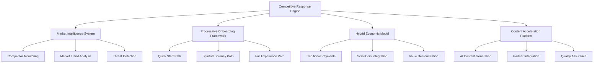
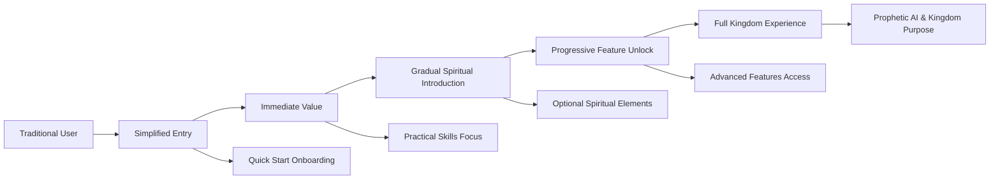

# ScrollUniversity Competitive Response Strategy Design

> "Every kingdom divided against itself is brought to desolation" - Matthew 12:25
> We unite market wisdom with kingdom purpose to establish dominion in education

## Overview

This design document outlines the comprehensive architecture and implementation strategy for ScrollUniversity's competitive response system. The design bridges traditional education expectations with revolutionary spiritual-technological capabilities, creating a pathway for users to transition from familiar experiences to kingdom transformation.

## Architecture

### Strategic Response Architecture



### User Journey Transformation Architecture



## Components and Interfaces

### 1. Progressive Onboarding Framework

#### Quick Start Path Component
```typescript
interface QuickStartOnboarding {
  skipSpiritualAssessment: boolean;
  focusOnPracticalSkills: boolean;
  traditionalPaymentOptions: boolean;
  gradualFeatureIntroduction: boolean;
  optionalSpiritualElements: boolean;
}

class QuickStartService {
  async createQuickStartProfile(userData: BasicUserData): Promise<QuickStartProfile>
  async recommendPracticalCourses(interests: string[]): Promise<Course[]>
  async trackEngagementLevel(userId: string): Promise<EngagementMetrics>
  async suggestSpiritualUpgrade(userId: string): Promise<UpgradeRecommendation>
}
```

#### Spiritual Journey Path Component
```typescript
interface SpiritualJourneyOnboarding {
  lightSpiritualAssessment: boolean;
  characterFormationFocus: boolean;
  kingdomPurposeIntroduction: boolean;
  propheticElementsOptional: boolean;
  communityIntegration: boolean;
}

class SpiritualJourneyService {
  async assessSpiritualReadiness(userId: string): Promise<SpiritualReadinessLevel>
  async createPersonalizedJourney(profile: SpiritualProfile): Promise<LearningPath>
  async integrateCharacterFormation(courseId: string): Promise<EnhancedCourse>
  async connectWithMentors(userId: string): Promise<MentorMatch[]>
}
```

### 2. Hybrid Economic Model

#### Traditional Payment Integration
```typescript
interface HybridPaymentSystem {
  traditionalPayments: PaymentMethod[];
  scrollCoinIntegration: ScrollCoinOptions;
  valueComparison: PricingComparison;
  transitionIncentives: IncentiveProgram[];
}

class HybridPaymentService {
  async processTraditionalPayment(paymentData: PaymentRequest): Promise<PaymentResult>
  async calculateScrollCoinEquivalent(usdAmount: number): Promise<ScrollCoinAmount>
  async demonstrateScrollCoinBenefits(userId: string): Promise<BenefitAnalysis>
  async createTransitionIncentive(userId: string): Promise<IncentiveOffer>
}
```

#### Value Demonstration Engine
```typescript
interface ValueDemonstrationEngine {
  costSavingsCalculator: CostAnalysis;
  learningEfficiencyMetrics: EfficiencyComparison;
  careerImpactProjections: CareerProjection;
  spiritualGrowthBenefits: SpiritualBenefits;
}

class ValueDemonstrationService {
  async calculateTotalCostOfOwnership(userId: string): Promise<CostAnalysis>
  async projectCareerImpact(learningPath: LearningPath): Promise<CareerProjection>
  async measureLearningEfficiency(userId: string): Promise<EfficiencyMetrics>
  async demonstrateSpiritualROI(userId: string): Promise<SpiritualROIAnalysis>
}
```

### 3. Content Acceleration Platform

#### AI-Powered Content Generation
```typescript
interface ContentAccelerationEngine {
  aiContentGenerator: AIContentService;
  partnerContentIntegration: PartnerIntegrationService;
  qualityAssuranceSystem: QualityAssuranceService;
  spiritualAlignmentValidator: SpiritualValidationService;
}

class ContentAccelerationService {
  async generateCourseOutline(topic: string, level: SkillLevel): Promise<CourseOutline>
  async createLectureContent(outline: CourseOutline): Promise<LectureContent[]>
  async integratePartnerContent(partnerCourse: ExternalCourse): Promise<IntegratedCourse>
  async validateSpiritualAlignment(content: CourseContent): Promise<AlignmentScore>
}
```

#### Partner Integration System
```typescript
interface PartnerIntegrationSystem {
  contentPartners: ContentPartner[];
  corporatePartners: CorporatePartner[];
  academicPartners: AcademicPartner[];
  integrationAPIs: IntegrationAPI[];
}

class PartnerIntegrationService {
  async onboardContentPartner(partner: ContentPartnerData): Promise<PartnerProfile>
  async integratePartnerCourses(partnerId: string): Promise<IntegratedCourse[]>
  async createCorporateTrainingProgram(requirements: CorporateRequirements): Promise<TrainingProgram>
  async establishAcademicPartnership(institution: AcademicInstitution): Promise<Partnership>
}
```

### 4. Competitive Intelligence System

#### Market Monitoring Engine
```typescript
interface CompetitiveIntelligenceSystem {
  competitorMonitoring: CompetitorMonitor;
  marketTrendAnalysis: TrendAnalyzer;
  threatDetection: ThreatDetector;
  responseRecommendation: ResponseEngine;
}

class CompetitiveIntelligenceService {
  async monitorCompetitorFeatures(competitors: string[]): Promise<FeatureComparison[]>
  async analyzeMarketTrends(timeframe: TimeRange): Promise<MarketTrends>
  async detectCompetitiveThreats(threshold: ThreatLevel): Promise<ThreatAlert[]>
  async recommendStrategicResponse(threat: ThreatAlert): Promise<ResponseStrategy>
}
```

#### Automated Response System
```typescript
interface AutomatedResponseSystem {
  featureGapAnalysis: GapAnalyzer;
  rapidDevelopmentQueue: DevelopmentQueue;
  marketingResponseEngine: MarketingEngine;
  pricingOptimization: PricingOptimizer;
}

class AutomatedResponseService {
  async analyzeFeatureGaps(competitorFeatures: Feature[]): Promise<GapAnalysis>
  async prioritizeDevelopmentQueue(gaps: GapAnalysis): Promise<DevelopmentPriority[]>
  async generateMarketingResponse(competitorAction: CompetitorAction): Promise<MarketingResponse>
  async optimizePricing(marketConditions: MarketConditions): Promise<PricingStrategy>
}
```

### 5. Technical Reliability Enhancement

#### Infrastructure Optimization
```typescript
interface ReliabilityEnhancementSystem {
  uptimeMonitoring: UptimeMonitor;
  performanceOptimization: PerformanceOptimizer;
  scalabilityManagement: ScalabilityManager;
  supportSystemIntegration: SupportSystem;
}

class ReliabilityEnhancementService {
  async monitorSystemUptime(services: string[]): Promise<UptimeMetrics>
  async optimizePerformance(bottlenecks: PerformanceBottleneck[]): Promise<OptimizationResult>
  async scaleInfrastructure(demandProjection: DemandProjection): Promise<ScalingPlan>
  async provideTechnicalSupport(issue: SupportTicket): Promise<SupportResolution>
}
```

### 6. Brand Building and Market Presence

#### SEO and Content Marketing Engine
```typescript
interface MarketPresenceEngine {
  seoOptimization: SEOOptimizer;
  contentMarketingSystem: ContentMarketer;
  socialMediaIntegration: SocialMediaManager;
  influencerPartnership: InfluencerManager;
}

class MarketPresenceService {
  async optimizeSearchRankings(keywords: string[]): Promise<SEORankings>
  async createThoughtLeadershipContent(topics: string[]): Promise<ContentPiece[]>
  async manageSocialMediaPresence(platforms: Platform[]): Promise<SocialMetrics>
  async establishInfluencerPartnerships(criteria: InfluencerCriteria): Promise<Partnership[]>
}
```

## Data Models

### Progressive User Profile Model
```typescript
interface ProgressiveUserProfile {
  userId: string;
  onboardingPath: 'quick_start' | 'spiritual_journey' | 'full_experience';
  engagementLevel: EngagementLevel;
  spiritualReadiness: SpiritualReadinessLevel;
  paymentPreference: PaymentPreference;
  featureUnlockStatus: FeatureUnlockStatus;
  progressionStage: ProgressionStage;
  conversionProbability: number;
}

interface EngagementLevel {
  coursesCompleted: number;
  timeSpentLearning: number;
  communityParticipation: number;
  spiritualContentInteraction: number;
  overallEngagementScore: number;
}

interface FeatureUnlockStatus {
  propheticAI: boolean;
  spiritualFormation: boolean;
  kingdomPurpose: boolean;
  scrollCoinEconomy: boolean;
  advancedCommunity: boolean;
}
```

### Competitive Intelligence Data Model
```typescript
interface CompetitiveIntelligenceData {
  competitorId: string;
  competitorName: string;
  marketPosition: MarketPosition;
  featureSet: CompetitorFeature[];
  pricingModel: PricingModel;
  marketingStrategy: MarketingStrategy;
  userFeedback: UserFeedback[];
  threatLevel: ThreatLevel;
  lastUpdated: Date;
}

interface CompetitorFeature {
  featureName: string;
  description: string;
  userRating: number;
  adoptionRate: number;
  scrollUniversityEquivalent?: string;
  competitiveAdvantage: 'competitor' | 'scrolluniversity' | 'neutral';
}
```

### Content Acceleration Data Model
```typescript
interface AcceleratedContent {
  contentId: string;
  contentType: 'ai_generated' | 'partner_integrated' | 'hybrid';
  topic: string;
  skillLevel: SkillLevel;
  spiritualAlignment: AlignmentScore;
  marketDemand: DemandScore;
  qualityScore: QualityScore;
  creationTimeline: Timeline;
  partnerAttribution?: PartnerAttribution;
}

interface QualityScore {
  technicalAccuracy: number;
  pedagogicalEffectiveness: number;
  spiritualIntegration: number;
  marketRelevance: number;
  overallQuality: number;
}
```

## Implementation Strategy

### Phase 1: Foundation Building (Months 1-3)
1. **Progressive Onboarding Implementation**
   - Deploy Quick Start path with minimal spiritual requirements
   - Implement traditional payment integration
   - Create basic content acceleration pipeline

2. **Technical Reliability Enhancement**
   - Achieve 99.9% uptime through infrastructure optimization
   - Implement comprehensive monitoring and alerting
   - Deploy mobile performance optimization

3. **Content Acceleration Launch**
   - Partner with 10+ major content creators
   - Deploy AI content generation for high-demand skills
   - Establish quality assurance processes

### Phase 2: Market Positioning (Months 4-6)
1. **Competitive Intelligence Deployment**
   - Launch automated competitor monitoring
   - Implement threat detection and response systems
   - Deploy market trend analysis capabilities

2. **Brand Building Initiative**
   - Launch comprehensive SEO optimization
   - Deploy thought leadership content strategy
   - Establish influencer and corporate partnerships

3. **Value Demonstration Engine**
   - Deploy ROI calculators and benefit demonstrations
   - Implement progressive feature unlock system
   - Launch ScrollCoin transition incentive programs

### Phase 3: Market Leadership (Months 7-12)
1. **Advanced Feature Rollout**
   - Deploy prophetic AI capabilities to ready users
   - Launch kingdom purpose integration
   - Implement advanced spiritual formation tools

2. **Partnership Ecosystem**
   - Establish 100+ corporate partnerships
   - Launch academic institution collaborations
   - Deploy white-label solutions for partners

3. **Global Expansion**
   - Launch in 25+ countries with localized content
   - Implement cultural adaptation systems
   - Deploy offline mesh networking capabilities

## Success Metrics and KPIs

### User Acquisition and Retention
- New user registration rate: 300% increase
- User retention at 30 days: 85%+
- Conversion from Quick Start to Full Experience: 40%+
- ScrollCoin adoption rate: 60% of active users

### Market Position
- SEO ranking for key education terms: Top 3
- Brand awareness in target markets: 500% increase
- Corporate partnership count: 100+
- Market share in spiritual education: #1 position

### Technical Performance
- Platform uptime: 99.9%+
- Mobile performance score: 95+
- Page load times: <2 seconds
- Customer support response time: <1 hour

### Content and Quality
- Course catalog size: 50,000+ courses
- Content quality score: 4.5/5.0+
- Spiritual alignment score: 95%+
- User satisfaction rating: 4.7/5.0+

This comprehensive design provides ScrollUniversity with the strategic framework to overcome current competitive disadvantages while maintaining its revolutionary spiritual-technological vision and achieving market leadership through kingdom principles.