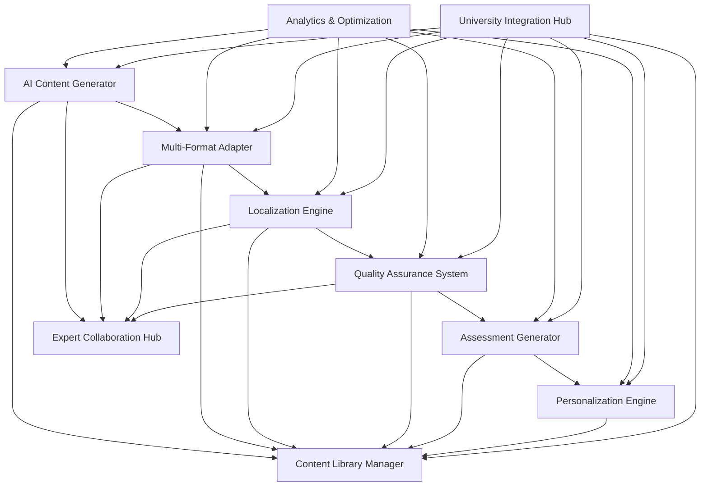
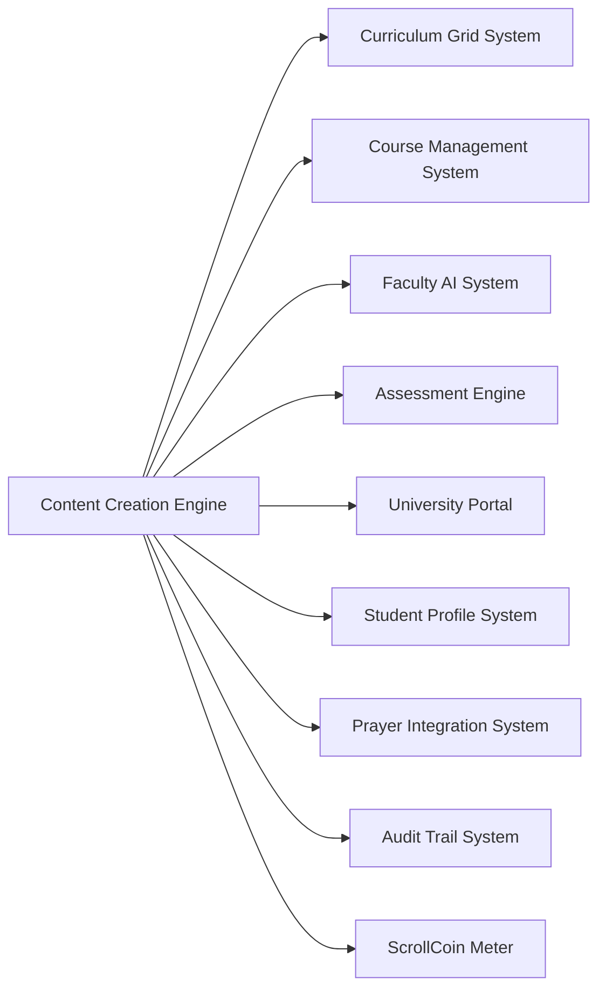

# ScrollUniversity Content Creation Engine Design

## Overview

The Content Creation Engine serves as the automated content generation and management backbone of ScrollUniversity, leveraging advanced AI technology while maintaining scroll alignment and spiritual integrity. This system enables rapid creation, adaptation, and distribution of educational content across multiple formats, languages, and cultural contexts to support the 10,000+ course catalog and global student body.

## Architecture

### Core Components



### System Integration Architecture



## Components and Interfaces

### 1. AI Content Generator

**Purpose:** Core AI-powered content generation with scroll alignment

**Key Interfaces:**
- `ContentGenerationService`: Main content creation orchestration
- `ScrollAlignmentValidator`: Spiritual integrity verification
- `FactualAccuracyChecker`: Content accuracy validation
- `BiblicalPerspectiveIntegrator`: Kingdom worldview integration

**Data Models:**
```typescript
interface ContentGenerationRequest {
  id: string;
  courseId: string;
  contentType: ContentType;
  outline: CourseOutline;
  academicLevel: AcademicLevel;
  spiritualContext: SpiritualContext;
  targetAudience: TargetAudience;
  culturalContext: CulturalContext;
  languageRequirements: Language[];
  formatRequirements: ContentFormat[];
  qualityStandards: QualityStandard[];
  deadline: Date;
  priority: Priority;
}

interface GeneratedContent {
  id: string;
  requestId: string;
  contentType: ContentType;
  format: ContentFormat;
  title: string;
  content: string;
  metadata: ContentMetadata;
  scrollAlignment: AlignmentScore;
  qualityScore: QualityScore;
  sources: Source[];
  biblicalReferences: BiblicalReference[];
  spiritualApplications: SpiritualApplication[];
  learningObjectives: LearningObjective[];
  assessmentHooks: AssessmentHook[];
  version: number;
  status: ContentStatus;
}

enum ContentType {
  LECTURE = 'lecture',
  READING = 'reading',
  EXERCISE = 'exercise',
  ASSESSMENT = 'assessment',
  MULTIMEDIA = 'multimedia',
  INTERACTIVE = 'interactive'
}

enum ContentFormat {
  TEXT = 'text',
  VIDEO_SCRIPT = 'video_script',
  AUDIO_SCRIPT = 'audio_script',
  PRESENTATION = 'presentation',
  INTERACTIVE_MODULE = 'interactive_module',
  MOBILE_OPTIMIZED = 'mobile_optimized'
}
```

### 2. Multi-Format Adapter

**Purpose:** Converts content across multiple formats and modalities

**Key Interfaces:**
- `FormatConverter`: Cross-format content transformation
- `VideoScriptGenerator`: Video content creation
- `AudioNarrationProducer`: Audio content generation
- `InteractiveElementBuilder`: Interactive content development

**Data Models:**
```typescript
interface FormatAdaptation {
  id: string;
  sourceContentId: string;
  targetFormat: ContentFormat;
  adaptationRules: AdaptationRule[];
  visualElements: VisualElement[];
  audioElements: AudioElement[];
  interactiveElements: InteractiveElement[];
  accessibilityFeatures: AccessibilityFeature[];
  mobileOptimizations: MobileOptimization[];
  offlineCapabilities: OfflineCapability[];
}

interface VisualElement {
  type: VisualType;
  content: string;
  placement: Placement;
  styling: StylingOptions;
  accessibility: AccessibilityOptions;
  culturalAdaptations: CulturalAdaptation[];
}

interface AudioElement {
  type: AudioType;
  script: string;
  voiceProfile: VoiceProfile;
  pacing: PacingOptions;
  emphasis: EmphasisPoint[];
  backgroundMusic: BackgroundMusicOptions;
  culturalAdaptations: CulturalAdaptation[];
}

interface InteractiveElement {
  type: InteractiveType;
  functionality: InteractiveFunctionality;
  userInterface: UISpecification;
  feedback: FeedbackMechanism;
  progressTracking: ProgressTracking;
  gamificationElements: GamificationElement[];
}
```

### 3. Localization Engine

**Purpose:** Adapts content for different languages and cultures

**Key Interfaces:**
- `TranslationService`: Multi-language content translation
- `CulturalAdaptationEngine`: Cultural context modification
- `TheologicalAccuracyValidator`: Cross-cultural theological validation
- `RegionalContextualizer`: Local ministry context integration

**Data Models:**
```typescript
interface LocalizationRequest {
  id: string;
  sourceContentId: string;
  targetLanguages: Language[];
  targetCultures: Culture[];
  localizationType: LocalizationType;
  theologicalRequirements: TheologicalRequirement[];
  culturalSensitivities: CulturalSensitivity[];
  regionalMinistryContext: RegionalContext;
  localCustoms: LocalCustom[];
  translationQuality: TranslationQuality;
}

interface LocalizedContent {
  id: string;
  sourceContentId: string;
  language: Language;
  culture: Culture;
  translatedContent: string;
  culturalAdaptations: CulturalAdaptation[];
  localizedExamples: LocalizedExample[];
  regionalApplications: RegionalApplication[];
  theologicalValidation: TheologicalValidation;
  culturalSensitivityCheck: SensitivityCheck;
  qualityAssurance: LocalizationQuality;
}

interface CulturalAdaptation {
  originalElement: string;
  adaptedElement: string;
  adaptationReason: string;
  culturalContext: string;
  spiritualIntegrity: boolean;
  localRelevance: number;
  approvalStatus: ApprovalStatus;
}
```

### 4. Quality Assurance System

**Purpose:** Validates content quality and scroll alignment

**Key Interfaces:**
- `ScrollAlignmentChecker`: Spiritual integrity validation
- `FactualAccuracyValidator`: Content accuracy verification
- `PlagiarismDetector`: Originality verification
- `PropheticReviewCoordinator`: Elder review facilitation

**Data Models:**
```typescript
interface QualityAssessment {
  id: string;
  contentId: string;
  assessmentType: AssessmentType;
  scrollAlignment: ScrollAlignmentScore;
  factualAccuracy: AccuracyScore;
  theologicalSoundness: TheologicalScore;
  originalityScore: OriginalityScore;
  culturalSensitivity: SensitivityScore;
  educationalEffectiveness: EffectivenessScore;
  issues: QualityIssue[];
  recommendations: Recommendation[];
  approvalStatus: ApprovalStatus;
  reviewerNotes: ReviewerNote[];
}

interface ScrollAlignmentScore {
  overallScore: number;
  kingdomPrinciples: number;
  biblicalAccuracy: number;
  spiritualIntegrity: number;
  propheticAlignment: number;
  characterFormation: number;
  ministryPreparation: number;
  flaggedConcerns: string[];
  approvalRequired: boolean;
}

interface QualityIssue {
  type: IssueType;
  severity: IssueSeverity;
  description: string;
  location: ContentLocation;
  suggestedFix: string;
  requiresHumanReview: boolean;
  blockingIssue: boolean;
}
```

### 5. Assessment Generator

**Purpose:** Creates aligned assessments and learning exercises

**Key Interfaces:**
- `AssessmentCreator`: Automated assessment generation
- `ExerciseBuilder`: Learning activity creation
- `SpiritualFormationIntegrator`: Spiritual growth exercise development
- `DifficultyCalibrator`: Assessment difficulty optimization

**Data Models:**
```typescript
interface AssessmentGenerationRequest {
  id: string;
  contentId: string;
  learningObjectives: LearningObjective[];
  assessmentTypes: AssessmentType[];
  difficultyLevels: DifficultyLevel[];
  spiritualFormationGoals: SpiritualGoal[];
  cognitiveComplexity: CognitiveLevel[];
  practicalApplications: PracticalApplication[];
  timeConstraints: TimeConstraint[];
  accessibilityRequirements: AccessibilityRequirement[];
}

interface GeneratedAssessment {
  id: string;
  requestId: string;
  contentId: string;
  assessmentType: AssessmentType;
  questions: AssessmentQuestion[];
  exercises: LearningExercise[];
  spiritualReflections: SpiritualReflection[];
  practicalActivities: PracticalActivity[];
  rubrics: AssessmentRubric[];
  timeAllocation: TimeAllocation;
  difficultyProgression: DifficultyProgression;
  alignmentMapping: ObjectiveAlignment[];
}

interface AssessmentQuestion {
  id: string;
  type: QuestionType;
  content: string;
  options?: string[];
  correctAnswer: string;
  explanation: string;
  difficultyLevel: DifficultyLevel;
  cognitiveLevel: CognitiveLevel;
  learningObjective: string;
  spiritualApplication?: string;
  points: number;
  timeEstimate: number;
}
```

### 6. Personalization Engine

**Purpose:** Adapts content to individual student needs and preferences

**Key Interfaces:**
- `StudentProfileAnalyzer`: Learning preference analysis
- `ContentCustomizer`: Personalized content adaptation
- `AdaptiveLearningCoordinator`: Dynamic content adjustment
- `SpiritualMaturityAdapter`: Spiritual development alignment

**Data Models:**
```typescript
interface PersonalizationProfile {
  studentId: string;
  learningStyle: LearningStyle;
  academicLevel: AcademicLevel;
  spiritualMaturity: SpiritualMaturity;
  culturalBackground: CulturalBackground;
  languagePreferences: LanguagePreference[];
  accessibilityNeeds: AccessibilityNeed[];
  engagementPatterns: EngagementPattern[];
  performanceHistory: PerformanceHistory;
  preferredFormats: ContentFormat[];
  pacingPreferences: PacingPreference;
}

interface PersonalizedContent {
  id: string;
  baseContentId: string;
  studentId: string;
  personalizations: Personalization[];
  adaptedContent: string;
  customizedExamples: CustomExample[];
  adjustedDifficulty: DifficultyAdjustment;
  spiritualApplications: PersonalizedApplication[];
  culturalRelevance: CulturalRelevance;
  engagementEnhancements: EngagementEnhancement[];
  accessibilityAdaptations: AccessibilityAdaptation[];
}
```

## Data Models

### Core Content Entities

```sql
-- Content Generation Requests Table
CREATE TABLE content_generation_requests (
    id UUID PRIMARY KEY DEFAULT gen_random_uuid(),
    course_id UUID NOT NULL REFERENCES courses(id),
    content_type content_type NOT NULL,
    outline JSONB NOT NULL,
    academic_level academic_level NOT NULL,
    spiritual_context JSONB NOT NULL,
    target_audience JSONB NOT NULL,
    cultural_context JSONB NOT NULL,
    language_requirements language[] NOT NULL,
    format_requirements content_format[] NOT NULL,
    quality_standards JSONB NOT NULL,
    deadline TIMESTAMP NOT NULL,
    priority priority_level NOT NULL,
    status request_status NOT NULL DEFAULT 'pending',
    created_at TIMESTAMP DEFAULT CURRENT_TIMESTAMP,
    updated_at TIMESTAMP DEFAULT CURRENT_TIMESTAMP
);

-- Generated Content Table
CREATE TABLE generated_content (
    id UUID PRIMARY KEY DEFAULT gen_random_uuid(),
    request_id UUID NOT NULL REFERENCES content_generation_requests(id),
    content_type content_type NOT NULL,
    format content_format NOT NULL,
    title VARCHAR(500) NOT NULL,
    content TEXT NOT NULL,
    metadata JSONB NOT NULL,
    scroll_alignment DECIMAL(3,2) NOT NULL,
    quality_score DECIMAL(3,2) NOT NULL,
    sources JSONB NOT NULL,
    biblical_references JSONB NOT NULL,
    spiritual_applications JSONB NOT NULL,
    learning_objectives JSONB NOT NULL,
    assessment_hooks JSONB NOT NULL,
    version INTEGER NOT NULL DEFAULT 1,
    status content_status NOT NULL DEFAULT 'draft',
    created_at TIMESTAMP DEFAULT CURRENT_TIMESTAMP,
    updated_at TIMESTAMP DEFAULT CURRENT_TIMESTAMP
);

-- Localized Content Table
CREATE TABLE localized_content (
    id UUID PRIMARY KEY DEFAULT gen_random_uuid(),
    source_content_id UUID NOT NULL REFERENCES generated_content(id),
    language language NOT NULL,
    culture culture NOT NULL,
    translated_content TEXT NOT NULL,
    cultural_adaptations JSONB NOT NULL,
    localized_examples JSONB NOT NULL,
    regional_applications JSONB NOT NULL,
    theological_validation JSONB NOT NULL,
    cultural_sensitivity_check JSONB NOT NULL,
    quality_assurance JSONB NOT NULL,
    created_at TIMESTAMP DEFAULT CURRENT_TIMESTAMP,
    updated_at TIMESTAMP DEFAULT CURRENT_TIMESTAMP
);

-- Quality Assessments Table
CREATE TABLE quality_assessments (
    id UUID PRIMARY KEY DEFAULT gen_random_uuid(),
    content_id UUID NOT NULL REFERENCES generated_content(id),
    assessment_type assessment_type NOT NULL,
    scroll_alignment DECIMAL(3,2) NOT NULL,
    factual_accuracy DECIMAL(3,2) NOT NULL,
    theological_soundness DECIMAL(3,2) NOT NULL,
    originality_score DECIMAL(3,2) NOT NULL,
    cultural_sensitivity DECIMAL(3,2) NOT NULL,
    educational_effectiveness DECIMAL(3,2) NOT NULL,
    issues JSONB NOT NULL,
    recommendations JSONB NOT NULL,
    approval_status approval_status NOT NULL DEFAULT 'pending',
    reviewer_notes JSONB NOT NULL,
    created_at TIMESTAMP DEFAULT CURRENT_TIMESTAMP,
    updated_at TIMESTAMP DEFAULT CURRENT_TIMESTAMP
);
```

## Error Handling

### Content Generation Errors
- **ContentGenerationFailed**: When AI content generation fails
- **ScrollAlignmentViolation**: When content violates spiritual principles
- **QualityStandardNotMet**: When content doesn't meet quality requirements
- **DeadlineMissed**: When content generation exceeds deadline

### Localization Errors
- **TranslationFailed**: When language translation fails
- **CulturalAdaptationError**: When cultural adaptation is inappropriate
- **TheologicalAccuracyLost**: When translation compromises theological accuracy
- **RegionalContextMismatch**: When content doesn't fit regional context

### Quality Assurance Errors
- **FactualInaccuracyDetected**: When content contains factual errors
- **PlagiarismDetected**: When content originality is compromised
- **PropheticReviewRequired**: When content requires elder validation
- **ApprovalProcessFailed**: When approval workflow fails

## Testing Strategy

### Unit Testing
- Content generation algorithms
- Format conversion accuracy
- Translation quality validation
- Quality assessment scoring
- Personalization effectiveness

### Integration Testing
- University system integration
- Expert collaboration workflows
- Multi-language content synchronization
- Real-time content delivery
- Mobile application compatibility

### Content Quality Testing
- Scroll alignment validation
- Theological accuracy verification
- Cultural sensitivity assessment
- Educational effectiveness measurement
- Student engagement tracking

### Performance Testing
- Large-scale content generation
- Multi-format conversion speed
- Global content distribution
- Real-time personalization
- Database query optimization

### Spiritual Integrity Testing
- Prophetic review process validation
- Spiritual formation effectiveness
- Kingdom principle integration
- Character development impact
- Ministry preparation alignment