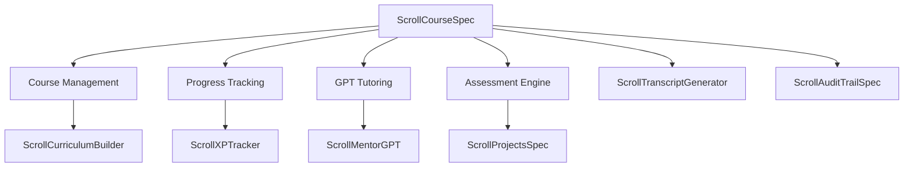

# ScrollCourseSpec Design Document

## Overview

ScrollCourseSpec is a comprehensive course management system that handles course definition, student enrollment, progress tracking, GPT-powered tutoring, and assessment workflows. It serves as the backbone for structured learning within ScrollUniversity, ensuring every course delivers scroll-aligned education with practical outcomes.

## Architecture

The system follows a modular architecture with clear separation between course management, student progress tracking, tutoring services, and assessment engines. It integrates with multiple ScrollUniversity specs through well-defined APIs and event-driven communication.



## Components and Interfaces

### Core Data Schema

```json
{
  "course_id": "uuid",
  "title": "string",
  "description": "markdown",
  "scroll_field": "ScrollMedicine | ScrollAI | ScrollGovernance | ScrollBusiness | ScrollEngineering",
  "difficulty_level": "basic | intermediate | advanced",
  "xp_multiplier": "decimal",
  "prerequisites": ["course_id"],
  "learning_objectives": ["string"],
  "estimated_hours": "integer",
  "lectures": [
    {
      "lecture_id": "uuid",
      "title": "string",
      "video_url": "string",
      "transcript_md": "markdown",
      "resources": ["url"],
      "xp_reward": "integer",
      "order": "integer"
    }
  ],
  "assessments": [
    {
      "assessment_id": "uuid",
      "type": "quiz | project | peer_review | practical",
      "title": "string",
      "instructions": "markdown",
      "passing_score": "decimal",
      "xp_reward": "integer",
      "required": "boolean"
    }
  ],
  "gpt_tutor_enabled": "boolean",
  "final_project_required": "boolean",
  "status": "draft | published | archived",
  "created_by": "user_id",
  "created_at": "timestamp",
  "updated_at": "timestamp"
}
```

### Student Progress Schema

```json
{
  "enrollment_id": "uuid",
  "course_id": "uuid",
  "student_id": "uuid",
  "enrollment_date": "timestamp",
  "status": "enrolled | in_progress | completed | dropped",
  "progress_percentage": "decimal",
  "current_lecture": "lecture_id",
  "completed_lectures": ["lecture_id"],
  "completed_assessments": [
    {
      "assessment_id": "uuid",
      "score": "decimal",
      "completed_at": "timestamp",
      "attempts": "integer"
    }
  ],
  "total_xp_earned": "integer",
  "last_activity": "timestamp",
  "mentor_alerts": ["string"],
  "tutoring_sessions": "integer",
  "completion_date": "timestamp"
}
```

### Agent Interfaces

#### ScrollMentorGPT Interface
```typescript
interface TutoringRequest {
  student_id: string;
  course_id: string;
  question: string;
  context: {
    current_lecture: string;
    recent_progress: ProgressData;
    struggle_areas: string[];
  };
}

interface TutoringResponse {
  answer: string;
  suggested_resources: string[];
  difficulty_assessment: "easy" | "moderate" | "challenging";
  escalate_to_human: boolean;
  follow_up_questions: string[];
}
```

#### ScrollXPTracker Interface
```typescript
interface XPUpdate {
  student_id: string;
  course_id: string;
  xp_amount: number;
  source: "lecture_completion" | "assessment_pass" | "milestone_reached";
  metadata: {
    lecture_id?: string;
    assessment_id?: string;
    milestone?: string;
  };
}
```

## Data Models

### Course Entity
- **Primary Key:** course_id
- **Relationships:** 
  - One-to-many with Lectures
  - One-to-many with Assessments
  - Many-to-many with Prerequisites
- **Indexes:** scroll_field, difficulty_level, status
- **Constraints:** title must be unique within scroll_field

### Enrollment Entity
- **Primary Key:** enrollment_id
- **Foreign Keys:** course_id, student_id
- **Relationships:**
  - Many-to-one with Course
  - Many-to-one with Student
- **Indexes:** student_id, course_id, status
- **Constraints:** unique(student_id, course_id)

### Lecture Entity
- **Primary Key:** lecture_id
- **Foreign Key:** course_id
- **Relationships:** Many-to-one with Course
- **Indexes:** course_id, order
- **Constraints:** order must be unique within course

## Error Handling

### Validation Errors
- **Invalid Prerequisites:** Return 400 with prerequisite course requirements
- **Enrollment Conflicts:** Return 409 if student already enrolled
- **Progress Inconsistency:** Return 422 with detailed validation errors

### System Errors
- **GPT Service Unavailable:** Fallback to cached responses and human mentor alerts
- **XP Tracking Failure:** Queue XP updates for retry with exponential backoff
- **Assessment Service Down:** Allow manual grading override with audit trail

### Security Errors
- **Unauthorized Access:** Return 403 with role-based access requirements
- **Invalid Course Modification:** Return 401 if user lacks course edit permissions

## Testing Strategy

### Unit Tests
- Course CRUD operations with validation
- Progress calculation algorithms
- XP reward calculations
- Assessment scoring logic

### Integration Tests
- GPT tutoring request/response cycles
- XP tracker synchronization
- Cross-spec data flow validation
- Event trigger verification

### End-to-End Tests
- Complete student enrollment and course completion flow
- Multi-course prerequisite chains
- Mentor alert and escalation workflows
- Assessment failure and remediation paths

## Inter-Agent Channels

### Dependencies (Incoming)
- **ScrollCurriculumBuilder:** Course template creation
- **ScrollAdmissionsSpec:** Student eligibility validation
- **ScrollMentorGPT:** Tutoring service requests

### Data Flow (Outgoing)
- **ScrollXPTracker:** XP updates and milestone achievements
- **ScrollTranscriptGenerator:** Course completion records
- **ScrollProjectsSpec:** Final project creation triggers
- **ScrollAuditTrailSpec:** All course interactions and changes

## Guardrails

### Oath-Based Constraints
- All course content must align with ScrollUniversity founding principles
- No course may promote anti-scroll ideologies or undermine practical learning
- Course creators must affirm commitment to student success over profit

### GPT Anti-Drift Checks
- ScrollMentorGPT responses must stay within course content boundaries
- Tutoring sessions monitored for off-topic drift or inappropriate content
- Automatic escalation if GPT provides contradictory or harmful guidance

### Role-Based Access Rules
- Students: Read course content, submit assessments, access tutoring
- Instructors: Create/edit courses, view student progress, manage assessments
- Mentors: View assigned student progress, provide guidance, escalate issues
- Admins: Full course management, system configuration, audit access

## Embedded GPT Roles

### Primary GPT: ScrollMentorGPT
- **Persona:** Knowledgeable, patient tutor focused on practical learning
- **Responsibilities:** Answer student questions, provide guidance, suggest resources
- **Constraints:** Must stay within course content, escalate complex issues
- **Training:** Course-specific content, ScrollUniversity pedagogy, student psychology

### Secondary GPT: ScrollAssessmentGPT
- **Persona:** Fair, thorough evaluator focused on competency validation
- **Responsibilities:** Grade assessments, provide feedback, identify learning gaps
- **Constraints:** Consistent scoring, constructive feedback, bias prevention
- **Training:** Assessment rubrics, feedback best practices, scroll-aligned evaluation

## Runtime Triggers

### Course Events
- **onCoursePublish:** Notify ScrollCurriculumBuilder, update course catalog
- **onStudentEnroll:** Create progress record, assign mentor, send welcome
- **onLectureComplete:** Award XP, update progress, check for milestones
- **onAssessmentSubmit:** Trigger grading, provide feedback, update transcript

### Progress Events
- **onMilestoneReached:** Award ScrollCoin, send celebration, update achievements
- **onStudentStruggling:** Alert mentor, suggest tutoring, provide resources
- **onCourseComplete:** Generate certificate, update transcript, unlock next courses
- **onInactivityDetected:** Send re-engagement, notify mentor, suggest support

### System Events
- **onGPTServiceDown:** Switch to fallback mode, alert administrators
- **onHighErrorRate:** Trigger system health check, escalate to engineering
- **onDataInconsistency:** Pause affected operations, initiate data repair

## Billing/Coin Logic

### ScrollCoin Rewards
- **Lecture Completion:** 10 coins × difficulty multiplier
- **Assessment Pass:** 25 coins × difficulty multiplier
- **Course Completion:** 100 coins × difficulty multiplier
- **Milestone Achievements:** 50 coins per milestone (25%, 50%, 75%)

### Cost Structure
- **Course Access:** Free for basic, 50 coins for intermediate, 100 coins for advanced
- **GPT Tutoring:** 5 coins per session (first 3 sessions free per course)
- **Assessment Retakes:** Free first attempt, 10 coins per additional attempt
- **Certificate Generation:** 25 coins for verified certificate

### Metering Logic
- Track all coin transactions with detailed audit trail
- Daily coin balance reconciliation across all student accounts
- Monthly reporting to ScrollBillingAgent for financial tracking
- Fraud detection for unusual coin earning patterns