# Design Document

## Overview

The ScrollCritical Thinking & Innovation Engine is the revolutionary core that transforms ScrollUniversity from a traditional educational platform into a divine reasoning laboratory. This system implements the principle "Come, let us reason together" (Isaiah 1:18) by creating an integrated environment where prophetic reasoning meets data discernment, producing students who can build systems, challenge empires, and govern nations.

The architecture combines AI-powered tutoring, collaborative innovation labs, spiritual formation tools, and real-world problem-solving in a unified platform that rewards deep thinking over memorization and encourages bold questioning over passive acceptance.

## Architecture

### High-Level System Architecture

```mermaid
graph TB
    subgraph "ScrollCritical Thinking Engine"
        CTCore[Critical Thinking Core]
        Innovation[Innovation Lab Engine]
        Assessment[Prophetic Assessment]
        Collaboration[Global Collaboration Hub]
    end
    
    subgraph "Learning Modalities"
        AITutor[ScrollMentorGPT]
        VideoLectures[ScrollClass System]
        Livestreams[ScrollLive Platform]
        XRSessions[Avatar-Led XR]
        HandsOnLabs[ScrollLabs]
    end
    
    subgraph "Innovation Pipeline"
        ProblemID[ScrollProblem Identification]
        GPTToolkit[ScrollGPT Toolkit]
        PropheticInsight[Prophetic Insight Journal]
        Prototyping[Build & Deploy Tools]
        Publication[ScrollJournal Publishing]
    end
    
    subgraph "Assessment & Rewards"
        XPSystem[ScrollXP Reward Engine]
        DefenseRounds[ScrollDefense System]
        PeerReview[Prophetic Peer Review]
        ImpactMetrics[Kingdom Impact Tracking]
    end
    
    subgraph "Collaboration Tools"
        DebateRooms[Global Debate Rooms]
        TeamProjects[Cross-Cultural Teams]
        MentorNetwork[Prophet-Mentor Network]
        CommunityForum[ScrollCommunity]
    end
    
    subgraph "Integration Layer"
        ScrollUniversity[ScrollUniversity Platform]
        ResearchHub[Research Powerhouse]
        AIFaculty[ScrollAI Faculty]
        CertificationSystem[ScrollSeal Certification]
    end
    
    CTCore --> Innovation
    CTCore --> Assessment
    CTCore --> Collaboration
    
    Innovation --> ProblemID
    Innovation --> GPTToolkit
    Innovation --> PropheticInsight
    Innovation --> Prototyping
    Innovation --> Publication
    
    Assessment --> XPSystem
    Assessment --> DefenseRounds
    Assessment --> PeerReview
    Assessment --> ImpactMetrics
    
    Collaboration --> DebateRooms
    Collaboration --> TeamProjects
    Collaboration --> MentorNetwork
    Collaboration --> CommunityForum
    
    AITutor --> CTCore
    VideoLectures --> CTCore
    Livestreams --> CTCore
    XRSessions --> CTCore
    HandsOnLabs --> CTCore
    
    CTCore --> ScrollUniversity
    CTCore --> ResearchHub
    CTCore --> AIFaculty
    CTCore --> CertificationSystem
```



### Service Architecture Patterns

The system follows a microservices architecture with domain-driven design:

- **Critical Thinking Context**: Core reasoning and discernment tools
- **Innovation Context**: Problem-solving and prototype development
- **Assessment Context**: Prophetic evaluation and XP rewards
- **Collaboration Context**: Global interaction and team projects
- **Integration Context**: Connection with ScrollUniversity ecosystem

## Components and Interfaces

### 1. ScrollCritical Thinking Core Service

**Responsibilities:**
- Manage critical thinking frameworks and methodologies
- Track student reasoning development and spiritual discernment
- Coordinate between different learning modalities
- Integrate prophetic insight with data analysis

**Key Interfaces:**
```typescript
interface CriticalThinkingEngine {
  evaluateReasoning(submission: ReasoningSubmission): Promise<ReasoningAssessment>
  trackDiscernment(userId: string, activity: DiscernmentActivity): Promise<void>
  generateChallenge(level: ThinkingLevel, topic: string): Promise<CriticalThinkingChallenge>
  assessPropheticAlignment(content: string, context: string): Promise<PropheticScore>
}

interface ReasoningSubmission {
  userId: string
  challengeId: string
  argument: string
  evidence: Evidence[]
  spiritualInsights: string[]
  aiToolsUsed: AITool[]
  submittedAt: Date
}

interface ReasoningAssessment {
  logicalConsistency: number
  evidenceQuality: number
  spiritualAlignment: number
  innovativeThinking: number
  kingdomImpact: number
  feedback: string
  scrollXPAwarded: number
}

enum ThinkingLevel {
  FOUNDATION = 'foundation',
  INTERMEDIATE = 'intermediate',
  ADVANCED = 'advanced',
  PROPHETIC = 'prophetic',
  GOVERNMENTAL = 'governmental'
}
```

### 2. Innovation Lab Engine

**Responsibilities:**
- Manage weekly innovation challenges and ScrollLabs
- Coordinate the Revelation + Data + Prototype pipeline
- Track innovation projects from conception to publication
- Facilitate team collaboration and cross-cultural projects

**Key Interfaces:**
```typescript
interface InnovationEngine {
  createWeeklyChallenge(prompt: string, parameters: ChallengeParameters): Promise<InnovationChallenge>
  formTeams(challengeId: string, students: string[]): Promise<InnovationTeam[]>
  trackProgress(teamId: string, milestone: ProjectMilestone): Promise<void>
  publishSolution(solutionId: string, publication: PublicationData): Promise<ScrollJournalEntry>
}

interface InnovationChallenge {
  id: string
  title: string
  description: string
  scrollPrompt: string
  realWorldContext: string
  successCriteria: string[]
  resources: Resource[]
  deadline: Date
  scrollCoinReward: number
}

interface InnovationTeam {
  id: string
  challengeId: string
  members: TeamMember[]
  culturalDiversity: CulturalMetrics
  collaborationTools: CollaborationTool[]
  mentorAssigned: string
}

interface ProjectMilestone {
  type: MilestoneType
  description: string
  completedAt: Date
  evidence: string[]
  propheticInsights: string[]
  kingdomImpact: ImpactMetrics
}

enum MilestoneType {
  PROBLEM_ANALYSIS = 'problem_analysis',
  PROPHETIC_INSIGHT = 'prophetic_insight',
  PROTOTYPE_DEVELOPMENT = 'prototype_development',
  TESTING_VALIDATION = 'testing_validation',
  PUBLICATION_READY = 'publication_ready'
}
```

### 3. ScrollMentorGPT Integration Service

**Responsibilities:**
- Provide 24/7 AI tutoring with prophetic reasoning capabilities
- Support multiple interaction modes (chat, voice, image, scroll queries)
- Maintain context across learning sessions
- Integrate with spiritual formation tracking

**Key Interfaces:**
```typescript
interface ScrollMentorGPT {
  startTutoringSession(userId: string, subject: string, mode: InteractionMode): Promise<TutoringSession>
  processQuery(sessionId: string, query: ScrollQuery): Promise<MentorResponse>
  evaluateThinking(userId: string, reasoning: string): Promise<ThinkingEvaluation>
  providePropheticGuidance(context: string, question: string): Promise<PropheticGuidance>
}

interface ScrollQuery {
  type: QueryType
  content: string
  context?: string
  attachments?: Attachment[]
  spiritualContext?: string
}

interface MentorResponse {
  answer: string
  reasoning: string
  scripturalBasis?: string[]
  followUpQuestions: string[]
  recommendedResources: Resource[]
  scrollXPOpportunity?: XPOpportunity
}

enum QueryType {
  CONCEPTUAL = 'conceptual',
  PRACTICAL = 'practical',
  PROPHETIC = 'prophetic',
  ETHICAL = 'ethical',
  INNOVATIVE = 'innovative'
}

enum InteractionMode {
  TEXT_CHAT = 'text_chat',
  VOICE_CONVERSATION = 'voice_conversation',
  IMAGE_ANALYSIS = 'image_analysis',
  SCROLL_QUERY = 'scroll_query',
  XR_INTERACTION = 'xr_interaction'
}
```

### 4. Global Collaboration Hub

**Responsibilities:**
- Manage cross-cultural team formation and projects
- Facilitate global debate rooms and discussion forums
- Coordinate language matching and translation services
- Track collaborative learning outcomes

**Key Interfaces:**
```typescript
interface CollaborationHub {
  createDebateRoom(topic: string, parameters: DebateParameters): Promise<DebateRoom>
  formCulturalTeams(projectId: string, diversity: DiversityRequirements): Promise<CollaborationTeam>
  moderateDiscussion(roomId: string, message: Message): Promise<ModerationResult>
  trackCollaborativeOutcomes(teamId: string): Promise<CollaborationMetrics>
}

interface DebateRoom {
  id: string
  topic: string
  participants: Participant[]
  language: string
  moderator: ModeratorType
  rules: DebateRules
  currentPhase: DebatePhase
  transcription: string[]
}

interface CollaborationTeam {
  id: string
  projectId: string
  members: GlobalMember[]
  culturalRepresentation: CulturalMap
  communicationTools: CommunicationTool[]
  sharedWorkspace: WorkspaceAccess
}

enum ModeratorType {
  AI_MODERATOR = 'ai_moderator',
  HUMAN_MODERATOR = 'human_moderator',
  SCROLL_ELDER = 'scroll_elder',
  PEER_MODERATION = 'peer_moderation'
}

enum DebatePhase {
  OPENING_STATEMENTS = 'opening_statements',
  EVIDENCE_PRESENTATION = 'evidence_presentation',
  CROSS_EXAMINATION = 'cross_examination',
  PROPHETIC_DISCERNMENT = 'prophetic_discernment',
  CLOSING_ARGUMENTS = 'closing_arguments',
  COMMUNITY_REFLECTION = 'community_reflection'
}
```

### 5. Prophetic Assessment Engine

**Responsibilities:**
- Evaluate spiritual alignment and prophetic reasoning
- Assess kingdom impact and transformational potential
- Coordinate ScrollDefense rounds and peer review
- Track development of Spirit-governed thinking

**Key Interfaces:**
```typescript
interface PropheticAssessment {
  evaluateSpiritual Alignment(content: string, context: AssessmentContext): Promise<SpiritualScore>
  conductScrollDefense(defenderId: string, thesis: DefenseThesis): Promise<DefenseResult>
  assessKingdomImpact(projectId: string, outcomes: ProjectOutcome[]): Promise<ImpactAssessment>
  trackPropheticGrowth(userId: string, timeframe: TimeFrame): Promise<GrowthMetrics>
}

interface SpiritualScore {
  scriptural Alignment: number
  propheticAccuracy: number
  kingdomRelevance: number
  transformationalPotential: number
  loveAndTruthBalance: number
  overallAlignment: number
  feedback: PropheticFeedback
}

interface DefenseThesis {
  title: string
  abstract: string
  methodology: string
  findings: string[]
  kingdomImplications: string
  propheticInsights: string[]
  practicalApplications: string[]
}

interface DefenseResult {
  panelComposition: DefensePanel
  scores: DefenseScores
  feedback: PanelFeedback[]
  recommendations: string[]
  certificationType: CertificationType
  scrollCoinAwarded: number
}

interface DefensePanel {
  aiJudge: AIJudgeProfile
  humanExpert: ExpertProfile
  propheticValidator: ProphetProfile
  peerReviewers: PeerProfile[]
}
```

## Data Models

### Core Entities

```typescript
interface CriticalThinkingProfile {
  userId: string
  reasoningLevel: ThinkingLevel
  discernmentScore: number
  innovationCapacity: number
  collaborationSkills: number
  propheticMaturity: number
  
  // Skill Development Tracking
  logicalReasoning: SkillMetrics
  evidenceEvaluation: SkillMetrics
  spiritualDiscernment: SkillMetrics
  ethicalAnalysis: SkillMetrics
  innovativeThinking: SkillMetrics
  
  // Activity History
  challengesCompleted: ChallengeCompletion[]
  innovationProjects: InnovationProject[]
  debateParticipation: DebateRecord[]
  mentoringSessions: MentoringSession[]
  
  createdAt: Date
  updatedAt: Date
}

interface InnovationProject {
  id: string
  title: string
  description: string
  category: ProjectCategory
  teamMembers: string[]
  
  // Project Phases
  problemAnalysis: ProblemAnalysis
  propheticInsights: PropheticInsight[]
  prototypeDevelopment: PrototypeData
  testingResults: TestingResult[]
  publicationData: PublicationData
  
  // Assessment
  kingdomImpact: ImpactMetrics
  technicalQuality: number
  innovationScore: number
  collaborationRating: number
  
  status: ProjectStatus
  startedAt: Date
  completedAt?: Date
}

interface CriticalThinkingChallenge {
  id: string
  title: string
  description: string
  level: ThinkingLevel
  category: ChallengeCategory
  
  // Challenge Content
  scenario: string
  questions: ChallengeQuestion[]
  resources: Resource[]
  evaluationCriteria: EvaluationCriteria[]
  
  // Rewards
  scrollXPReward: number
  scrollCoinReward: number
  badgeUnlocked?: string
  
  // Metadata
  createdBy: string
  difficulty: number
  estimatedTime: number
  prerequisites: string[]
  
  isActive: boolean
  createdAt: Date
  updatedAt: Date
}

interface DebateSession {
  id: string
  topic: string
  participants: DebateParticipant[]
  moderator: ModeratorInfo
  
  // Session Structure
  phases: DebatePhase[]
  currentPhase: DebatePhase
  timeRemaining: number
  
  // Content
  arguments: Argument[]
  evidence: Evidence[]
  propheticInsights: PropheticInsight[]
  
  // Assessment
  participationScores: ParticipationScore[]
  reasoningQuality: ReasoningQuality[]
  spiritualMaturity: SpiritualMaturity[]
  
  status: SessionStatus
  startedAt: Date
  endedAt?: Date
}

interface ScrollXPTransaction {
  id: string
  userId: string
  amount: number
  category: XPCategory
  description: string
  
  // Context
  activityType: ActivityType
  relatedEntityId: string
  achievementLevel: AchievementLevel
  
  // Validation
  validatedBy: ValidationType
  validatorId?: string
  evidence: string[]
  
  createdAt: Date
}

enum ProjectCategory {
  CLIMATE_SOLUTIONS = 'climate_solutions',
  AI_ETHICS = 'ai_ethics',
  HEALTH_ACCESS = 'health_access',
  BIBLICAL_LITERACY = 'biblical_literacy',
  ECONOMIC_JUSTICE = 'economic_justice',
  EDUCATIONAL_REFORM = 'educational_reform',
  GOVERNANCE_SYSTEMS = 'governance_systems',
  SPIRITUAL_FORMATION = 'spiritual_formation'
}

enum XPCategory {
  CRITICAL_THINKING = 'critical_thinking',
  INNOVATION = 'innovation',
  COLLABORATION = 'collaboration',
  SPIRITUAL_GROWTH = 'spiritual_growth',
  LEADERSHIP = 'leadership',
  RESEARCH = 'research',
  MENTORING = 'mentoring'
}

enum ActivityType {
  CHALLENGE_FALSE_DOCTRINE = 'challenge_false_doctrine',
  ASK_PROPHETIC_QUESTION = 'ask_prophetic_question',
  BUILD_LOCAL_SOLUTION = 'build_local_solution',
  PROPOSE_NEW_THEORY = 'propose_new_theory',
  DISCERN_AI_HALLUCINATION = 'discern_ai_hallucination',
  COMPLETE_INNOVATION_PROJECT = 'complete_innovation_project',
  PARTICIPATE_DEBATE = 'participate_debate',
  MENTOR_PEER = 'mentor_peer'
}
```

## Error Handling

### Critical Thinking Specific Errors

```typescript
enum CriticalThinkingErrorType {
  REASONING_VALIDATION_FAILED = 'reasoning_validation_failed',
  PROPHETIC_ALIGNMENT_LOW = 'prophetic_alignment_low',
  INNOVATION_REQUIREMENTS_NOT_MET = 'innovation_requirements_not_met',
  COLLABORATION_CONFLICT = 'collaboration_conflict',
  ASSESSMENT_CRITERIA_UNCLEAR = 'assessment_criteria_unclear',
  SPIRITUAL_DISCERNMENT_NEEDED = 'spiritual_discernment_needed'
}

interface CriticalThinkingError {
  type: CriticalThinkingErrorType
  message: string
  scrollGuidance: string
  kingdomWisdom: string
  recommendedActions: string[]
  mentorContact?: string
}
```

### Error Recovery Strategies

1. **Reasoning Failures**: Provide additional scaffolding and mentor support
2. **Prophetic Alignment Issues**: Connect with ScrollElders for spiritual guidance
3. **Innovation Blocks**: Offer alternative approaches and creative exercises
4. **Collaboration Conflicts**: Implement conflict resolution and cultural bridge-building
5. **Assessment Disputes**: Provide multiple evaluation perspectives and appeal processes

## Testing Strategy

### Unit Testing

- Critical thinking algorithm validation with diverse reasoning scenarios
- Innovation pipeline testing with mock projects and outcomes
- Assessment engine testing with known good/bad examples
- Collaboration tools testing with simulated cross-cultural interactions

### Integration Testing

- End-to-end innovation project flow from problem to publication
- Cross-service communication between thinking engine and ScrollUniversity platform
- AI mentor integration with human oversight and validation
- Global collaboration testing across time zones and languages

### User Acceptance Testing

- Student engagement with critical thinking challenges across cultures
- Faculty validation of assessment accuracy and spiritual alignment
- Innovation project outcomes measurement and kingdom impact verification
- Collaborative learning effectiveness across diverse student populations

## Security Considerations

### Intellectual Property Protection

- Secure storage of student innovations and research
- Attribution tracking for collaborative projects
- Publication rights management for ScrollJournal
- Patent and copyright guidance for student inventions

### Spiritual Integrity

- Prophetic validation of content and teachings
- Protection against false doctrine and deceptive reasoning
- Spiritual authority verification for mentors and assessors
- Community accountability for maintaining kingdom standards

### Global Collaboration Security

- Safe communication channels for international students
- Cultural sensitivity training and enforcement
- Protection of vulnerable populations (refugees, persecuted believers)
- Secure handling of sensitive political and religious topics

## Performance Optimization

### AI Processing Optimization

- Efficient GPT model usage for tutoring and assessment
- Caching of common reasoning patterns and responses
- Load balancing for global collaboration sessions
- Real-time processing for live debates and discussions

### Scalability Design

- Microservices architecture for independent scaling
- Global content delivery for multimedia learning materials
- Database sharding for user profiles and project data
- Async processing for complex assessment and validation tasks

### Monitoring and Analytics

- Critical thinking skill development tracking
- Innovation project success rate measurement
- Global collaboration effectiveness metrics
- Spiritual formation progress monitoring

This design ensures the ScrollCritical Thinking & Innovation Engine delivers on its revolutionary promise of producing students who can "build systems, challenge empires, and govern nations" through the integration of prophetic reasoning, data discernment, and Spirit-led innovation.