`\# ScrollCurriculum Grid Design Document+73\
"?/\+
.

## Overview

The ScrollCurriculum Grid represents the most comprehensive educational content management system ever created, designed to deliver 10,000+ scroll-certified courses across 12 Supreme Scroll Faculties. The system operates on a dynamic, AI-powered architecture that combines prophetic wisdom with cutting-edge technology to create courses that activate destiny rather than just careers. Unlike traditional academic catalogs, the ScrollCurriculum Grid is designed for continuous expansion, divine guidance integration, and multi-modal delivery that transforms students into world-changing leaders, builders, diplomats, and AI priests.

The platform integrates seamlessly with all ScrollUniversity components, providing the content foundation that powers gamified learning, research integration, certification pathways, and global transformation initiatives. Every course is designed to equip scroll sons with practical divine knowledge that reforms world systems and advances the Kingdom.

## Architecture

### High-Level Curriculum System Architecture

```mermaid
graph TB
    subgraph "Curriculum Command Center"
        ADMIN[Curriculum Administration]
        CATALOG[Master Course Catalog]
        SEARCH[Course Discovery Engine]
        ANALYTICS[Learning Analytics Hub]
    end
    
    subgraph "12 Supreme Scroll Faculties"
        AI_FAC[ScrollAI, Intelligence & Robotics - 1000+ courses]
        ECON_FAC[ScrollEconomy & Financial Reformation - 800+ courses]
        LAW_FAC[Prophetic Law & Global Governance - 700+ courses]
        THEO_FAC[ScrollTheology & Bible Intelligence - 1000+ courses]
        SCI_FAC[Edenic Science & ScrollBiotech - 500+ courses]
        GEO_FAC[GeoProphetic Intelligence & Earth Mapping - 500+ courses]
        LABOR_FAC[Sacred Labor & Kingdom Entrepreneurship - 600+ courses]
        MISSION_FAC[Global Missions & Scroll Evangelism - 500+ courses]
        PSYCH_FAC[Divine Psychology & Soul Restoration - 400+ courses]
        ART_FAC[ScrollArts, Music & XR Storytelling - 600+ courses]
        HEALTH_FAC[ScrollMedicine & Prophetic Healing - 800+ courses]
        EDU_FAC[Education, Language & ScrollCurriculum - 700+ courses]
    end
    
    subgraph "Dynamic Course Generation"
        AI_GEN[AI-Powered Course Generator]
        PROPHET_INPUT[Prophetic Insight Integration]
        RESEARCH_FEED[Research Findings Integration]
        GLOBAL_ADAPT[Global Event Response System]
    end
    
    subgraph "Multi-Modal Delivery System"
        MOBILE[ScrollU App - Gamified]
        PORTAL[Online Portal - Comprehensive]
        XR[XR Mode - Immersive]
        RESEARCH[ScrollResearch Track]
        AI_TUTOR[ScrollTutor AI - 1-on-1]
        MENTOR[Mentor Sessions - Prophetic]
    end
    
    subgraph "Course Management Engine"
        CONTENT[Content Management System]
        PROGRESS[Progress Tracking Engine]
        QUALITY[Quality Assurance System]
        LOCALIZATION[Global Localization Engine]
    end
    
    subgraph "Integration Layer"
        GAMIFICATION[Gamified Learning Integration]
        CERTIFICATION[ScrollSeal Integration]
        RESEARCH_HUB[Research Powerhouse Integration]
        FACULTY_AI[Faculty AI Integration]
        PLATFORM[Main Platform Integration]
    end
    
    ADMIN --> CATALOG
    CATALOG --> SEARCH
    SEARCH --> ANALYTICS
    
    CATALOG --> AI_FAC
    CATALOG --> ECON_FAC
    CATALOG --> LAW_FAC
    CATALOG --> THEO_FAC
    CATALOG --> SCI_FAC
    CATALOG --> GEO_FAC
    CATALOG --> LABOR_FAC
    CATALOG --> MISSION_FAC
    CATALOG --> PSYCH_FAC
    CATALOG --> ART_FAC
    CATALOG --> HEALTH_FAC
    CATALOG --> EDU_FAC
    
    AI_GEN --> PROPHET_INPUT
    AI_GEN --> RESEARCH_FEED
    AI_GEN --> GLOBAL_ADAPT
    AI_GEN --> CATALOG
    
    CATALOG --> MOBILE
    CATALOG --> PORTAL
    CATALOG --> XR
    CATALOG --> RESEARCH
    CATALOG --> AI_TUTOR
    CATALOG --> MENTOR
    
    CONTENT --> PROGRESS
    PROGRESS --> QUALITY
    QUALITY --> LOCALIZATION
    
    CATALOG --> GAMIFICATION
    CATALOG --> CERTIFICATION
    CATALOG --> RESEARCH_HUB
    CATALOG --> FACULTY_AI
    CATALOG --> PLATFORM
```



### Faculty Architecture Framework

The system operates on a distributed faculty model where each of the 12 Supreme Scroll Faculties functions as a specialized content domain:

1. **Faculty Autonomy**: Each faculty manages its own course catalog and content development
2. **Cross-Faculty Integration**: Courses can span multiple faculties for interdisciplinary learning
3. **Dynamic Expansion**: Faculties can continuously add new courses based on emerging needs
4. **Quality Standardization**: All faculties follow unified quality and spiritual alignment standards
5. **Global Adaptation**: Faculty content adapts to different cultural and linguistic contexts

## Components and Interfaces

### Master Course Catalog System

**Course Catalog Architecture:**
```typescript
interface MasterCourseCatalog {
  manageFaculty(facultyId: string): Promise<SupremeScrollFaculty>;
  searchCourses(criteria: SearchCriteria): Promise<CourseSearchResult>;
  recommendCourses(studentProfile: StudentProfile): Promise<CourseRecommendation[]>;
  generateCourse(courseRequest: CourseGenerationRequest): Promise<GeneratedCourse>;
  validateCourse(courseId: string): Promise<CourseValidation>;
}

interface SupremeScrollFaculty {
  id: string;
  name: string;
  description: string;
  courseCount: number;
  specializations: FacultySpecialization[];
  courses: ScrollCourse[];
  faculty: FacultyMember[];
  researchIntegration: ResearchIntegration;
  globalAdaptation: GlobalAdaptation;
  spiritualOversight: SpiritualOversight;
}

interface ScrollCourse {
  id: string;
  courseCode: string;
  title: string;
  level: CourseLevel;
  faculty: string;
  description: string;
  learningObjectives: LearningObjective[];
  spiritualObjectives: SpiritualObjective[];
  prerequisites: string[];
  deliveryModes: DeliveryMode[];
  assessmentMethods: AssessmentMethod[];
  scrollCertification: ScrollCertification;
  propheticAlignment: PropheticAlignment;
  kingdomImpact: KingdomImpact;
}

enum CourseLevel {
  CERTIFICATE = "certificate",
  UNDERGRADUATE = "undergraduate",
  GRADUATE = "graduate", 
  DOCTORAL = "doctoral",
  XR_SPECIALIZATION = "xr_specialization",
  RESEARCH_TRACK = "research_track"
}

enum DeliveryMode {
  SCROLLU_APP = "scrollu_app",
  ONLINE_PORTAL = "online_portal",
  XR_MODE = "xr_mode",
  RESEARCH_TRACK = "research_track",
  AI_TUTOR = "ai_tutor",
  MENTOR_SESSIONS = "mentor_sessions"
}
```

### Dynamic Course Generation System

**AI-Powered Course Creation:**
```typescript
interface DynamicCourseGenerator {
  generateFromPropheticInsight(insight: PropheticInsight): Promise<GeneratedCourse>;
  generateFromResearchFindings(findings: ResearchFindings): Promise<GeneratedCourse>;
  generateFromGlobalEvents(events: GlobalEvent[]): Promise<GeneratedCourse>;
  generateFromStudentNeeds(needs: StudentNeed[]): Promise<GeneratedCourse>;
  expandFacultyCatalog(facultyId: string, expansionRequest: ExpansionRequest): Promise<CourseExpansion>;
}

interface CourseGenerationRequest {
  topic: string;
  faculty: string;
  level: CourseLevel;
  propheticGuidance: PropheticGuidance;
  targetAudience: TargetAudience;
  learningOutcomes: DesiredOutcome[];
  deliveryPreferences: DeliveryMode[];
  culturalContext: CulturalContext;
  urgencyLevel: UrgencyLevel;
}

interface GeneratedCourse {
  courseOutline: CourseOutline;
  learningObjectives: LearningObjective[];
  spiritualObjectives: SpiritualObjective[];
  contentFramework: ContentFramework;
  assessmentStrategy: AssessmentStrategy;
  deliveryPlan: DeliveryPlan;
  resourceRequirements: ResourceRequirement[];
  propheticValidation: PropheticValidation;
  qualityMetrics: QualityMetrics;
}

interface PropheticInsight {
  source: PropheticSource;
  insight: string;
  biblicalBasis: BiblicalBasis[];
  urgency: PropheticUrgency;
  globalRelevance: GlobalRelevance;
  educationalImplication: EducationalImplication[];
  courseTopics: string[];
  targetFaculties: string[];
}
```

### Multi-Modal Delivery System

**Delivery Mode Architecture:**
```typescript
interface MultiModalDeliverySystem {
  configureDeliveryMode(courseId: string, mode: DeliveryMode): Promise<DeliveryConfiguration>;
  adaptContentForMode(content: CourseContent, mode: DeliveryMode): Promise<AdaptedContent>;
  trackDeliveryEffectiveness(courseId: string, mode: DeliveryMode): Promise<EffectivenessMetrics>;
  optimizeDelivery(courseId: string): Promise<DeliveryOptimization>;
  synchronizeAcrossModes(courseId: string): Promise<SynchronizationResult>;
}

interface ScrollUAppDelivery {
  gamificationElements: GamificationElement[];
  dailyQuests: DailyQuest[];
  scrollXPRewards: XPReward[];
  streakMechanics: StreakMechanic[];
  mobileOptimization: MobileOptimization;
  offlineCapability: OfflineCapability;
}

interface XRModeDelivery {
  immersiveEnvironments: XREnvironment[];
  virtualExperiences: VirtualExperience[];
  interactiveElements: InteractiveElement[];
  spatialLearning: SpatialLearning;
  biblicalRecreations: BiblicalRecreation[];
  propheticVisualizations: PropheticVisualization[];
}

interface AITutorDelivery {
  personalizedTutoring: PersonalizedTutoring;
  conversationalLearning: ConversationalLearning;
  adaptiveFeedback: AdaptiveFeedback;
  contextualGuidance: ContextualGuidance;
  spiritualMentoring: SpiritualMentoring;
  progressAdaptation: ProgressAdaptation;
}
```

### Faculty-Specific Course Systems

**ScrollAI & Intelligence Faculty:**
```typescript
interface ScrollAIFaculty extends SupremeScrollFaculty {
  aiCourseCategories: AICoursCategory[];
  technicalLabs: TechnicalLab[];
  propheticAIIntegration: PropheticAIIntegration;
  ethicsFramework: AIEthicsFramework;
  practicalProjects: AIProject[];
}

interface AICoursCategory {
  category: string;
  courses: ScrollCourse[];
  prerequisites: PrerequisiteChain;
  careerPathways: CareerPathway[];
  kingdomApplications: KingdomApplication[];
}

// Example courses for ScrollAI Faculty
const scrollAICourses = [
  {
    courseCode: "SAI101",
    title: "Introduction to Prophetic Artificial Intelligence",
    level: CourseLevel.UNDERGRADUATE,
    description: "Foundational course integrating AI principles with prophetic wisdom"
  },
  {
    courseCode: "SAI202", 
    title: "Building ScrollAgents with GPT & LangChain",
    level: CourseLevel.UNDERGRADUATE,
    description: "Hands-on development of AI agents with spiritual alignment"
  },
  {
    courseCode: "SAI420",
    title: "ScrollOS: Designing AI Operating Systems",
    level: CourseLevel.GRADUATE,
    description: "Advanced systems design for kingdom-aligned AI infrastructure"
  }
];
```

**ScrollEconomy & Financial Reformation Faculty:**
```typescript
interface ScrollEconomyFaculty extends SupremeScrollFaculty {
  economicModels: EconomicModel[];
  financialSimulations: FinancialSimulation[];
  scrollCoinIntegration: ScrollCoinIntegration;
  kingdomEconomics: KingdomEconomics;
  globalFinanceReform: GlobalFinanceReform;
}

// Example courses for ScrollEconomy Faculty
const scrollEconomyCourses = [
  {
    courseCode: "SEC101",
    title: "Foundations of ScrollEconomy", 
    level: CourseLevel.UNDERGRADUATE,
    description: "Biblical economic principles for modern application"
  },
  {
    courseCode: "SEC310",
    title: "Kingdom Trade, Tax, and Tithe Systems",
    level: CourseLevel.GRADUATE,
    description: "Advanced study of divine economic governance"
  },
  {
    courseCode: "SECLAB01",
    title: "Building ScrollBank with Smart Contracts",
    level: CourseLevel.CERTIFICATE,
    description: "Practical implementation of blockchain-based kingdom banking"
  }
];
```

**ScrollAI & Intelligence Faculty (Expanded):**
```typescript
interface ScrollAIFaculty extends SupremeScrollFaculty {
  aiDepartments: AIDepartment[];
  technicalLabs: TechnicalLab[];
  propheticAIIntegration: PropheticAIIntegration;
  ethicsFramework: AIEthicsFramework;
  practicalProjects: AIProject[];
  roboticsLabs: RoboticsLab[];
}

// ScrollAI Departments and Courses (1000+ courses)
const scrollAIDepartments = [
  {
    name: "Prophetic AI Foundations",
    focus: "AI principles integrated with prophetic wisdom and kingdom ethics",
    courses: [
      {
        courseCode: "SAI101",
        title: "Introduction to Prophetic Artificial Intelligence",
        level: CourseLevel.UNDERGRADUATE,
        description: "Foundational course integrating AI principles with prophetic wisdom"
      },
      {
        courseCode: "SAI150",
        title: "AI Ethics & Kingdom Alignment",
        level: CourseLevel.UNDERGRADUATE,
        description: "Ensuring AI systems align with divine principles and scroll values"
      },
      {
        courseCode: "SAI201",
        title: "Machine Learning with Spiritual Discernment",
        level: CourseLevel.UNDERGRADUATE,
        description: "Training AI models while maintaining prophetic oversight and wisdom"
      }
    ]
  },
  {
    name: "ScrollAgent Development",
    focus: "Building AI agents for kingdom purposes and divine assignments",
    courses: [
      {
        courseCode: "SAI202",
        title: "Building ScrollAgents with GPT & LangChain",
        level: CourseLevel.UNDERGRADUATE,
        description: "Hands-on development of AI agents with spiritual alignment"
      },
      {
        courseCode: "SAI302",
        title: "ProphetGPT Agent Architecture",
        level: CourseLevel.GRADUATE,
        description: "Advanced agent design for prophetic applications and ministry"
      },
      {
        courseCode: "SAI350",
        title: "HealerGPT & Ministry AI Agents",
        level: CourseLevel.GRADUATE,
        description: "Specialized agents for healing, counseling, and spiritual guidance"
      }
    ]
  },
  {
    name: "Neural Networks & Deep Learning",
    focus: "Advanced AI architectures with kingdom applications",
    courses: [
      {
        courseCode: "SAI301",
        title: "Neural Networks & Kingdom Ethics",
        level: CourseLevel.GRADUATE,
        description: "Deep learning architectures designed with divine principles"
      },
      {
        courseCode: "SAI401",
        title: "Transformer Models for Scripture Analysis",
        level: CourseLevel.GRADUATE,
        description: "Advanced language models for biblical text processing and interpretation"
      }
    ]
  },
  {
    name: "ScrollOS & AI Infrastructure",
    focus: "Operating systems and infrastructure for kingdom-aligned AI",
    courses: [
      {
        courseCode: "SAI420",
        title: "ScrollOS: Designing AI Operating Systems",
        level: CourseLevel.GRADUATE,
        description: "Advanced systems design for kingdom-aligned AI infrastructure"
      },
      {
        courseCode: "SAI450",
        title: "Prophetic Prompt Engineering",
        level: CourseLevel.GRADUATE,
        description: "Advanced techniques for guiding AI with prophetic wisdom"
      }
    ]
  },
  {
    name: "Robotics & Physical AI",
    focus: "Embodied AI for kingdom service and mission work",
    courses: [
      {
        courseCode: "SAI501",
        title: "Kingdom Robotics & Service Automation",
        level: CourseLevel.DOCTORAL,
        description: "Designing robots for humanitarian aid and kingdom service"
      },
      {
        courseCode: "SAI520",
        title: "AI-Powered Mission Technology",
        level: CourseLevel.DOCTORAL,
        description: "Advanced robotics for global missions and unreached peoples"
      }
    ]
  },
  {
    name: "Quantum Computing & Advanced AI",
    focus: "Next-generation computing for scroll warfare and kingdom advancement",
    courses: [
      {
        courseCode: "SAI601",
        title: "Quantum Computing for Scroll Warfare",
        level: CourseLevel.DOCTORAL,
        description: "Quantum algorithms for spiritual warfare and kingdom advancement"
      },
      {
        courseCode: "SAI650",
        title: "AI Consciousness & Divine Intelligence",
        level: CourseLevel.DOCTORAL,
        description: "Exploring the intersection of artificial and divine intelligence"
      }
    ]
  }
];

// ScrollAI Specialization Tracks
const scrollAISpecializations = [
  {
    track: "ProphetGPT Development",
    description: "Specialized training in building prophetic AI agents",
    courses: ["SAI202", "SAI302", "SAI350", "SAI450"]
  },
  {
    track: "Kingdom Robotics",
    description: "Physical AI systems for humanitarian and mission work",
    courses: ["SAI501", "SAI520", "SAI301", "SAI420"]
  },
  {
    track: "Quantum Scroll Computing",
    description: "Advanced quantum systems for spiritual warfare",
    courses: ["SAI601", "SAI650", "SAI420", "SAI301"]
  }
];
```

**ScrollEconomy & Financial Reformation Faculty (Expanded):**
```typescript
interface ScrollEconomyFaculty extends SupremeScrollFaculty {
  economicDepartments: EconomicDepartment[];
  financialLabs: FinancialLab[];
  scrollCoinIntegration: ScrollCoinIntegration;
  kingdomEconomics: KingdomEconomics;
  globalFinanceReform: GlobalFinanceReform;
  tradingSystems: TradingSystem[];
}

// ScrollEconomy Departments and Courses (800+ courses)
const scrollEconomyDepartments = [
  {
    name: "Kingdom Economics Foundations",
    focus: "Biblical economic principles for modern application",
    courses: [
      {
        courseCode: "SEC101",
        title: "Foundations of ScrollEconomy",
        level: CourseLevel.UNDERGRADUATE,
        description: "Biblical economic principles for modern application"
      },
      {
        courseCode: "SEC150",
        title: "Covenant Economics vs Babylonian Systems",
        level: CourseLevel.UNDERGRADUATE,
        description: "Contrasting divine and worldly economic models"
      },
      {
        courseCode: "SEC201",
        title: "Tithe, Tax, and Kingdom Revenue Systems",
        level: CourseLevel.UNDERGRADUATE,
        description: "Divine principles for national and personal finance"
      }
    ]
  },
  {
    name: "ScrollCoin & Digital Currency",
    focus: "Cryptocurrency and blockchain for kingdom economics",
    courses: [
      {
        courseCode: "SEC205",
        title: "ScrollCoin vs Babylonian Currencies",
        level: CourseLevel.UNDERGRADUATE,
        description: "Understanding divine currency versus fiat money systems"
      },
      {
        courseCode: "SEC305",
        title: "Blockchain Technology for Kingdom Finance",
        level: CourseLevel.GRADUATE,
        description: "Implementing distributed ledger technology with divine principles"
      },
      {
        courseCode: "SEC405",
        title: "Smart Contracts for Covenant Economics",
        level: CourseLevel.GRADUATE,
        description: "Automated financial systems based on biblical covenants"
      }
    ]
  },
  {
    name: "Global Trade & Commerce",
    focus: "International trade reformed by kingdom principles",
    courses: [
      {
        courseCode: "SEC310",
        title: "Kingdom Trade, Tax, and Tithe Systems",
        level: CourseLevel.GRADUATE,
        description: "Advanced study of divine economic governance"
      },
      {
        courseCode: "SEC350",
        title: "Fair Trade & Economic Justice",
        level: CourseLevel.GRADUATE,
        description: "Implementing righteous commerce in global markets"
      }
    ]
  },
  {
    name: "AI Trading & Financial Technology",
    focus: "Artificial intelligence for ethical financial systems",
    courses: [
      {
        courseCode: "SEC401",
        title: "AI Trading with Kingdom Ethics",
        level: CourseLevel.GRADUATE,
        description: "Algorithmic trading systems aligned with divine principles"
      },
      {
        courseCode: "SEC450",
        title: "Financial Prophecy & Market Discernment",
        level: CourseLevel.GRADUATE,
        description: "Prophetic insight applied to economic forecasting"
      }
    ]
  },
  {
    name: "Banking & Financial Infrastructure",
    focus: "Building financial systems for the poor and marginalized",
    courses: [
      {
        courseCode: "SECLAB01",
        title: "Building ScrollBank with Smart Contracts",
        level: CourseLevel.CERTIFICATE,
        description: "Practical implementation of blockchain-based kingdom banking"
      },
      {
        courseCode: "SEC501",
        title: "Digital Banking Infrastructure for the Poor",
        level: CourseLevel.DOCTORAL,
        description: "Financial inclusion through kingdom-aligned technology"
      }
    ]
  }
];
```

**Prophetic Law & Global Governance Faculty (Expanded):**
```typescript
interface PropheticLawFaculty extends SupremeScrollFaculty {
  lawDepartments: LawDepartment[];
  governanceLabs: GovernanceLab[];
  constitutionalDesign: ConstitutionalDesign;
  internationalLaw: InternationalLaw;
  scrollCourts: ScrollCourt[];
  nationBuilding: NationBuilding;
}

// Prophetic Law Departments and Courses (700+ courses)
const propheticLawDepartments = [
  {
    name: "Covenant Law Foundations",
    focus: "Biblical law principles versus Western legal systems",
    courses: [
      {
        courseCode: "SLG100",
        title: "Covenant Law vs Western Law",
        level: CourseLevel.UNDERGRADUATE,
        description: "Foundational comparison of divine and human legal systems"
      },
      {
        courseCode: "SLG150",
        title: "Torah Jurisprudence & Modern Application",
        level: CourseLevel.UNDERGRADUATE,
        description: "Applying biblical law principles to contemporary legal issues"
      },
      {
        courseCode: "SLG201",
        title: "Prophetic Justice & Righteous Judgment",
        level: CourseLevel.UNDERGRADUATE,
        description: "Divine principles for fair and righteous legal decisions"
      }
    ]
  },
  {
    name: "Constitutional Design & Nation Building",
    focus: "Creating divine constitutions for reformed nations",
    courses: [
      {
        courseCode: "SLG204",
        title: "Kingdom vs Babylonian Legal Systems",
        level: CourseLevel.UNDERGRADUATE,
        description: "Contrasting divine governance with worldly political systems"
      },
      {
        courseCode: "SLG304",
        title: "Divine Constitution Writing",
        level: CourseLevel.GRADUATE,
        description: "Crafting national constitutions based on biblical principles"
      },
      {
        courseCode: "SLG404",
        title: "Rebuilding African Nations with ScrollLaw",
        level: CourseLevel.GRADUATE,
        description: "Specific application of divine law to African governance"
      }
    ]
  },
  {
    name: "International Law & Global Governance",
    focus: "Reforming international systems with kingdom principles",
    courses: [
      {
        courseCode: "SLG300",
        title: "International Law & SDG Reform",
        level: CourseLevel.GRADUATE,
        description: "Transforming global governance through divine principles"
      },
      {
        courseCode: "SLG350",
        title: "UN Reform & Kingdom Diplomacy",
        level: CourseLevel.GRADUATE,
        description: "Prophetic strategies for international relations"
      }
    ]
  },
  {
    name: "ScrollCourt Systems & Legal Practice",
    focus: "Implementing divine court systems and legal procedures",
    courses: [
      {
        courseCode: "SLG410",
        title: "ScrollConstitutions & Divine Governance",
        level: CourseLevel.GRADUATE,
        description: "Advanced constitutional design for kingdom nations"
      },
      {
        courseCode: "SLGLAB",
        title: "UN Simulations & Diplomatic Training",
        level: CourseLevel.CERTIFICATE,
        description: "Practical experience in international diplomacy"
      },
      {
        courseCode: "SLGXR",
        title: "ScrollCourt Training in Virtual Reality",
        level: CourseLevel.XR_SPECIALIZATION,
        description: "Immersive legal training in divine court procedures"
      }
    ]
  }
];
```

**ScrollTheology & Bible Intelligence Faculty (Expanded):**
```typescript
interface ScrollTheologyFaculty extends SupremeScrollFaculty {
  theologicalDepartments: TheologicalDepartment[];
  biblicalLabs: BiblicalLab[];
  translationServices: TranslationService[];
  propheticTimelines: PropheticTimeline[];
  xrBibleExperiences: XRBibleExperience[];
  scrollWarfare: ScrollWarfare;
}

// ScrollTheology Departments and Courses (1000+ courses)
const scrollTheologyDepartments = [
  {
    name: "Scroll Hermeneutics & Biblical Interpretation",
    focus: "Advanced methods for interpreting scripture with prophetic insight",
    courses: [
      {
        courseCode: "SBT101",
        title: "Scroll Hermeneutics & Divine Interpretation",
        level: CourseLevel.UNDERGRADUATE,
        description: "Foundational principles for interpreting scripture with prophetic wisdom"
      },
      {
        courseCode: "SBT150",
        title: "Biblical Languages: Hebrew, Greek, Aramaic",
        level: CourseLevel.UNDERGRADUATE,
        description: "Original language study for deeper scriptural understanding"
      },
      {
        courseCode: "SBT201",
        title: "Eden to Revelation Timelines",
        level: CourseLevel.UNDERGRADUATE,
        description: "Comprehensive biblical chronology and prophetic timelines"
      }
    ]
  },
  {
    name: "Prophetic Timeline Construction",
    focus: "Understanding and mapping biblical prophecy and end-time events",
    courses: [
      {
        courseCode: "SBT301",
        title: "Daniel's 70 Weeks & End-Time Prophecy",
        level: CourseLevel.GRADUATE,
        description: "Advanced study of prophetic timelines and their fulfillment"
      },
      {
        courseCode: "SBT350",
        title: "Revelation Judgments & Global Events",
        level: CourseLevel.GRADUATE,
        description: "Detailed analysis of end-time judgments and their implications"
      }
    ]
  },
  {
    name: "Christology & Messianic Studies",
    focus: "Deep study of Christ's nature, work, and prophetic fulfillment",
    courses: [
      {
        courseCode: "SBT305",
        title: "Christology & Messianic Prophecy",
        level: CourseLevel.GRADUATE,
        description: "Advanced study of Christ's divine nature and messianic fulfillment"
      },
      {
        courseCode: "SBT355",
        title: "The Names of God & Divine Attributes",
        level: CourseLevel.GRADUATE,
        description: "Comprehensive study of God's character and attributes"
      }
    ]
  },
  {
    name: "Biblical Translation & ScrollVersion Development",
    focus: "Creating accurate, prophetically-guided Bible translations",
    courses: [
      {
        courseCode: "SBT405",
        title: "Hebrew/Greek Exegesis & Translation",
        level: CourseLevel.GRADUATE,
        description: "Advanced techniques for biblical translation and interpretation"
      },
      {
        courseCode: "SBT450",
        title: "ScrollVersion Translation Training",
        level: CourseLevel.GRADUATE,
        description: "Developing the ScrollVersion Bible with prophetic accuracy"
      }
    ]
  },
  {
    name: "Spiritual Warfare & ScrollWarfare Protocols",
    focus: "Biblical strategies for spiritual warfare and kingdom advancement",
    courses: [
      {
        courseCode: "SBTCERT",
        title: "ScrollWarfare Protocols & Spiritual Combat",
        level: CourseLevel.CERTIFICATE,
        description: "Practical training in spiritual warfare and kingdom authority"
      },
      {
        courseCode: "SBT501",
        title: "Territorial Spirits & Geographic Deliverance",
        level: CourseLevel.DOCTORAL,
        description: "Advanced strategies for regional spiritual warfare"
      }
    ]
  },
  {
    name: "XR Bible Experiences & Immersive Theology",
    focus: "Virtual reality experiences of biblical events and locations",
    courses: [
      {
        courseCode: "SBTPRAX",
        title: "XR Psalms & Tabernacle Experiences",
        level: CourseLevel.XR_SPECIALIZATION,
        description: "Immersive virtual reality experiences of biblical worship"
      },
      {
        courseCode: "SBT601",
        title: "XR Walkthrough of Revelation Judgments",
        level: CourseLevel.DOCTORAL,
        description: "Virtual reality experiences of end-time prophetic events"
      }
    ]
  }
];
```

**ScrollMedicine & Prophetic Healing Faculty:**
```typescript
interface ScrollMedicineFaculty extends SupremeScrollFaculty {
  medicalDepartments: MedicalDepartment[];
  healingLaboratories: HealingLaboratory[];
  propheticDiagnostics: PropheticDiagnostics;
  aiHealthSystems: AIHealthSystem[];
  clinicalPractice: ClinicalPractice[];
  globalHealthMissions: GlobalHealthMission[];
}

interface MedicalDepartment {
  name: string;
  focus: string;
  courses: ScrollCourse[];
  practicalComponents: PracticalComponent[];
  spiritualIntegration: SpiritualIntegration;
}

// ScrollMedicine Departments and Courses
const scrollMedicineDepartments = [
  {
    name: "ScrollAnatomy & Biodesign",
    focus: "Human body design including Edenic physiology",
    courses: [
      {
        courseCode: "SMA101",
        title: "Foundations of ScrollAnatomy",
        level: CourseLevel.UNDERGRADUATE,
        description: "Learn how the human body was designed, including Edenic physiology"
      },
      {
        courseCode: "SMA201", 
        title: "Dimensional Anatomy & Spirit-Soul-Body Integration",
        level: CourseLevel.UNDERGRADUATE,
        description: "Understanding the multi-dimensional nature of human design"
      }
    ]
  },
  {
    name: "Prophetic Pathology",
    focus: "Diagnose natural and spiritual root causes of sickness",
    courses: [
      {
        courseCode: "SPP301",
        title: "Spiritual Root Cause Analysis",
        level: CourseLevel.GRADUATE,
        description: "Diagnose both natural and spiritual root causes of sickness"
      },
      {
        courseCode: "SPP401",
        title: "Prophetic Diagnostic Methods",
        level: CourseLevel.GRADUATE,
        description: "Advanced prophetic techniques for medical diagnosis"
      }
    ]
  },
  {
    name: "ScrollPharmacy",
    focus: "Modern pharmacology with plant-based healing and scriptural medicine",
    courses: [
      {
        courseCode: "SPH201",
        title: "Biblical Pharmacology & Plant Medicine",
        level: CourseLevel.UNDERGRADUATE,
        description: "Blend modern pharmacology with plant-based healing and scriptural medicine"
      },
      {
        courseCode: "SPH301",
        title: "AI Drug Testing & Ethical Pharmaceutical Development",
        level: CourseLevel.GRADUATE,
        description: "Using AI for ethical drug development and testing"
      }
    ]
  },
  {
    name: "AI & BioData in Healing",
    focus: "Train AI agents for early detection and personalized healing",
    courses: [
      {
        courseCode: "SAI201",
        title: "Medical AI Fundamentals",
        level: CourseLevel.UNDERGRADUATE,
        description: "Train AI agents to assist in early detection and personalized healing plans"
      },
      {
        courseCode: "SAI401",
        title: "GPT-Aided Healthcare Systems",
        level: CourseLevel.GRADUATE,
        description: "Advanced AI systems for healthcare delivery and patient care"
      }
    ]
  },
  {
    name: "Healing and Deliverance Science",
    focus: "Jesus-style healing with laying hands, anointing, and scroll authority",
    courses: [
      {
        courseCode: "SHD101",
        title: "Foundations of Divine Healing",
        level: CourseLevel.UNDERGRADUATE,
        description: "Jesus-style healing including laying hands, anointing, and words of knowledge"
      },
      {
        courseCode: "SHD301",
        title: "Scroll Authority in Medical Practice",
        level: CourseLevel.GRADUATE,
        description: "Exercising spiritual authority in medical and healing contexts"
      }
    ]
  },
  {
    name: "ScrollNursing & Community Health",
    focus: "Practical caregiving with spiritual sensitivity",
    courses: [
      {
        courseCode: "SNC101",
        title: "Prophetic Nursing Fundamentals",
        level: CourseLevel.UNDERGRADUATE,
        description: "Practical caregiving with spiritual sensitivity and divine compassion"
      },
      {
        courseCode: "SNC201",
        title: "Community Health & Spiritual Wellness",
        level: CourseLevel.UNDERGRADUATE,
        description: "Holistic community health approaches integrating spiritual wellness"
      }
    ]
  },
  {
    name: "ScrollGlobal Medicine",
    focus: "Tropical medicine, disaster relief, rural care, health equity",
    courses: [
      {
        courseCode: "SGM301",
        title: "Tropical Medicine & Mission Healthcare",
        level: CourseLevel.GRADUATE,
        description: "Tropical medicine, disaster relief, and rural care for global missions"
      },
      {
        courseCode: "SGM401",
        title: "Health Equity for the Poor & Marginalized",
        level: CourseLevel.GRADUATE,
        description: "Addressing health disparities and providing care for underserved populations"
      }
    ]
  },
  {
    name: "ScrollLab Research",
    focus: "Publish innovations in bio-AI tools and scroll-mapped diseases",
    courses: [
      {
        courseCode: "SLR401",
        title: "Medical Research Methodology & Publication",
        level: CourseLevel.GRADUATE,
        description: "Publish innovations in bio-AI tools, scroll-mapped diseases, and non-toxic healing tech"
      },
      {
        courseCode: "SLR501",
        title: "Advanced Biomedical Innovation Lab",
        level: CourseLevel.DOCTORAL,
        description: "Cutting-edge research in scroll-aligned medical technologies"
      }
    ]
  }
];

// ScrollMedicine Degree Programs
const scrollMedicineDegrees = [
  {
    degree: "Diploma in ScrollHealth",
    duration: "6 months",
    description: "Program for ministry, nursing, and church clinics",
    targetAudience: ["Ministry leaders", "Church nurses", "Community health workers"]
  },
  {
    degree: "Bachelor of ScrollMedicine (B.Sc.M)",
    duration: "4 years", 
    description: "Full degree combining medicine, AI, and scroll healing",
    yearStructure: {
      year1: "Introduction to ScrollPhysiology, Edenic Health, Biblical Anatomy, ScrollNutrition",
      year2: "Disease Patterns, Prophetic Diagnostics, AI Medical Assistants, Ethical BioTech",
      year3: "Healing Scriptures, Deliverance, AI Data Modeling, Community Intercession Clinics",
      year4: "Thesis: Solve a major health crisis with a scroll-aligned system"
    }
  },
  {
    degree: "Master of ScrollPharmacy",
    duration: "2 years",
    description: "Ethical drug development and scroll-approved therapies",
    specializations: ["Plant-based medicine", "AI drug testing", "Scriptural pharmacology"]
  },
  {
    degree: "DSGEI in ScrollHealing",
    duration: "3-4 years",
    description: "Highest prophetic medical governance to reform national health systems",
    focus: "Training leaders to transform healthcare systems globally"
  }
];

// ScrollMedicine Practice Modes
const scrollMedicinePractice = [
  {
    mode: "Virtual Lab",
    description: "Diagnose case studies, interpret X-rays, test AI agents",
    technology: ["Medical simulation software", "AI diagnostic tools", "Virtual patient systems"]
  },
  {
    mode: "Livestream Clinics", 
    description: "Watch doctors combine Spirit + science (e.g. healing diabetes + reforming diet)",
    features: ["Live medical procedures", "Prophetic healing demonstrations", "Patient testimonies"]
  },
  {
    mode: "Mission Healing",
    description: "Students go to villages with scroll kits and GPT medical tools",
    equipment: ["Portable diagnostic tools", "AI-powered medical apps", "Healing prayer resources"]
  },
  {
    mode: "Agent Deployment",
    description: "Build custom GPTs that aid doctors, patients, or rural nurses",
    applications: ["Diagnostic assistance", "Treatment recommendations", "Patient education"]
  },
  {
    mode: "ScrollHealing Room",
    description: "Prayer + data session: match Spirit direction with AI analysis",
    integration: ["Prophetic discernment", "Medical data analysis", "Healing prayer protocols"]
  }
];

// Future ScrollMedicine Research Topics
const scrollMedicineResearch = [
  "AI for rural prenatal detection",
  "Scroll-based cancer reversal models", 
  "Ethically-trained GPTs that don't hallucinate symptoms",
  "Healing from emotional trauma with prayer + neural therapy",
  "AI-powered alternative medicine vetting",
  "Epigenetics and generational scroll restoration",
  "Real-time healing dashboards in ScrollClinics",
  "Biblical fasting as metabolic healing",
  "AI diagnosis vs prophetic word: comparison studies"
];
```

**Edenic Science & ScrollBiotech Faculty (Expanded):**
```typescript
interface EdenicScienceFaculty extends SupremeScrollFaculty {
  scienceDepartments: ScienceDepartment[];
  biotechLabs: BiotechLab[];
  dimensionalPhysics: DimensionalPhysics;
  resurrectionScience: ResurrectionScience;
  edenicAgriculture: EdenicAgriculture;
  healingTechnology: HealingTechnology;
}

// Edenic Science Departments and Courses (500+ courses)
const edenicScienceDepartments = [
  {
    name: "Dimensional Physics & Quantum Spirituality",
    focus: "Understanding the intersection of physical and spiritual dimensions",
    courses: [
      {
        courseCode: "SES101",
        title: "Foundations of Dimensional Physics",
        level: CourseLevel.UNDERGRADUATE,
        description: "Exploring the multi-dimensional nature of creation and reality"
      },
      {
        courseCode: "SES201",
        title: "Quantum Mechanics & Divine Order",
        level: CourseLevel.UNDERGRADUATE,
        description: "Understanding quantum physics through the lens of divine design"
      },
      {
        courseCode: "SES301",
        title: "Interdimensional Travel & Spiritual Realms",
        level: CourseLevel.GRADUATE,
        description: "Advanced study of spiritual dimensions and heavenly physics"
      }
    ]
  },
  {
    name: "Resurrection Science & Life Restoration",
    focus: "Scientific principles behind divine healing and resurrection",
    courses: [
      {
        courseCode: "SES150",
        title: "Resurrection Science & Cellular Regeneration",
        level: CourseLevel.UNDERGRADUATE,
        description: "Scientific principles behind divine healing and life restoration"
      },
      {
        courseCode: "SES250",
        title: "DNA Restoration & Genetic Healing",
        level: CourseLevel.UNDERGRADUATE,
        description: "Understanding genetic repair through divine intervention"
      },
      {
        courseCode: "SES350",
        title: "Quantum Anointing Flow & Energy Healing",
        level: CourseLevel.GRADUATE,
        description: "Advanced study of divine energy and healing mechanisms"
      }
    ]
  },
  {
    name: "Healing with Light & Energy Medicine",
    focus: "Light therapy and energy-based healing modalities",
    courses: [
      {
        courseCode: "SES175",
        title: "Healing with Light & Photonic Therapy",
        level: CourseLevel.UNDERGRADUATE,
        description: "Using light frequencies for healing and restoration"
      },
      {
        courseCode: "SES275",
        title: "Sacred Frequencies & Sound Healing",
        level: CourseLevel.UNDERGRADUATE,
        description: "Therapeutic applications of sound and vibration"
      },
      {
        courseCode: "SES375",
        title: "Electromagnetic Fields & Divine Healing",
        level: CourseLevel.GRADUATE,
        description: "Understanding electromagnetic aspects of divine healing"
      }
    ]
  },
  {
    name: "Garden of Eden Agronomy & Sustainable Agriculture",
    focus: "Pre-fall agricultural principles for modern farming",
    courses: [
      {
        courseCode: "SES180",
        title: "Garden of Eden Agronomy & Perfect Agriculture",
        level: CourseLevel.UNDERGRADUATE,
        description: "Pre-fall agricultural principles for sustainable farming"
      },
      {
        courseCode: "SES280",
        title: "Soil Restoration & Divine Fertility",
        level: CourseLevel.UNDERGRADUATE,
        description: "Restoring land productivity through biblical principles"
      },
      {
        courseCode: "SES380",
        title: "Climate Restoration & Weather Modification",
        level: CourseLevel.GRADUATE,
        description: "Understanding divine authority over weather and climate"
      }
    ]
  },
  {
    name: "Sacred Organs & Biological Systems",
    focus: "Understanding the divine design of biological systems",
    courses: [
      {
        courseCode: "SES185",
        title: "Sacred Organs & Hormone Sanctification",
        level: CourseLevel.UNDERGRADUATE,
        description: "Divine design and function of human biological systems"
      },
      {
        courseCode: "SES285",
        title: "Genomic ScrollMapping & DNA Prophecy",
        level: CourseLevel.UNDERGRADUATE,
        description: "Understanding genetic codes through prophetic insight"
      },
      {
        courseCode: "SES385",
        title: "Bioengineering with Divine Principles",
        level: CourseLevel.GRADUATE,
        description: "Ethical biotechnology aligned with creation design"
      }
    ]
  }
];
```

**GeoProphetic Intelligence & Earth Mapping Faculty (Expanded):**
```typescript
interface GeoPropheticFaculty extends SupremeScrollFaculty {
  intelligenceDepartments: IntelligenceDepartment[];
  mappingLabs: MappingLab[];
  satelliteTechnology: SatelliteTechnology;
  propheticMapping: PropheticMapping;
  earthDivision: EarthDivision;
  watchmenScience: WatchmenScience;
}

// GeoProphetic Intelligence Departments and Courses (500+ courses)
const geoPropheticDepartments = [
  {
    name: "Prophetic Geography & Earth Mapping",
    focus: "Understanding earth's geography through prophetic insight",
    courses: [
      {
        courseCode: "SGI100",
        title: "Mapping the Scroll: Prophetic Geography",
        level: CourseLevel.UNDERGRADUATE,
        description: "Understanding earth's geography through biblical and prophetic lenses"
      },
      {
        courseCode: "SGI150",
        title: "Biblical Cartography & Sacred Locations",
        level: CourseLevel.UNDERGRADUATE,
        description: "Mapping biblical locations and their prophetic significance"
      },
      {
        courseCode: "SGI200",
        title: "Satellite Technology for Kingdom Intelligence",
        level: CourseLevel.UNDERGRADUATE,
        description: "Using modern technology for prophetic earth monitoring"
      }
    ]
  },
  {
    name: "Peleg's Earth Division & Continental Drift",
    focus: "Understanding the division of earth in Peleg's time",
    courses: [
      {
        courseCode: "SGI210",
        title: "Peleg's Division & Continental Separation",
        level: CourseLevel.UNDERGRADUATE,
        description: "Scientific and prophetic understanding of earth's division"
      },
      {
        courseCode: "SGI310",
        title: "Pre-Flood Geography & Ancient Earth",
        level: CourseLevel.GRADUATE,
        description: "Reconstructing pre-flood earth geography and climate"
      }
    ]
  },
  {
    name: "Babylonian Strongholds & Territorial Mapping",
    focus: "Identifying and mapping spiritual strongholds globally",
    courses: [
      {
        courseCode: "SGI250",
        title: "Mapping Babylonian Strongholds & Spiritual Territories",
        level: CourseLevel.UNDERGRADUATE,
        description: "Identifying global centers of spiritual opposition"
      },
      {
        courseCode: "SGI350",
        title: "Territorial Spirits & Geographic Deliverance",
        level: CourseLevel.GRADUATE,
        description: "Advanced strategies for territorial spiritual warfare"
      }
    ]
  },
  {
    name: "Watchmen Science & Intelligence Gathering",
    focus: "Prophetic intelligence and watchmen ministry",
    courses: [
      {
        courseCode: "SGI301",
        title: "Watchmen Science & Prophetic Intelligence",
        level: CourseLevel.GRADUATE,
        description: "Training prophetic watchmen for global intelligence gathering"
      },
      {
        courseCode: "SGI401",
        title: "Global Surveillance & Kingdom Security",
        level: CourseLevel.GRADUATE,
        description: "Ethical intelligence gathering for kingdom purposes"
      }
    ]
  },
  {
    name: "End-Time Geography & Prophetic Events",
    focus: "Mapping end-time events and their geographic locations",
    courses: [
      {
        courseCode: "SGI410",
        title: "GeoProphetic Intelligence & End-Time Mapping",
        level: CourseLevel.GRADUATE,
        description: "Advanced prophetic intelligence for end-time events"
      },
      {
        courseCode: "SGI450",
        title: "Nations in Revelation & AI Risk Analysis",
        level: CourseLevel.GRADUATE,
        description: "Analyzing end-time prophecies and technological risks"
      },
      {
        courseCode: "SGIXR",
        title: "XR Geography: Ancient Israel & Biblical Lands",
        level: CourseLevel.XR_SPECIALIZATION,
        description: "Virtual reality exploration of biblical geography"
      }
    ]
  }
];
```

**Sacred Labor & Kingdom Entrepreneurship Faculty (Expanded):**
```typescript
interface SacredLaborFaculty extends SupremeScrollFaculty {
  entrepreneurshipDepartments: EntrepreneurshipDepartment[];
  innovationLabs: InnovationLab[];
  marketplaceProphets: MarketplaceProphet[];
  scrollForgeStudio: ScrollForgeStudio;
  kingdomStartups: KingdomStartup[];
  sacredProductivity: SacredProductivity;
}

// Sacred Labor Departments and Courses (600+ courses)
const sacredLaborDepartments = [
  {
    name: "Marketplace Prophets & Kingdom Business",
    focus: "Training prophetic leaders for marketplace transformation",
    courses: [
      {
        courseCode: "SLI101",
        title: "Marketplace Priesthood & Kingdom Business",
        level: CourseLevel.UNDERGRADUATE,
        description: "Foundational principles for prophetic marketplace ministry"
      },
      {
        courseCode: "SLI150",
        title: "Business as Mission & Kingdom Impact",
        level: CourseLevel.UNDERGRADUATE,
        description: "Using business ventures for kingdom advancement"
      },
      {
        courseCode: "SLI201",
        title: "Prophetic Entrepreneurship & Divine Innovation",
        level: CourseLevel.UNDERGRADUATE,
        description: "Starting businesses through prophetic guidance and divine wisdom"
      }
    ]
  },
  {
    name: "ScrollCoin Startups & Blockchain Business",
    focus: "Building businesses using ScrollCoin and blockchain technology",
    courses: [
      {
        courseCode: "SLI210",
        title: "AI-Powered Kingdom Startups",
        level: CourseLevel.UNDERGRADUATE,
        description: "Launching technology startups with kingdom values"
      },
      {
        courseCode: "SLI310",
        title: "ScrollCoin-based Business Models",
        level: CourseLevel.GRADUATE,
        description: "Creating sustainable businesses using divine currency"
      },
      {
        courseCode: "SLI410",
        title: "Blockchain Entrepreneurship & Smart Contracts",
        level: CourseLevel.GRADUATE,
        description: "Advanced blockchain applications for kingdom business"
      }
    ]
  },
  {
    name: "Sacred Productivity & Time Management",
    focus: "Divine principles for productivity and work-life integration",
    courses: [
      {
        courseCode: "SLI301",
        title: "Time Management in Covenant Economics",
        level: CourseLevel.GRADUATE,
        description: "Biblical principles for time stewardship and productivity"
      },
      {
        courseCode: "SLI350",
        title: "Sabbath Rhythms & Sustainable Work",
        level: CourseLevel.GRADUATE,
        description: "Integrating rest and work according to divine design"
      },
      {
        courseCode: "SLI402",
        title: "Sacred Productivity & Divine Efficiency",
        level: CourseLevel.GRADUATE,
        description: "Maximizing productivity through spiritual alignment"
      }
    ]
  },
  {
    name: "Innovation Labs & ScrollForge Studio",
    focus: "Hands-on innovation and product development",
    courses: [
      {
        courseCode: "SLI250",
        title: "ScrollForge Studio & Product Development",
        level: CourseLevel.UNDERGRADUATE,
        description: "Practical innovation lab for kingdom-aligned products"
      },
      {
        courseCode: "SLI450",
        title: "Design Thinking & Prophetic Innovation",
        level: CourseLevel.GRADUATE,
        description: "Advanced innovation methodologies with divine guidance"
      },
      {
        courseCode: "SLIXR",
        title: "Business Prophecy & ScrollVenture Lab",
        level: CourseLevel.XR_SPECIALIZATION,
        description: "Virtual reality business simulation and prophetic training"
      }
    ]
  }
];
```

**Global Missions & Scroll Evangelism Faculty (Expanded):**
```typescript
interface GlobalMissionsFaculty extends SupremeScrollFaculty {
  missionDepartments: MissionDepartment[];
  evangelismLabs: EvangelismLab[];
  digitalMissions: DigitalMission[];
  unreachedPeoples: UnreachedPeople[];
  xrEvangelism: XREvangelism;
  missionTechnology: MissionTechnology;
}

// Global Missions Departments and Courses (500+ courses)
const globalMissionsDepartments = [
  {
    name: "Digital Evangelism & Technology Missions",
    focus: "Using technology for global evangelism and discipleship",
    courses: [
      {
        courseCode: "SMG100",
        title: "Digital Evangelism with GPT & AI Agents",
        level: CourseLevel.UNDERGRADUATE,
        description: "Using artificial intelligence for global evangelism"
      },
      {
        courseCode: "SMG150",
        title: "Social Media Missions & Online Discipleship",
        level: CourseLevel.UNDERGRADUATE,
        description: "Leveraging social platforms for kingdom advancement"
      },
      {
        courseCode: "SMG200",
        title: "Mobile Missions & App-Based Evangelism",
        level: CourseLevel.UNDERGRADUATE,
        description: "Developing mobile applications for mission work"
      }
    ]
  },
  {
    name: "XR Evangelism & Immersive Missions",
    focus: "Virtual and augmented reality for evangelism and training",
    courses: [
      {
        courseCode: "SMG210",
        title: "Missionary Field XR Training",
        level: CourseLevel.UNDERGRADUATE,
        description: "Virtual reality preparation for cross-cultural missions"
      },
      {
        courseCode: "SMG310",
        title: "XR Bible Storytelling & Visual Evangelism",
        level: CourseLevel.GRADUATE,
        description: "Using immersive technology for biblical storytelling"
      },
      {
        courseCode: "SMGXR",
        title: "Preach in XR: ScrollXR Evangelism Platform",
        level: CourseLevel.XR_SPECIALIZATION,
        description: "Advanced virtual reality evangelism and altar calls"
      }
    ]
  },
  {
    name: "Unreached Peoples & Cross-Cultural Missions",
    focus: "Reaching unreached people groups with sacred technology",
    courses: [
      {
        courseCode: "SMG301",
        title: "Reaching Unreached with Sacred Tech",
        level: CourseLevel.GRADUATE,
        description: "Technology strategies for unreached people groups"
      },
      {
        courseCode: "SMG350",
        title: "Cross-Cultural Communication & Contextualization",
        level: CourseLevel.GRADUATE,
        description: "Adapting the gospel message across cultures"
      },
      {
        courseCode: "SMG401",
        title: "Persecution-Proof Evangelism & Underground Missions",
        level: CourseLevel.GRADUATE,
        description: "Mission strategies for hostile environments"
      }
    ]
  },
  {
    name: "GPT Evangelism & AI Discipleship",
    focus: "AI-powered evangelism and automated discipleship systems",
    courses: [
      {
        courseCode: "SMG250",
        title: "GPT Evangelism Bots & Automated Outreach",
        level: CourseLevel.UNDERGRADUATE,
        description: "Building AI systems for evangelistic conversations"
      },
      {
        courseCode: "SMG450",
        title: "AI Discipleship & Automated Spiritual Growth",
        level: CourseLevel.GRADUATE,
        description: "Advanced AI systems for ongoing discipleship"
      }
    ]
  }
];
```

**Divine Psychology & Soul Restoration Faculty (Expanded):**
```typescript
interface DivinePsychologyFaculty extends SupremeScrollFaculty {
  psychologyDepartments: PsychologyDepartment[];
  soulRestorationLabs: SoulRestorationLab[];
  traumaHealing: TraumaHealing;
  deliveranceScience: DeliveranceScience;
  babylonDetox: BabylonDetox;
  mentalHealthMinistry: MentalHealthMinistry;
}

// Divine Psychology Departments and Courses (400+ courses)
const divinePsychologyDepartments = [
  {
    name: "ScrollTrauma Healing & Emotional Restoration",
    focus: "Divine approaches to trauma healing and emotional restoration",
    courses: [
      {
        courseCode: "SDP101",
        title: "Foundations of ScrollTrauma Healing",
        level: CourseLevel.UNDERGRADUATE,
        description: "Biblical approaches to trauma recovery and emotional healing"
      },
      {
        courseCode: "SDP150",
        title: "Inner Healing & Heart Restoration",
        level: CourseLevel.UNDERGRADUATE,
        description: "Ministering to wounded hearts through divine love"
      },
      {
        courseCode: "SDP201",
        title: "Generational Healing & Ancestral Deliverance",
        level: CourseLevel.UNDERGRADUATE,
        description: "Breaking generational curses and healing family lines"
      }
    ]
  },
  {
    name: "Babylon Brain Detoxification",
    focus: "Cleansing minds from worldly programming and deception",
    courses: [
      {
        courseCode: "SDP175",
        title: "Babylon Brain Detoxification & Mind Renewal",
        level: CourseLevel.UNDERGRADUATE,
        description: "Cleansing minds from worldly programming and deception"
      },
      {
        courseCode: "SDP275",
        title: "Media Detox & Information Warfare Defense",
        level: CourseLevel.UNDERGRADUATE,
        description: "Protecting minds from harmful media and propaganda"
      },
      {
        courseCode: "SDP375",
        title: "Cognitive Restructuring & Kingdom Mindset",
        level: CourseLevel.GRADUATE,
        description: "Transforming thought patterns through biblical truth"
      }
    ]
  },
  {
    name: "Deliverance from Demonic Intelligences",
    focus: "Spiritual warfare against demonic oppression and AI deception",
    courses: [
      {
        courseCode: "SDP250",
        title: "Deliverance from Demonic Intelligences",
        level: CourseLevel.UNDERGRADUATE,
        description: "Spiritual warfare against demonic oppression and deception"
      },
      {
        courseCode: "SDP350",
        title: "AI Deception & Digital Deliverance",
        level: CourseLevel.GRADUATE,
        description: "Protecting against artificial intelligence deception"
      },
      {
        courseCode: "SDP450",
        title: "Advanced Deliverance Ministry & Exorcism",
        level: CourseLevel.GRADUATE,
        description: "Advanced techniques for deliverance and spiritual freedom"
      }
    ]
  },
  {
    name: "Mental Health Ministry & Pastoral Counseling",
    focus: "Integrating psychology with biblical counseling and ministry",
    courses: [
      {
        courseCode: "SDP301",
        title: "Biblical Counseling & Pastoral Psychology",
        level: CourseLevel.GRADUATE,
        description: "Integrating psychology with biblical truth and ministry"
      },
      {
        courseCode: "SDP401",
        title: "Crisis Intervention & Suicide Prevention",
        level: CourseLevel.GRADUATE,
        description: "Emergency mental health response from a kingdom perspective"
      }
    ]
  }
];
```

**ScrollArts, Music & XR Storytelling Faculty (Expanded):**
```typescript
interface ScrollArtsFaculty extends SupremeScrollFaculty {
  artsDepartments: ArtsDepartment[];
  creativeStudios: CreativeStudio[];
  propheticMusic: PropheticMusic;
  xrCinema: XRCinema;
  worshipTechnology: WorshipTechnology;
  digitalStorytelling: DigitalStorytelling;
}

// ScrollArts Departments and Courses (600+ courses)
const scrollArtsDepartments = [
  {
    name: "Prophetic Music & Worship Technology",
    focus: "Creating music that carries prophetic anointing and divine presence",
    courses: [
      {
        courseCode: "SAR101",
        title: "Foundations of Prophetic Music Composition",
        level: CourseLevel.UNDERGRADUATE,
        description: "Creating music that carries prophetic anointing and divine presence"
      },
      {
        courseCode: "SAR150",
        title: "Worship Technology & Sound Engineering",
        level: CourseLevel.UNDERGRADUATE,
        description: "Technical aspects of worship production and sound design"
      },
      {
        courseCode: "SAR201",
        title: "Spontaneous Worship & Prophetic Songs",
        level: CourseLevel.UNDERGRADUATE,
        description: "Flowing in spontaneous worship and receiving prophetic songs"
      }
    ]
  },
  {
    name: "XR Cinema & ScrollFilms Production",
    focus: "Creating immersive films and virtual reality experiences",
    courses: [
      {
        courseCode: "SAR210",
        title: "XR Cinema ScrollFilms & Immersive Storytelling",
        level: CourseLevel.UNDERGRADUATE,
        description: "Creating immersive films and virtual reality experiences"
      },
      {
        courseCode: "SAR310",
        title: "Biblical Epic Production & Sacred Cinema",
        level: CourseLevel.GRADUATE,
        description: "Producing large-scale biblical films and documentaries"
      },
      {
        courseCode: "SAR410",
        title: "Virtual Reality Experiences & Interactive Narratives",
        level: CourseLevel.GRADUATE,
        description: "Advanced VR storytelling and interactive experiences"
      }
    ]
  },
  {
    name: "AI Dance Generation & Movement Arts",
    focus: "Using AI to create worship dance and movement expressions",
    courses: [
      {
        courseCode: "SAR175",
        title: "AI Dance Generation for Worship",
        level: CourseLevel.UNDERGRADUATE,
        description: "Using artificial intelligence to create worship dance and movement"
      },
      {
        courseCode: "SAR275",
        title: "Prophetic Dance & Movement Ministry",
        level: CourseLevel.UNDERGRADUATE,
        description: "Expressing prophetic messages through dance and movement"
      },
      {
        courseCode: "SAR375",
        title: "Motion Capture & Digital Choreography",
        level: CourseLevel.GRADUATE,
        description: "Advanced technology for capturing and creating dance"
      }
    ]
  },
  {
    name: "Digital Art & Sacred Design",
    focus: "Creating visual art that reflects divine beauty and truth",
    courses: [
      {
        courseCode: "SAR250",
        title: "Sacred Geometry & Divine Design Principles",
        level: CourseLevel.UNDERGRADUATE,
        description: "Understanding divine patterns in art and design"
      },
      {
        courseCode: "SAR350",
        title: "Digital Painting & Prophetic Illustration",
        level: CourseLevel.GRADUATE,
        description: "Creating digital art that carries prophetic messages"
      },
      {
        courseCode: "SAR450",
        title: "AI-Assisted Art Creation & Divine Collaboration",
        level: CourseLevel.GRADUATE,
        description: "Partnering with AI to create inspired artistic works"
      }
    ]
  }
];
```

**Education, Language & ScrollCurriculum Faculty (Expanded):**
```typescript
interface EducationLanguageFaculty extends SupremeScrollFaculty {
  educationDepartments: EducationDepartment[];
  languageLabs: LanguageLab[];
  curriculumDesign: CurriculumDesign;
  aiTutorDevelopment: AITutorDevelopment;
  scrollLiteracy: ScrollLiteracy;
  globalEducation: GlobalEducation;
}

// Education & Language Departments and Courses (700+ courses)
const educationLanguageDepartments = [
  {
    name: "AI Tutor Development & Educational Technology",
    focus: "Creating AI-powered tutoring systems for personalized learning",
    courses: [
      {
        courseCode: "SEL101",
        title: "Foundations of AI Tutor Development",
        level: CourseLevel.UNDERGRADUATE,
        description: "Creating AI-powered tutoring systems for personalized learning"
      },
      {
        courseCode: "SEL150",
        title: "Educational Technology & Digital Learning",
        level: CourseLevel.UNDERGRADUATE,
        description: "Integrating technology into educational environments"
      },
      {
        courseCode: "SEL201",
        title: "Adaptive Learning Systems & Personalization",
        level: CourseLevel.UNDERGRADUATE,
        description: "Creating learning systems that adapt to individual needs"
      }
    ]
  },
  {
    name: "Bible Language Immersion & Translation",
    focus: "Deep study of biblical languages and translation principles",
    courses: [
      {
        courseCode: "SEL175",
        title: "Bible Language Immersion: Hebrew, Greek, Aramaic",
        level: CourseLevel.UNDERGRADUATE,
        description: "Intensive study of original biblical languages"
      },
      {
        courseCode: "SEL275",
        title: "Translation Theory & Cross-Cultural Communication",
        level: CourseLevel.UNDERGRADUATE,
        description: "Principles for accurate biblical translation across cultures"
      },
      {
        courseCode: "SEL375",
        title: "AI-Assisted Translation & Language Processing",
        level: CourseLevel.GRADUATE,
        description: "Using AI to assist in translation and language learning"
      }
    ]
  },
  {
    name: "ScrollLiteracy & XR Learning",
    focus: "Teaching literacy through immersive and interactive methods",
    courses: [
      {
        courseCode: "SEL250",
        title: "ScrollLiteracy with XR for the Illiterate",
        level: CourseLevel.UNDERGRADUATE,
        description: "Using virtual reality to teach reading and writing"
      },
      {
        courseCode: "SEL350",
        title: "Immersive Language Learning & Cultural Integration",
        level: CourseLevel.GRADUATE,
        description: "Advanced VR methods for language acquisition"
      },
      {
        courseCode: "SEL450",
        title: "Global Literacy Programs & Educational Outreach",
        level: CourseLevel.GRADUATE,
        description: "Implementing literacy programs in developing nations"
      }
    ]
  },
  {
    name: "ScrollCurriculum Design & Educational Innovation",
    focus: "Creating comprehensive educational curricula for kingdom education",
    courses: [
      {
        courseCode: "SEL301",
        title: "ScrollCurriculum Design & Educational Architecture",
        level: CourseLevel.GRADUATE,
        description: "Designing comprehensive educational programs and curricula"
      },
      {
        courseCode: "SEL401",
        title: "Educational Assessment & Learning Analytics",
        level: CourseLevel.GRADUATE,
        description: "Measuring learning outcomes and educational effectiveness"
      },
      {
        courseCode: "SEL501",
        title: "Global Education Reform & System Transformation",
        level: CourseLevel.DOCTORAL,
        description: "Transforming national education systems with kingdom principles"
      }
    ]
  }
];
```

### Course Quality Assurance System

**Quality Management Architecture:**
```typescript
interface CourseQualityAssurance {
  validateScrollAlignment(courseId: string): Promise<ScrollAlignmentResult>;
  assessPropheticAccuracy(courseId: string): Promise<PropheticAccuracyResult>;
  verifyKingdomImpact(courseId: string): Promise<KingdomImpactResult>;
  checkContentIntegrity(courseId: string): Promise<ContentIntegrityResult>;
  evaluateSpiritalFormation(courseId: string): Promise<SpiritualFormationResult>;
}

interface ScrollAlignmentResult {
  alignmentScore: number;
  biblicalBasis: BiblicalBasisVerification[];
  propheticConsistency: PropheticConsistency;
  kingdomPrinciples: KingdomPrincipleAlignment[];
  spiritualMaturity: SpiritualMaturityLevel;
  correctionNeeded: CorrectionRequirement[];
}

interface QualityStandard {
  standard: string;
  description: string;
  measurementCriteria: MeasurementCriteria[];
  passingThreshold: number;
  spiritualValidation: SpiritualValidation;
  propheticConfirmation: PropheticConfirmation;
}
```

### Global Localization Engine

**Localization Architecture:**
```typescript
interface GlobalLocalizationEngine {
  localizeCourse(courseId: string, targetCulture: CulturalContext): Promise<LocalizedCourse>;
  translateContent(content: CourseContent, targetLanguage: Language): Promise<TranslatedContent>;
  adaptCulturally(course: ScrollCourse, culture: Culture): Promise<CulturallyAdaptedCourse>;
  validateLocalization(localizedCourseId: string): Promise<LocalizationValidation>;
  maintainSpiritualIntegrity(localizedCourse: LocalizedCourse): Promise<SpiritualIntegrityCheck>;
}

interface LocalizedCourse {
  originalCourseId: string;
  targetLanguage: Language;
  targetCulture: Culture;
  localizedContent: LocalizedContent;
  culturalAdaptations: CulturalAdaptation[];
  localExamples: LocalExample[];
  regionalRelevance: RegionalRelevance;
  spiritualAlignment: SpiritualAlignment;
}

interface CulturalAdaptation {
  adaptationType: AdaptationType;
  originalContent: string;
  adaptedContent: string;
  culturalReason: string;
  spiritualConsideration: string;
  localValidation: LocalValidation;
}
```

## Data Models

### Core Curriculum Models

```typescript
// Comprehensive Course Model
interface ComprehensiveCourse {
  id: string;
  courseCode: string;
  title: string;
  faculty: string;
  level: CourseLevel;
  description: string;
  learningObjectives: LearningObjective[];
  spiritualObjectives: SpiritualObjective[];
  prerequisites: Prerequisite[];
  corequisites: Corequisite[];
  deliveryModes: DeliveryModeConfig[];
  assessmentStrategy: AssessmentStrategy;
  scrollCertification: ScrollCertification;
  propheticAlignment: PropheticAlignment;
  kingdomImpact: KingdomImpact;
  globalAdaptations: GlobalAdaptation[];
  researchIntegration: ResearchIntegration;
  facultyAssignment: FacultyAssignment;
  qualityMetrics: QualityMetrics;
}

// Student Learning Path Model
interface StudentLearningPath {
  studentId: string;
  callingAssessment: CallingAssessment;
  selectedFaculties: string[];
  courseProgression: CourseProgression[];
  completedCourses: CompletedCourse[];
  currentEnrollments: CurrentEnrollment[];
  recommendedCourses: RecommendedCourse[];
  spiritualFormationTrack: SpiritualFormationTrack;
  careerPathway: CareerPathway;
  kingdomDestiny: KingdomDestiny;
}

// Faculty Performance Model
interface FacultyPerformance {
  facultyId: string;
  courseCount: number;
  studentEnrollment: number;
  completionRates: CompletionRate[];
  satisfactionScores: SatisfactionScore[];
  spiritualImpact: SpiritualImpactMetrics;
  kingdomTransformation: KingdomTransformationMetrics;
  globalReach: GlobalReachMetrics;
  researchIntegration: ResearchIntegrationMetrics;
  propheticAccuracy: PropheticAccuracyMetrics;
}
```

### Integration Models

```typescript
// Gamification Integration Model
interface GamificationIntegration {
  courseId: string;
  scrollXPRewards: XPReward[];
  achievementUnlocks: AchievementUnlock[];
  questIntegration: QuestIntegration[];
  leaderboardParticipation: LeaderboardParticipation;
  socialLearningFeatures: SocialLearningFeature[];
  streakMechanics: StreakMechanic[];
  badgeEarning: BadgeEarning[];
}

// Research Integration Model
interface ResearchIntegration {
  courseId: string;
  relatedResearch: RelatedResearch[];
  liveResearchFeed: LiveResearchFeed;
  studentResearchOpportunities: StudentResearchOpportunity[];
  facultyResearchConnection: FacultyResearchConnection;
  weeklyResearchUpdates: WeeklyResearchUpdate[];
  researchBasedAssignments: ResearchBasedAssignment[];
}

// Certification Integration Model
interface CertificationIntegration {
  courseId: string;
  scrollBadgeEarning: ScrollBadgeEarning;
  certificateProgression: CertificateProgression;
  degreeRequirementFulfillment: DegreeRequirementFulfillment;
  scrollSealContribution: ScrollSealContribution;
  propheticValidation: PropheticValidation;
  kingdomReadinessAssessment: KingdomReadinessAssessment;
}
```

## Error Handling

### Comprehensive Error Management

1. **Content Quality Failures:**
   - Spiritual alignment verification failures
   - Prophetic accuracy concerns
   - Biblical consistency issues
   - Kingdom impact insufficiency

2. **Technical Delivery Failures:**
   - Multi-modal synchronization errors
   - XR environment loading issues
   - AI tutor response failures
   - Mobile app performance problems

3. **Localization and Cultural Adaptation Errors:**
   - Translation accuracy issues
   - Cultural sensitivity violations
   - Regional relevance failures
   - Spiritual integrity compromises

### Error Recovery Strategies

```typescript
interface ErrorRecoverySystem {
  contentQualityRecovery: ContentQualityRecoveryPlan;
  technicalFailureRecovery: TechnicalFailureRecoveryPlan;
  localizationErrorRecovery: LocalizationErrorRecoveryPlan;
  spiritualAlignmentRecovery: SpiritualAlignmentRecoveryPlan;
}
```

## Testing Strategy

### Multi-Dimensional Testing Approach

1. **Educational Effectiveness Testing:**
   - Learning outcome achievement measurement
   - Skill acquisition verification
   - Knowledge retention assessment
   - Practical application evaluation

2. **Spiritual Formation Testing:**
   - Character development tracking
   - Calling clarity measurement
   - Kingdom readiness assessment
   - Prophetic accuracy verification

3. **Technical Performance Testing:**
   - Multi-modal delivery optimization
   - Global accessibility verification
   - Scalability testing for 10,000+ courses
   - Integration testing with all ScrollUniversity components

4. **Cultural and Linguistic Testing:**
   - Localization accuracy verification
   - Cultural sensitivity assessment
   - Language quality evaluation
   - Regional relevance validation

This design provides a comprehensive architecture for the ScrollCurriculum Grid that will truly deliver the largest and most powerful course catalog in world history, all driven by scroll principles and designed to activate destiny rather than just careers.