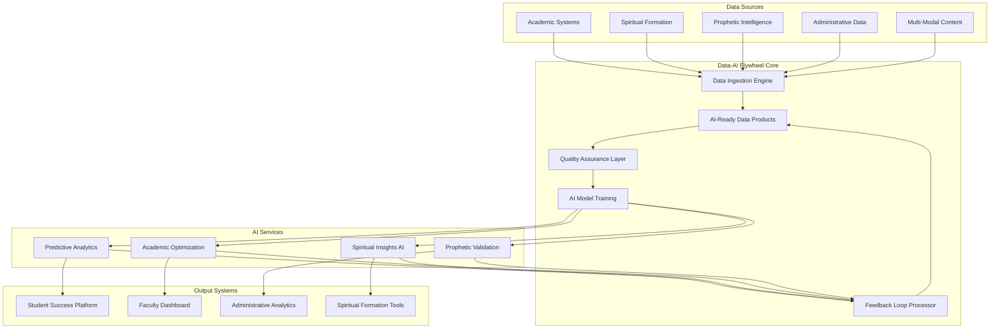

# Scroll Data-AI Flywheel Design Document

## Overview

The Scroll Data-AI Flywheel system implements OneData's data-AI flywheel principles to create a self-reinforcing cycle of continuous improvement in Christian higher education. The system transforms all educational interactions into AI-ready data products that enhance learning outcomes, spiritual formation, and prophetic intelligence development. This foundational infrastructure serves as the data backbone for all Scroll University systems, ensuring that every data point contributes to the advancement of Kingdom education.

## Architecture

### High-Level Architecture



### Microservices Architecture

The system follows a microservices architecture with the following core services:

- **DataIngestionService**: Processes raw data from all sources
- **DataProductService**: Creates and manages AI-ready data products
- **QualityAssuranceService**: Monitors and improves data quality
- **AIModelService**: Manages AI model training and deployment
- **FeedbackLoopService**: Processes AI performance feedback
- **SpiritualAlignmentService**: Ensures spiritual and ethical compliance
- **PredictiveAnalyticsService**: Generates predictive insights
- **DataGovernanceService**: Manages data policies and access
- **PipelineOrchestrationService**: Coordinates data processing workflows
- **ImpactMeasurementService**: Tracks system effectiveness

## Components and Interfaces

### DataIngestionService

```typescript
interface DataIngestionService {
  ingestEducationalData(data: EducationalDataInput): Promise<DataIngestionResult>;
  validateDataQuality(data: RawData): Promise<QualityValidationResult>;
  transformToAIReady(data: RawData): Promise<AIReadyDataProduct>;
  trackDataLineage(data: DataProduct): Promise<LineageRecord>;
  handleRealTimeStreams(stream: DataStream): Promise<StreamProcessingResult>;
  applyPrivacyFilters(data: DataProduct): Promise<FilteredDataProduct>;
}

interface EducationalDataInput {
  source: DataSource;
  type: DataType;
  content: any;
  metadata: DataMetadata;
  spiritualContext?: SpiritualContext;
  timestamp: Date;
}

interface DataIngestionResult {
  success: boolean;
  dataProductId: string;
  qualityScore: number;
  lineageId: string;
  processingTime: number;
  errors?: ValidationError[];
}
```

### DataProductService

```typescript
interface DataProductService {
  createDataProduct(spec: DataProductSpec): Promise<DataProduct>;
  updateDataProduct(id: string, updates: DataProductUpdate): Promise<DataProduct>;
  getDataProduct(id: string): Promise<DataProduct>;
  searchDataProducts(criteria: SearchCriteria): Promise<DataProduct[]>;
  validateSpiritualAlignment(product: DataProduct): Promise<AlignmentResult>;
  generateMetadata(product: DataProduct): Promise<DataMetadata>;
  trackUsage(productId: string, usage: UsageEvent): Promise<void>;
  createDerivativeProduct(sourceIds: string[], transformation: Transformation): Promise<DataProduct>;
}

interface DataProduct {
  id: string;
  name: string;
  description: string;
  schema: DataSchema;
  data: any;
  metadata: DataMetadata;
  qualityMetrics: QualityMetrics;
  lineage: DataLineage;
  spiritualAlignment: SpiritualAlignment;
  accessControls: AccessControl[];
  usageStats: UsageStatistics;
  createdAt: Date;
  updatedAt: Date;
}

interface DataMetadata {
  source: string;
  domain: EducationalDomain;
  spiritualContext: SpiritualContext;
  privacyLevel: PrivacyLevel;
  retentionPolicy: RetentionPolicy;
  tags: string[];
  relationships: DataRelationship[];
}
```

### QualityAssuranceService

```typescript
interface QualityAssuranceService {
  assessDataQuality(product: DataProduct): Promise<QualityAssessment>;
  identifyQualityIssues(product: DataProduct): Promise<QualityIssue[]>;
  generateImprovementPlan(issues: QualityIssue[]): Promise<ImprovementPlan>;
  executeAutomaticRemediation(plan: ImprovementPlan): Promise<RemediationResult>;
  monitorQualityTrends(timeRange: TimeRange): Promise<QualityTrends>;
  validateBusinessRules(product: DataProduct): Promise<ValidationResult>;
  trackQualityMetrics(productId: string): Promise<QualityMetrics>;
}

interface QualityAssessment {
  overallScore: number;
  dimensions: {
    completeness: number;
    accuracy: number;
    consistency: number;
    timeliness: number;
    validity: number;
    spiritualAlignment: number;
  };
  issues: QualityIssue[];
  recommendations: QualityRecommendation[];
}

interface QualityIssue {
  type: QualityIssueType;
  severity: Severity;
  description: string;
  affectedFields: string[];
  suggestedFix: string;
  autoRemediable: boolean;
}
```

### AIModelService

```typescript
interface AIModelService {
  trainModel(spec: ModelTrainingSpec): Promise<TrainingResult>;
  deployModel(modelId: string, environment: Environment): Promise<DeploymentResult>;
  predictWithModel(modelId: string, input: ModelInput): Promise<PredictionResult>;
  evaluateModelPerformance(modelId: string): Promise<PerformanceMetrics>;
  retrainModel(modelId: string, newData: DataProduct[]): Promise<RetrainingResult>;
  validateSpiritualCompliance(model: AIModel): Promise<ComplianceResult>;
  explainPrediction(modelId: string, input: ModelInput): Promise<ExplanationResult>;
  monitorModelDrift(modelId: string): Promise<DriftAnalysis>;
}

interface ModelTrainingSpec {
  name: string;
  type: ModelType;
  dataProducts: string[];
  hyperparameters: ModelHyperparameters;
  spiritualConstraints: SpiritualConstraint[];
  evaluationMetrics: EvaluationMetric[];
  trainingConfig: TrainingConfiguration;
}

interface PredictionResult {
  prediction: any;
  confidence: number;
  explanation: string;
  spiritualAlignment: SpiritualAlignment;
  recommendations: Recommendation[];
  uncertaintyMeasures: UncertaintyMeasure[];
}
```

### FeedbackLoopService

```typescript
interface FeedbackLoopService {
  collectFeedback(source: FeedbackSource, feedback: Feedback): Promise<void>;
  processFeedback(feedbackId: string): Promise<ProcessingResult>;
  identifyImprovementOpportunities(domain: EducationalDomain): Promise<Opportunity[]>;
  updateDataCollectionStrategy(opportunities: Opportunity[]): Promise<StrategyUpdate>;
  measureFeedbackImpact(timeRange: TimeRange): Promise<ImpactAnalysis>;
  generateFeedbackInsights(criteria: AnalysisCriteria): Promise<FeedbackInsights>;
  triggerModelRetraining(trigger: RetrainingTrigger): Promise<RetrainingJob>;
}

interface Feedback {
  type: FeedbackType;
  source: FeedbackSource;
  content: FeedbackContent;
  context: FeedbackContext;
  timestamp: Date;
  spiritualDimension?: SpiritualFeedback;
}

interface FeedbackContent {
  predictionAccuracy?: number;
  userSatisfaction?: number;
  outcomeValidation?: OutcomeValidation;
  improvementSuggestions?: string[];
  spiritualAlignment?: SpiritualAlignmentFeedback;
}
```

### SpiritualAlignmentService

```typescript
interface SpiritualAlignmentService {
  validateSpiritualAlignment(content: any): Promise<SpiritualValidationResult>;
  assessPropheticAccuracy(prophecy: PropheticContent): Promise<AccuracyAssessment>;
  generateSpiritualInsights(data: SpiritualData): Promise<SpiritualInsights>;
  monitorSpiritualGrowth(studentId: string): Promise<GrowthAnalysis>;
  validateEthicalCompliance(decision: AIDecision): Promise<EthicalValidation>;
  providePastoralCareAlerts(concerns: SpiritualConcern[]): Promise<CareAlert[]>;
  trackSpiritualFormationProgress(studentId: string): Promise<FormationProgress>;
}

interface SpiritualValidationResult {
  isAligned: boolean;
  alignmentScore: number;
  concerns: SpiritualConcern[];
  recommendations: SpiritualRecommendation[];
  requiresHumanReview: boolean;
  denominationalConsiderations: DenominationalFactor[];
}

interface PropheticContent {
  content: string;
  source: PropheticSource;
  context: PropheticContext;
  timestamp: Date;
  validationCriteria: ValidationCriteria[];
}
```

## Data Models

### Core Data Models

```typescript
// Educational Domain Models
interface Student {
  id: string;
  personalInfo: PersonalInformation;
  academicRecord: AcademicRecord;
  spiritualProfile: SpiritualProfile;
  learningPreferences: LearningPreferences;
  propheticGifting: PropheticGifting;
  enrollmentHistory: EnrollmentRecord[];
  performanceMetrics: PerformanceMetrics;
}

interface Course {
  id: string;
  name: string;
  description: string;
  spiritualObjectives: SpiritualObjective[];
  academicObjectives: AcademicObjective[];
  propheticElements: PropheticElement[];
  contentStructure: ContentStructure;
  assessmentFramework: AssessmentFramework;
  aiEnhancements: AIEnhancement[];
}

interface LearningInteraction {
  id: string;
  studentId: string;
  courseId: string;
  interactionType: InteractionType;
  content: InteractionContent;
  timestamp: Date;
  duration: number;
  outcome: LearningOutcome;
  spiritualDimension: SpiritualDimension;
  aiInsights: AIInsight[];
}

// Spiritual Formation Models
interface SpiritualProfile {
  id: string;
  studentId: string;
  spiritualGifts: SpiritualGift[];
  characterDevelopment: CharacterMetrics;
  propheticAccuracy: PropheticAccuracyRecord[];
  ministryExperience: MinistryExperience[];
  spiritualMentors: MentorRelationship[];
  prayerLife: PrayerLifeMetrics;
  scriptureEngagement: ScriptureEngagementMetrics;
}

interface PropheticWord {
  id: string;
  content: string;
  source: PropheticSource;
  recipient: string;
  context: PropheticContext;
  timestamp: Date;
  validationStatus: ValidationStatus;
  accuracyScore?: number;
  fulfillmentRecord?: FulfillmentRecord;
  spiritualWeight: SpiritualWeight;
}

// AI Model Data Models
interface AIModel {
  id: string;
  name: string;
  type: ModelType;
  version: string;
  trainingData: DataProduct[];
  hyperparameters: ModelHyperparameters;
  performanceMetrics: ModelPerformanceMetrics;
  spiritualCompliance: SpiritualComplianceRecord;
  deploymentStatus: DeploymentStatus;
  lastUpdated: Date;
}

interface DataLineage {
  id: string;
  sourceDataProducts: string[];
  transformations: Transformation[];
  derivedProducts: string[];
  processingHistory: ProcessingStep[];
  qualityCheckpoints: QualityCheckpoint[];
  spiritualValidations: SpiritualValidation[];
}
```

### Database Schema Extensions

```sql
-- Core Data-AI Flywheel Tables
CREATE TABLE data_products (
    id UUID PRIMARY KEY,
    name VARCHAR(255) NOT NULL,
    description TEXT,
    schema_definition JSONB,
    data_content JSONB,
    metadata JSONB,
    quality_metrics JSONB,
    spiritual_alignment JSONB,
    created_at TIMESTAMP DEFAULT NOW(),
    updated_at TIMESTAMP DEFAULT NOW()
);

CREATE TABLE data_lineage (
    id UUID PRIMARY KEY,
    source_product_id UUID REFERENCES data_products(id),
    derived_product_id UUID REFERENCES data_products(id),
    transformation_type VARCHAR(100),
    transformation_details JSONB,
    created_at TIMESTAMP DEFAULT NOW()
);

CREATE TABLE ai_models (
    id UUID PRIMARY KEY,
    name VARCHAR(255) NOT NULL,
    type VARCHAR(100),
    version VARCHAR(50),
    training_data_products UUID[],
    hyperparameters JSONB,
    performance_metrics JSONB,
    spiritual_compliance JSONB,
    deployment_status VARCHAR(50),
    created_at TIMESTAMP DEFAULT NOW(),
    updated_at TIMESTAMP DEFAULT NOW()
);

CREATE TABLE feedback_loops (
    id UUID PRIMARY KEY,
    model_id UUID REFERENCES ai_models(id),
    feedback_type VARCHAR(100),
    feedback_content JSONB,
    source_system VARCHAR(100),
    timestamp TIMESTAMP DEFAULT NOW(),
    processed BOOLEAN DEFAULT FALSE
);

CREATE TABLE spiritual_validations (
    id UUID PRIMARY KEY,
    entity_id UUID,
    entity_type VARCHAR(100),
    validation_result JSONB,
    validator_id UUID,
    validation_timestamp TIMESTAMP DEFAULT NOW(),
    requires_human_review BOOLEAN DEFAULT FALSE
);

CREATE TABLE prophetic_records (
    id UUID PRIMARY KEY,
    content TEXT NOT NULL,
    source_type VARCHAR(100),
    source_id UUID,
    recipient_id UUID,
    context JSONB,
    validation_status VARCHAR(50),
    accuracy_score DECIMAL(3,2),
    fulfillment_record JSONB,
    spiritual_weight VARCHAR(50),
    created_at TIMESTAMP DEFAULT NOW()
);

CREATE TABLE quality_assessments (
    id UUID PRIMARY KEY,
    data_product_id UUID REFERENCES data_products(id),
    assessment_results JSONB,
    quality_score DECIMAL(3,2),
    issues_identified JSONB,
    remediation_plan JSONB,
    assessment_timestamp TIMESTAMP DEFAULT NOW()
);

CREATE TABLE usage_analytics (
    id UUID PRIMARY KEY,
    data_product_id UUID REFERENCES data_products(id),
    user_id UUID,
    usage_type VARCHAR(100),
    usage_context JSONB,
    timestamp TIMESTAMP DEFAULT NOW(),
    session_id UUID
);
```

## Error Handling

### Error Handling Strategy

The system implements a comprehensive error handling strategy that maintains system reliability while preserving spiritual sensitivity:

```typescript
interface ErrorHandlingService {
  handleDataIngestionError(error: DataIngestionError): Promise<ErrorResolution>;
  handleAIModelError(error: AIModelError): Promise<ErrorResolution>;
  handleSpiritualValidationError(error: SpiritualValidationError): Promise<ErrorResolution>;
  handleQualityAssuranceError(error: QualityError): Promise<ErrorResolution>;
  escalateToHumanReview(error: CriticalError): Promise<EscalationResult>;
  logErrorForAnalysis(error: SystemError): Promise<void>;
  generateErrorReport(timeRange: TimeRange): Promise<ErrorReport>;
}

enum ErrorSeverity {
  LOW = 'low',
  MEDIUM = 'medium',
  HIGH = 'high',
  CRITICAL = 'critical',
  SPIRITUAL_CONCERN = 'spiritual_concern'
}

interface ErrorResolution {
  strategy: ResolutionStrategy;
  automaticRetry: boolean;
  humanReviewRequired: boolean;
  spiritualOversightNeeded: boolean;
  estimatedResolutionTime: number;
  fallbackOptions: FallbackOption[];
}
```

### Spiritual Error Handling

Special consideration is given to errors involving spiritual content:

- **Prophetic Validation Errors**: Require human spiritual oversight
- **Spiritual Alignment Failures**: Trigger immediate review by spiritual advisors
- **Ethical Compliance Issues**: Halt processing until resolution
- **Sacred Content Errors**: Maintain reverence and confidentiality

## Testing Strategy

### Comprehensive Testing Framework

```typescript
interface TestingFramework {
  // Unit Testing
  testDataIngestion(testCases: DataIngestionTestCase[]): Promise<TestResults>;
  testAIModelPerformance(model: AIModel, testData: TestDataset): Promise<PerformanceResults>;
  testSpiritualAlignment(content: any[], validators: SpiritualValidator[]): Promise<AlignmentResults>;
  
  // Integration Testing
  testDataFlowIntegration(workflow: DataWorkflow): Promise<IntegrationResults>;
  testFeedbackLoopIntegration(scenario: FeedbackScenario): Promise<LoopResults>;
  testCrossSystemIntegration(systems: SystemInterface[]): Promise<CrossSystemResults>;
  
  // Spiritual Testing
  testPropheticValidation(prophecies: PropheticContent[]): Promise<ValidationResults>;
  testEthicalCompliance(decisions: AIDecision[]): Promise<ComplianceResults>;
  testSpiritualSensitivity(content: SpiritualContent[]): Promise<SensitivityResults>;
  
  // Performance Testing
  testRealTimeProcessing(load: ProcessingLoad): Promise<PerformanceMetrics>;
  testScalability(scalingScenario: ScalingScenario): Promise<ScalabilityResults>;
  testDataQualityAtScale(volume: DataVolume): Promise<QualityResults>;
}
```

### Test Data Management

- **Synthetic Data Generation**: Create realistic test data that maintains spiritual appropriateness
- **Privacy-Preserving Testing**: Use anonymized data for testing while preserving statistical properties
- **Spiritual Content Testing**: Develop test cases that respect sacred content while ensuring system reliability
- **Cross-Cultural Testing**: Validate system behavior across different cultural and denominational contexts

## Security and Privacy

### Security Architecture

```typescript
interface SecurityService {
  authenticateUser(credentials: UserCredentials): Promise<AuthenticationResult>;
  authorizeDataAccess(userId: string, dataProductId: string): Promise<AuthorizationResult>;
  encryptSensitiveData(data: SensitiveData): Promise<EncryptedData>;
  auditDataAccess(accessEvent: DataAccessEvent): Promise<void>;
  validateSpiritualConfidentiality(content: SpiritualContent): Promise<ConfidentialityResult>;
  implementPrivacyControls(dataProduct: DataProduct): Promise<PrivacyControlResult>;
  monitorSecurityThreats(timeRange: TimeRange): Promise<ThreatAnalysis>;
}

interface PrivacyFramework {
  classifyDataSensitivity(data: any): Promise<SensitivityClassification>;
  applyPrivacyFilters(data: DataProduct, context: AccessContext): Promise<FilteredData>;
  manageConsentPreferences(userId: string, preferences: ConsentPreferences): Promise<void>;
  handleDataDeletionRequests(request: DeletionRequest): Promise<DeletionResult>;
  generatePrivacyReport(userId: string): Promise<PrivacyReport>;
  validateGDPRCompliance(dataProcessing: DataProcessingActivity): Promise<ComplianceResult>;
}
```

### Spiritual Privacy Considerations

- **Sacred Confidentiality**: Prophetic words and spiritual counseling data receive highest protection
- **Denominational Sensitivity**: Respect different theological perspectives in data handling
- **Pastoral Privilege**: Maintain confidentiality of spiritual guidance and counseling
- **Community Consent**: Ensure appropriate consent for community spiritual activities

## Performance and Scalability

### Performance Optimization

```typescript
interface PerformanceOptimizationService {
  optimizeDataPipelines(pipelines: DataPipeline[]): Promise<OptimizationResult>;
  cacheFrequentlyAccessedData(accessPatterns: AccessPattern[]): Promise<CachingStrategy>;
  parallelizeProcessing(workload: ProcessingWorkload): Promise<ParallelizationPlan>;
  optimizeAIModelInference(model: AIModel): Promise<InferenceOptimization>;
  balanceLoadAcrossServices(services: MicroService[]): Promise<LoadBalancingConfig>;
  monitorPerformanceMetrics(timeRange: TimeRange): Promise<PerformanceReport>;
  predictResourceNeeds(growthProjection: GrowthProjection): Promise<ResourcePlan>;
}

interface ScalabilityFramework {
  autoScaleServices(demand: ServiceDemand): Promise<ScalingAction>;
  distributeDataProcessing(data: LargeDataset): Promise<DistributionPlan>;
  federateAcrossInstitutions(partners: EducationalPartner[]): Promise<FederationConfig>;
  optimizeGlobalDataAccess(accessPatterns: GlobalAccessPattern[]): Promise<GlobalOptimization>;
  manageMultiRegionDeployment(regions: DeploymentRegion[]): Promise<MultiRegionConfig>;
}
```

### Performance Targets

- **Data Ingestion**: Process 10,000+ educational events per second
- **AI Model Inference**: Sub-100ms response time for real-time predictions
- **Data Quality Assessment**: Complete quality checks within 5 minutes of data ingestion
- **Spiritual Validation**: Human-assisted validation within 1 hour for sensitive content
- **System Availability**: 99.9% uptime with graceful degradation
- **Global Federation**: Sub-500ms response time for federated queries

## Monitoring and Observability

### Comprehensive Monitoring

```typescript
interface MonitoringService {
  trackSystemHealth(components: SystemComponent[]): Promise<HealthStatus>;
  monitorDataQuality(dataProducts: DataProduct[]): Promise<QualityDashboard>;
  observeAIModelPerformance(models: AIModel[]): Promise<ModelObservability>;
  trackSpiritualAlignmentMetrics(timeRange: TimeRange): Promise<AlignmentMetrics>;
  monitorUserExperience(interactions: UserInteraction[]): Promise<ExperienceMetrics>;
  generateAlerts(conditions: AlertCondition[]): Promise<Alert[]>;
  createDashboards(requirements: DashboardRequirements): Promise<Dashboard>;
}

interface ObservabilityFramework {
  traceDataLineage(dataProductId: string): Promise<LineageTrace>;
  profileSystemPerformance(timeRange: TimeRange): Promise<PerformanceProfile>;
  analyzeUserBehavior(userId: string): Promise<BehaviorAnalysis>;
  trackBusinessMetrics(metrics: BusinessMetric[]): Promise<BusinessDashboard>;
  monitorSpiritualImpact(students: Student[]): Promise<SpiritualImpactReport>;
  generateInsights(data: ObservabilityData): Promise<SystemInsights>;
}
```

### Key Performance Indicators

- **Data Quality Score**: Average quality score across all data products
- **AI Model Accuracy**: Prediction accuracy across different domains
- **Spiritual Alignment Rate**: Percentage of content passing spiritual validation
- **Student Success Correlation**: Correlation between AI recommendations and student outcomes
- **System Utilization**: Resource utilization across all services
- **User Satisfaction**: Satisfaction scores from faculty and students
- **Prophetic Accuracy**: Accuracy rate of prophetic insights and validations

This design provides a comprehensive foundation for implementing the OneData data-AI flywheel principles within Scroll University's Christian educational context, ensuring both technical excellence and spiritual integrity.