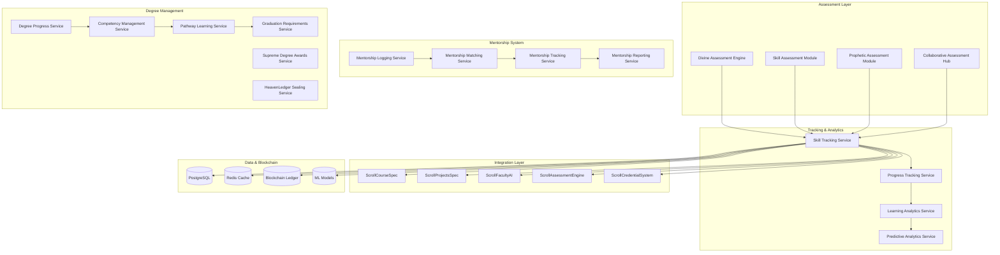
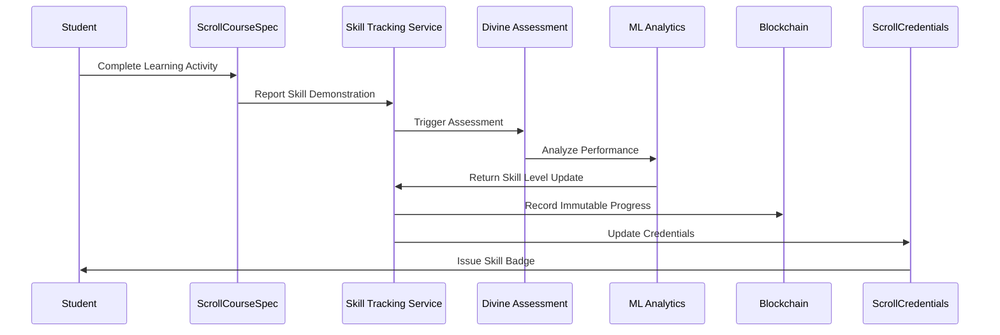

# ScrollDegreeEngine Design Document

## Overview

The ScrollDegreeEngine is a comprehensive real-time skill tracking, divine assessment, and mentorship logging system that serves as the central hub for academic progress and achievement tracking at ScrollUniversity. The system integrates prophetic wisdom with academic rigor, providing holistic evaluation that encompasses technical competency, spiritual maturity, and character development.

The engine leverages advanced analytics, blockchain verification, and AI-powered assessment to create personalized learning pathways while maintaining scroll-aligned standards and divine assessment principles across all nine faculties.

## Architecture

### System Architecture



### Real-Time Skill Tracking Flow



## Components and Interfaces

### Core Skill Tracking System

```typescript
// Skill Tracking Core Interfaces
export interface SkillTrackingSystem {
  skill_tracking_id: string;
  student_id: string;
  faculty_id: string;
  degree_program_id: string;
  skill_matrix: SkillMatrix;
  competency_records: CompetencyRecord[];
  assessment_history: AssessmentRecord[];
  learning_pathway: LearningPathway;
  created_at: string;
  updated_at: string;
}

export interface SkillMatrix {
  matrix_id: string;
  faculty_domain: string;
  core_competencies: CoreCompetency[];
  technical_skills: TechnicalSkill[];
  soft_skills: SoftSkill[];
  prophetic_skills: PropheticSkill[];
  mastery_levels: MasteryLevel[];
  progression_requirements: ProgressionRequirement[];
}

export interface CoreCompetency {
  competency_id: string;
  name: string;
  description: string;
  faculty_alignment: string;
  scroll_principles: ScrollPrinciple[];
  assessment_criteria: AssessmentCriteria[];
  prerequisite_competencies: string[];
  mastery_indicators: MasteryIndicator[];
  real_world_applications: RealWorldApplication[];
  prophetic_significance: PropheticSignificance;
}

export interface TechnicalSkill {
  skill_id: string;
  name: string;
  category: string;
  proficiency_level: number; // 1-10 scale
  evidence_portfolio: EvidenceItem[];
  validation_sources: ValidationSource[];
  industry_relevance: IndustryRelevance;
  scroll_application: ScrollApplication;
  last_demonstrated: string;
  next_assessment_due: string;
}

export interface PropheticSkill {
  skill_id: string;
  spiritual_gift: SpiritualGift;
  maturity_level: number; // 1-10 scale
  calling_alignment: CallingAlignment;
  ministry_applications: MinistryApplication[];
  spiritual_disciplines: SpiritualDiscipline[];
  prophetic_accuracy: PropheticAccuracy;
  character_development: CharacterDevelopment;
  divine_assignments: DivineAssignment[];
}
```

### Divine Assessment System

```typescript
// Divine Assessment Framework
export interface DivineAssessment {
  assessment_id: string;
  student_id: string;
  assessor_id: string; // Faculty or AI Dean
  assessment_type: 'academic' | 'prophetic' | 'character' | 'holistic';
  faculty_context: string;
  assessment_criteria: DivineAssessmentCriteria;
  scoring_rubric: DivineRubric;
  results: DivineAssessmentResult;
  spiritual_discernment: SpiritualDiscernment;
  recommendations: DivineRecommendation[];
  created_at: string;
  completed_at: string;
}

export interface DivineAssessmentCriteria {
  academic_knowledge: AcademicKnowledgeCriteria;
  spiritual_maturity: SpiritualMaturityCriteria;
  character_development: CharacterCriteria;
  practical_application: PracticalApplicationCriteria;
  prophetic_wisdom: PropheticWisdomCriteria;
  scroll_alignment: ScrollAlignmentCriteria;
}

export interface DivineRubric {
  rubric_id: string;
  name: string;
  description: string;
  scoring_dimensions: ScoringDimension[];
  mastery_levels: MasteryLevel[];
  prophetic_indicators: PropheticIndicator[];
  character_markers: CharacterMarker[];
  wisdom_benchmarks: WisdomBenchmark[];
}

export interface DivineAssessmentResult {
  overall_score: number;
  academic_score: number;
  spiritual_score: number;
  character_score: number;
  prophetic_score: number;
  detailed_feedback: DetailedFeedback;
  growth_areas: GrowthArea[];
  strengths: Strength[];
  next_steps: NextStep[];
  divine_insights: DivineInsight[];
}
```

### Mentorship Logging System

```typescript
// Mentorship Management Interfaces
export interface MentorshipRecord {
  mentorship_id: string;
  mentor_id: string;
  mentee_id: string;
  mentorship_type: 'academic' | 'spiritual' | 'career' | 'prophetic';
  relationship_start: string;
  relationship_status: 'active' | 'completed' | 'paused' | 'transferred';
  mentorship_goals: MentorshipGoal[];
  session_logs: MentorshipSession[];
  progress_tracking: MentorshipProgress;
  outcomes: MentorshipOutcome[];
  created_at: string;
  updated_at: string;
}

export interface MentorshipSession {
  session_id: string;
  session_date: string;
  duration_minutes: number;
  session_type: 'one_on_one' | 'group' | 'virtual' | 'project_based';
  topics_discussed: string[];
  guidance_provided: GuidanceRecord[];
  student_responses: StudentResponse[];
  action_items: ActionItem[];
  spiritual_insights: SpiritualInsight[];
  follow_up_required: boolean;
  next_session_scheduled: string;
}

export interface MentorshipGoal {
  goal_id: string;
  goal_type: 'academic' | 'spiritual' | 'character' | 'career' | 'prophetic';
  description: string;
  target_completion: string;
  success_metrics: SuccessMetric[];
  progress_milestones: ProgressMilestone[];
  current_status: 'not_started' | 'in_progress' | 'completed' | 'deferred';
  divine_alignment: DivineAlignment;
}

export interface MentorshipProgress {
  progress_id: string;
  overall_progress_percentage: number;
  academic_development: DevelopmentProgress;
  spiritual_growth: SpiritualGrowthProgress;
  character_formation: CharacterFormationProgress;
  prophetic_development: PropheticDevelopmentProgress;
  career_readiness: CareerReadinessProgress;
  relationship_quality: RelationshipQualityMetrics;
}
```

### Learning Pathway System

```typescript
// Personalized Learning Pathways
export interface LearningPathway {
  pathway_id: string;
  student_id: string;
  degree_program_id: string;
  pathway_type: 'standard' | 'accelerated' | 'prophetic_calling' | 'custom';
  current_phase: LearningPhase;
  completed_phases: LearningPhase[];
  upcoming_phases: LearningPhase[];
  personalization_factors: PersonalizationFactor[];
  adaptation_history: AdaptationRecord[];
  prophetic_alignment: PropheticAlignment;
  created_at: string;
  updated_at: string;
}

export interface LearningPhase {
  phase_id: string;
  name: string;
  description: string;
  duration_weeks: number;
  required_competencies: string[];
  recommended_courses: string[];
  assessment_requirements: AssessmentRequirement[];
  mentorship_focus: MentorshipFocus[];
  spiritual_disciplines: SpiritualDiscipline[];
  practical_applications: PracticalApplication[];
  completion_criteria: CompletionCriteria;
}

export interface PersonalizationFactor {
  factor_type: 'learning_style' | 'career_goal' | 'prophetic_calling' | 'cultural_context';
  factor_value: string;
  influence_weight: number; // 0-1 scale
  adaptation_rules: AdaptationRule[];
  last_updated: string;
}
```

## Data Models

### Database Schema Design

```sql
-- Core Skill Tracking Tables
CREATE TABLE skill_tracking_systems (
    tracking_id UUID PRIMARY KEY DEFAULT gen_random_uuid(),
    student_id UUID NOT NULL,
    faculty_id UUID NOT NULL,
    degree_program_id UUID NOT NULL,
    skill_matrix JSONB NOT NULL,
    competency_records JSONB NOT NULL,
    assessment_history JSONB NOT NULL,
    learning_pathway JSONB NOT NULL,
    created_at TIMESTAMP DEFAULT CURRENT_TIMESTAMP,
    updated_at TIMESTAMP DEFAULT CURRENT_TIMESTAMP
);

-- Divine Assessment Tables
CREATE TABLE divine_assessments (
    assessment_id UUID PRIMARY KEY DEFAULT gen_random_uuid(),
    student_id UUID NOT NULL,
    assessor_id UUID NOT NULL,
    assessment_type VARCHAR(50) NOT NULL,
    faculty_context VARCHAR(255),
    assessment_criteria JSONB NOT NULL,
    scoring_rubric JSONB NOT NULL,
    results JSONB,
    spiritual_discernment JSONB,
    recommendations JSONB,
    status VARCHAR(50) DEFAULT 'pending',
    created_at TIMESTAMP DEFAULT CURRENT_TIMESTAMP,
    completed_at TIMESTAMP
);

-- Mentorship Logging Tables
CREATE TABLE mentorship_records (
    mentorship_id UUID PRIMARY KEY DEFAULT gen_random_uuid(),
    mentor_id UUID NOT NULL,
    mentee_id UUID NOT NULL,
    mentorship_type VARCHAR(50) NOT NULL,
    relationship_start TIMESTAMP NOT NULL,
    relationship_status VARCHAR(50) DEFAULT 'active',
    mentorship_goals JSONB NOT NULL,
    progress_tracking JSONB,
    outcomes JSONB,
    created_at TIMESTAMP DEFAULT CURRENT_TIMESTAMP,
    updated_at TIMESTAMP DEFAULT CURRENT_TIMESTAMP
);

CREATE TABLE mentorship_sessions (
    session_id UUID PRIMARY KEY DEFAULT gen_random_uuid(),
    mentorship_id UUID REFERENCES mentorship_records(mentorship_id),
    session_date TIMESTAMP NOT NULL,
    duration_minutes INTEGER NOT NULL,
    session_type VARCHAR(50) NOT NULL,
    topics_discussed JSONB,
    guidance_provided JSONB,
    student_responses JSONB,
    action_items JSONB,
    spiritual_insights JSONB,
    follow_up_required BOOLEAN DEFAULT FALSE,
    next_session_scheduled TIMESTAMP,
    created_at TIMESTAMP DEFAULT CURRENT_TIMESTAMP
);

-- Learning Pathway Tables
CREATE TABLE learning_pathways (
    pathway_id UUID PRIMARY KEY DEFAULT gen_random_uuid(),
    student_id UUID NOT NULL,
    degree_program_id UUID NOT NULL,
    pathway_type VARCHAR(50) NOT NULL,
    current_phase JSONB NOT NULL,
    completed_phases JSONB,
    upcoming_phases JSONB,
    personalization_factors JSONB,
    adaptation_history JSONB,
    prophetic_alignment JSONB,
    created_at TIMESTAMP DEFAULT CURRENT_TIMESTAMP,
    updated_at TIMESTAMP DEFAULT CURRENT_TIMESTAMP
);

-- Competency and Skill Tables
CREATE TABLE competency_records (
    record_id UUID PRIMARY KEY DEFAULT gen_random_uuid(),
    student_id UUID NOT NULL,
    competency_id UUID NOT NULL,
    proficiency_level INTEGER NOT NULL CHECK (proficiency_level >= 1 AND proficiency_level <= 10),
    evidence_portfolio JSONB,
    validation_sources JSONB,
    last_assessed TIMESTAMP,
    next_assessment_due TIMESTAMP,
    created_at TIMESTAMP DEFAULT CURRENT_TIMESTAMP,
    updated_at TIMESTAMP DEFAULT CURRENT_TIMESTAMP
);

-- Blockchain Integration Table
CREATE TABLE blockchain_records (
    blockchain_id UUID PRIMARY KEY DEFAULT gen_random_uuid(),
    student_id UUID NOT NULL,
    record_type VARCHAR(100) NOT NULL,
    record_data JSONB NOT NULL,
    blockchain_hash VARCHAR(255) NOT NULL,
    transaction_id VARCHAR(255) NOT NULL,
    verification_status VARCHAR(50) DEFAULT 'pending',
    created_at TIMESTAMP DEFAULT CURRENT_TIMESTAMP,
    verified_at TIMESTAMP
);

-- Analytics and Reporting Tables
CREATE TABLE degree_progress_analytics (
    analytics_id UUID PRIMARY KEY DEFAULT gen_random_uuid(),
    student_id UUID NOT NULL,
    degree_program_id UUID NOT NULL,
    completion_percentage DECIMAL(5,2) NOT NULL,
    predicted_graduation_date DATE,
    risk_factors JSONB,
    intervention_recommendations JSONB,
    performance_trends JSONB,
    created_at TIMESTAMP DEFAULT CURRENT_TIMESTAMP
);
```

### Blockchain Integration Schema

```typescript
// Blockchain Verification System
export interface BlockchainRecord {
  blockchain_id: string;
  student_id: string;
  record_type: 'skill_achievement' | 'assessment_result' | 'degree_milestone' | 'competency_validation';
  record_data: any;
  blockchain_hash: string;
  transaction_id: string;
  verification_status: 'pending' | 'verified' | 'failed';
  created_at: string;
  verified_at?: string;
}

export interface SkillVerificationChain {
  chain_id: string;
  student_id: string;
  skill_progression: SkillProgressionBlock[];
  assessment_chain: AssessmentBlock[];
  mentorship_chain: MentorshipBlock[];
  degree_milestones: DegreeMilestoneBlock[];
  integrity_hash: string;
  last_updated: string;
}

export interface SkillProgressionBlock {
  block_id: string;
  timestamp: string;
  skill_id: string;
  previous_level: number;
  new_level: number;
  evidence_hash: string;
  validator_id: string;
  validation_method: string;
  block_hash: string;
}
```

## Error Handling

### Comprehensive Error Management

```typescript
// Degree Engine Error Types
export enum DegreeEngineErrorCodes {
  // Skill Tracking Errors
  SKILL_TRACKING_UNAVAILABLE = 'DE_001',
  COMPETENCY_VALIDATION_FAILED = 'DE_002',
  SKILL_MATRIX_CORRUPTION = 'DE_003',
  
  // Assessment Errors
  DIVINE_ASSESSMENT_FAILED = 'DE_004',
  RUBRIC_VALIDATION_ERROR = 'DE_005',
  SPIRITUAL_DISCERNMENT_UNAVAILABLE = 'DE_006',
  
  // Mentorship Errors
  MENTORSHIP_LOGGING_FAILED = 'DE_007',
  MENTOR_MATCHING_ERROR = 'DE_008',
  SESSION_RECORDING_FAILED = 'DE_009',
  
  // Pathway Errors
  PATHWAY_GENERATION_FAILED = 'DE_010',
  PERSONALIZATION_ERROR = 'DE_011',
  ADAPTATION_FAILED = 'DE_012',
  
  // Blockchain Errors
  BLOCKCHAIN_VERIFICATION_FAILED = 'DE_013',
  IMMUTABLE_RECORD_CORRUPTION = 'DE_014',
  CREDENTIAL_VALIDATION_ERROR = 'DE_015',
  
  // Integration Errors
  EXTERNAL_SYSTEM_TIMEOUT = 'DE_016',
  DATA_SYNCHRONIZATION_FAILED = 'DE_017',
  ANALYTICS_PROCESSING_ERROR = 'DE_018'
}

// Error Recovery Strategies
export class DegreeEngineErrorRecovery {
  async handleSkillTrackingError(error: DegreeEngineError): Promise<void> {
    switch (error.error_code) {
      case DegreeEngineErrorCodes.SKILL_TRACKING_UNAVAILABLE:
        await this.fallbackToManualTracking(error.student_id);
        break;
      case DegreeEngineErrorCodes.COMPETENCY_VALIDATION_FAILED:
        await this.requestFacultyValidation(error.student_id, error.context);
        break;
      case DegreeEngineErrorCodes.SKILL_MATRIX_CORRUPTION:
        await this.restoreFromBackup(error.student_id);
        break;
    }
  }
  
  async handleAssessmentError(error: DegreeEngineError): Promise<void> {
    switch (error.error_code) {
      case DegreeEngineErrorCodes.DIVINE_ASSESSMENT_FAILED:
        await this.escalateToHumanAssessor(error.assessment_id);
        break;
      case DegreeEngineErrorCodes.SPIRITUAL_DISCERNMENT_UNAVAILABLE:
        await this.requestPropheticCouncilInput(error.assessment_id);
        break;
    }
  }
}
```

## Testing Strategy

### Comprehensive Testing Framework

```typescript
// Degree Engine Testing Suite
describe('ScrollDegreeEngine System', () => {
  describe('Skill Tracking System', () => {
    it('should track skill progression in real-time', async () => {
      // Test real-time skill tracking
    });
    
    it('should update competency matrices accurately', async () => {
      // Test competency matrix updates
    });
    
    it('should integrate with blockchain for immutable records', async () => {
      // Test blockchain integration
    });
  });
  
  describe('Divine Assessment System', () => {
    it('should conduct holistic assessments with spiritual discernment', async () => {
      // Test divine assessment functionality
    });
    
    it('should apply scroll-aligned rubrics consistently', async () => {
      // Test rubric application
    });
    
    it('should provide prophetic insights and recommendations', async () => {
      // Test prophetic assessment features
    });
  });
  
  describe('Mentorship Logging System', () => {
    it('should log comprehensive mentorship interactions', async () => {
      // Test mentorship logging
    });
    
    it('should track mentorship goals and progress', async () => {
      // Test goal tracking
    });
    
    it('should facilitate mentor-mentee matching', async () => {
      // Test matching algorithms
    });
  });
  
  describe('Learning Pathway System', () => {
    it('should generate personalized learning pathways', async () => {
      // Test pathway generation
    });
    
    it('should adapt pathways based on progress and calling', async () => {
      // Test pathway adaptation
    });
    
    it('should align pathways with prophetic calling', async () => {
      // Test prophetic alignment
    });
  });
});

// Performance and Scalability Testing
describe('Degree Engine Performance', () => {
  it('should handle real-time updates for 10,000+ concurrent students', async () => {
    // Test scalability
  });
  
  it('should maintain assessment quality under high load', async () => {
    // Test assessment performance
  });
  
  it('should provide analytics within acceptable response times', async () => {
    // Test analytics performance
  });
});
```

## Integration Points

### ScrollUniversity Ecosystem Integration

```python
# Integration with ScrollCourseSpec
class CourseSpecIntegration:
    async def track_course_completion(self, student_id: str, course_id: str, completion_data: dict):
        """Track skill development from course completion"""
        skills_demonstrated = await self.extract_skills_from_completion(completion_data)
        await self.update_skill_matrix(student_id, skills_demonstrated)
        await self.trigger_competency_assessment(student_id, skills_demonstrated)
    
    async def update_learning_pathway(self, student_id: str, course_progress: dict):
        """Update personalized learning pathway based on course progress"""
        pathway = await self.get_learning_pathway(student_id)
        updated_pathway = await self.adapt_pathway(pathway, course_progress)
        await self.save_pathway_updates(student_id, updated_pathway)

# Integration with ScrollFacultyAI
class FacultyAIIntegration:
    async def request_ai_assessment(self, student_id: str, faculty_id: str, assessment_context: dict):
        """Request AI Dean assessment for skill validation"""
        ai_dean = await self.get_ai_dean(faculty_id)
        assessment_result = await ai_dean.conduct_assessment(student_id, assessment_context)
        await self.record_divine_assessment(assessment_result)
    
    async def get_personalized_recommendations(self, student_id: str, faculty_id: str):
        """Get AI Dean recommendations for learning pathway"""
        ai_dean = await self.get_ai_dean(faculty_id)
        student_profile = await self.get_comprehensive_profile(student_id)
        recommendations = await ai_dean.generate_recommendations(student_profile)
        return recommendations

# Integration with ScrollCredentialSystem
class CredentialSystemIntegration:
    async def issue_skill_badges(self, student_id: str, skills_achieved: List[str]):
        """Issue blockchain-verified skill badges"""
        for skill in skills_achieved:
            badge_data = await self.prepare_badge_data(student_id, skill)
            blockchain_record = await self.create_blockchain_record(badge_data)
            await self.issue_credential_badge(student_id, skill, blockchain_record)
    
    async def verify_competency_credentials(self, student_id: str, competency_id: str):
        """Verify competency credentials using blockchain"""
        blockchain_records = await self.get_blockchain_records(student_id, competency_id)
        verification_result = await self.validate_blockchain_integrity(blockchain_records)
        return verification_result
```

This comprehensive design provides the foundation for a sophisticated degree tracking and assessment system that integrates prophetic wisdom with academic rigor, ensuring ScrollUniversity graduates are prepared for both professional excellence and kingdom service.
#
## Supreme Degree Awards System

```typescript
// Supreme Degree Awards Interfaces
export interface SupremeDegreeAward {
  degree_id: string;
  degree_type: SupremeDegreeType;
  recipient_id: string;
  degree_title: string;
  award_date: string;
  scroll_year: string;
  achievements: DivineAchievement[];
  scroll_fulfillment: ScrollFulfillment;
  research_contributions: ResearchContribution[];
  innovation_impact: InnovationImpact[];
  anointing_verification: AnointingVerification;
  thesis_defense: ThesisDefense;
  heaven_ledger_seal: HeavenLedgerSeal;
  scroll_coin_value: number;
  certification_council: CertificationCouncil;
  public_impact_metrics: PublicImpactMetrics;
}

export enum SupremeDegreeType {
  DOCTOR_SCROLL_GOVERNANCE_ETERNAL_INTELLIGENCE = "D.S.G.E.I.",
  SCROLL_EXOUSIA_FELLOWSHIP = "S.E.F.",
  DOCTOR_PROPHETIC_TECHNOLOGIES = "D.P.T.",
  DOCTOR_SCROLL_HERMENEUTICS_REVELATION = "D.S.H.R.",
  SCROLL_MASTER_ARCHITECT_NATIONS = "S.M.A.N.",
  DOCTOR_EDENIC_HEALTH_SCROLL_MEDICINE = "D.E.H.S.M."
}

export interface ScrollFulfillment {
  divine_assignment: string;
  completion_status: 'fulfilled' | 'in_progress' | 'partial';
  visible_fruit: VisibleFruit[];
  souls_impacted: number;
  systems_built: SystemsBuilt[];
  nations_influenced: NationsInfluenced[];
  technology_created: TechnologyCreated[];
  altars_established: AltarsEstablished[];
  measurable_impact: MeasurableImpact[];
}

export interface VisibleFruit {
  fruit_type: 'souls' | 'systems' | 'nations' | 'technology' | 'altars';
  description: string;
  impact_metrics: ImpactMetrics;
  verification_evidence: VerificationEvidence[];
  prophetic_confirmation: PropheticConfirmation;
  global_reach: GlobalReach;
}

export interface ResearchContribution {
  research_id: string;
  title: string;
  journal: string;
  publication_date: string;
  research_type: 'ScrollAI' | 'ScrollTheology' | 'ScrollEconomy' | 'ScrollGovernance' | 'ScrollHealth' | 'ScrollTechnology';
  breakthrough_level: 'incremental' | 'significant' | 'revolutionary' | 'paradigm_shifting';
  global_impact: GlobalImpact;
  citations: number;
  practical_applications: PracticalApplication[];
  kingdom_advancement: KingdomAdvancement;
}

export interface AnointingVerification {
  verification_id: string;
  verifying_prophets: VerifyingProphet[];
  spiritual_legacy_metrics: SpiritualLegacyMetrics;
  character_witness: CharacterWitness[];
  ministry_fruit: MinistryFruit[];
  prophetic_accuracy: PropheticAccuracy;
  divine_favor_indicators: DivineFavorIndicator[];
  anointing_level: AnointingLevel;
}

export interface ThesisDefense {
  defense_id: string;
  defense_date: string;
  scroll_project_title: string;
  defense_council: DefenseCouncil;
  scroll_fathers: ScrollFather[];
  prophetic_panel: PropheticPanel[];
  ai_deans: AIDean[];
  defense_outcome: 'approved' | 'approved_with_conditions' | 'resubmission_required' | 'rejected';
  council_feedback: CouncilFeedback[];
  prophetic_insights: PropheticInsight[];
  final_score: number;
  commendations: Commendation[];
}

export interface HeavenLedgerSeal {
  seal_id: string;
  heaven_ledger_id: string;
  scroll_chain_hash: string;
  seal_date: string;
  seal_type: 'ScrollSeal' | 'ScrollWitness' | 'KingdomMark';
  immutable_record: ImmutableRecord;
  public_verification_url: string;
  blockchain_confirmation: BlockchainConfirmation;
  eternal_timestamp: string;
  divine_authentication: DivineAuthentication;
}

export interface CertificationCouncil {
  council_id: string;
  council_name: "EXOUSIA Faculty Council";
  council_members: CouncilMember[];
  certification_date: string;
  unanimous_approval: boolean;
  council_seal: CouncilSeal;
  prophetic_confirmation: PropheticConfirmation;
  divine_witness: DivineWitness[];
}

export interface PublicImpactMetrics {
  nations_transformed: number;
  souls_reached: number;
  systems_reformed: number;
  technologies_deployed: number;
  economic_impact: EconomicImpact;
  spiritual_impact: SpiritualImpact;
  social_impact: SocialImpact;
  global_recognition: GlobalRecognition[];
  kingdom_advancement_score: number;
}
```

### Supreme Degree Management Service

```typescript
export interface SupremeDegreeManagementService {
  evaluateSupremeDegreeEligibility(studentId: string, degreeType: SupremeDegreeType): Promise<EligibilityResult>;
  initiateSupremeDegreeProcess(studentId: string, degreeType: SupremeDegreeType): Promise<DegreeProcess>;
  validateScrollFulfillment(studentId: string): Promise<ScrollFulfillmentValidation>;
  verifyResearchContributions(studentId: string): Promise<ResearchVerification>;
  conductAnointingVerification(studentId: string): Promise<AnointingVerificationResult>;
  scheduleThesisDefense(studentId: string, thesisDetails: ThesisDetails): Promise<DefenseSchedule>;
  generateHeavenLedgerSeal(degreeId: string): Promise<HeavenLedgerSeal>;
  awardSupremeDegree(degreeId: string): Promise<SupremeDegreeAward>;
  publishImpactMetrics(degreeId: string): Promise<PublicImpactMetrics>;
  maintainEternalRecord(degreeId: string): Promise<EternalRecord>;
}

export interface EligibilityResult {
  eligible: boolean;
  requirements_met: RequirementStatus[];
  missing_requirements: MissingRequirement[];
  estimated_completion_time: string;
  recommended_actions: RecommendedAction[];
  prophetic_guidance: PropheticGuidance;
}

export interface DegreeProcess {
  process_id: string;
  student_id: string;
  degree_type: SupremeDegreeType;
  current_stage: ProcessStage;
  completion_percentage: number;
  milestones: ProcessMilestone[];
  assigned_mentors: AssignedMentor[];
  timeline: ProcessTimeline;
  divine_guidance: DivineGuidance[];
}

export enum ProcessStage {
  ELIGIBILITY_ASSESSMENT = "eligibility_assessment",
  SCROLL_FULFILLMENT_VALIDATION = "scroll_fulfillment_validation", 
  RESEARCH_CONTRIBUTION_REVIEW = "research_contribution_review",
  INNOVATION_IMPACT_EVALUATION = "innovation_impact_evaluation",
  ANOINTING_VERIFICATION = "anointing_verification",
  THESIS_PREPARATION = "thesis_preparation",
  DEFENSE_SCHEDULING = "defense_scheduling",
  COUNCIL_DEFENSE = "council_defense",
  HEAVEN_LEDGER_SEALING = "heaven_ledger_sealing",
  DEGREE_CONFERMENT = "degree_conferment",
  PUBLIC_RECOGNITION = "public_recognition"
}
```