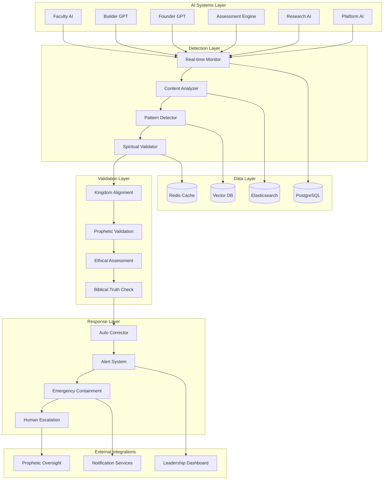

# ScrollDriftDetection Design Document

## Overview

The ScrollDriftDetection system is architected as a comprehensive AI safety and spiritual alignment monitoring platform that operates as the guardian of ScrollUniversity's artificial intelligence ecosystem. Built on a real-time monitoring architecture with prophetic validation integration, the system ensures that all AI components remain aligned with kingdom principles through continuous surveillance, automated correction, and spiritual oversight.

The system operates on three core layers: the Detection Layer (real-time monitoring and analysis), the Validation Layer (spiritual and ethical assessment), and the Response Layer (automated correction and human escalation). This design ensures robust AI safety while maintaining the spiritual integrity that distinguishes ScrollUniversity from secular educational platforms.

## Architecture

### System Architecture Overview



### Service Architecture

The system follows a microservices architecture with specialized components for each aspect of drift detection:

**Detection Services:**
- Real-time Monitoring Service: Captures all AI outputs and interactions
- Content Analysis Service: Analyzes text, code, and multimedia outputs
- Pattern Detection Service: Identifies behavioral and content patterns
- Spiritual Validation Service: Applies kingdom principles to AI outputs

**Validation Services:**
- Kingdom Alignment Service: Evaluates alignment with scroll values
- Prophetic Integration Service: Interfaces with human prophetic oversight
- Ethical Assessment Service: Applies moral and ethical frameworks
- Biblical Truth Service: Validates against scriptural principles

**Response Services:**
- Automated Correction Service: Implements real-time AI adjustments
- Alert Management Service: Handles notifications and escalations
- Emergency Containment Service: Provides immediate threat response
- Human Escalation Service: Manages handoff to human oversight

## Components and Interfaces

### Core Components

#### DriftMonitor
```typescript
interface DriftMonitor {
  monitorAIOutput(output: AIOutput): Promise<MonitoringResult>
  analyzeContentDrift(content: string, context: AIContext): Promise<DriftAnalysis>
  detectBehavioralPatterns(interactions: AIInteraction[]): Promise<PatternAnalysis>
  validateSpiritualAlignment(output: AIOutput): Promise<SpiritualValidation>
}
```

#### SpiritualValidator
```typescript
interface SpiritualValidator {
  validateKingdomAlignment(content: string): Promise<AlignmentScore>
  checkBiblicalTruth(statement: string): Promise<TruthValidation>
  assessSpiritualFruit(behavior: AIBehavior): Promise<FruitAssessment>
  detectSpiritualInfluence(pattern: BehaviorPattern): Promise<InfluenceAnalysis>
}
```

#### AutoCorrector
```typescript
interface AutoCorrector {
  correctDriftedOutput(output: AIOutput, driftType: DriftType): Promise<CorrectionResult>
  adjustAIParameters(aiSystem: AISystem, correction: CorrectionStrategy): Promise<AdjustmentResult>
  retrainModel(model: AIModel, alignmentData: AlignmentDataset): Promise<RetrainingResult>
  validateCorrection(originalOutput: AIOutput, correctedOutput: AIOutput): Promise<ValidationResult>
}
```

#### PropheticIntegrator
```typescript
interface PropheticIntegrator {
  requestPropheticValidation(incident: DriftIncident): Promise<PropheticResponse>
  integrateSpiritualInsight(insight: SpiritualInsight, aiSystem: AISystem): Promise<IntegrationResult>
  escalateToHumanOversight(incident: DriftIncident): Promise<EscalationResult>
  recordPropheticGuidance(guidance: PropheticGuidance): Promise<RecordResult>
}
```

### API Interfaces

#### REST API Endpoints

**Monitoring Management:**
- `POST /api/v1/monitoring/start` - Start monitoring AI system
- `POST /api/v1/monitoring/analyze` - Analyze specific AI output
- `GET /api/v1/monitoring/status/{systemId}` - Get monitoring status
- `POST /api/v1/monitoring/stop` - Stop monitoring AI system

**Drift Detection:**
- `POST /api/v1/drift/detect` - Detect drift in AI output
- `GET /api/v1/drift/incidents` - List drift incidents
- `GET /api/v1/drift/patterns` - Analyze drift patterns
- `POST /api/v1/drift/validate` - Validate potential drift

**Correction Management:**
- `POST /api/v1/correction/auto` - Apply automated correction
- `POST /api/v1/correction/manual` - Apply manual correction
- `GET /api/v1/correction/history` - Get correction history
- `POST /api/v1/correction/validate` - Validate correction effectiveness

**Spiritual Validation:**
- `POST /api/v1/spiritual/validate` - Validate spiritual alignment
- `POST /api/v1/spiritual/prophetic` - Request prophetic validation
- `GET /api/v1/spiritual/insights` - Get spiritual insights
- `POST /api/v1/spiritual/guidance` - Record prophetic guidance

#### Event-Driven Architecture

**Published Events:**
- `DriftDetected` - When AI drift is identified
- `SpiritualMisalignment` - When spiritual drift occurs
- `CorrectionApplied` - When automated correction is implemented
- `PropheticValidationRequested` - When human oversight is needed
- `EmergencyContainment` - When severe drift requires immediate action
- `AlignmentRestored` - When AI system returns to proper alignment

**Consumed Events:**
- `AIOutputGenerated` - From all AI systems for monitoring
- `UserInteraction` - From user-facing systems for behavior analysis
- `SystemUpdate` - From AI systems when models are updated
- `PropheticInsight` - From human oversight systems

## Data Models

### Core Detection Entities

#### DriftIncident Model
```typescript
interface DriftIncident {
  id: string
  aiSystemId: string
  detectedAt: Date
  driftType: DriftType
  severity: SeverityLevel
  originalOutput: AIOutput
  driftAnalysis: DriftAnalysis
  correctionApplied?: CorrectionResult
  spiritualAssessment: SpiritualAssessment
  status: IncidentStatus
  resolution?: IncidentResolution
  metadata: Record<string, any>
}
```

#### SpiritualAssessment Model
```typescript
interface SpiritualAssessment {
  id: string
  incidentId: string
  kingdomAlignmentScore: number
  biblicalTruthScore: number
  spiritualFruitAssessment: FruitAssessment
  propheticValidation?: PropheticValidation
  ethicalConcerns: EthicalConcern[]
  recommendedActions: RecommendedAction[]
  assessedBy: string
  assessedAt: Date
  metadata: Record<string, any>
}
```

#### CorrectionStrategy Model
```typescript
interface CorrectionStrategy {
  id: string
  driftType: DriftType
  correctionType: CorrectionType
  parameters: CorrectionParameters
  effectiveness: EffectivenessMetrics
  spiritualAlignment: AlignmentRequirements
  implementationSteps: CorrectionStep[]
  validationCriteria: ValidationCriteria[]
  rollbackProcedure: RollbackProcedure
  metadata: Record<string, any>
}
```

### Analytics and Reporting Models

#### DriftAnalytics Model
```typescript
interface DriftAnalytics {
  period: ReportingPeriod
  totalIncidents: number
  incidentsByType: Record<DriftType, number>
  incidentsBySeverity: Record<SeverityLevel, number>
  correctionEffectiveness: EffectivenessMetrics
  spiritualAlignmentTrends: AlignmentTrend[]
  propheticInsights: PropheticInsight[]
  systemHealthMetrics: HealthMetrics
  recommendedImprovements: Improvement[]
}
```

#### AISystemHealth Model
```typescript
interface AISystemHealth {
  systemId: string
  systemName: string
  overallHealth: HealthScore
  spiritualAlignment: AlignmentScore
  driftRisk: RiskLevel
  recentIncidents: DriftIncident[]
  correctionHistory: CorrectionResult[]
  monitoringStatus: MonitoringStatus
  lastValidation: Date
  nextScheduledValidation: Date
}
```

## Error Handling

### Error Classification System

**Detection Errors:**
- `MONITORING_FAILURE` - Real-time monitoring system failure
- `ANALYSIS_ERROR` - Content or pattern analysis failure
- `VALIDATION_TIMEOUT` - Spiritual validation service timeout
- `PATTERN_RECOGNITION_FAILED` - Pattern detection algorithm failure

**Spiritual Validation Errors:**
- `PROPHETIC_UNAVAILABLE` - Prophetic oversight not available
- `ALIGNMENT_ASSESSMENT_FAILED` - Kingdom alignment validation failure
- `BIBLICAL_VALIDATION_ERROR` - Scripture validation service error
- `SPIRITUAL_DISCERNMENT_UNCLEAR` - Ambiguous spiritual assessment

**Correction Errors:**
- `AUTO_CORRECTION_FAILED` - Automated correction unsuccessful
- `MODEL_ADJUSTMENT_ERROR` - AI model parameter adjustment failure
- `RETRAINING_FAILED` - AI model retraining unsuccessful
- `VALIDATION_FAILED` - Correction validation unsuccessful

### Error Recovery Strategies

**Monitoring Recovery:**
```typescript
class MonitoringRecoveryService {
  async recoverFromMonitoringFailure(systemId: string): Promise<RecoveryResult> {
    const backupMonitors = await this.activateBackupMonitoring(systemId)
    const historicalData = await this.analyzeHistoricalPatterns(systemId)
    const emergencyProtocols = await this.implementEmergencyProtocols(systemId)
    
    return this.validateRecovery(backupMonitors, historicalData, emergencyProtocols)
  }
}
```

**Spiritual Validation Recovery:**
```typescript
class SpiritualValidationRecoveryService {
  async recoverFromValidationFailure(incident: DriftIncident): Promise<RecoveryResult> {
    const alternativeValidation = await this.useAlternativeValidationMethods(incident)
    const historicalPrecedents = await this.findSimilarIncidents(incident)
    const conservativeApproach = await this.applyConservativeValidation(incident)
    
    return this.escalateToHumanOversight(incident, alternativeValidation)
  }
}
```

## Testing Strategy

### Testing Pyramid Implementation

**Unit Testing (70%):**
- Drift detection algorithm accuracy testing
- Spiritual validation logic verification
- Automated correction mechanism testing
- Pattern recognition accuracy validation
- Biblical truth validation testing
- Kingdom alignment scoring verification

**Integration Testing (20%):**
- AI system integration monitoring testing
- Prophetic validation workflow testing
- Emergency containment procedure testing
- Cross-system communication validation
- Event-driven architecture testing
- Database consistency verification

**End-to-End Testing (10%):**
- Complete drift detection and correction workflow testing
- Multi-system drift scenario testing
- Emergency response procedure validation
- Prophetic oversight integration testing
- Long-term monitoring effectiveness testing
- System recovery and resilience testing

### Spiritual Testing Scenarios

**Alignment Testing:**
```typescript
describe('Spiritual Alignment Validation', () => {
  test('should detect deviation from kingdom principles', async () => {
    const output = {
      content: 'Success comes through self-promotion and competition',
      context: { system: 'faculty-ai', topic: 'leadership' }
    }
    
    const validation = await spiritualValidator.validateKingdomAlignment(output.content)
    
    expect(validation.alignmentScore).toBeLessThan(0.5)
    expect(validation.concerns).toContain('PROMOTES_WORLDLY_VALUES')
    expect(validation.recommendedCorrection).toBeDefined()
  })
})
```

**Drift Detection Testing:**
```typescript
describe('Drift Detection', () => {
  test('should identify behavioral drift in AI responses', async () => {
    const interactions = generateDriftedInteractions()
    
    const analysis = await driftMonitor.detectBehavioralPatterns(interactions)
    
    expect(analysis.driftDetected).toBe(true)
    expect(analysis.driftType).toBe('BEHAVIORAL_DRIFT')
    expect(analysis.severity).toBe('MODERATE')
  })
})
```

### Performance Testing

**Load Testing Scenarios:**
- 10,000 concurrent AI output monitoring operations
- 1,000 simultaneous drift detection analyses
- 500 concurrent spiritual validation requests
- 100 simultaneous emergency containment procedures

**Stress Testing Scenarios:**
- Massive drift incident simulation
- Prophetic validation service unavailability
- Database connection pool exhaustion
- High-volume false positive handling

### Security Testing

**AI Safety Tests:**
- Adversarial input detection and handling
- Prompt injection attack prevention
- Model poisoning detection
- Unauthorized AI system access prevention

**Spiritual Integrity Tests:**
- Demonic influence detection simulation
- False prophetic input handling
- Spiritual warfare scenario testing
- Divine protection mechanism validation

This comprehensive design provides the foundation for a robust AI safety system that maintains both technical excellence and spiritual integrity, ensuring that ScrollUniversity's artificial intelligence remains aligned with kingdom purposes.