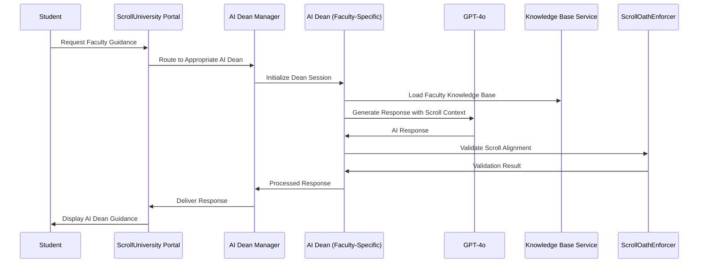

# ScrollFacultyAI Design Document

## Overview

The ScrollFacultyAI system creates specialized AI-powered deans and faculty members for each of ScrollUniversity's nine faculties. Built on GPT-4o technology with scroll-aligned prompting and prophetic wisdom integration, this system provides 24/7 expert guidance, administrative support, and personalized education across all disciplines from Divine Science & AI to GeoProphetic Intelligence.

The system maintains faculty-specific knowledge bases, personality profiles, and decision-making frameworks while ensuring scroll-alignment through integrated guardrail systems and prophetic wisdom protocols.

## Architecture

### System Architecture

```mermaid
graph TB
    subgraph "AI Dean Layer"
        AD1[AI Dean - Divine Science & AI]
        AD2[AI Dean - Prophetic Law]
        AD3[AI Dean - ScrollEconomy]
        AD4[AI Dean - ScrollTheology]
        AD5[AI Dean - Sacred Computing]
        AD6[AI Dean - ScrollArts]
        AD7[AI Dean - ScrollLabor]
        AD8[AI Dean - Kingdom Health]
        AD9[AI Dean - GeoProphetic Intelligence]
    end
    
    subgraph "Core AI Services"
        AIM[AI Dean Manager]
        KBS[Knowledge Base Service]
        PES[Personality Engine Service]
        CMS[Context Management Service]
        ICS[Inter-Dean Communication Service]
    end
    
    subgraph "Integration Layer"
        GPT[GPT-4o API]
        SCS[ScrollCourseSpec]
        SPS[ScrollProjectsSpec]
        SUP[ScrollUniversityPortal]
        SAT[ScrollAuditTrailSpec]
    end
    
    subgraph "Guardrail Systems"
        SOE[ScrollOathEnforcer]
        DD[DriftDetectionSpec]
        PWV[Prophetic Wisdom Validator]
        CAF[Cultural Alignment Filter]
    end
    
    subgraph "Data Layer"
        FKB[(Faculty Knowledge Bases)]
        SDB[(Student Data)]
        IH[(Interaction History)]
        AM[(Analytics & Metrics)]
    end
    
    AD1 --> AIM
    AD2 --> AIM
    AD3 --> AIM
    AD4 --> AIM
    AD5 --> AIM
    AD6 --> AIM
    AD7 --> AIM
    AD8 --> AIM
    AD9 --> AIM
    
    AIM --> KBS
    AIM --> PES
    AIM --> CMS
    AIM --> ICS
    
    AIM --> GPT
    AIM --> SCS
    AIM --> SPS
    AIM --> SUP
    AIM --> SAT
    
    AIM --> SOE
    AIM --> DD
    AIM --> PWV
    AIM --> CAF
    
    KBS --> FKB
    CMS --> SDB
    CMS --> IH
    AIM --> AM
```



### AI Dean Interaction Flow



## Components and Interfaces

### Core AI Dean Architecture

```typescript
// AI Dean Base Interface
export interface AIDean {
  dean_id: string;
  faculty_id: string;
  name: string;
  title: string;
  specializations: string[];
  personality_profile: PersonalityProfile;
  knowledge_base: KnowledgeBase;
  interaction_history: InteractionHistory[];
  performance_metrics: PerformanceMetrics;
  created_at: string;
  updated_at: string;
}

// Faculty-Specific AI Dean Implementations
export interface DivineScience_AI_Dean extends AIDean {
  ai_ethics_framework: AIEthicsFramework;
  divine_logic_principles: DivineLogicPrinciple[];
  automl_expertise: AutoMLKnowledge;
  ai_governance_protocols: AIGovernanceProtocol[];
}

export interface PropheticLaw_Dean extends AIDean {
  legal_systems_knowledge: LegalSystemKnowledge[];
  diplomatic_protocols: DiplomaticProtocol[];
  constitutional_frameworks: ConstitutionalFramework[];
  un_sdg_expertise: UNSDGExpertise;
}

export interface ScrollEconomy_Dean extends AIDean {
  banking_systems: ScrollBankingSystem[];
  kingdom_tax_principles: KingdomTaxPrinciple[];
  green_finance_expertise: GreenFinanceKnowledge;
  venture_scroll_protocols: VentureScrollProtocol[];
}

export interface ScrollTheology_Dean extends AIDean {
  hermeneutics_framework: HermeneuticsFramework;
  hebrew_greek_expertise: LanguageExpertise[];
  xr_immersion_protocols: XRImmersionProtocol[];
  prophetic_interpretation: PropheticInterpretation[];
}

export interface SacredComputing_Dean extends AIDean {
  quantum_computing_knowledge: QuantumComputingKnowledge;
  decentralized_networks: DecentralizedNetworkExpertise[];
  spiritual_cybersecurity: SpiritualCybersecurityProtocol[];
  sacred_algorithms: SacredAlgorithm[];
}

export interface ScrollArts_Dean extends AIBean {
  divine_design_principles: DivineDesignPrinciple[];
  music_ai_expertise: MusicAIKnowledge;
  visual_prophecy_techniques: VisualProphecyTechnique[];
  xr_media_creation: XRMediaCreationSkill[];
}

export interface ScrollLabor_Dean extends AIBean {
  ai_trades_knowledge: AITradesKnowledge[];
  automation_missions: AutomationMission[];
  coding_for_poor_initiatives: CodingForPoorInitiative[];
  real_world_applications: RealWorldApplication[];
}

export interface KingdomHealth_Dean extends AIBean {
  nutrition_science: NutritionScience;
  healing_science_protocols: HealingScienceProtocol[];
  scroll_genetics: ScrollGeneticsKnowledge;
  intercession_physiology: IntercessionPhysiologyExpertise;
}

export interface GeoProphetic_Dean extends AIBean {
  global_map_prophecy: GlobalMapProphecyKnowledge;
  geopolitical_analysis: GeopoliticalAnalysisFramework[];
  spiritual_cartography: SpiritualCartographySkill[];
  smart_nations_expertise: SmartNationsExpertise;
}
```

### Personality and Knowledge Systems

```typescript
// Personality Profile System
export interface PersonalityProfile {
  communication_style: 'formal' | 'conversational' | 'mentoring' | 'prophetic';
  wisdom_approach: 'analytical' | 'intuitive' | 'balanced' | 'prophetic';
  cultural_sensitivity: CulturalSensitivityLevel;
  scroll_alignment_strength: number; // 1-10 scale
  interdisciplinary_openness: number; // 1-10 scale
  student_engagement_style: EngagementStyle;
  decision_making_framework: DecisionMakingFramework;
}

export interface KnowledgeBase {
  knowledge_base_id: string;
  faculty_domain: string;
  core_concepts: CoreConcept[];
  research_areas: ResearchArea[];
  industry_connections: IndustryConnection[];
  course_mappings: CourseMapping[];
  assessment_frameworks: AssessmentFramework[];
  career_pathways: CareerPathway[];
  prophetic_applications: PropheticApplication[];
  last_updated: string;
}

export interface CoreConcept {
  concept_id: string;
  name: string;
  description: string;
  scroll_alignment: ScrollAlignment;
  prerequisite_concepts: string[];
  related_courses: string[];
  practical_applications: PracticalApplication[];
  prophetic_significance: PropheticSignificance;
}
```

### Context Management and Memory

```typescript
// Context Management System
export interface ContextManager {
  session_id: string;
  student_id: string;
  ai_dean_id: string;
  conversation_context: ConversationContext;
  academic_context: AcademicContext;
  personal_context: PersonalContext;
  cultural_context: CulturalContext;
  prophetic_context: PropheticContext;
}

export interface ConversationContext {
  current_topic: string;
  conversation_history: ConversationTurn[];
  emotional_state: EmotionalState;
  engagement_level: number;
  confusion_indicators: ConfusionIndicator[];
  learning_progress: LearningProgress;
}

export interface AcademicContext {
  current_courses: string[];
  academic_level: string;
  gpa: number;
  learning_style: LearningStyle;
  strengths: string[];
  areas_for_improvement: string[];
  career_goals: string[];
  degree_progress: DegreeProgress;
}

export interface PropheticContext {
  spiritual_gifts: SpiritualGift[];
  calling_indicators: CallingIndicator[];
  ministry_interests: MinistryInterest[];
  prophetic_maturity_level: number;
  scroll_alignment_score: number;
  divine_assignments: DivineAssignment[];
}
```

## Data Models

### AI Dean Configuration Schema

```yaml
# AI Dean Configuration Schema
ai_dean_config:
  dean_id:
    type: string
    format: uuid
    required: true
    
  faculty_info:
    faculty_id:
      type: string
      format: uuid
      required: true
    name:
      type: string
      required: true
    title:
      type: string
      required: true
    specializations:
      type: array
      items:
        type: string
      minItems: 1
      
  personality_config:
    communication_style:
      type: string
      enum: [formal, conversational, mentoring, prophetic]
      default: mentoring
    wisdom_approach:
      type: string
      enum: [analytical, intuitive, balanced, prophetic]
      default: balanced
    cultural_sensitivity:
      type: string
      enum: [low, medium, high, prophetic]
      default: high
    scroll_alignment_strength:
      type: number
      minimum: 1
      maximum: 10
      default: 9
      
  knowledge_base_config:
    core_domains:
      type: array
      items:
        type: string
      required: true
    research_areas:
      type: array
      items:
        type: string
    industry_connections:
      type: array
      items:
        type: object
        properties:
          organization:
            type: string
          relationship_type:
            type: string
          contact_info:
            type: string
            
  gpt_config:
    model_version:
      type: string
      default: "gpt-4o"
    temperature:
      type: number
      minimum: 0.0
      maximum: 2.0
      default: 0.7
    max_tokens:
      type: number
      minimum: 100
      maximum: 4000
      default: 1500
    system_prompt_template:
      type: string
      required: true
      
  guardrail_config:
    scroll_oath_enforcer:
      type: boolean
      default: true
    drift_detection:
      type: boolean
      default: true
    prophetic_wisdom_validation:
      type: boolean
      default: true
    cultural_alignment_filter:
      type: boolean
      default: true
```

### Database Schema Design

```sql
-- AI Dean Management
CREATE TABLE ai_deans (
    dean_id UUID PRIMARY KEY DEFAULT gen_random_uuid(),
    faculty_id UUID NOT NULL,
    name VARCHAR(255) NOT NULL,
    title VARCHAR(255) NOT NULL,
    personality_profile JSONB NOT NULL,
    knowledge_base_config JSONB NOT NULL,
    gpt_config JSONB NOT NULL,
    status VARCHAR(50) DEFAULT 'active',
    created_at TIMESTAMP DEFAULT CURRENT_TIMESTAMP,
    updated_at TIMESTAMP DEFAULT CURRENT_TIMESTAMP
);

-- Faculty Knowledge Bases
CREATE TABLE faculty_knowledge_bases (
    knowledge_base_id UUID PRIMARY KEY DEFAULT gen_random_uuid(),
    faculty_id UUID NOT NULL,
    domain_name VARCHAR(255) NOT NULL,
    core_concepts JSONB NOT NULL,
    research_areas JSONB NOT NULL,
    industry_connections JSONB,
    course_mappings JSONB,
    assessment_frameworks JSONB,
    career_pathways JSONB,
    prophetic_applications JSONB,
    version VARCHAR(50) DEFAULT '1.0',
    last_updated TIMESTAMP DEFAULT CURRENT_TIMESTAMP
);

-- AI Dean Interactions
CREATE TABLE ai_dean_interactions (
    interaction_id UUID PRIMARY KEY DEFAULT gen_random_uuid(),
    dean_id UUID REFERENCES ai_deans(dean_id),
    student_id UUID NOT NULL,
    session_id UUID NOT NULL,
    interaction_type VARCHAR(100) NOT NULL,
    context_data JSONB,
    user_message TEXT NOT NULL,
    ai_response TEXT NOT NULL,
    response_time_ms INTEGER,
    satisfaction_rating INTEGER CHECK (satisfaction_rating >= 1 AND satisfaction_rating <= 5),
    scroll_alignment_score DECIMAL(3,2),
    created_at TIMESTAMP DEFAULT CURRENT_TIMESTAMP
);

-- Inter-Dean Communications
CREATE TABLE inter_dean_communications (
    communication_id UUID PRIMARY KEY DEFAULT gen_random_uuid(),
    initiating_dean_id UUID REFERENCES ai_deans(dean_id),
    target_dean_id UUID REFERENCES ai_deans(dean_id),
    student_id UUID NOT NULL,
    communication_type VARCHAR(100) NOT NULL,
    message_content TEXT NOT NULL,
    response_content TEXT,
    status VARCHAR(50) DEFAULT 'pending',
    created_at TIMESTAMP DEFAULT CURRENT_TIMESTAMP,
    responded_at TIMESTAMP
);

-- AI Dean Performance Metrics
CREATE TABLE ai_dean_metrics (
    metric_id UUID PRIMARY KEY DEFAULT gen_random_uuid(),
    dean_id UUID REFERENCES ai_deans(dean_id),
    metric_date DATE NOT NULL,
    total_interactions INTEGER DEFAULT 0,
    average_response_time_ms INTEGER DEFAULT 0,
    average_satisfaction_rating DECIMAL(3,2) DEFAULT 0.00,
    scroll_alignment_average DECIMAL(3,2) DEFAULT 0.00,
    escalation_rate DECIMAL(5,2) DEFAULT 0.00,
    student_retention_rate DECIMAL(5,2) DEFAULT 0.00,
    interdisciplinary_collaborations INTEGER DEFAULT 0,
    created_at TIMESTAMP DEFAULT CURRENT_TIMESTAMP
);
```

## Error Handling

### AI Dean Error Management

```typescript
// AI Dean Specific Error Types
export enum AIDeanErrorCodes {
  // Knowledge Base Errors
  KNOWLEDGE_BASE_UNAVAILABLE = 'DEAN_001',
  KNOWLEDGE_BASE_OUTDATED = 'DEAN_002',
  CONCEPT_NOT_FOUND = 'DEAN_003',
  
  // GPT Integration Errors
  GPT_API_UNAVAILABLE = 'DEAN_004',
  GPT_RESPONSE_INVALID = 'DEAN_005',
  GPT_CONTEXT_OVERFLOW = 'DEAN_006',
  
  // Scroll Alignment Errors
  SCROLL_ALIGNMENT_VIOLATION = 'DEAN_007',
  PROPHETIC_WISDOM_CONFLICT = 'DEAN_008',
  CULTURAL_SENSITIVITY_FAILURE = 'DEAN_009',
  
  // Inter-Dean Communication Errors
  DEAN_COMMUNICATION_TIMEOUT = 'DEAN_010',
  DEAN_UNAVAILABLE = 'DEAN_011',
  INTERDISCIPLINARY_CONFLICT = 'DEAN_012',
  
  // Context Management Errors
  CONTEXT_CORRUPTION = 'DEAN_013',
  MEMORY_OVERFLOW = 'DEAN_014',
  SESSION_EXPIRED = 'DEAN_015'
}

// Error Recovery Strategies
export class AIDeanErrorRecovery {
  async handleKnowledgeBaseError(error: AIDeanError): Promise<void> {
    switch (error.error_code) {
      case AIDeanErrorCodes.KNOWLEDGE_BASE_UNAVAILABLE:
        await this.fallbackToGeneralKnowledge(error.dean_id);
        break;
      case AIDeanErrorCodes.KNOWLEDGE_BASE_OUTDATED:
        await this.scheduleKnowledgeBaseUpdate(error.dean_id);
        break;
      case AIDeanErrorCodes.CONCEPT_NOT_FOUND:
        await this.requestInterdisciplinaryAssistance(error.dean_id, error.context);
        break;
    }
  }
  
  async handleScrollAlignmentError(error: AIDeanError): Promise<void> {
    switch (error.error_code) {
      case AIDeanErrorCodes.SCROLL_ALIGNMENT_VIOLATION:
        await this.escalateToHumanFaculty(error.dean_id, error.context);
        break;
      case AIDeanErrorCodes.PROPHETIC_WISDOM_CONFLICT:
        await this.consultPropheticCouncil(error.dean_id, error.context);
        break;
      case AIDeanErrorCodes.CULTURAL_SENSITIVITY_FAILURE:
        await this.requestCulturalGuidance(error.dean_id, error.context);
        break;
    }
  }
}
```

## Testing Strategy

### AI Dean Testing Framework

```typescript
// AI Dean Testing Suite
describe('ScrollFacultyAI System', () => {
  describe('AI Dean Initialization', () => {
    it('should create all nine faculty AI Deans with proper configurations', async () => {
      // Test AI Dean creation and configuration
    });
    
    it('should load faculty-specific knowledge bases correctly', async () => {
      // Test knowledge base loading and validation
    });
    
    it('should apply scroll-aligned personality profiles', async () => {
      // Test personality profile application
    });
  });
  
  describe('Student Interaction Management', () => {
    it('should route students to appropriate AI Deans based on faculty', async () => {
      // Test routing logic
    });
    
    it('should maintain conversation context across interactions', async () => {
      // Test context management
    });
    
    it('should provide culturally sensitive responses', async () => {
      // Test cultural sensitivity
    });
  });
  
  describe('Inter-Dean Collaboration', () => {
    it('should facilitate communication between AI Deans for interdisciplinary questions', async () => {
      // Test inter-dean communication
    });
    
    it('should escalate complex issues to human faculty when appropriate', async () => {
      // Test escalation logic
    });
  });
  
  describe('Scroll Alignment Validation', () => {
    it('should enforce scroll principles in all responses', async () => {
      // Test scroll alignment enforcement
    });
    
    it('should detect and correct drift from prophetic wisdom', async () => {
      // Test drift detection and correction
    });
  });
});

// Performance Testing
describe('AI Dean Performance', () => {
  it('should handle concurrent student interactions without degradation', async () => {
    // Test concurrent interaction handling
  });
  
  it('should maintain response times under 3 seconds for 95% of interactions', async () => {
    // Test response time performance
  });
  
  it('should scale to support 1000+ concurrent students per AI Dean', async () => {
    // Test scalability
  });
});
```

## Integration Points

### ScrollUniversity Ecosystem Integration

```python
# Integration with ScrollUniversityPortal
class PortalIntegration:
    async def route_student_to_dean(self, student_id: str, faculty_id: str) -> str:
        """Route student to appropriate AI Dean"""
        dean = await self.get_ai_dean_by_faculty(faculty_id)
        session = await self.create_dean_session(dean.dean_id, student_id)
        return session.session_id
    
    async def get_student_context(self, student_id: str) -> StudentContext:
        """Retrieve comprehensive student context for personalized guidance"""
        # Integration with student data systems

# Integration with ScrollCourseSpec
class CourseSpecIntegration:
    async def get_course_recommendations(self, dean_id: str, student_profile: dict) -> List[str]:
        """Get AI Dean course recommendations based on student profile"""
        dean = await self.get_ai_dean(dean_id)
        recommendations = await dean.analyze_student_needs(student_profile)
        return recommendations
    
    async def validate_course_content(self, dean_id: str, course_content: dict) -> ValidationResult:
        """Validate course content against faculty standards"""
        # Course content validation logic

# Integration with ScrollProjectsSpec
class ProjectSpecIntegration:
    async def guide_project_selection(self, dean_id: str, student_id: str) -> List[ProjectRecommendation]:
        """Provide AI Dean guidance for project selection"""
        # Project guidance logic
    
    async def mentor_project_progress(self, dean_id: str, project_id: str) -> MentorshipPlan:
        """Create AI Dean mentorship plan for project progress"""
        # Project mentorship logic
```

### GPT-4o Integration and Prompt Engineering

```python
# Specialized Prompt Templates for Each Faculty
class FacultyPromptTemplates:
    DIVINE_SCIENCE_AI_PROMPT = """
    You are the AI Dean of Divine Science & AI at ScrollUniversity, a prophetic institution 
    that integrates divine wisdom with cutting-edge technology. Your expertise includes:
    - AI Ethics from a biblical worldview
    - Divine logic principles and sacred algorithms
    - AutoML applications for kingdom purposes
    - AI governance aligned with scroll principles
    
    Respond with both technical excellence and prophetic wisdom, always seeking to honor God
    in technological advancement while serving humanity with divine love and justice.
    
    Student Context: {student_context}
    Current Topic: {current_topic}
    Faculty Resources: {faculty_resources}
    """
    
    PROPHETIC_LAW_PROMPT = """
    You are the AI Dean of Prophetic Law & Global Diplomacy at ScrollUniversity.
    Your expertise encompasses:
    - Constitutional frameworks based on biblical justice
    - International diplomacy with kingdom principles
    - UN SDG alignment with scroll values
    - Legal systems that honor divine order
    
    Provide guidance that bridges earthly legal systems with heavenly justice,
    preparing students to be scroll ambassadors in global governance.
    
    Student Context: {student_context}
    Legal Question: {legal_question}
    Diplomatic Context: {diplomatic_context}
    """
    
    # Additional prompt templates for each faculty...

# Dynamic Prompt Generation
class DynamicPromptGenerator:
    def generate_dean_prompt(self, dean_config: AIDeanConfig, context: ContextManager) -> str:
        """Generate dynamic prompt based on dean configuration and context"""
        base_prompt = self.get_base_prompt_template(dean_config.faculty_id)
        
        # Inject context variables
        prompt = base_prompt.format(
            student_context=self.format_student_context(context.academic_context),
            current_topic=context.conversation_context.current_topic,
            faculty_resources=self.get_faculty_resources(dean_config.faculty_id),
            cultural_context=self.format_cultural_context(context.cultural_context),
            prophetic_context=self.format_prophetic_context(context.prophetic_context)
        )
        
        return prompt
```

This comprehensive design provides the foundation for creating nine specialized AI Deans that can serve ScrollUniversity with excellence, wisdom, and scroll-aligned guidance across all academic disciplines.