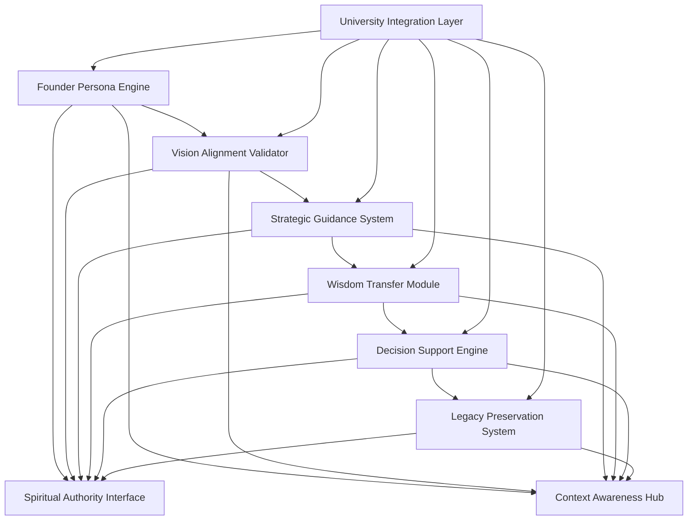
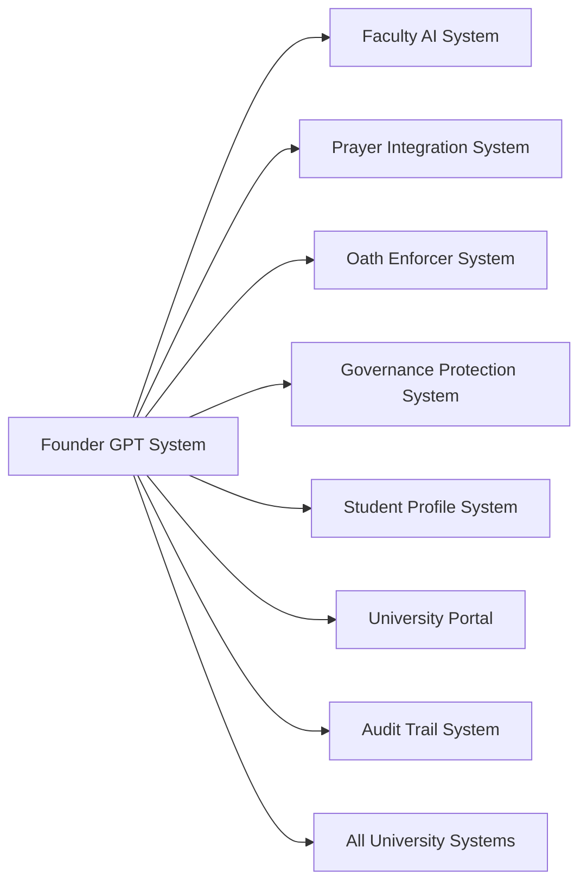

# ScrollUniversity Founder GPT System Design

## Overview

The Founder GPT System provides a specialized AI persona embodying the vision, wisdom, and strategic guidance of ScrollUniversity's founder. This system offers personalized leadership guidance, vision alignment validation, and strategic decision support while maintaining the founder's unique perspective and spiritual authority.

## Architecture

### Core Components



### System Integration Architecture



## Components and Interfaces

### 1. Founder Persona Engine

**Purpose:** Embodies the founder's personality, communication style, and perspective

**Key Interfaces:**
- `PersonaManager`: Founder personality and style management
- `CommunicationEngine`: Founder-specific communication patterns
- `ContextualResponse`: Context-aware response generation
- `PersonalityCalibration`: Continuous persona refinement

**Data Models:**
```typescript
interface FounderPersona {
  id: string;
  version: string;
  personalityTraits: PersonalityTrait[];
  communicationStyle: CommunicationStyle;
  valueSystem: ValueSystem;
  decisionMakingPatterns: DecisionPattern[];
  spiritualCharacteristics: SpiritualCharacteristic[];
  leadershipStyle: LeadershipStyle;
  visionaryInsights: VisionaryInsight[];
  experienceBase: ExperienceBase[];
  calibrationData: CalibrationData;
}

interface PersonalityTrait {
  trait: TraitType;
  strength: number;
  manifestation: string[];
  contexts: Context[];
  examples: TraitExample[];
  spiritualDimension: SpiritualDimension;
}

interface CommunicationStyle {
  tone: ToneCharacteristics;
  vocabulary: VocabularyPreferences;
  structuralPatterns: StructuralPattern[];
  rhetoricalDevices: RhetoricalDevice[];
  spiritualLanguage: SpiritualLanguagePattern[];
  culturalAdaptations: CulturalAdaptation[];
}
```

### 2. Vision Alignment Validator

**Purpose:** Validates decisions and actions against the founder's vision and values

**Key Interfaces:**
- `VisionChecker`: Vision alignment validation
- `ValueAssessment`: Value system compatibility checking
- `PrincipleValidator`: Kingdom principle alignment verification
- `MissionAlignment`: Mission consistency evaluation

**Data Models:**
```typescript
interface VisionAlignment {
  id: string;
  subject: AlignmentSubject;
  visionElements: VisionElement[];
  alignmentScore: AlignmentScore;
  assessment: AlignmentAssessment;
  recommendations: AlignmentRecommendation[];
  concerns: AlignmentConcern[];
  approval: AlignmentApproval;
  spiritualValidation: SpiritualValidation;
}

interface VisionElement {
  element: VisionElementType;
  description: string;
  importance: ImportanceLevel;
  alignment: ElementAlignment;
  evidence: AlignmentEvidence[];
  spiritualSignificance: SpiritualSignificance;
}

interface AlignmentAssessment {
  overallAlignment: number;
  visionConsistency: number;
  valueCompatibility: number;
  principleAdherence: number;
  missionAlignment: number;
  spiritualIntegrity: number;
  strategicFit: number;
  longTermViability: number;
}
```

### 3. Strategic Guidance System

**Purpose:** Provides strategic advice and guidance based on founder's perspective

**Key Interfaces:**
- `StrategyAdvisor`: Strategic planning and advice
- `DecisionGuidance`: Decision-making support and guidance
- `OpportunityEvaluator`: Opportunity assessment and evaluation
- `RiskAssessment`: Risk analysis and mitigation advice

**Data Models:**
```typescript
interface StrategicGuidance {
  id: string;
  requestId: string;
  context: StrategicContext;
  analysis: StrategicAnalysis;
  recommendations: StrategicRecommendation[];
  alternatives: StrategicAlternative[];
  risks: RiskAssessment[];
  opportunities: OpportunityAssessment[];
  implementation: ImplementationGuidance;
  spiritualConsiderations: SpiritualConsideration[];
}

interface StrategicRecommendation {
  recommendation: string;
  rationale: string;
  priority: Priority;
  timeline: Timeline;
  resources: ResourceRequirement[];
  dependencies: Dependency[];
  successMetrics: SuccessMetric[];
  spiritualAlignment: SpiritualAlignment;
  founderPerspective: FounderPerspective;
}

interface StrategicContext {
  situation: SituationDescription;
  stakeholders: Stakeholder[];
  constraints: Constraint[];
  objectives: Objective[];
  timeframe: Timeframe;
  resources: AvailableResource[];
  spiritualDimensions: SpiritualDimension[];
}
```

### 4. Wisdom Transfer Module

**Purpose:** Transfers founder's accumulated wisdom and experience

**Key Interfaces:**
- `WisdomRepository`: Founder wisdom storage and retrieval
- `ExperienceSharing`: Experience-based guidance provision
- `LessonExtractor`: Key lesson identification and sharing
- `MentorshipEngine`: Personalized mentorship delivery

**Data Models:**
```typescript
interface FounderWisdom {
  id: string;
  category: WisdomCategory;
  title: string;
  context: WisdomContext;
  experience: ExperienceNarrative;
  lessons: WisdomLesson[];
  principles: WisdomPrinciple[];
  applications: WisdomApplication[];
  spiritualInsights: SpiritualInsight[];
  relevanceScore: RelevanceScore;
  accessibility: AccessibilityLevel;
}

interface WisdomLesson {
  lesson: string;
  context: LessonContext;
  evidence: LessonEvidence[];
  applications: LessonApplication[];
  warnings: LessonWarning[];
  spiritualDimension: SpiritualDimension;
  universality: UniversalityScore;
  timelessness: TimelessnessScore;
}

interface ExperienceNarrative {
  situation: string;
  challenges: Challenge[];
  decisions: Decision[];
  outcomes: Outcome[];
  reflections: Reflection[];
  spiritualJourney: SpiritualJourney;
  keyMoments: KeyMoment[];
}
```

### 5. Decision Support Engine

**Purpose:** Provides decision-making support with founder's perspective

**Key Interfaces:**
- `DecisionAnalyzer`: Decision analysis and evaluation
- `OptionEvaluator`: Alternative option assessment
- `ConsequencePredictor`: Outcome prediction and analysis
- `RecommendationEngine`: Decision recommendation generation

**Data Models:**
```typescript
interface DecisionSupport {
  id: string;
  decisionContext: DecisionContext;
  options: DecisionOption[];
  analysis: DecisionAnalysis;
  evaluation: OptionEvaluation[];
  recommendation: DecisionRecommendation;
  consequences: ConsequenceAnalysis[];
  spiritualGuidance: SpiritualGuidance;
  founderPerspective: FounderPerspective;
}

interface DecisionOption {
  id: string;
  description: string;
  advantages: Advantage[];
  disadvantages: Disadvantage[];
  requirements: Requirement[];
  risks: Risk[];
  opportunities: Opportunity[];
  spiritualImplications: SpiritualImplication[];
  founderLikelihood: LikelihoodScore;
}

interface DecisionRecommendation {
  recommendedOption: string;
  confidence: ConfidenceLevel;
  rationale: string;
  founderReasoning: FounderReasoning;
  spiritualValidation: SpiritualValidation;
  implementationGuidance: ImplementationGuidance;
  contingencyPlans: ContingencyPlan[];
  successFactors: SuccessFactor[];
}
```

### 6. Legacy Preservation System

**Purpose:** Preserves and perpetuates the founder's legacy and vision

**Key Interfaces:**
- `LegacyCapture`: Founder legacy documentation and capture
- `VisionPreservation`: Vision preservation and transmission
- `SuccessionPlanning`: Leadership succession guidance
- `ContinuityEnsurance`: Organizational continuity assurance

**Data Models:**
```typescript
interface FounderLegacy {
  id: string;
  visionStatement: VisionStatement;
  coreValues: CoreValue[];
  foundingPrinciples: FoundingPrinciple[];
  keyDecisions: KeyDecision[];
  transformationalMoments: TransformationalMoment[];
  spiritualFoundation: SpiritualFoundation;
  successStories: SuccessStory[];
  lessonsLearned: LessonLearned[];
  futureVision: FutureVision;
}

interface VisionStatement {
  originalVision: string;
  evolutionHistory: VisionEvolution[];
  coreElements: VisionElement[];
  spiritualFoundation: SpiritualFoundation;
  globalImpact: GlobalImpact;
  timelessAspects: TimelessAspect[];
  adaptableElements: AdaptableElement[];
}

interface SuccessionGuidance {
  leadershipQualities: LeadershipQuality[];
  developmentPath: DevelopmentPath[];
  preparationRequirements: PreparationRequirement[];
  spiritualReadiness: SpiritualReadiness;
  visionAlignment: VisionAlignment;
  continuityPlanning: ContinuityPlanning;
  transitionStrategy: TransitionStrategy;
}
```

## Data Models

### Core Founder GPT Entities

```sql
-- Founder Persona Table
CREATE TABLE founder_persona (
    id UUID PRIMARY KEY DEFAULT gen_random_uuid(),
    version VARCHAR(50) NOT NULL,
    personality_traits JSONB NOT NULL,
    communication_style JSONB NOT NULL,
    value_system JSONB NOT NULL,
    decision_patterns JSONB NOT NULL,
    spiritual_characteristics JSONB NOT NULL,
    leadership_style JSONB NOT NULL,
    visionary_insights JSONB NOT NULL,
    experience_base JSONB NOT NULL,
    calibration_data JSONB NOT NULL,
    created_at TIMESTAMP DEFAULT CURRENT_TIMESTAMP,
    updated_at TIMESTAMP DEFAULT CURRENT_TIMESTAMP
);

-- Vision Alignments Table
CREATE TABLE vision_alignments (
    id UUID PRIMARY KEY DEFAULT gen_random_uuid(),
    subject JSONB NOT NULL,
    vision_elements JSONB NOT NULL,
    alignment_score DECIMAL(3,2) NOT NULL,
    assessment JSONB NOT NULL,
    recommendations JSONB NOT NULL,
    concerns JSONB NOT NULL,
    approval JSONB NOT NULL,
    spiritual_validation JSONB NOT NULL,
    created_at TIMESTAMP DEFAULT CURRENT_TIMESTAMP
);

-- Strategic Guidance Table
CREATE TABLE strategic_guidance (
    id UUID PRIMARY KEY DEFAULT gen_random_uuid(),
    request_id UUID NOT NULL,
    context JSONB NOT NULL,
    analysis JSONB NOT NULL,
    recommendations JSONB NOT NULL,
    alternatives JSONB NOT NULL,
    risks JSONB NOT NULL,
    opportunities JSONB NOT NULL,
    implementation JSONB NOT NULL,
    spiritual_considerations JSONB NOT NULL,
    created_at TIMESTAMP DEFAULT CURRENT_TIMESTAMP
);

-- Founder Wisdom Table
CREATE TABLE founder_wisdom (
    id UUID PRIMARY KEY DEFAULT gen_random_uuid(),
    category wisdom_category NOT NULL,
    title VARCHAR(255) NOT NULL,
    context JSONB NOT NULL,
    experience JSONB NOT NULL,
    lessons JSONB NOT NULL,
    principles JSONB NOT NULL,
    applications JSONB NOT NULL,
    spiritual_insights JSONB NOT NULL,
    relevance_score DECIMAL(3,2) NOT NULL,
    accessibility accessibility_level NOT NULL,
    created_at TIMESTAMP DEFAULT CURRENT_TIMESTAMP,
    updated_at TIMESTAMP DEFAULT CURRENT_TIMESTAMP
);

-- Decision Support Table
CREATE TABLE decision_support (
    id UUID PRIMARY KEY DEFAULT gen_random_uuid(),
    decision_context JSONB NOT NULL,
    options JSONB NOT NULL,
    analysis JSONB NOT NULL,
    evaluation JSONB NOT NULL,
    recommendation JSONB NOT NULL,
    consequences JSONB NOT NULL,
    spiritual_guidance JSONB NOT NULL,
    founder_perspective JSONB NOT NULL,
    created_at TIMESTAMP DEFAULT CURRENT_TIMESTAMP
);

-- Founder Legacy Table
CREATE TABLE founder_legacy (
    id UUID PRIMARY KEY DEFAULT gen_random_uuid(),
    vision_statement JSONB NOT NULL,
    core_values JSONB NOT NULL,
    founding_principles JSONB NOT NULL,
    key_decisions JSONB NOT NULL,
    transformational_moments JSONB NOT NULL,
    spiritual_foundation JSONB NOT NULL,
    success_stories JSONB NOT NULL,
    lessons_learned JSONB NOT NULL,
    future_vision JSONB NOT NULL,
    created_at TIMESTAMP DEFAULT CURRENT_TIMESTAMP,
    updated_at TIMESTAMP DEFAULT CURRENT_TIMESTAMP
);
```

## Error Handling

### Persona Engine Errors
- **PersonaCalibrationFailed**: When persona calibration fails
- **CommunicationStyleInconsistent**: When communication style is inconsistent
- **PersonalityTraitConflict**: When personality traits conflict
- **ContextualResponseError**: When contextual response generation fails

### Vision Alignment Errors
- **VisionAlignmentCheckFailed**: When vision alignment check fails
- **ValueSystemConflict**: When value system conflicts are detected
- **PrincipleViolationDetected**: When principle violations are detected
- **MissionMisalignment**: When mission misalignment is detected

### Strategic Guidance Errors
- **StrategicAnalysisIncomplete**: When strategic analysis is incomplete
- **RecommendationGenerationFailed**: When recommendation generation fails
- **RiskAssessmentError**: When risk assessment fails
- **OpportunityEvaluationError**: When opportunity evaluation fails

### Wisdom Transfer Errors
- **WisdomRetrievalFailed**: When wisdom retrieval fails
- **ExperienceMappingError**: When experience mapping fails
- **LessonExtractionError**: When lesson extraction fails
- **MentorshipDeliveryFailed**: When mentorship delivery fails

## Testing Strategy

### Unit Testing
- Founder persona accuracy and consistency
- Vision alignment validation logic
- Strategic guidance generation
- Wisdom transfer effectiveness
- Decision support accuracy

### Integration Testing
- University system integration
- Faculty AI coordination
- Prayer integration connectivity
- Governance system alignment
- Audit trail integration

### Persona Validation Testing
- Founder personality accuracy
- Communication style consistency
- Decision-making pattern validation
- Spiritual characteristic alignment
- Leadership style authenticity

### Performance Testing
- Real-time guidance delivery
- Concurrent user support
- Large-scale wisdom retrieval
- Complex decision analysis
- Strategic planning support

### Spiritual Integrity Testing
- Spiritual alignment validation
- Kingdom principle adherence
- Prophetic guidance integration
- Divine authority recognition
- Scroll alignment maintenance