# ScrollU Gamified Learning Engine Design Document

## Overview

The ScrollU Gamified Learning Engine represents a revolutionary fusion of addictive gaming mechanics with sacred educational content, creating an experience that makes wisdom more compelling than entertainment. The system operates on a multi-layered architecture that combines real-time AI tutoring, immersive XR experiences, social learning communities, and tangible reward systems to transform education from obligation into obsession.

The platform is designed to surpass Duolingo's engagement through divine gamification that produces eternal impact rather than just temporary entertainment. Every interaction is crafted to build both practical skills and spiritual formation while maintaining the addictive qualities that keep students returning daily for their "scroll fix."

## Architecture

### High-Level System Architecture

```mermaid
graph TB
    subgraph "Client Experience Layer"
        MOBILE[ScrollU Mobile App]
        WEB[Web Portal]
        XR[XR Interface]
        VOICE[Voice Interface]
    end
    
    subgraph "Gamification Engine"
        GAME[Game Engine Core]
        XP[ScrollXP System]
        STREAK[Divine Streak Tracker]
        LEADER[Global Leaderboards]
        REWARDS[ScrollRewards Engine]
    end
    
    subgraph "Learning Content Systems"
        WORLDS[Thematic Learning Worlds]
        QUESTS[XR Quest Engine]
        MAP[ScrollMap System]
        TUTOR[ScrollTutor AI]
        BUILD[Integrated Build System]
    end
    
    subgraph "Social Sacred Community"
        TRIBES[ScrollTribe Management]
        WARS[Global ScrollWars]
        PRAYER[Intercessory Study Mode]
        MENTOR[Mentorship Trees]
        LIVE[Live Interactive Elements]
    end
    
    subgraph "AI & Intelligence Layer"
        GPT[GPT-4o+ Integration]
        BIBLICAL[Biblical Character AI]
        PROPHETIC[Prophetic Intelligence]
        ADAPTIVE[Adaptive Learning AI]
        SPEECH[Speech Recognition AI]
    end
    
    subgraph "Data & Analytics"
        PROGRESS[Progress Tracking]
        ANALYTICS[Learning Analytics]
        SPIRITUAL[Spiritual Formation Metrics]
        PERSONALIZATION[Personalization Engine]
    end
    
    subgraph "Integration Layer"
        SCROLLU[ScrollUniversity Platform]
        SEAL[ScrollSeal Certification]
        COIN[ScrollCoin Economy]
        STORE[ScrollStore Marketplace]
    end
    
    MOBILE --> GAME
    WEB --> GAME
    XR --> GAME
    VOICE --> GAME
    
    GAME --> XP
    GAME --> STREAK
    GAME --> LEADER
    GAME --> REWARDS
    
    GAME --> WORLDS
    GAME --> QUESTS
    GAME --> MAP
    GAME --> TUTOR
    GAME --> BUILD
    
    GAME --> TRIBES
    GAME --> WARS
    GAME --> PRAYER
    GAME --> MENTOR
    GAME --> LIVE
    
    TUTOR --> GPT
    LIVE --> BIBLICAL
    QUESTS --> PROPHETIC
    GAME --> ADAPTIVE
    VOICE --> SPEECH
    
    GAME --> PROGRESS
    GAME --> ANALYTICS
    GAME --> SPIRITUAL
    GAME --> PERSONALIZATION
    
    REWARDS --> SCROLLU
    BUILD --> SEAL
    REWARDS --> COIN
    BUILD --> STORE
```



### Core Gaming Architecture

The system follows a layered gaming architecture designed for maximum engagement and retention:

1. **Engagement Layer**: Hooks, rewards, and social elements that create addiction
2. **Content Layer**: Educational material delivered through gaming mechanics
3. **Progress Layer**: Advancement systems that provide sense of achievement
4. **Social Layer**: Community features that build lasting connections
5. **Impact Layer**: Real-world outputs that justify the time investment

## Components and Interfaces

### ScrollGame Mode Core Engine

**Game Engine Architecture:**
```typescript
interface ScrollGameEngine {
  initializePlayer(userId: string): Promise<PlayerProfile>;
  processAction(action: GameAction): Promise<GameResult>;
  calculateRewards(achievement: Achievement): Promise<RewardBundle>;
  updateLeaderboards(playerId: string, score: number): Promise<LeaderboardUpdate>;
  triggerStreakEvent(playerId: string): Promise<StreakResult>;
}

interface PlayerProfile {
  id: string;
  scrollXP: number;
  currentStreak: number;
  longestStreak: number;
  globalRank: number;
  scrollCoins: number;
  badges: ScrollBadge[];
  unlockedWorlds: LearningWorld[];
  currentQuests: ActiveQuest[];
  spiritualLevel: SpiritualLevel;
}

interface GameAction {
  type: ActionType;
  playerId: string;
  content: ActionContent;
  timestamp: Date;
  context: LearningContext;
}

enum ActionType {
  COMPLETE_LESSON = "complete_lesson",
  SOLVE_PUZZLE = "solve_puzzle",
  WIN_CHALLENGE = "win_challenge",
  HELP_PEER = "help_peer",
  BUILD_PROJECT = "build_project",
  PROPHETIC_INSIGHT = "prophetic_insight"
}
```

**ScrollXP and Progression System:**
```typescript
interface ScrollXPSystem {
  calculateXP(action: GameAction): number;
  awardXP(playerId: string, amount: number, category: XPCategory): Promise<XPResult>;
  getLevelProgress(playerId: string): Promise<LevelProgress>;
  checkLevelUp(playerId: string): Promise<LevelUpResult>;
  getXPLeaderboard(category: XPCategory, timeframe: Timeframe): Promise<Leaderboard>;
}

enum XPCategory {
  PROPHECY_XP = "prophecy",
  AI_XP = "ai",
  LAW_XP = "law", 
  ECONOMY_XP = "economy",
  GOVERNANCE_XP = "governance",
  HEALING_XP = "healing",
  WORSHIP_XP = "worship"
}

interface LevelProgress {
  currentLevel: number;
  currentXP: number;
  xpToNextLevel: number;
  totalXP: number;
  categoryBreakdown: XPBreakdown[];
  recentAchievements: Achievement[];
}
```

### Thematic Learning Worlds System

**Learning World Architecture:**
```typescript
interface LearningWorldEngine {
  createWorld(worldConfig: WorldConfiguration): Promise<LearningWorld>;
  enterWorld(playerId: string, worldId: string): Promise<WorldEntry>;
  progressInWorld(playerId: string, worldId: string, action: WorldAction): Promise<WorldProgress>;
  completeWorld(playerId: string, worldId: string): Promise<WorldCompletion>;
  getWorldLeaderboard(worldId: string): Promise<WorldLeaderboard>;
}

interface LearningWorld {
  id: string;
  name: string;
  theme: WorldTheme;
  description: string;
  entryRequirements: Requirement[];
  levels: WorldLevel[];
  rewards: WorldReward[];
  socialFeatures: SocialFeature[];
  buildProjects: BuildProject[];
}

enum WorldTheme {
  SCROLL_ECONOMY = "scroll_economy",
  SCROLL_LAW_ACADEMY = "scroll_law_academy",
  SCROLL_AI_LAB = "scroll_ai_lab",
  PROPHETIC_WORSHIP_REALM = "prophetic_worship_realm",
  SCROLL_DIPLOMACY_ROOM = "scroll_diplomacy_room"
}

interface WorldLevel {
  id: string;
  name: string;
  objectives: LearningObjective[];
  challenges: Challenge[];
  xrExperiences: XRExperience[];
  aiTutorGuidance: TutorGuidance;
  completionRewards: Reward[];
}
```

**ScrollEconomy World Implementation:**
```typescript
interface ScrollEconomyWorld extends LearningWorld {
  citySimulation: CitySimulation;
  budgetingChallenges: BudgetChallenge[];
  tradeSimulations: TradeSimulation[];
  kingdomTaxSystem: TaxSystem;
  divineEconomyPrinciples: EconomyPrinciple[];
}

interface CitySimulation {
  cityState: CityState;
  availableResources: Resource[];
  citizenNeeds: Need[];
  divineGuidance: PropheticGuidance[];
  economicChallenges: EconomicChallenge[];
}
```

### XR Quest and Roleplay System

**XR Quest Engine:**
```typescript
interface XRQuestEngine {
  createQuest(questTemplate: QuestTemplate): Promise<XRQuest>;
  startQuest(playerId: string, questId: string): Promise<QuestSession>;
  processQuestAction(sessionId: string, action: QuestAction): Promise<QuestResult>;
  completeQuest(sessionId: string): Promise<QuestCompletion>;
  getAvailableCharacters(playerId: string): Promise<BiblicalCharacter[]>;
}

interface XRQuest {
  id: string;
  title: string;
  character: BiblicalCharacter;
  historicalPeriod: HistoricalPeriod;
  environment: XREnvironment;
  objectives: QuestObjective[];
  challenges: QuestChallenge[];
  learningOutcomes: LearningOutcome[];
  spiritualLessons: SpiritualLesson[];
}

interface BiblicalCharacter {
  name: string;
  period: HistoricalPeriod;
  personality: CharacterPersonality;
  abilities: CharacterAbility[];
  challenges: CharacterChallenge[];
  spiritualGifts: SpiritualGift[];
  aiPersonality: AIPersonalityConfig;
}

interface QuestChallenge {
  type: ChallengeType;
  description: string;
  requiredSkills: Skill[];
  biblicalWisdomNeeded: BiblicalWisdom[];
  possibleOutcomes: QuestOutcome[];
  spiritualLessons: SpiritualLesson[];
}
```

### ScrollTutor AI System

**AI Tutor Architecture:**
```typescript
interface ScrollTutorAI {
  createTutor(subject: Subject, personality: TutorPersonality): Promise<ScrollTutor>;
  startConversation(tutorId: string, playerId: string): Promise<Conversation>;
  processMessage(conversationId: string, message: string): Promise<TutorResponse>;
  provideFeedback(playerId: string, performance: Performance): Promise<Feedback>;
  adaptToLearner(tutorId: string, learnerProfile: LearnerProfile): Promise<AdaptationResult>;
}

interface ScrollTutor {
  id: string;
  name: string;
  subject: Subject;
  personality: TutorPersonality;
  knowledgeBase: KnowledgeBase;
  teachingStyle: TeachingStyle;
  spiritualWisdom: SpiritualWisdom;
  humorLevel: HumorLevel;
  encouragementStyle: EncouragementStyle;
}

interface TutorPersonality {
  basePersonality: PersonalityType;
  humorStyle: HumorStyle;
  encouragementApproach: EncouragementApproach;
  spiritualMaturity: MaturityLevel;
  culturalSensitivity: CulturalSensitivity;
  adaptability: AdaptabilityLevel;
}

interface TutorResponse {
  message: string;
  emotionalTone: EmotionalTone;
  educationalContent: EducationalContent;
  spiritualInsight: SpiritualInsight;
  nextSteps: NextStep[];
  encouragement: Encouragement;
  xpAwarded: number;
}
```

### ScrollMap Exploration System

**Map System Architecture:**
```typescript
interface ScrollMapSystem {
  generateMap(): Promise<ScrollMap>;
  unlockLocation(playerId: string, locationId: string): Promise<LocationUnlock>;
  exploreLocation(playerId: string, locationId: string): Promise<LocationExperience>;
  completeLocationQuest(playerId: string, questId: string): Promise<QuestCompletion>;
  getMasterProgress(playerId: string): Promise<MapProgress>;
}

interface ScrollMap {
  regions: MapRegion[];
  propheticLocations: PropheticLocation[];
  modernNations: ModernNation[];
  biblicalSites: BiblicalSite[];
  connectionPaths: ConnectionPath[];
  hiddenLocations: HiddenLocation[];
}

interface PropheticLocation {
  id: string;
  name: string;
  coordinates: Coordinates;
  propheticSignificance: PropheticSignificance;
  learningContent: LocationContent[];
  culturalContext: CulturalContext;
  modernRelevance: ModernRelevance;
  unlockRequirements: Requirement[];
  rewards: LocationReward[];
}

interface LocationExperience {
  immersiveContent: ImmersiveContent;
  culturalLearning: CulturalLearning;
  propheticInsights: PropheticInsight[];
  practicalApplications: PracticalApplication[];
  connectionToOtherLocations: LocationConnection[];
}
```

### Social Sacred Community System

**Community Architecture:**
```typescript
interface SacredCommunitySystem {
  createScrollTribe(tribeConfig: TribeConfiguration): Promise<ScrollTribe>;
  joinTribe(playerId: string, tribeId: string): Promise<TribeMembership>;
  startGlobalScrollWar(warConfig: WarConfiguration): Promise<ScrollWar>;
  initiateIntercessoryStudy(playerId: string): Promise<IntercessorySession>;
  createMentorshipTree(mentorId: string): Promise<MentorshipTree>;
}

interface ScrollTribe {
  id: string;
  name: string;
  type: TribeType;
  members: TribeMember[];
  sharedGoals: TribeGoal[];
  collectiveProgress: CollectiveProgress;
  tribeLeader: TribeLeader;
  specializations: TribeSpecialization[];
  tribeRewards: TribeReward[];
}

enum TribeType {
  SCROLL_TECH_TRIBE = "scroll_tech",
  ESTHER_TRIBE = "esther",
  SCROLL_SCRIBES = "scroll_scribes",
  DANIEL_TRIBE = "daniel",
  JOSEPH_TRIBE = "joseph"
}

interface IntercessorySession {
  id: string;
  studentId: string;
  prayerWarriors: PrayerWarrior[];
  prayerRequests: PrayerRequest[];
  studyFocus: StudyFocus;
  spiritualCoverage: SpiritualCoverage;
  sessionDuration: Duration;
  prayerResults: PrayerResult[];
}

interface GlobalScrollWar {
  id: string;
  name: string;
  participatingNations: Nation[];
  warObjectives: WarObjective[];
  duration: Duration;
  currentStandings: WarStandings[];
  rewards: WarReward[];
  spiritualSignificance: SpiritualSignificance;
}
```

### ScrollRewards Economy System

**Rewards Architecture:**
```typescript
interface ScrollRewardsEngine {
  calculateReward(achievement: Achievement): Promise<RewardBundle>;
  awardScrollCoins(playerId: string, amount: number, reason: string): Promise<CoinTransaction>;
  issueBadge(playerId: string, badgeType: BadgeType): Promise<BadgeIssuance>;
  generateScrollKey(playerId: string, puzzle: SolvedPuzzle): Promise<ScrollKey>;
  revealSecretScroll(playerId: string, keyId: string): Promise<SecretScroll>;
}

interface RewardBundle {
  scrollCoins: number;
  scrollXP: number;
  badges: ScrollBadge[];
  scrollKeys: ScrollKey[];
  secretScrolls: SecretScroll[];
  specialUnlocks: SpecialUnlock[];
  realWorldBenefits: RealWorldBenefit[];
}

interface ScrollBadge {
  id: string;
  name: string;
  description: string;
  badgeType: BadgeType;
  rarity: BadgeRarity;
  requirements: BadgeRequirement[];
  spiritualSignificance: SpiritualSignificance;
  displayImage: string;
  nftMetadata: NFTMetadata;
}

enum BadgeType {
  PROPHET_LEVEL_1 = "prophet_1",
  AI_PRIEST_LEVEL_2 = "ai_priest_2",
  SCROLL_ECONOMIST = "scroll_economist",
  DIVINE_DIPLOMAT = "divine_diplomat",
  KINGDOM_BUILDER = "kingdom_builder"
}

interface SecretScroll {
  id: string;
  title: string;
  author: BiblicalAuthor;
  content: SecretContent;
  propheticInsights: PropheticInsight[];
  practicalApplications: PracticalApplication[];
  unlockRequirements: UnlockRequirement[];
  spiritualMaturityRequired: MaturityLevel;
}
```

### Integrated Build System

**Build System Architecture:**
```typescript
interface IntegratedBuildSystem {
  createProject(projectTemplate: ProjectTemplate): Promise<BuildProject>;
  guideBuildProcess(projectId: string, playerId: string): Promise<BuildGuidance>;
  trainScrollAI(playerId: string, trainingData: TrainingData): Promise<ScrollAIAgent>;
  publishToScrollStore(projectId: string): Promise<StorePublication>;
  collaborateOnBuild(projectId: string, collaborators: string[]): Promise<Collaboration>;
}

interface BuildProject {
  id: string;
  title: string;
  type: ProjectType;
  learningObjectives: LearningObjective[];
  requiredSkills: Skill[];
  buildSteps: BuildStep[];
  mentorGuidance: MentorGuidance;
  realWorldApplication: RealWorldApplication;
  portfolioIntegration: PortfolioIntegration;
}

enum ProjectType {
  SCROLL_AI_AGENT = "scroll_ai_agent",
  KINGDOM_APP = "kingdom_app",
  PROPHETIC_TOOL = "prophetic_tool",
  ECONOMIC_MODEL = "economic_model",
  DIPLOMATIC_SOLUTION = "diplomatic_solution"
}

interface ScrollAIAgent {
  id: string;
  name: string;
  specialization: AISpecialization;
  knowledgeBase: KnowledgeBase;
  personality: AIPersonality;
  capabilities: AICapability[];
  trainingHistory: TrainingHistory;
  performanceMetrics: PerformanceMetrics;
  scrollStoreListingId?: string;
}
```

## Data Models

### Core Gaming Models

```typescript
// Player Progression Model
interface PlayerProgression {
  playerId: string;
  totalScrollXP: number;
  categoryXP: Map<XPCategory, number>;
  currentLevel: number;
  currentStreak: number;
  longestStreak: number;
  globalRank: number;
  regionRank: number;
  tribeRank: number;
  achievements: Achievement[];
  unlockedContent: UnlockedContent[];
  spiritualGrowth: SpiritualGrowthMetrics;
}

// Engagement Metrics Model
interface EngagementMetrics {
  playerId: string;
  dailyActiveStreak: number;
  weeklyEngagementScore: number;
  monthlyProgressScore: number;
  favoriteWorlds: LearningWorld[];
  preferredLearningTimes: TimePreference[];
  socialInteractionLevel: SocialLevel;
  buildProjectsCompleted: number;
  mentorshipContributions: MentorshipContribution[];
}

// Spiritual Formation Integration
interface SpiritualFormationGaming {
  playerId: string;
  characterDevelopmentLevel: number;
  propheticGiftActivation: PropheticGiftLevel[];
  callingClarityScore: number;
  kingdomImpactPoints: number;
  intercessoryParticipation: IntercessoryMetrics;
  worshipEngagement: WorshipMetrics;
  scriptureMemorizationLevel: number;
}
```

### Social Community Models

```typescript
// Tribe Dynamics Model
interface TribeDynamics {
  tribeId: string;
  collectiveXP: number;
  memberEngagement: MemberEngagement[];
  sharedProjects: SharedProject[];
  prayerChains: PrayerChain[];
  mentorshipNetworks: MentorshipNetwork[];
  tribeAchievements: TribeAchievement[];
  globalWarParticipation: WarParticipation[];
}

// Global Competition Model
interface GlobalCompetition {
  competitionId: string;
  type: CompetitionType;
  participants: Participant[];
  currentStandings: Standing[];
  objectives: CompetitionObjective[];
  rewards: CompetitionReward[];
  spiritualSignificance: SpiritualSignificance;
  realWorldImpact: RealWorldImpact;
}
```

## Error Handling

### Engagement Recovery Systems

1. **Streak Recovery Mechanisms:**
   - Grace periods for missed days
   - Intercessory support for struggling students
   - Mentor intervention for declining engagement
   - Alternative engagement paths for different learning styles

2. **Social Support Systems:**
   - Tribe member encouragement protocols
   - Prayer warrior activation for struggling learners
   - Mentor assignment for at-risk students
   - Community celebration of small wins

3. **Technical Resilience:**
   - Offline mode for continued engagement
   - Cross-platform synchronization
   - Backup reward systems
   - Alternative content delivery methods

## Testing Strategy

### Multi-Dimensional Testing Approach

1. **Engagement Testing:**
   - A/B testing of gamification elements
   - Retention rate optimization
   - Addiction potential assessment (positive addiction to learning)
   - Social feature effectiveness measurement

2. **Educational Effectiveness Testing:**
   - Learning outcome verification
   - Skill acquisition measurement
   - Spiritual formation assessment
   - Real-world application validation

3. **Technical Performance Testing:**
   - XR experience optimization
   - AI response time testing
   - Social feature scalability
   - Cross-platform compatibility

4. **Spiritual Alignment Testing:**
   - Content alignment with biblical principles
   - Prophetic accuracy verification
   - Character development measurement
   - Kingdom impact assessment

This design provides a comprehensive architecture for the ScrollU Gamified Learning Engine that will truly make wisdom more irresistible than entertainment while producing eternal impact and real-world skills.