# Design Document

## Overview

The ScrollUniversity Governance and Protection System represents the most critical safeguard in educational history - a comprehensive defense architecture designed to prevent the institutional drift that destroyed every major Christian university. This system implements an immutable, blockchain-sealed governance framework that ensures ScrollUniversity remains scroll-aligned for 1,000 generations, immune to the four primary vulnerabilities that caused Harvard, Oxford, Yale, Cambridge, Princeton, and Heidelberg to fall from their Christian foundations.

Built on a hybrid blockchain-traditional architecture, the system combines prophetic oversight with AI-powered monitoring, creating an unprecedented fusion of spiritual authority and technological precision. The platform operates under EXOUSIA (divine authority) principles, where prophetic leaders maintain supreme governance authority over all institutional decisions, protected by smart contracts that cannot be compromised by donors, boards, or cultural pressure.

## Architecture

### High-Level System Architecture

```mermaid
graph TB
    subgraph "Prophetic Governance Layer"
        NATION_SEER[Nation Seers - Supreme Oversight]
        SCROLL_DEACONS[ScrollDeacons - Department Oversight]
        SCROLL_SCRIBES[ScrollScribes - Content Creation]
        SCROLL_WATCHERS[ScrollWatchers - Audit & Monitoring]
        FOUNDER_SEAT[Founder's Seat - Stanley Osei-Wusu]
    end
    
    subgraph "Blockchain Covenant Layer"
        SMART_CONTRACTS[Immutable Smart Contracts]
        COVENANT_STORAGE[ScrollCovenant Storage]
        GOVERNANCE_RULES[Governance Rules Engine]
        PROPHETIC_CONSENSUS[Multi-Sig Prophetic Approval]
    end
    
    subgraph "Spiritual Monitoring & Defense"
        SCROLL_RADAR[ScrollRadar Dashboard]
        DRIFT_DETECTOR[Spiritual Drift Detection AI]
        AUDIT_ENGINE[Automated Spiritual Audit Engine]
        DEFENSE_PORTAL[ScrollDefense Portal]
        ALERT_SYSTEM[Prophetic Alert System]
    end
    
    subgraph "Faculty & Content Management"
        OATH_SYSTEM[Faculty Oath Management]
        SCROLL_SEAL[ScrollSeal Review System]
        CONTENT_VALIDATOR[Content Validation Engine]
        PROFESSOR_MONITOR[Professor Monitoring System]
        GPT_AUDITOR[AI Faculty Auditor]
    end
    
    subgraph "Seven-Year Integrity Cycle"
        YEAR_TRACKER[7-Year Calendar System]
        COVENANT_RENEWAL[Covenant Renewal Engine]
        ASSEMBLY_MANAGER[Global ScrollAssembly Manager]
        GENERATIONAL_TRANSFER[Generational Transfer System]
    end
    
    subgraph "Integration Layer"
        API_GATEWAY[Governance API Gateway]
        SYSTEM_INTEGRATOR[ScrollUniversity Systems Integration]
        AUTHORITY_ENFORCER[Authority Hierarchy Enforcer]
        EMERGENCY_OVERRIDE[Emergency Governance Override]
    end
    
    subgraph "Data & Analytics Layer"
        SPIRITUAL_METRICS[(Spiritual Metrics Database)]
        AUDIT_LOGS[(Audit Trail Storage)]
        PROPHETIC_RECORDS[(Prophetic Records)]
        COVENANT_HISTORY[(Covenant History)]
        BLOCKCHAIN_STORAGE[(Blockchain Storage)]
    end
    
    subgraph "External Integrations"
        SCROLLUNIVERSITY_SYSTEMS[All ScrollUniversity Platforms]
        PROPHETIC_NETWORK[Global Prophetic Network]
        BLOCKCHAIN_NETWORKS[Public Blockchain Networks]
        SPIRITUAL_VALIDATORS[External Spiritual Validators]
    end
    
    NATION_SEER --> SMART_CONTRACTS
    SCROLL_DEACONS --> GOVERNANCE_RULES
    SCROLL_WATCHERS --> DRIFT_DETECTOR
    FOUNDER_SEAT --> PROPHETIC_CONSENSUS
    
    SMART_CONTRACTS --> COVENANT_STORAGE
    GOVERNANCE_RULES --> AUDIT_ENGINE
    DRIFT_DETECTOR --> SCROLL_RADAR
    DEFENSE_PORTAL --> ALERT_SYSTEM
    
    OATH_SYSTEM --> CONTENT_VALIDATOR
    SCROLL_SEAL --> PROFESSOR_MONITOR
    GPT_AUDITOR --> SPIRITUAL_METRICS
    
    YEAR_TRACKER --> COVENANT_RENEWAL
    ASSEMBLY_MANAGER --> GENERATIONAL_TRANSFER
    
    API_GATEWAY --> SYSTEM_INTEGRATOR
    AUTHORITY_ENFORCER --> EMERGENCY_OVERRIDE
    
    SPIRITUAL_METRICS --> AUDIT_LOGS
    PROPHETIC_RECORDS --> COVENANT_HISTORY
    BLOCKCHAIN_STORAGE --> BLOCKCHAIN_NETWORKS
    
    SYSTEM_INTEGRATOR --> SCROLLUNIVERSITY_SYSTEMS
    PROPHETIC_CONSENSUS --> PROPHETIC_NETWORK
    CONTENT_VALIDATOR --> SPIRITUAL_VALIDATORS
```



### Governance Architecture Pattern

**EXOUSIA Hierarchy Design:**
- Divine authority flows from Christ's headship through prophetic leadership
- Nation Seers hold supreme oversight authority over institutional direction
- ScrollDeacons provide departmental prophetic accountability
- ScrollScribes ensure all content creation maintains scroll alignment
- ScrollWatchers conduct continuous spiritual auditing and monitoring

**Immutable Covenant Protection:**
- Blockchain smart contracts store foundational documents with cryptographic immutability
- Multi-signature prophetic approval required for any governance changes
- Automatic enforcement of covenant terms through smart contract execution
- Emergency founder override capabilities through cryptographic key management

## Components and Interfaces

### 1. ScrollCovenant Immutable Foundation Service

**Core Components:**
```typescript
interface ScrollCovenantService {
  // Covenant management
  createImmutableCovenant(covenantData: CovenantData): Promise<BlockchainCovenant>;
  validateCovenantIntegrity(): Promise<IntegrityVerification>;
  requestCovenantModification(modification: CovenantModification): Promise<PropheticApprovalProcess>;
  
  // Governance structure enforcement
  establishEXOUSIAHierarchy(hierarchy: EXOUSIAStructure): Promise<GovernanceContract>;
  enforceGovernanceRules(decision: GovernanceDecision): Promise<EnforcementResult>;
  validatePropheticAuthority(action: GovernanceAction, actor: PropheticRole): Promise<AuthorityValidation>;
  
  // Public access and verification
  getPublicCovenant(): Promise<PublicCovenantView>;
  verifyCovenantUnchanged(blockchainHash: string): Promise<VerificationResult>;
  generateCovenantProof(): Promise<CryptographicProof>;
}

interface CovenantData {
  identity: InstitutionalIdentity;
  mandate: string; // "To teach all nations in truth, Spirit, and scroll alignment"
  foundingPrinciple: string; // Isaiah 54:13
  governanceStructure: EXOUSIAStructure;
  spiritualFoundation: SpiritualFoundation;
  immutabilityRules: ImmutabilityRule[];
  propheticOversight: PropheticOversightStructure;
}

interface EXOUSIAStructure {
  nationSeers: NationSeer[];
  scrollDeacons: ScrollDeacon[];
  scrollScribes: ScrollScribe[];
  scrollWatchers: ScrollWatcher[];
  founderSeat: FounderAuthority;
  hierarchyRules: HierarchyRule[];
  authorityFlow: AuthorityFlowDefinition;
}

interface BlockchainCovenant {
  contractAddress: string;
  immutableHash: string;
  creationTimestamp: Date;
  propheticSignatures: PropheticSignature[];
  verificationUrl: string;
  publicAccessHash: string;
}
```

**Blockchain Integration:**
- Ethereum-based smart contracts for covenant immutability
- IPFS storage for detailed covenant documents
- Multi-signature wallet requiring prophetic consensus
- Automated enforcement of governance rules through smart contract execution

### 2. Faculty Oath and Spiritual Accountability Service

**Core Components:**
```typescript
interface FacultyOathService {
  // Oath management
  createFacultyOath(facultyId: string, oathData: OathData): Promise<DigitalOath>;
  renewAnnualOath(facultyId: string, renewalData: OathRenewalData): Promise<RenewalResult>;
  validateOathCompliance(facultyId: string): Promise<ComplianceStatus>;
  
  // Spiritual accountability
  trackSpiritualAccountability(facultyId: string, metrics: SpiritualMetrics): Promise<void>;
  detectOathViolations(facultyId: string, activities: FacultyActivity[]): Promise<ViolationAlert[]>;
  initiateAccountabilityProcess(violationId: string): Promise<AccountabilityProcess>;
  
  // AI faculty integration
  bindAIFacultyToOath(avatarId: string, oathParameters: OathParameters): Promise<AIBinding>;
  auditAIFacultyCompliance(avatarId: string): Promise<AIComplianceReport>;
  updateAIFacultyAlignment(avatarId: string, alignmentData: AlignmentUpdate): Promise<void>;
}

interface OathData {
  facultyId: string;
  oathText: string; // "I swear by the living scroll..."
  spiritualCommitments: SpiritualCommitment[];
  accountabilityMeasures: AccountabilityMeasure[];
  renewalSchedule: RenewalSchedule;
  violationConsequences: ViolationConsequence[];
}

interface DigitalOath {
  id: string;
  facultyId: string;
  oathContent: string;
  digitalSignature: string;
  witnessSignatures: PropheticWitnessSignature[];
  blockchainHash: string;
  creationDate: Date;
  expirationDate: Date;
  renewalHistory: OathRenewal[];
}

interface SpiritualMetrics {
  revelationAlignment: number;
  truthFidelity: number;
  humilityScore: number;
  fearOfGodMeasure: number;
  academicPrideResistance: number;
  propheticSensitivity: number;
}
```

**Spiritual Accountability Architecture:**
- Annual oath renewal with video/text/live testimony options
- AI-powered monitoring of faculty activities for oath compliance
- ScrollWatcher integration for prophetic oversight
- Automated violation detection and accountability processes

### 3. EXOUSIA Prophetic Governance Service

**Core Components:**
```typescript
interface EXOUSIAGovernanceService {
  // Prophetic role management
  assignPropheticRole(personId: string, role: PropheticRole): Promise<RoleAssignment>;
  validatePropheticAuthority(roleId: string, action: GovernanceAction): Promise<AuthorityValidation>;
  managePropheticHierarchy(hierarchy: PropheticHierarchy): Promise<HierarchyUpdate>;
  
  // Decision-making processes
  initiatePropheticDecision(decision: PropheticDecision): Promise<DecisionProcess>;
  gatherPropheticConsensus(decisionId: string): Promise<ConsensusResult>;
  enforcePropheticDecision(decisionId: string): Promise<EnforcementResult>;
  
  // Authority flow management
  establishAuthorityFlow(flow: AuthorityFlow): Promise<FlowConfiguration>;
  validateDecisionAuthority(decision: GovernanceDecision): Promise<AuthorityCheck>;
  overrideDonorInfluence(overrideReason: OverrideReason): Promise<OverrideResult>;
}

interface PropheticRole {
  roleType: PropheticRoleType; // NationSeer, ScrollDeacon, ScrollScribe, ScrollWatcher
  personId: string;
  authorityLevel: AuthorityLevel;
  responsibilities: Responsibility[];
  accountabilityStructure: AccountabilityStructure;
  spiritualGifting: SpiritualGifting[];
}

interface PropheticDecision {
  decisionType: DecisionType;
  scope: DecisionScope;
  spiritualImplications: SpiritualImplication[];
  requiredConsensus: ConsensusRequirement;
  timeframe: DecisionTimeframe;
  scriptureFoundation: ScriptureFoundation;
}

interface AuthorityFlow {
  sourceAuthority: AuthoritySource; // Christ -> Nation Seers -> ScrollDeacons -> etc.
  delegationRules: DelegationRule[];
  overrideConditions: OverrideCondition[];
  accountabilityMeasures: AccountabilityMeasure[];
}
```

**Prophetic Authority Architecture:**
- Divine authority flow from Christ through prophetic hierarchy
- Consensus-based decision making among prophetic leaders
- Automatic rejection of donor or board influence on spiritual matters
- Emergency founder override capabilities for institutional protection

### 4. ScrollSeal Annual Review and Audit Service

**Core Components:**
```typescript
interface ScrollSealAuditService {
  // Annual review management
  scheduleAnnualReviews(year: number): Promise<ReviewSchedule>;
  conductCourseReview(courseId: string, reviewers: Reviewer[]): Promise<CourseReviewResult>;
  auditProfessorAlignment(professorId: string): Promise<ProfessorAuditResult>;
  reviewGPTAgentOutputs(agentId: string): Promise<GPTAuditResult>;
  
  // Research and student assessment
  auditResearchIntegrity(researchId: string): Promise<ResearchAuditResult>;
  assessStudentFormation(studentId: string): Promise<FormationAssessment>;
  evaluateInstitutionalHealth(): Promise<InstitutionalHealthReport>;
  
  // Emergency review triggers
  triggerEmergencyReview(concern: SpiritualConcern): Promise<EmergencyReviewProcess>;
  investigateHeresyReport(reportId: string): Promise<HeresyInvestigation>;
  addressAgendaPushing(agendaReport: AgendaReport): Promise<CorrectionAction>;
}

interface CourseReviewResult {
  courseId: string;
  reviewDate: Date;
  reviewers: Reviewer[];
  
  // Spiritual alignment metrics
  revelationIntegrity: RevelationIntegrityScore;
  truthAlignment: TruthAlignmentScore;
  scrollGovernance: ScrollGovernanceScore;
  propheticAccuracy: PropheticAccuracyScore;
  
  // Recommendations and actions
  recommendations: ReviewRecommendation[];
  requiredCorrections: CorrectionRequirement[];
  approvalStatus: ApprovalStatus;
  nextReviewDate: Date;
}

interface ProfessorAuditResult {
  professorId: string;
  auditDate: Date;
  
  // Spiritual health indicators
  humilityAssessment: HumilityAssessment;
  prideDetection: PrideDetectionResult;
  compromiseIndicators: CompromiseIndicator[];
  teachingFaithfulness: TeachingFaithfulnessScore;
  
  // Corrective actions
  spiritualCounseling: SpiritualCounselingPlan;
  accountabilityMeasures: AccountabilityMeasure[];
  probationStatus: ProbationStatus;
}
```

**Annual Review Architecture:**
- Systematic 12-month review cycle for all institutional components
- Combined prophetic and AI-powered evaluation processes
- Emergency review triggers for immediate spiritual concerns
- Comprehensive correction and restoration procedures

### 5. ScrollDefense Portal and Monitoring Service

**Core Components:**
```typescript
interface ScrollDefenseService {
  // Defense portal management
  createDefensePortal(): Promise<DefensePortalInstance>;
  monitorInstitutionalHealth(): Promise<HealthMonitoringResult>;
  detectSpiritualThreats(): Promise<ThreatDetectionResult>;
  
  // Faculty and content monitoring
  trackFacultyOathCompliance(): Promise<ComplianceMonitoringResult>;
  evaluateCourseContent(courseId: string): Promise<ContentEvaluationResult>;
  auditGPTAgentOutputs(): Promise<GPTAuditResult>;
  
  // Student and community feedback
  collectStudentDiscernmentReports(): Promise<DiscernmentReport[]>;
  processAnonymousConcerns(): Promise<ConcernProcessingResult>;
  facilitatePropheticOversight(): Promise<PropheticOversightResult>;
  
  // Real-time alerts and responses
  generateSpiritualAlerts(): Promise<SpiritualAlert[]>;
  coordinateEmergencyResponse(alertId: string): Promise<EmergencyResponse>;
  implementCorrectionMeasures(correctionPlan: CorrectionPlan): Promise<CorrectionResult>;
}

interface DefensePortalInstance {
  portalId: string;
  accessControls: AccessControl[];
  monitoringDashboards: MonitoringDashboard[];
  alertSystems: AlertSystem[];
  reportingTools: ReportingTool[];
  interventionCapabilities: InterventionCapability[];
}

interface SpiritualAlert {
  alertId: string;
  alertType: SpiritualAlertType;
  severity: AlertSeverity;
  source: AlertSource;
  description: string;
  spiritualImplications: SpiritualImplication[];
  recommendedActions: RecommendedAction[];
  propheticValidation: PropheticValidation;
}

interface ThreatDetectionResult {
  detectedThreats: SpiritualThreat[];
  riskAssessment: RiskAssessment;
  preventionMeasures: PreventionMeasure[];
  monitoringRecommendations: MonitoringRecommendation[];
}
```

**Defense Portal Architecture:**
- Real-time monitoring of all institutional activities
- AI-powered threat detection combined with prophetic discernment
- Comprehensive reporting and alert systems
- Immediate intervention capabilities for spiritual emergencies

### 6. Seven-Year Integrity Calendar Service

**Core Components:**
```typescript
interface SevenYearIntegrityService {
  // Calendar management
  initializeSevenYearCycle(startDate: Date): Promise<IntegrityCycle>;
  trackCurrentYear(): Promise<CurrentYearStatus>;
  scheduleYearlyFocus(year: number, focus: YearlyFocus): Promise<ScheduleResult>;
  
  // Year-specific implementations
  executeCovenantSealing(year: 1): Promise<CovenantSealingResult>;
  conductCourseDriftTesting(year: 2): Promise<DriftTestingResult>;
  performGPTAgentRetraining(year: 3): Promise<RetrainingResult>;
  implementProphetSimulation(year: 4): Promise<ProphetSimulationResult>;
  assessStudentScrollCompetence(year: 5): Promise<CompetenceAssessment>;
  auditFinancialEthics(year: 6): Promise<FinancialAuditResult>;
  hostJubileeRededication(year: 7): Promise<JubileeResult>;
  
  // Global ScrollAssembly management
  organizeGlobalScrollAssembly(): Promise<ScrollAssemblyEvent>;
  facilitatePropheticGathering(): Promise<PropheticGatheringResult>;
  coordinateGenerationalTransfer(): Promise<GenerationalTransferResult>;
}

interface IntegrityCycle {
  cycleId: string;
  startDate: Date;
  currentYear: number;
  yearlyFoci: YearlyFocus[];
  milestones: IntegrityMilestone[];
  propheticOversight: PropheticOversightPlan;
  generationalGoals: GenerationalGoal[];
}

interface ScrollAssemblyEvent {
  assemblyId: string;
  globalParticipants: GlobalParticipant[];
  propheticLeaders: PropheticLeader[];
  nationRepresentatives: NationRepresentative[];
  impactTestimonies: ImpactTestimony[];
  facultyReconsecration: FacultyReconsecration;
  newCampusInvitations: CampusInvitation[];
}

interface GenerationalTransferResult {
  transferredAuthority: TransferredAuthority[];
  newLeadershipStructure: LeadershipStructure;
  continuityMeasures: ContinuityMeasure[];
  propheticValidation: PropheticValidation;
}
```

**Seven-Year Cycle Architecture:**
- Systematic integrity focus for each year of the seven-year cycle
- Global ScrollAssembly coordination for worldwide prophetic gathering
- Generational transfer protocols ensuring faithful leadership succession
- Comprehensive institutional renewal and rededication processes

## Data Models

### Core Governance Data Models

```typescript
// Immutable covenant and governance structure
interface GovernanceRecord {
  id: string;
  covenantHash: string;
  governanceStructure: EXOUSIAStructure;
  creationDate: Date;
  
  // Prophetic authority structure
  nationSeers: NationSeerRecord[];
  scrollDeacons: ScrollDeaconRecord[];
  scrollScribes: ScrollScribeRecord[];
  scrollWatchers: ScrollWatcherRecord[];
  founderAuthority: FounderAuthorityRecord;
  
  // Blockchain verification
  smartContractAddress: string;
  immutabilityProof: string;
  propheticSignatures: PropheticSignatureRecord[];
  
  // Modification history
  modificationAttempts: ModificationAttemptRecord[];
  propheticApprovals: PropheticApprovalRecord[];
}

// Faculty spiritual accountability
interface FacultyAccountabilityRecord {
  facultyId: string;
  currentOath: DigitalOathRecord;
  oathHistory: OathHistoryRecord[];
  
  // Spiritual metrics tracking
  spiritualMetrics: SpiritualMetricsRecord[];
  accountabilityMeasures: AccountabilityMeasureRecord[];
  violationHistory: ViolationHistoryRecord[];
  
  // AI faculty binding
  aiFacultyBindings: AIFacultyBindingRecord[];
  complianceReports: ComplianceReportRecord[];
}

// Annual review and audit data
interface InstitutionalAuditRecord {
  auditId: string;
  auditYear: number;
  auditDate: Date;
  
  // Component audits
  courseReviews: CourseReviewRecord[];
  professorAudits: ProfessorAuditRecord[];
  gptAgentAudits: GPTAgentAuditRecord[];
  researchAudits: ResearchAuditRecord[];
  studentAssessments: StudentAssessmentRecord[];
  
  // Overall institutional health
  institutionalHealthScore: InstitutionalHealthScore;
  spiritualAlignmentMetrics: SpiritualAlignmentMetrics;
  correctionActions: CorrectionActionRecord[];
  
  // Prophetic validation
  propheticValidation: PropheticValidationRecord;
  scrollWatcherReports: ScrollWatcherReportRecord[];
}

// Seven-year integrity cycle
interface IntegrityCycleRecord {
  cycleId: string;
  cycleNumber: number;
  startDate: Date;
  endDate: Date;
  
  // Yearly focus tracking
  yearlyExecutions: YearlyExecutionRecord[];
  milestoneAchievements: MilestoneAchievementRecord[];
  
  // Global ScrollAssembly
  scrollAssemblyEvents: ScrollAssemblyEventRecord[];
  propheticGatherings: PropheticGatheringRecord[];
  generationalTransfers: GenerationalTransferRecord[];
  
  // Institutional continuity
  continuityMeasures: ContinuityMeasureRecord[];
  faithfulnessMetrics: FaithfulnessMetricsRecord;
}

// Spiritual monitoring and defense
interface SpiritualDefenseRecord {
  defenseId: string;
  monitoringPeriod: MonitoringPeriod;
  
  // Threat detection
  detectedThreats: SpiritualThreatRecord[];
  riskAssessments: RiskAssessmentRecord[];
  preventionMeasures: PreventionMeasureRecord[];
  
  // Alert and response
  spiritualAlerts: SpiritualAlertRecord[];
  emergencyResponses: EmergencyResponseRecord[];
  correctionImplementations: CorrectionImplementationRecord[];
  
  // Prophetic oversight
  propheticOversightActions: PropheticOversightActionRecord[];
  scrollWatcherInterventions: ScrollWatcherInterventionRecord[];
}
```

### Database Schema Extensions

```sql
-- Governance and covenant tables
CREATE TABLE governance_records (
    id UUID PRIMARY KEY DEFAULT gen_random_uuid(),
    covenant_hash VARCHAR(256) UNIQUE NOT NULL,
    governance_structure JSONB NOT NULL,
    smart_contract_address VARCHAR(256),
    immutability_proof TEXT,
    prophetic_signatures JSONB DEFAULT '[]',
    modification_attempts JSONB DEFAULT '[]',
    created_at TIMESTAMP DEFAULT NOW(),
    updated_at TIMESTAMP DEFAULT NOW()
);

CREATE TABLE faculty_accountability (
    id UUID PRIMARY KEY DEFAULT gen_random_uuid(),
    faculty_id UUID REFERENCES users(id),
    current_oath JSONB NOT NULL,
    oath_history JSONB DEFAULT '[]',
    spiritual_metrics JSONB DEFAULT '{}',
    accountability_measures JSONB DEFAULT '[]',
    violation_history JSONB DEFAULT '[]',
    ai_faculty_bindings JSONB DEFAULT '[]',
    compliance_reports JSONB DEFAULT '[]',
    created_at TIMESTAMP DEFAULT NOW(),
    updated_at TIMESTAMP DEFAULT NOW()
);

CREATE TABLE institutional_audits (
    id UUID PRIMARY KEY DEFAULT gen_random_uuid(),
    audit_year INTEGER NOT NULL,
    audit_date TIMESTAMP DEFAULT NOW(),
    course_reviews JSONB DEFAULT '[]',
    professor_audits JSONB DEFAULT '[]',
    gpt_agent_audits JSONB DEFAULT '[]',
    research_audits JSONB DEFAULT '[]',
    student_assessments JSONB DEFAULT '[]',
    institutional_health_score JSONB DEFAULT '{}',
    spiritual_alignment_metrics JSONB DEFAULT '{}',
    correction_actions JSONB DEFAULT '[]',
    prophetic_validation JSONB DEFAULT '{}',
    scroll_watcher_reports JSONB DEFAULT '[]',
    created_at TIMESTAMP DEFAULT NOW()
);

CREATE TABLE integrity_cycles (
    id UUID PRIMARY KEY DEFAULT gen_random_uuid(),
    cycle_number INTEGER NOT NULL,
    start_date TIMESTAMP NOT NULL,
    end_date TIMESTAMP,
    yearly_executions JSONB DEFAULT '[]',
    milestone_achievements JSONB DEFAULT '[]',
    scroll_assembly_events JSONB DEFAULT '[]',
    prophetic_gatherings JSONB DEFAULT '[]',
    generational_transfers JSONB DEFAULT '[]',
    continuity_measures JSONB DEFAULT '[]',
    faithfulness_metrics JSONB DEFAULT '{}',
    created_at TIMESTAMP DEFAULT NOW(),
    updated_at TIMESTAMP DEFAULT NOW()
);

CREATE TABLE spiritual_defense (
    id UUID PRIMARY KEY DEFAULT gen_random_uuid(),
    monitoring_period JSONB NOT NULL,
    detected_threats JSONB DEFAULT '[]',
    risk_assessments JSONB DEFAULT '[]',
    prevention_measures JSONB DEFAULT '[]',
    spiritual_alerts JSONB DEFAULT '[]',
    emergency_responses JSONB DEFAULT '[]',
    correction_implementations JSONB DEFAULT '[]',
    prophetic_oversight_actions JSONB DEFAULT '[]',
    scroll_watcher_interventions JSONB DEFAULT '[]',
    created_at TIMESTAMP DEFAULT NOW(),
    updated_at TIMESTAMP DEFAULT NOW()
);

-- Prophetic role and authority tables
CREATE TABLE prophetic_roles (
    id UUID PRIMARY KEY DEFAULT gen_random_uuid(),
    person_id UUID REFERENCES users(id),
    role_type VARCHAR(100) NOT NULL, -- NationSeer, ScrollDeacon, ScrollScribe, ScrollWatcher
    authority_level INTEGER NOT NULL,
    responsibilities JSONB DEFAULT '[]',
    accountability_structure JSONB DEFAULT '{}',
    spiritual_gifting JSONB DEFAULT '[]',
    appointment_date TIMESTAMP DEFAULT NOW(),
    active_status BOOLEAN DEFAULT true
);

-- Indexes for performance
CREATE INDEX idx_governance_records_covenant_hash ON governance_records(covenant_hash);
CREATE INDEX idx_faculty_accountability_faculty ON faculty_accountability(faculty_id);
CREATE INDEX idx_institutional_audits_year ON institutional_audits(audit_year);
CREATE INDEX idx_integrity_cycles_number ON integrity_cycles(cycle_number);
CREATE INDEX idx_spiritual_defense_period ON spiritual_defense USING GIN (monitoring_period);
CREATE INDEX idx_prophetic_roles_type ON prophetic_roles(role_type);
CREATE INDEX idx_prophetic_roles_person ON prophetic_roles(person_id);
```

## Error Handling

### Comprehensive Spiritual and Technical Error Management

**1. Covenant Violation Errors:**
```typescript
enum CovenantViolationError {
  UNAUTHORIZED_MODIFICATION = 'COVENANT_UNAUTHORIZED_MODIFICATION',
  PROPHETIC_CONSENSUS_FAILED = 'COVENANT_PROPHETIC_CONSENSUS_FAILED',
  BLOCKCHAIN_INTEGRITY_BREACH = 'COVENANT_BLOCKCHAIN_INTEGRITY_BREACH',
  GOVERNANCE_AUTHORITY_VIOLATION = 'COVENANT_GOVERNANCE_AUTHORITY_VIOLATION'
}

interface CovenantErrorHandler {
  handleUnauthorizedModification(attemptId: string): Promise<SecurityResponse>;
  handleConsensusFailure(proposalId: string): Promise<ConsensusRecovery>;
  handleIntegrityBreach(breachId: string): Promise<IntegrityRestoration>;
  handleAuthorityViolation(violationId: string): Promise<AuthorityEnforcement>;
}
```

**2. Spiritual Drift Detection Errors:**
```typescript
enum SpiritualDriftError {
  HERESY_DETECTED = 'SPIRITUAL_HERESY_DETECTED',
  COMPROMISE_IDENTIFIED = 'SPIRITUAL_COMPROMISE_IDENTIFIED',
  BABYLON_INFILTRATION = 'SPIRITUAL_BABYLON_INFILTRATION',
  PROPHETIC_AUTHORITY_CHALLENGED = 'SPIRITUAL_PROPHETIC_AUTHORITY_CHALLENGED'
}

interface SpiritualErrorHandler {
  handleHeresyDetection(heresyId: string): Promise<HeresyResponse>;
  handleCompromiseIdentification(compromiseId: string): Promise<CompromiseCorrection>;
  handleBabylonInfiltration(infiltrationId: string): Promise<InfiltrationResponse>;
  handleAuthorityChallenge(challengeId: string): Promise<AuthorityReaffirmation>;
}
```

**Error Recovery Strategies:**
- Immediate prophetic intervention for spiritual violations
- Automatic covenant enforcement through smart contracts
- Emergency founder override for institutional protection
- Comprehensive restoration and correction procedures
- Prophetic validation of all error resolution actions

## Testing Strategy

### 1. Covenant Integrity Testing

**Immutability Testing:**
- Blockchain smart contract immutability verification
- Unauthorized modification attempt detection
- Cryptographic integrity validation
- Multi-signature prophetic approval testing

**Governance Authority Testing:**
- EXOUSIA hierarchy enforcement validation
- Prophetic consensus mechanism testing
- Authority flow verification
- Emergency override capability testing

### 2. Spiritual Monitoring Testing

**Drift Detection Testing:**
- AI-powered spiritual drift detection accuracy
- Prophetic discernment integration testing
- False positive/negative rate optimization
- Real-time alert system validation

**Audit System Testing:**
- Annual review process automation
- Faculty oath compliance monitoring
- Course content spiritual alignment verification
- GPT agent output spiritual validation

### 3. Seven-Year Cycle Testing

**Integrity Calendar Testing:**
- Seven-year cycle progression automation
- Yearly focus implementation verification
- Global ScrollAssembly coordination testing
- Generational transfer protocol validation

**Continuity Testing:**
- Leadership succession planning validation
- Institutional memory preservation testing
- Prophetic authority transfer verification
- Multi-generational faithfulness measurement

This comprehensive design provides the technical and spiritual architecture for ensuring ScrollUniversity never falls like Harvard, Oxford, Yale, and all the other Christian universities that compromised their foundations. The system creates an impenetrable defense against the four primary vulnerabilities through prophetic governance, blockchain immutability, continuous spiritual monitoring, and systematic generational protection.