# ScrollGPTVerifier Design Document

## Overview

ScrollGPTVerifier is an advanced AI quality assurance system that continuously monitors, validates, and corrects all GPT and AI outputs across ScrollUniversity to ensure alignment with scroll principles, theological accuracy, and kingdom truth. The system serves as the guardian of AI integrity, preventing hallucinations, detecting bias, correcting errors, and maintaining the spiritual and factual accuracy that distinguishes scroll-aligned AI from secular artificial intelligence.

## Architecture

The system follows a real-time validation architecture with multiple verification layers, continuous learning, and comprehensive quality assurance. It integrates with all AI systems across ScrollUniversity through interceptor patterns and maintains verification integrity through blockchain logging.

```mermaid
graph TB
    A[ScrollGPTVerifier] --> B[Real-Time Validator]
    A --> C[Hallucination Detector]
    A --> D[Bias Neutralizer]
    A --> E[Theological Validator]
    
    B --> F[Output Interceptor]
    B --> G[Accuracy Checker]
    B --> H[Correction Engine]
    B --> I[Escalation System]
    
    C --> J[Fact Verification]
    C --> K[Citation Validator]
    C --> L[Confidence Scorer]
    C --> M[Pattern Analyzer]
    
    D --> N[Bias Detection]
    D --> O[Cultural Sensitivity]
    D --> P[Fairness Enforcer]
    D --> Q[Balance Maintainer]
    
    E --> R[Scripture Validator]
    E --> S[Doctrine Checker]
    E --> T[Prophetic Alignment]
    E --> U[Spiritual Discernment]
    
    A --> V[Performance Monitor]
    A --> W[Learning Engine]
    A --> X[Emergency Response]
```



## Components and Interfaces

### Core Data Schema

```json
{
  "ai_output_validation": {
    "validation_id": "uuid",
    "ai_system": "scroll-faculty-ai | scroll-founder-gpt | scroll-builder-gpt",
    "original_output": "text",
    "corrected_output": "text",
    "validation_status": "passed | corrected | flagged | blocked",
    "confidence_score": "decimal",
    "validation_criteria": {
      "factual_accuracy": "decimal",
      "theological_soundness": "decimal",
      "bias_score": "decimal",
      "hallucination_risk": "decimal",
      "kingdom_alignment": "decimal"
    },
    "corrections_applied": ["string"],
    "escalation_required": "boolean",
    "validated_at": "timestamp",
    "validator_agent": "string"
  },
  "hallucination_detection": {
    "detection_id": "uuid",
    "validation_id": "uuid",
    "hallucination_type": "fabricated_fact | false_citation | invented_source | impossible_claim",
    "detected_content": "text",
    "verification_sources": ["string"],
    "confidence_level": "decimal",
    "correction_applied": "text",
    "detection_method": "fact_check | source_verification | logical_analysis | pattern_matching",
    "detected_at": "timestamp"
  },
  "bias_assessment": {
    "assessment_id": "uuid",
    "validation_id": "uuid",
    "bias_types": ["cultural | political | gender | racial | ideological"],
    "bias_severity": "low | moderate | high | critical",
    "affected_content": "text",
    "neutralization_applied": "text",
    "cultural_context": "string",
    "fairness_score": "decimal",
    "assessed_at": "timestamp"
  }
}
```

### Theological Validation Schema

```json
{
  "theological_validation": {
    "theological_id": "uuid",
    "validation_id": "uuid",
    "content_type": "scripture_reference | doctrinal_statement | spiritual_guidance | prophetic_content",
    "biblical_accuracy": "decimal",
    "doctrinal_soundness": "decimal",
    "scripture_references": [
      {
        "reference": "string",
        "accuracy": "decimal",
        "context_appropriate": "boolean",
        "interpretation_sound": "boolean"
      }
    ],
    "theological_concerns": ["string"],
    "spiritual_alignment": "decimal",
    "prophetic_validation": "text",
    "validated_by": "uuid",
    "validation_notes": "text"
  },
  "source_verification": {
    "verification_id": "uuid",
    "validation_id": "uuid",
    "cited_sources": [
      {
        "source_url": "string",
        "source_title": "string",
        "accessibility": "accessible | broken | restricted | not_found",
        "accuracy": "decimal",
        "credibility_score": "decimal",
        "last_verified": "timestamp"
      }
    ],
    "citation_format": "correct | incorrect | missing",
    "source_quality": "high | medium | low | unreliable",
    "verification_status": "verified | failed | partial",
    "verified_at": "timestamp"
  }
}
```

### Performance and Learning Schema

```json
{
  "verifier_performance": {
    "performance_id": "uuid",
    "time_period": "string",
    "total_validations": "integer",
    "accuracy_rate": "decimal",
    "correction_rate": "decimal",
    "escalation_rate": "decimal",
    "false_positive_rate": "decimal",
    "response_time_avg": "decimal",
    "user_satisfaction": "decimal",
    "improvement_trends": "json",
    "recorded_at": "timestamp"
  },
  "learning_feedback": {
    "feedback_id": "uuid",
    "validation_id": "uuid",
    "user_id": "uuid",
    "feedback_type": "correction | rating | suggestion | complaint",
    "feedback_content": "text",
    "validation_accuracy": "decimal",
    "improvement_suggestion": "text",
    "incorporated": "boolean",
    "submitted_at": "timestamp"
  }
}
```

## Data Models

### AI Output Validation Entity
- **Primary Key:** validation_id
- **Relationships:** One-to-many with Hallucination Detection, Bias Assessment
- **Indexes:** ai_system, validation_status, validated_at, confidence_score
- **Constraints:** confidence_score between 0 and 1

### Hallucination Detection Entity
- **Primary Key:** detection_id
- **Foreign Key:** validation_id
- **Relationships:** Many-to-one with AI Output Validation
- **Indexes:** hallucination_type, confidence_level, detected_at
- **Constraints:** confidence_level between 0 and 1

### Theological Validation Entity
- **Primary Key:** theological_id
- **Foreign Key:** validation_id
- **Relationships:** Many-to-one with AI Output Validation
- **Indexes:** content_type, biblical_accuracy, validated_by
- **Constraints:** accuracy scores between 0 and 1

## Error Handling

### Validation Processing Errors
- **AI Service Timeout:** Implement circuit breaker pattern with fallback validation
- **Validation Overload:** Queue validations with priority-based processing
- **Database Connection Issues:** Use cached validation results with eventual consistency

### Quality Assurance Errors
- **False Positive Detection:** Implement confidence thresholds and human review escalation
- **Validation Inconsistency:** Use ensemble validation methods and consensus algorithms
- **Performance Degradation:** Implement automatic scaling and load balancing

### Emergency Response Errors
- **Critical Content Detected:** Immediate blocking with administrator alerts
- **System Compromise:** Failsafe mode with all AI outputs requiring human approval
- **Validation System Failure:** Emergency bypass with comprehensive logging

## Testing Strategy

### Unit Tests
- Individual validation algorithm accuracy and performance
- Hallucination detection precision and recall rates
- Bias detection sensitivity and specificity
- Theological validation accuracy against known standards

### Integration Tests
- End-to-end validation workflows across all AI systems
- Real-time validation performance under high load
- Cross-system integration with all ScrollUniversity AI components
- Emergency response and escalation procedures

### Performance Tests
- High-volume concurrent validation processing
- Real-time response time requirements under peak load
- Memory and CPU usage optimization
- Database performance with large validation datasets

## Inter-Agent Channels

### Dependencies (Incoming)
- **scroll-faculty-ai:** All AI tutoring outputs for validation and correction
- **scroll-founder-gpt-spec:** Founder guidance outputs for alignment verification
- **scroll-builder-gpt:** Technical guidance outputs for accuracy validation
- **All AI Systems:** Any GPT-generated content across ScrollUniversity platform

### Data Flow (Outgoing)
- **scroll-audit-trail-spec:** All validation activities and correction logs
- **scroll-drift-detection-spec:** Patterns indicating potential AI drift
- **scroll-oath-enforcer:** Violations of scroll principles in AI outputs
- **System Administrators:** Critical alerts and performance reports

## Guardrails

### Oath-Based Constraints
- All AI validation must prioritize truth and accuracy over convenience
- Validation processes must maintain transparency and accountability
- AI correction must preserve the intent while ensuring accuracy
- System must serve kingdom purposes rather than merely technical excellence

### GPT Anti-Drift Checks
- Validation algorithms must not drift toward secular or anti-kingdom bias
- Correction mechanisms must maintain scroll alignment while improving accuracy
- Learning systems must incorporate kingdom values in improvement processes
- Performance metrics must balance efficiency with spiritual integrity

### Role-Based Access Rules
- Students: View validation results and confidence scores for AI responses
- Faculty: Access detailed validation reports and correction histories
- Administrators: Full system oversight, policy configuration, emergency controls
- Validators: Human review capabilities, validation override authority

## Embedded GPT Roles

### Primary GPT: ScrollValidatorGPT
- **Persona:** Meticulous guardian focused on truth, accuracy, and kingdom alignment
- **Responsibilities:** Validate AI outputs, detect errors, apply corrections, escalate concerns
- **Constraints:** Must maintain high accuracy while preserving AI system usability
- **Training:** Fact-checking methodology, theological accuracy, bias detection, quality assurance

### Secondary GPT: ScrollFactCheckerGPT
- **Persona:** Thorough investigator focused on factual accuracy and source verification
- **Responsibilities:** Verify facts, validate citations, check source accessibility, assess credibility
- **Constraints:** Must balance thoroughness with response time requirements
- **Training:** Research methodology, source evaluation, citation standards, academic integrity

## Runtime Triggers

### Validation Events
- **onAIOutput:** Intercept and validate all AI-generated content before delivery
- **onValidationComplete:** Log results, apply corrections, update performance metrics
- **onHighRiskDetected:** Escalate to human reviewers and implement protective measures
- **onValidationFailed:** Block output, provide alternative response, alert administrators

### Quality Events
- **onAccuracyImprovement:** Update validation algorithms and retrain models
- **onBiasDetected:** Apply neutralization and update bias detection patterns
- **onHallucinationFound:** Block content, correct information, improve detection
- **onTheologicalError:** Escalate to spiritual reviewers and provide doctrinal correction

### System Events
- **onPerformanceDegradation:** Scale resources and optimize validation processes
- **onEmergencyDetected:** Implement crisis protocols and administrator notifications
- **onLearningUpdate:** Incorporate user feedback and improve validation accuracy
- **onSystemHealthCheck:** Monitor all components and ensure optimal operation

## Billing/Coin Logic

### Validation Services
- **Basic Validation:** Included in all AI interactions (no additional cost)
- **Detailed Analysis:** 5 ScrollCoins for comprehensive validation reports
- **Human Review:** 15 ScrollCoins for expert human validation when needed
- **Priority Validation:** 10 ScrollCoins for expedited validation processing

### Quality Contributions
- **Accurate Feedback:** Users earn 2 ScrollCoins for validated correction suggestions
- **Quality Reports:** 5 ScrollCoins for identifying significant validation issues
- **System Improvement:** 10 ScrollCoins for contributions that enhance validation accuracy
- **Expert Validation:** Human validators earn 25 ScrollCoins per complex review

### Performance Incentives
- **High Accuracy:** System earns efficiency points for maintaining validation accuracy above 95%
- **Fast Response:** Bonus points for validation processing under 500ms average
- **User Satisfaction:** Additional rewards for high user satisfaction with validation quality
- **Continuous Improvement:** Recognition for ongoing enhancement of validation capabilities

### Cost Structure
- **Infrastructure:** 40% for computational resources and system maintenance
- **Human Oversight:** 30% for expert reviewers and theological validators
- **Research & Development:** 20% for improving validation algorithms and capabilities
- **Quality Assurance:** 10% for monitoring, testing, and system reliability