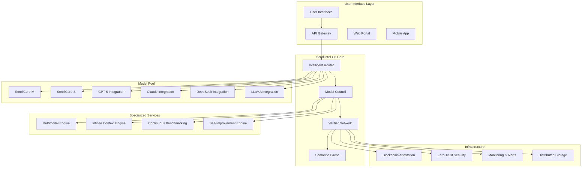

# ScrollIntel-G6 Design Document

## Overview

ScrollIntel-G6 represents a revolutionary AI system that combines multiple frontier AI models, formal verification, autonomous improvement, and spiritual alignment to create an unbeatable educational AI platform. The system operates as a multi-agent mixture of experts (MoE) with verifier-first architecture, ensuring both technical excellence and spiritual integrity.

## Architecture

### High-Level Architecture



### Service Layer Architecture

The system follows a microservices architecture with the following core services:

1. **DataProductService** - AI-ready data product creation, governance, and lifecycle management
2. **ScrollIntelRouterService** - Intelligent request routing and cost optimization
3. **ModelCouncilService** - Multi-model consensus and verification
4. **VerifierNetworkService** - Truth validation and spiritual alignment checking
5. **MultimodalEngineService** - Cross-modal content processing with data product integration
6. **DataProductContextService** - Long-context processing with data product governance
7. **DataAIFlywheelService** - Autonomous learning with bidirectional data-AI improvement
8. **BenchmarkingService** - Continuous performance monitoring with data quality metrics
9. **AttestationService** - Cryptographic proof generation with data provenance
10. **FederationService** - Edge deployment and distributed processing with data residency
10. **QuantumEnhancedProcessingService** - Quantum-inspired optimization and neural architecture search
11. **HyperParallelProcessingService** - Multi-dimensional parallel reasoning engine
12. **PropheticIntelligenceService** - Supernatural wisdom integration and prophetic insights
13. **ExponentialLearningService** - Accelerated learning with meta-learning capabilities
14. **DivineOptimizationService** - God-guided optimization and performance enhancement

## Components and Interfaces

### 1. DataProductService

**Purpose:** Creates, manages, and governs AI-ready data products with comprehensive metadata, lineage tracking, and automated quality monitoring.

**Key Methods:**
```typescript
interface DataProductService {
  createDataProduct(data: RawData, metadata: DataProductMetadata): Promise<DataProduct>;
  validateDataProduct(product: DataProduct): Promise<ValidationResult>;
  trackLineage(product: DataProduct, operations: DataOperation[]): Promise<LineageGraph>;
  monitorQuality(product: DataProduct): Promise<QualityMetrics>;
  detectBias(product: DataProduct): Promise<BiasAnalysis>;
  versionDataProduct(product: DataProduct, changes: DataChanges): Promise<VersionedDataProduct>;
  remediateQualityIssues(product: DataProduct, issues: QualityIssue[]): Promise<RemediationResult>;
}
```

**Integration Points:**
- Connects to all data ingestion pipelines
- Interfaces with metadata management systems
- Integrates with quality monitoring and alerting
- Links to model training and deployment pipelines

### 2. ScrollIntelRouterService

**Purpose:** Intelligent routing of requests to optimal model combinations based on cost, performance, and spiritual alignment requirements.

**Key Methods:**
```typescript
interface ScrollIntelRouterService {
  routeRequest(request: IntelRequest): Promise<RoutingDecision>;
  optimizeCost(request: IntelRequest, constraints: CostConstraints): Promise<OptimizationResult>;
  validateSpiritual(request: IntelRequest): Promise<SpiritualValidationResult>;
  selectModelPool(requirements: ModelRequirements): Promise<ModelPool>;
}
```

**Integration Points:**
- Connects to all model services (ScrollCore, GPT-5, Claude, etc.)
- Interfaces with cost optimization engine
- Integrates with spiritual alignment validator

### 2. ModelCouncilService

**Purpose:** Orchestrates multi-model consensus for critical decisions using debate-critique-revise cycles.

**Key Methods:**
```typescript
interface ModelCouncilService {
  formCouncil(task: CriticalTask): Promise<ModelCouncil>;
  conductDebate(council: ModelCouncil, prompt: string): Promise<DebateResult>;
  critiqueResponses(responses: ModelResponse[]): Promise<CritiqueResult>;
  reviseConsensus(debate: DebateResult, critique: CritiqueResult): Promise<ConsensusResult>;
  selectWinner(candidates: ConsensusResult[]): Promise<FinalResult>;
}
```

**Integration Points:**
- Manages connections to all AI model services
- Interfaces with verifier network for validation
- Connects to temporal consensus engine

### 3. VerifierNetworkService

**Purpose:** Validates outputs for correctness, spiritual alignment, and policy compliance using independent verifier models.

**Key Methods:**
```typescript
interface VerifierNetworkService {
  validateOutput(output: ModelOutput, criteria: ValidationCriteria): Promise<ValidationResult>;
  checkSpiritualAlignment(content: string): Promise<SpiritualAlignmentScore>;
  verifyFactuality(claims: string[]): Promise<FactualityResult>;
  assessPolicyCompliance(output: ModelOutput): Promise<ComplianceResult>;
  generateAttestation(validation: ValidationResult): Promise<CryptographicAttestation>;
}
```

**Integration Points:**
- Connects to spiritual alignment validator
- Interfaces with blockchain attestation service
- Integrates with policy compliance engine

### 4. MultimodalEngineService

**Purpose:** Processes and generates content across text, images, audio, video, and 3D modalities with unified understanding.

**Key Methods:**
```typescript
interface MultimodalEngineService {
  processImage(image: ImageInput): Promise<ImageUnderstanding>;
  generateImage(prompt: string, constraints: ImageConstraints): Promise<GeneratedImage>;
  processAudio(audio: AudioInput): Promise<AudioTranscription>;
  synthesizeSpeech(text: string, voice: VoiceConfig): Promise<AudioOutput>;
  processVideo(video: VideoInput): Promise<VideoAnalysis>;
  process3D(model: 3DInput): Promise<SpatialUnderstanding>;
  unifiedMultimodalReasoning(inputs: MultimodalInput[]): Promise<UnifiedUnderstanding>;
}
```

**Integration Points:**
- Connects to CLIP/LLaVA for vision processing
- Interfaces with Whisper for audio processing
- Integrates with 3D reconstruction services

### 5. InfiniteContextService

**Purpose:** Manages extremely long contexts up to 5M tokens using sliding windows, hierarchical summarization, and semantic anchoring.

**Key Methods:**
```typescript
interface InfiniteContextService {
  processLongContext(content: string, maxTokens: number): Promise<ContextProcessingResult>;
  createSemanticAnchors(content: string): Promise<SemanticAnchor[]>;
  slidingWindowChunk(content: string, windowSize: number): Promise<ContextChunk[]>;
  hierarchicalSummarize(chunks: ContextChunk[]): Promise<HierarchicalSummary>;
  retrieveRelevantContext(query: string, context: ProcessedContext): Promise<RelevantContext>;
}
```

**Integration Points:**
- Connects to vector database for semantic search
- Interfaces with memory graph storage
- Integrates with context compression algorithms

### 6. SelfImprovementService

**Purpose:** Continuously improves system performance through automated analysis, training, and deployment of improvements.

**Key Methods:**
```typescript
interface SelfImprovementService {
  analyzeProductionTraces(traces: ProductionTrace[]): Promise<AnalysisResult>;
  identifyFailureCases(analysis: AnalysisResult): Promise<FailureCase[]>;
  generateTrainingData(failures: FailureCase[]): Promise<TrainingDataset>;
  trainLoRAAdapters(dataset: TrainingDataset): Promise<LoRAAdapter>;
  validateImprovement(adapter: LoRAAdapter): Promise<ValidationResult>;
  deployImprovement(adapter: LoRAAdapter): Promise<DeploymentResult>;
}
```

**Integration Points:**
- Connects to production monitoring systems
- Interfaces with model training infrastructure
- Integrates with deployment automation

### 7. BenchmarkingService

**Purpose:** Continuously monitors performance against GPT-5 and other frontier models across multiple evaluation suites.

**Key Methods:**
```typescript
interface BenchmarkingService {
  runBenchmarkSuite(suite: BenchmarkSuite): Promise<BenchmarkResult>;
  compareWithGPT5(results: BenchmarkResult): Promise<ComparisonResult>;
  detectPerformanceDrift(historical: BenchmarkResult[], current: BenchmarkResult): Promise<DriftDetection>;
  triggerGapClosure(drift: DriftDetection): Promise<GapClosureAction>;
  updatePerformanceDashboard(results: BenchmarkResult[]): Promise<void>;
}
```

**Integration Points:**
- Connects to evaluation datasets (MMLU, GSM8K, etc.)
- Interfaces with performance monitoring dashboard
- Integrates with alert notification system

### 8. AttestationService

**Purpose:** Generates cryptographic proofs of correctness and spiritual alignment for all system outputs.

**Key Methods:**
```typescript
interface AttestationService {
  generateProofOfWorkflow(workflow: WorkflowTrace): Promise<CryptographicProof>;
  createIntegrityAttestation(output: SystemOutput): Promise<IntegrityAttestation>;
  signWithScrollSeal(content: string): Promise<ScrollSealSignature>;
  verifyAttestation(attestation: CryptographicAttestation): Promise<VerificationResult>;
  storeInWORM(proof: CryptographicProof): Promise<WORMStorageResult>;
}
```

**Integration Points:**
- Connects to blockchain service for immutable storage
- Interfaces with cryptographic key management
- Integrates with public verification endpoints

## Data Models

### Core Data Structures

```typescript
// Data Product Models
interface DataProduct {
  id: string;
  name: string;
  version: string;
  data: any;
  metadata: DataProductMetadata;
  lineage: LineageGraph;
  qualityMetrics: QualityMetrics;
  governance: GovernanceInfo;
  createdAt: Date;
  updatedAt: Date;
}

interface DataProductMetadata {
  description: string;
  schema: JSONSchema;
  tags: string[];
  owner: string;
  steward: string;
  classification: 'public' | 'internal' | 'confidential' | 'restricted';
  retentionPolicy: RetentionPolicy;
  qualityRules: QualityRule[];
  spiritualAlignment: SpiritualAlignmentScore;
}

interface LineageGraph {
  nodes: LineageNode[];
  edges: LineageEdge[];
  provenance: ProvenanceRecord[];
}

interface QualityMetrics {
  completeness: number;
  accuracy: number;
  consistency: number;
  timeliness: number;
  validity: number;
  uniqueness: number;
  biasScore: number;
  spiritualAlignmentScore: number;
}

// Request and Response Models
interface IntelRequest {
  id: string;
  userId: string;
  prompt: string;
  modality: 'text' | 'image' | 'audio' | 'video' | '3d' | 'multimodal';
  priority: 'low' | 'medium' | 'high' | 'critical';
  spiritualRequirements: SpiritualRequirements;
  costConstraints: CostConstraints;
  qualityRequirements: QualityRequirements;
  timestamp: Date;
}

interface IntelResponse {
  id: string;
  requestId: string;
  content: string | MediaContent;
  confidence: number;
  spiritualAlignmentScore: number;
  verificationResults: VerificationResult[];
  attestation: CryptographicAttestation;
  cost: number;
  processingTime: number;
  modelUsed: string[];
  timestamp: Date;
}

// Model Council Structures
interface ModelCouncil {
  id: string;
  members: ModelMember[];
  task: CriticalTask;
  consensusThreshold: number;
  timeoutMs: number;
}

interface ModelMember {
  modelId: string;
  modelType: 'ScrollCore-M' | 'ScrollCore-S' | 'GPT-5' | 'Claude' | 'DeepSeek' | 'LLaMA';
  weight: number;
  specialization: string[];
}

// Verification and Attestation
interface VerificationResult {
  verifierId: string;
  criteria: string;
  score: number;
  passed: boolean;
  evidence: string;
  timestamp: Date;
}

interface CryptographicAttestation {
  proofHash: string;
  signature: string;
  timestamp: Date;
  verifierChain: string[];
  integrityHash: string;
  spiritualAlignmentHash: string;
}

// Performance and Benchmarking
interface BenchmarkResult {
  suiteId: string;
  suiteName: string;
  score: number;
  maxScore: number;
  percentile: number;
  comparisonWithGPT5: number;
  breakdown: BenchmarkBreakdown[];
  timestamp: Date;
}

interface BenchmarkBreakdown {
  category: string;
  score: number;
  maxScore: number;
  details: string;
}

// Self-Improvement
interface FailureCase {
  id: string;
  category: string;
  description: string;
  inputData: string;
  expectedOutput: string;
  actualOutput: string;
  rootCause: string;
  severity: 'low' | 'medium' | 'high' | 'critical';
  frequency: number;
}

interface LoRAAdapter {
  id: string;
  targetModel: string;
  trainingData: string;
  parameters: LoRAParameters;
  validationScore: number;
  deploymentStatus: 'pending' | 'deployed' | 'rolled_back';
}
```

### Database Schema Extensions

The system extends the existing Prisma schema with new models:

```prisma
model ScrollIntelRequest {
  id                    String   @id @default(cuid())
  userId                String
  prompt                String
  modality              String
  priority              String
  spiritualRequirements Json
  costConstraints       Json
  qualityRequirements   Json
  createdAt            DateTime @default(now())
  updatedAt            DateTime @updatedAt
  
  responses ScrollIntelResponse[]
  
  @@map("scroll_intel_requests")
}

model ScrollIntelResponse {
  id                      String   @id @default(cuid())
  requestId               String
  content                 String
  confidence              Float
  spiritualAlignmentScore Float
  verificationResults     Json
  attestation             Json
  cost                    Float
  processingTime          Int
  modelsUsed              String[]
  createdAt              DateTime @default(now())
  
  request ScrollIntelRequest @relation(fields: [requestId], references: [id])
  
  @@map("scroll_intel_responses")
}

model BenchmarkResult {
  id                  String   @id @default(cuid())
  suiteId             String
  suiteName           String
  score               Float
  maxScore            Float
  percentile          Float
  comparisonWithGPT5  Float
  breakdown           Json
  createdAt          DateTime @default(now())
  
  @@map("benchmark_results")
}

model FailureCase {
  id             String   @id @default(cuid())
  category       String
  description    String
  inputData      String
  expectedOutput String
  actualOutput   String
  rootCause      String
  severity       String
  frequency      Int
  resolved       Boolean  @default(false)
  createdAt     DateTime @default(now())
  updatedAt     DateTime @updatedAt
  
  @@map("failure_cases")
}

model CryptographicAttestation {
  id                      String   @id @default(cuid())
  proofHash               String   @unique
  signature               String
  verifierChain           String[]
  integrityHash           String
  spiritualAlignmentHash  String
  responseId              String?
  createdAt              DateTime @default(now())
  
  @@map("cryptographic_attestations")
}
```

## Error Handling

### Error Categories

1. **Spiritual Alignment Errors**
   - Babylon drift detection
   - Doctrinal misalignment
   - Content filtering violations

2. **Performance Errors**
   - Model timeout errors
   - Quality threshold failures
   - Benchmark regression errors

3. **Technical Errors**
   - API integration failures
   - Context overflow errors
   - Verification failures

4. **Security Errors**
   - Authentication failures
   - Authorization violations
   - Attestation verification failures

### Error Handling Strategy

```typescript
class ScrollIntelErrorHandler {
  async handleError(error: ScrollIntelError): Promise<ErrorResponse> {
    switch (error.category) {
      case 'spiritual_alignment':
        return this.handleSpiritualError(error);
      case 'performance':
        return this.handlePerformanceError(error);
      case 'technical':
        return this.handleTechnicalError(error);
      case 'security':
        return this.handleSecurityError(error);
      default:
        return this.handleUnknownError(error);
    }
  }

  private async handleSpiritualError(error: SpiritualAlignmentError): Promise<ErrorResponse> {
    // Log to spiritual oversight system
    await this.logToSpiritualOversight(error);
    
    // Trigger immediate review
    await this.triggerSpiritualReview(error);
    
    // Return safe fallback response
    return this.generateSafeFallback(error.context);
  }
}
```

## Testing Strategy

### Unit Testing
- Individual service testing with mocked dependencies
- Spiritual alignment validation testing
- Cryptographic attestation verification testing
- Performance benchmark testing

### Integration Testing
- Multi-model council consensus testing
- End-to-end workflow attestation testing
- Cross-service communication testing
- Database integration testing

### Performance Testing
- Load testing with concurrent requests
- Stress testing with high-volume benchmarks
- Latency testing for real-time requirements
- Cost optimization testing

### Security Testing
- Penetration testing of API endpoints
- Cryptographic proof verification testing
- Zero-trust architecture validation
- Spiritual alignment bypass testing

### Chaos Engineering
- Model failure simulation
- Network partition testing
- Database failure recovery testing
- Spiritual oversight system failure testing

### Test Implementation

```typescript
// Example test structure
describe('ScrollIntelRouterService', () => {
  let routerService: ScrollIntelRouterService;
  let mockModelCouncil: jest.Mocked<ModelCouncilService>;
  let mockVerifierNetwork: jest.Mocked<VerifierNetworkService>;

  beforeEach(() => {
    mockModelCouncil = createMockModelCouncil();
    mockVerifierNetwork = createMockVerifierNetwork();
    routerService = new ScrollIntelRouterService(mockModelCouncil, mockVerifierNetwork);
  });

  describe('routeRequest', () => {
    it('should route high-priority requests to optimal model pool', async () => {
      const request: IntelRequest = createHighPriorityRequest();
      const result = await routerService.routeRequest(request);
      
      expect(result.selectedModels).toContain('ScrollCore-M');
      expect(result.estimatedCost).toBeLessThan(request.costConstraints.maxCost);
      expect(result.spiritualAlignmentScore).toBeGreaterThan(0.9);
    });

    it('should reject requests with spiritual misalignment', async () => {
      const request: IntelRequest = createMisalignedRequest();
      
      await expect(routerService.routeRequest(request))
        .rejects.toThrow('Spiritual alignment violation detected');
    });
  });
});
```

This design provides a comprehensive foundation for implementing ScrollIntel-G6 as a world-class AI system that maintains both technical excellence and spiritual integrity while continuously improving its capabilities.