# ScrollMarketSpec Design Document

## Overview

ScrollMarketSpec creates a revolutionary marketplace where ScrollUniversity students and graduates can monetize their skills, sell their projects, offer services, and create economic opportunities through scroll-aligned commerce. The system enables students to transform their learning into income while building a kingdom economy that values wisdom, character, and practical impact over mere credentials.

## Architecture

The system follows a distributed marketplace architecture with secure transactions, reputation management, and comprehensive quality assurance. It integrates with ScrollCoin systems and maintains kingdom alignment through built-in ethical guidelines and community oversight.

```mermaid
graph TB
    A[ScrollMarketSpec] --> B[Project Marketplace]
    A --> C[Service Marketplace]
    A --> D[Tutoring Platform]
    A --> E[Collaboration Hub]
    
    B --> F[Project Listings]
    B --> G[Product Sales]
    B --> H[Digital Downloads]
    B --> I[Custom Solutions]
    
    C --> J[Skill Services]
    C --> K[Consulting]
    C --> L[Design Work]
    C --> M[Development]
    
    D --> N[Peer Tutoring]
    D --> O[Subject Expertise]
    D --> P[Mentorship]
    D --> Q[Study Groups]
    
    E --> R[Team Formation]
    E --> S[Project Partnerships]
    E --> T[Skill Matching]
    E --> U[Collaboration Tools]
    
    A --> V[Payment Processing]
    A --> W[Quality Assurance]
    A --> X[Reputation System]
    A --> Y[Global Integration]
```



## Components and Interfaces

### Core Data Schema

```json
{
  "marketplace_listing": {
    "listing_id": "uuid",
    "seller_id": "uuid",
    "listing_type": "project | service | tutoring | collaboration",
    "title": "string",
    "description": "markdown",
    "category": "string",
    "subcategory": "string",
    "price_scrollcoins": "decimal",
    "price_usd": "decimal",
    "delivery_time": "integer",
    "requirements": ["string"],
    "portfolio_items": ["url"],
    "tags": ["string"],
    "status": "draft | active | paused | completed | archived",
    "kingdom_alignment_score": "decimal",
    "created_at": "timestamp",
    "updated_at": "timestamp"
  },
  "marketplace_order": {
    "order_id": "uuid",
    "listing_id": "uuid",
    "buyer_id": "uuid",
    "seller_id": "uuid",
    "order_type": "project_purchase | service_booking | tutoring_session | collaboration_request",
    "total_amount_scrollcoins": "decimal",
    "total_amount_usd": "decimal",
    "requirements": "text",
    "delivery_date": "timestamp",
    "status": "pending | accepted | in_progress | delivered | completed | cancelled | disputed",
    "payment_status": "pending | paid | escrowed | released | refunded",
    "created_at": "timestamp",
    "completed_at": "timestamp"
  },
  "seller_profile": {
    "seller_id": "uuid",
    "user_id": "uuid",
    "business_name": "string",
    "specializations": ["string"],
    "scroll_fields": ["string"],
    "experience_level": "beginner | intermediate | advanced | expert",
    "portfolio_url": "string",
    "bio": "text",
    "hourly_rate_scrollcoins": "decimal",
    "hourly_rate_usd": "decimal",
    "availability": "json",
    "response_time": "integer",
    "completion_rate": "decimal",
    "kingdom_values_statement": "text",
    "verified": "boolean",
    "created_at": "timestamp"
  }
}
```

### Transaction and Payment Schema

```json
{
  "marketplace_transaction": {
    "transaction_id": "uuid",
    "order_id": "uuid",
    "buyer_id": "uuid",
    "seller_id": "uuid",
    "amount_scrollcoins": "decimal",
    "amount_usd": "decimal",
    "transaction_type": "payment | escrow | release | refund | fee",
    "payment_method": "scrollcoin | credit_card | bank_transfer | crypto",
    "status": "pending | processing | completed | failed | cancelled",
    "fees": {
      "platform_fee": "decimal",
      "payment_processing_fee": "decimal",
      "mentor_contribution": "decimal"
    },
    "processed_at": "timestamp",
    "blockchain_hash": "string"
  },
  "escrow_account": {
    "escrow_id": "uuid",
    "order_id": "uuid",
    "amount_held": "decimal",
    "currency": "scrollcoin | usd",
    "release_conditions": ["string"],
    "dispute_deadline": "timestamp",
    "auto_release_date": "timestamp",
    "status": "active | released | disputed | expired",
    "created_at": "timestamp"
  }
}
```

### Quality and Reputation Schema

```json
{
  "marketplace_review": {
    "review_id": "uuid",
    "order_id": "uuid",
    "reviewer_id": "uuid",
    "reviewee_id": "uuid",
    "reviewer_type": "buyer | seller",
    "ratings": {
      "overall": "decimal",
      "quality": "decimal",
      "communication": "decimal",
      "timeliness": "decimal",
      "kingdom_alignment": "decimal"
    },
    "review_text": "text",
    "would_recommend": "boolean",
    "verified_purchase": "boolean",
    "helpful_votes": "integer",
    "created_at": "timestamp"
  },
  "reputation_score": {
    "user_id": "uuid",
    "overall_score": "decimal",
    "total_reviews": "integer",
    "average_ratings": {
      "quality": "decimal",
      "communication": "decimal",
      "timeliness": "decimal",
      "kingdom_alignment": "decimal"
    },
    "completion_rate": "decimal",
    "response_rate": "decimal",
    "repeat_customer_rate": "decimal",
    "badges": ["string"],
    "trust_level": "new | bronze | silver | gold | platinum",
    "last_updated": "timestamp"
  }
}
```

## Data Models

### Marketplace Listing Entity
- **Primary Key:** listing_id
- **Foreign Key:** seller_id
- **Relationships:** One-to-many with Orders and Reviews
- **Indexes:** seller_id, listing_type, category, status, created_at
- **Constraints:** price > 0, valid listing_type and status

### Marketplace Order Entity
- **Primary Key:** order_id
- **Foreign Keys:** listing_id, buyer_id, seller_id
- **Relationships:** Many-to-one with Listing, Buyer, Seller
- **Indexes:** buyer_id, seller_id, status, created_at
- **Constraints:** total_amount > 0, valid status transitions

### Seller Profile Entity
- **Primary Key:** seller_id
- **Foreign Key:** user_id
- **Relationships:** One-to-one with User, One-to-many with Listings
- **Indexes:** user_id, specializations, scroll_fields
- **Constraints:** unique(user_id), completion_rate between 0 and 1

## Error Handling

### Listing Creation Errors
- **Invalid Pricing:** Return 400 with pricing guidelines and requirements
- **Missing Portfolio:** Return 422 with portfolio requirements for verification
- **Kingdom Alignment Issues:** Return 400 with alignment improvement suggestions

### Transaction Errors
- **Insufficient Funds:** Return 402 with balance information and funding options
- **Payment Processing Failure:** Retry with exponential backoff, provide alternative payment methods
- **Escrow Release Issues:** Escalate to dispute resolution with detailed context

### Quality Assurance Errors
- **Fake Reviews Detected:** Remove reviews and penalize accounts with warning system
- **Seller Verification Failure:** Suspend listings and require additional verification
- **Dispute Resolution Timeout:** Implement automatic resolution based on predefined criteria

## Testing Strategy

### Unit Tests
- Marketplace listing creation and validation logic
- Payment processing and escrow management
- Reputation scoring algorithms and review aggregation
- Kingdom alignment assessment and scoring

### Integration Tests
- End-to-end order placement and fulfillment workflows
- Cross-system integration with ScrollCoin and user profile systems
- Real-time messaging and collaboration features
- Multi-currency payment processing and conversion

### Performance Tests
- High-volume concurrent listing browsing and searching
- Payment processing under peak transaction loads
- Real-time messaging and notification delivery
- Database performance with large marketplace catalogs

## Inter-Agent Channels

### Dependencies (Incoming)
- **scroll-student-profile-spec:** User profiles and skill verification for seller validation
- **scroll-projects-spec:** Completed projects for marketplace listing and portfolio building
- **scroll-scrollcoin-meter:** Payment processing and ScrollCoin transaction management
- **scroll-transcript-generator:** Academic credentials for service provider verification

### Data Flow (Outgoing)
- **scroll-scrollcoin-meter:** Transaction processing and revenue distribution
- **scroll-audit-trail-spec:** All marketplace activities and transaction logging
- **scroll-seal-certification:** Seller verification and credential validation
- **scroll-university-portal:** Marketplace notifications and activity updates

## Guardrails

### Oath-Based Constraints
- All marketplace activities must align with kingdom values and ethical business practices
- No exploitation of students or unfair pricing that takes advantage of learning needs
- Service providers must demonstrate character and integrity alongside technical skills
- Marketplace success must serve community building and mutual support rather than pure profit

### GPT Anti-Drift Checks
- AI-powered listing recommendations must promote quality and kingdom alignment
- Automated matching algorithms must prioritize character and values alongside skills
- System suggestions must encourage fair pricing and ethical business practices
- Marketplace analytics must highlight community benefit over individual profit maximization

### Role-Based Access Rules
- Students: Browse marketplace, purchase services, provide tutoring, sell projects
- Graduates: Full marketplace access, premium seller features, mentorship opportunities
- Mentors: Oversight of student marketplace participation, dispute resolution assistance
- Administrators: Full marketplace management, policy enforcement, quality assurance

## Embedded GPT Roles

### Primary GPT: ScrollMarketGPT
- **Persona:** Wise marketplace facilitator focused on fair commerce and community building
- **Responsibilities:** Match buyers with sellers, suggest fair pricing, facilitate negotiations
- **Constraints:** Must prioritize kingdom values and community benefit over profit maximization
- **Training:** Marketplace dynamics, fair pricing, ethical business practices, community building

### Secondary GPT: ScrollNegotiatorGPT
- **Persona:** Diplomatic mediator focused on win-win outcomes and relationship building
- **Responsibilities:** Facilitate negotiations, resolve disputes, improve communication
- **Constraints:** Must maintain neutrality while promoting kingdom principles
- **Training:** Conflict resolution, negotiation tactics, relationship building, kingdom diplomacy

## Runtime Triggers

### Listing Events
- **onListingCreate:** Validate kingdom alignment and notify relevant community members
- **onListingPurchase:** Initialize escrow, notify seller, begin delivery tracking
- **onProjectComplete:** Release payment, request reviews, update reputation scores
- **onListingExpire:** Archive inactive listings and notify sellers of renewal options

### Transaction Events
- **onPaymentReceived:** Confirm payment, notify seller, initialize delivery timeline
- **onEscrowRelease:** Transfer funds, update completion rates, trigger review requests
- **onDisputeRaised:** Pause transactions, notify mediators, begin resolution process
- **onRefundProcessed:** Return funds, update records, analyze refund patterns

### Quality Events
- **onReviewSubmitted:** Update reputation scores, notify reviewed party, check for patterns
- **onQualityIssue:** Investigate concerns, provide seller support, implement improvements
- **onFraudDetected:** Suspend accounts, investigate activities, protect community
- **onExcellenceRecognized:** Award badges, promote listings, celebrate achievements

## Billing/Coin Logic

### Transaction Fees
- **Platform Fee:** 5% of transaction value for marketplace operations and development
- **Payment Processing:** 2.5% for credit card transactions, 1% for ScrollCoin transactions
- **Mentor Contribution:** 2.5% goes to mentor development and community support
- **Quality Assurance:** 1% for dispute resolution and quality monitoring systems

### Seller Benefits
- **Project Sales:** Keep 90% of sale price after platform fees
- **Service Completion:** Earn full agreed amount plus potential tips and bonuses
- **Repeat Business:** Reduced fees for sellers with high repeat customer rates
- **Excellence Bonuses:** Additional ScrollCoin rewards for exceptional service and reviews

### Buyer Protections
- **Satisfaction Guarantee:** Full refund if deliverables don't meet agreed specifications
- **Quality Assurance:** Free revisions and improvements for substandard work
- **Dispute Resolution:** Professional mediation and fair resolution processes
- **Community Support:** Access to community advice and seller recommendations

### Revenue Distribution
- **ScrollUniversity Operations:** 40% for platform development and maintenance
- **Mentor Support:** 30% for mentor compensation and development programs
- **Student Scholarships:** 20% for need-based financial aid and accessibility
- **Community Building:** 10% for events, networking, and community development