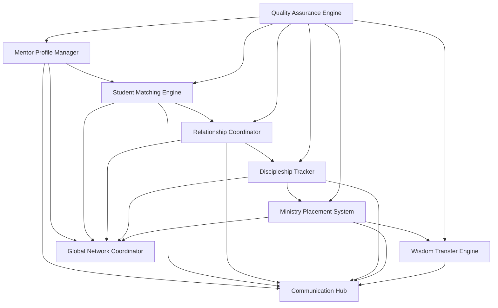
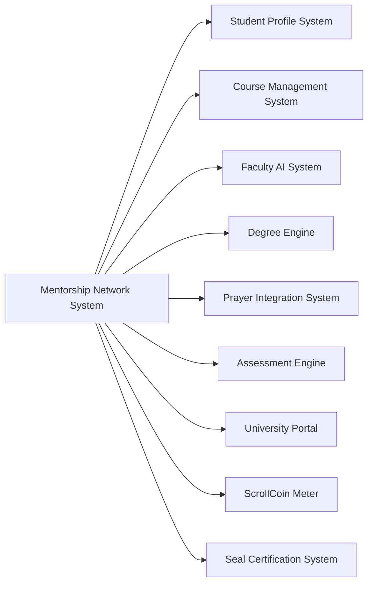

# ScrollUniversity Mentorship Network System Design

## Overview

The Mentorship Network System creates a comprehensive platform for human-to-human wisdom transfer within ScrollUniversity, bridging the gap between AI-powered education and personal discipleship. This system facilitates meaningful mentor-student relationships, tracks discipleship pathways, coordinates ministry placements, and ensures cross-generational wisdom transfer for kingdom impact.

## Architecture

### Core Components



### System Integration Architecture



## Components and Interfaces

### 1. Mentor Profile Manager

**Purpose:** Manages mentor profiles, credentials, and availability

**Key Interfaces:**
- `MentorProfileService`: CRUD operations for mentor profiles
- `CredentialValidator`: Mentor qualification verification
- `AvailabilityManager`: Mentor capacity and scheduling
- `ExpertiseMapper`: Skill and experience categorization

**Data Models:**
```typescript
interface MentorProfile {
  id: string;
  userId: string;
  expertise: ExpertiseArea[];
  ministryExperience: MinistryExperience[];
  availability: AvailabilitySchedule;
  capacity: MentorshipCapacity;
  credentials: Credential[];
  testimonials: Testimonial[];
  spiritualMaturity: MaturityLevel;
  culturalContext: CulturalBackground;
  languages: Language[];
  mentorshipStyle: MentorshipStyle;
  currentMentees: string[];
  completedMentorships: number;
  effectiveness: MentorEffectiveness;
}

interface ExpertiseArea {
  domain: string;
  level: ExpertiseLevel;
  yearsExperience: number;
  specializations: string[];
  achievements: string[];
}

interface MinistryExperience {
  role: string;
  organization: string;
  duration: number;
  responsibilities: string[];
  impact: string[];
  location: string;
}
```

### 2. Student Matching Engine

**Purpose:** Intelligently matches students with appropriate mentors

**Key Interfaces:**
- `MatchingAlgorithm`: Core matching logic and scoring
- `StudentAssessment`: Student needs and compatibility analysis
- `PreferenceManager`: Matching preferences and constraints
- `ConsentCoordinator`: Mutual agreement facilitation

**Data Models:**
```typescript
interface MentorshipRequest {
  id: string;
  studentId: string;
  mentorshipType: MentorshipType;
  specificNeeds: string[];
  academicFocus: string[];
  ministryInterests: string[];
  personalityProfile: PersonalityProfile;
  culturalPreferences: CulturalPreference[];
  languageRequirements: Language[];
  availabilityConstraints: AvailabilityConstraint[];
  urgency: RequestUrgency;
  status: RequestStatus;
}

interface MatchingScore {
  mentorId: string;
  studentId: string;
  overallScore: number;
  expertiseMatch: number;
  personalityCompatibility: number;
  culturalAlignment: number;
  availabilityFit: number;
  ministryAlignment: number;
  geographicalProximity: number;
  languageCompatibility: number;
}

enum MentorshipType {
  ACADEMIC = 'academic',
  SPIRITUAL = 'spiritual',
  MINISTRY = 'ministry',
  CAREER = 'career',
  COMPREHENSIVE = 'comprehensive'
}
```

### 3. Relationship Coordinator

**Purpose:** Manages mentorship relationship lifecycle and communication

**Key Interfaces:**
- `RelationshipManager`: Relationship lifecycle management
- `CommunicationHub`: Messaging and meeting coordination
- `ConflictResolver`: Relationship issue resolution
- `TransitionManager`: Relationship changes and endings

**Data Models:**
```typescript
interface MentorshipRelationship {
  id: string;
  mentorId: string;
  studentId: string;
  relationshipType: MentorshipType;
  startDate: Date;
  expectedDuration: number;
  status: RelationshipStatus;
  goals: MentorshipGoal[];
  meetings: MeetingRecord[];
  communications: CommunicationRecord[];
  milestones: Milestone[];
  challenges: Challenge[];
  outcomes: Outcome[];
  satisfaction: SatisfactionRating;
}

interface MeetingRecord {
  id: string;
  relationshipId: string;
  scheduledDate: Date;
  actualDate?: Date;
  duration: number;
  type: MeetingType;
  agenda: string[];
  notes: string;
  actionItems: ActionItem[];
  nextSteps: string[];
  attendanceStatus: AttendanceStatus;
}

interface CommunicationRecord {
  id: string;
  relationshipId: string;
  senderId: string;
  receiverId: string;
  type: CommunicationType;
  content: string;
  timestamp: Date;
  read: boolean;
  responded: boolean;
}
```

### 4. Discipleship Tracker

**Purpose:** Tracks spiritual development and discipleship progress

**Key Interfaces:**
- `DiscipleshipPathway`: Personalized development path management
- `SpiritualGrowthTracker`: Spiritual maturity measurement
- `CharacterAssessment`: Character development evaluation
- `GiftDiscovery`: Spiritual gifts identification and development

**Data Models:**
```typescript
interface DiscipleshipPathway {
  id: string;
  studentId: string;
  mentorId: string;
  pathwayType: PathwayType;
  currentStage: DiscipleshipStage;
  stages: DiscipleshipStage[];
  spiritualGifts: SpiritualGift[];
  characterTraits: CharacterTrait[];
  ministryReadiness: ReadinessLevel;
  completedExercises: SpiritualExercise[];
  breakthroughMoments: Breakthrough[];
  challenges: SpiritualChallenge[];
  progress: ProgressMetrics;
}

interface SpiritualGift {
  gift: GiftType;
  strength: number;
  development: DevelopmentLevel;
  manifestations: string[];
  confirmations: Confirmation[];
  applications: Application[];
}

interface CharacterTrait {
  trait: TraitType;
  currentLevel: number;
  targetLevel: number;
  developmentPlan: string[];
  evidences: string[];
  challenges: string[];
}
```

### 5. Ministry Placement System

**Purpose:** Coordinates real-world ministry opportunities and placements

**Key Interfaces:**
- `OpportunityMatcher`: Ministry opportunity matching
- `QualificationVerifier`: Student readiness assessment
- `PlacementCoordinator`: Ministry placement management
- `PerformanceTracker`: Ministry performance monitoring

**Data Models:**
```typescript
interface MinistryOpportunity {
  id: string;
  organizationId: string;
  title: string;
  description: string;
  requirements: Requirement[];
  responsibilities: string[];
  duration: number;
  location: Location;
  compensation: Compensation;
  spiritualRequirements: SpiritualRequirement[];
  skillRequirements: SkillRequirement[];
  availablePositions: number;
  applicationDeadline: Date;
  startDate: Date;
  mentorshipSupport: boolean;
}

interface MinistryPlacement {
  id: string;
  studentId: string;
  opportunityId: string;
  mentorId: string;
  startDate: Date;
  endDate?: Date;
  status: PlacementStatus;
  performance: PerformanceMetrics;
  feedback: FeedbackRecord[];
  challenges: PlacementChallenge[];
  achievements: Achievement[];
  impact: ImpactMeasurement;
  nextSteps: string[];
}
```

### 6. Wisdom Transfer Engine

**Purpose:** Facilitates systematic knowledge and wisdom transfer

**Key Interfaces:**
- `WisdomCapture`: Experience and insight documentation
- `StoryManager`: Narrative and case study management
- `LessonExtractor`: Key learning identification
- `LegacyBuilder`: Institutional memory creation

**Data Models:**
```typescript
interface WisdomRecord {
  id: string;
  mentorId: string;
  category: WisdomCategory;
  title: string;
  context: string;
  experience: string;
  lessons: string[];
  applications: string[];
  warnings: string[];
  principles: string[];
  outcomes: string[];
  relevance: RelevanceScore;
  accessibility: AccessibilityLevel;
  tags: string[];
}

interface WisdomTransferSession {
  id: string;
  mentorId: string;
  studentIds: string[];
  wisdomRecordId: string;
  sessionDate: Date;
  format: TransferFormat;
  engagement: EngagementMetrics;
  comprehension: ComprehensionLevel;
  application: ApplicationPlan[];
  followUp: FollowUpAction[];
}
```

## Data Models

### Core Mentorship Entities

```sql
-- Mentor Profiles Table
CREATE TABLE mentor_profiles (
    id UUID PRIMARY KEY DEFAULT gen_random_uuid(),
    user_id UUID NOT NULL REFERENCES users(id),
    expertise_areas JSONB NOT NULL,
    ministry_experience JSONB NOT NULL,
    availability JSONB NOT NULL,
    capacity INTEGER NOT NULL DEFAULT 3,
    spiritual_maturity maturity_level NOT NULL,
    cultural_context JSONB NOT NULL,
    languages language[] NOT NULL,
    mentorship_style mentorship_style NOT NULL,
    current_mentees INTEGER DEFAULT 0,
    completed_mentorships INTEGER DEFAULT 0,
    effectiveness_rating DECIMAL(3,2) DEFAULT 0.00,
    created_at TIMESTAMP DEFAULT CURRENT_TIMESTAMP,
    updated_at TIMESTAMP DEFAULT CURRENT_TIMESTAMP
);

-- Mentorship Relationships Table
CREATE TABLE mentorship_relationships (
    id UUID PRIMARY KEY DEFAULT gen_random_uuid(),
    mentor_id UUID NOT NULL REFERENCES mentor_profiles(id),
    student_id UUID NOT NULL REFERENCES users(id),
    relationship_type mentorship_type NOT NULL,
    start_date TIMESTAMP NOT NULL,
    expected_duration INTEGER NOT NULL,
    status relationship_status NOT NULL DEFAULT 'active',
    goals JSONB NOT NULL,
    satisfaction_rating DECIMAL(3,2),
    created_at TIMESTAMP DEFAULT CURRENT_TIMESTAMP,
    updated_at TIMESTAMP DEFAULT CURRENT_TIMESTAMP
);

-- Discipleship Pathways Table
CREATE TABLE discipleship_pathways (
    id UUID PRIMARY KEY DEFAULT gen_random_uuid(),
    student_id UUID NOT NULL REFERENCES users(id),
    mentor_id UUID NOT NULL REFERENCES mentor_profiles(id),
    pathway_type pathway_type NOT NULL,
    current_stage discipleship_stage NOT NULL,
    spiritual_gifts JSONB NOT NULL,
    character_traits JSONB NOT NULL,
    ministry_readiness readiness_level NOT NULL DEFAULT 'developing',
    progress_metrics JSONB NOT NULL,
    created_at TIMESTAMP DEFAULT CURRENT_TIMESTAMP,
    updated_at TIMESTAMP DEFAULT CURRENT_TIMESTAMP
);

-- Ministry Placements Table
CREATE TABLE ministry_placements (
    id UUID PRIMARY KEY DEFAULT gen_random_uuid(),
    student_id UUID NOT NULL REFERENCES users(id),
    opportunity_id UUID NOT NULL REFERENCES ministry_opportunities(id),
    mentor_id UUID NOT NULL REFERENCES mentor_profiles(id),
    start_date TIMESTAMP NOT NULL,
    end_date TIMESTAMP,
    status placement_status NOT NULL DEFAULT 'active',
    performance_metrics JSONB NOT NULL,
    impact_measurement JSONB NOT NULL,
    created_at TIMESTAMP DEFAULT CURRENT_TIMESTAMP,
    updated_at TIMESTAMP DEFAULT CURRENT_TIMESTAMP
);
```

## Error Handling

### Matching Errors
- **NoSuitableMentorFound**: When no mentors match student requirements
- **MentorCapacityExceeded**: When mentor reaches maximum mentee capacity
- **ConflictingPreferences**: When mentor and student preferences conflict
- **InsufficientQualifications**: When student doesn't meet mentorship requirements

### Relationship Errors
- **RelationshipConflict**: When mentorship relationship issues arise
- **CommunicationFailure**: When communication systems fail
- **SchedulingConflict**: When meeting scheduling conflicts occur
- **RelationshipTerminationFailed**: When relationship ending process fails

### Ministry Placement Errors
- **PlacementQualificationFailed**: When student doesn't meet ministry requirements
- **PlacementConflict**: When ministry placement conflicts arise
- **PerformanceIssue**: When ministry performance problems occur
- **PlacementTerminationRequired**: When ministry placement must end early

## Testing Strategy

### Unit Testing
- Mentor-student matching algorithms
- Relationship lifecycle management
- Discipleship progress tracking
- Ministry placement coordination
- Wisdom transfer effectiveness

### Integration Testing
- University system integration
- Communication platform connectivity
- Global network coordination
- Mobile application synchronization
- Real-time notification delivery

### Relationship Testing
- Mentor-student compatibility validation
- Communication effectiveness measurement
- Discipleship outcome assessment
- Ministry placement success tracking
- Wisdom transfer impact evaluation

### Performance Testing
- Large-scale matching algorithm performance
- Real-time communication handling
- Global network synchronization
- Mobile application responsiveness
- Database query optimization

### Quality Assurance Testing
- Mentorship relationship quality measurement
- Spiritual development tracking accuracy
- Ministry placement success validation
- Cross-cultural communication effectiveness
- Long-term relationship sustainability