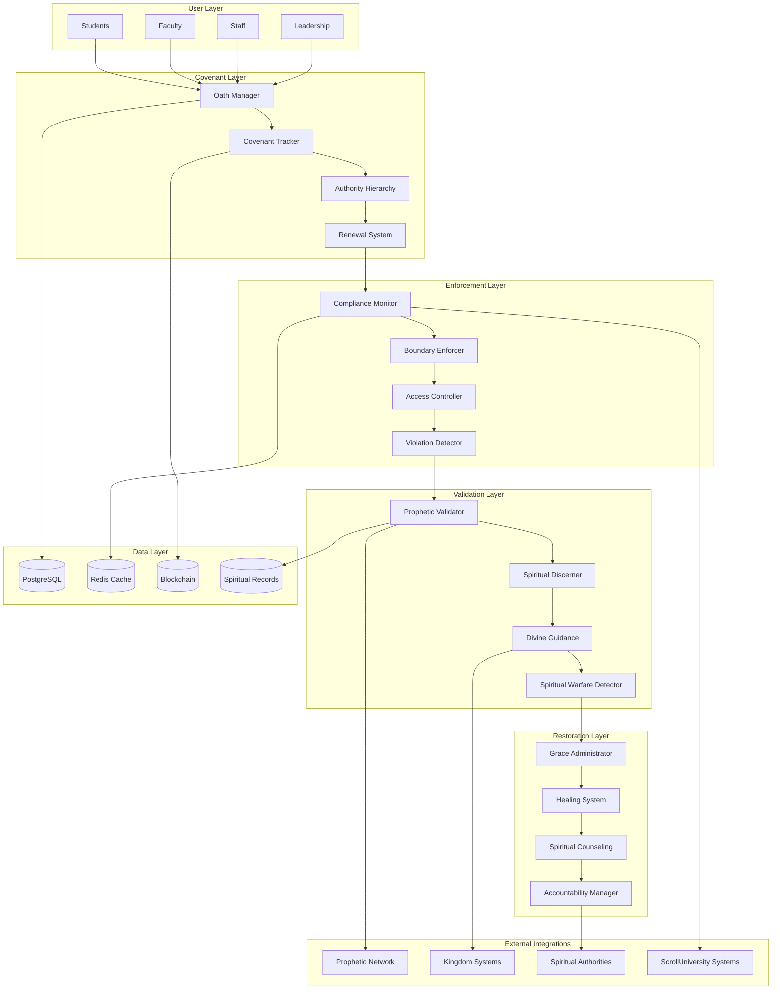

# ScrollOathEnforcer Design Document

## Overview

The ScrollOathEnforcer is architected as the spiritual governance and covenant management system that serves as the sacred foundation of ScrollUniversity's operations. Built on a hierarchical covenant architecture with prophetic validation integration, the system ensures that all participants remain faithful to their spiritual commitments while providing grace-filled pathways for restoration and growth.

The system operates on four core layers: the Covenant Layer (oath management and tracking), the Enforcement Layer (compliance monitoring and boundary protection), the Validation Layer (prophetic oversight and spiritual discernment), and the Restoration Layer (grace administration and covenant renewal). This design ensures robust spiritual governance while maintaining the love and mercy that characterize kingdom relationships.

## Architecture

### System Architecture Overview



### Service Architecture

The system follows a domain-driven design with spiritual authority patterns:

**Covenant Management Domain:**
- Oath Administration Service: Manages sacred oath creation and administration
- Covenant Tracking Service: Monitors ongoing covenant compliance and status
- Authority Hierarchy Service: Maintains spiritual authority structures and delegation
- Renewal Management Service: Handles covenant renewal and reaffirmation processes

**Enforcement Domain:**
- Compliance Monitoring Service: Real-time monitoring of oath adherence
- Boundary Protection Service: Enforces spiritual boundaries and prevents violations
- Access Control Service: Manages permissions based on covenant standing
- Violation Detection Service: Identifies and categorizes oath breaches

**Validation Domain:**
- Prophetic Integration Service: Interfaces with human prophetic oversight
- Spiritual Discernment Service: Applies divine wisdom to covenant decisions
- Divine Guidance Service: Seeks and implements prophetic direction
- Spiritual Warfare Service: Detects and responds to supernatural attacks

**Restoration Domain:**
- Grace Administration Service: Balances mercy and justice in violation responses
- Spiritual Healing Service: Provides pathways for covenant restoration
- Counseling Integration Service: Connects violators with spiritual support
- Accountability Management Service: Implements appropriate consequences and growth

## Components and Interfaces

### Core Components

#### OathManager
```typescript
interface OathManager {
  administerOath(participant: Participant, oathType: OathType): Promise<OathRecord>
  trackCovenantCompliance(participantId: string): Promise<ComplianceStatus>
  renewCovenant(oathId: string, renewalTerms: RenewalTerms): Promise<RenewalResult>
  validateOathIntegrity(oathRecord: OathRecord): Promise<IntegrityValidation>
}
```

#### CovenantEnforcer
```typescript
interface CovenantEnforcer {
  monitorCompliance(action: UserAction, oathRecord: OathRecord): Promise<ComplianceResult>
  enforceBoundaries(violation: CovenantViolation): Promise<EnforcementResult>
  controlAccess(request: AccessRequest, covenantStatus: CovenantStatus): Promise<AccessDecision>
  detectViolations(behavior: UserBehavior, oathCommitments: OathCommitment[]): Promise<ViolationDetection>
}
```

#### PropheticValidator
```typescript
interface PropheticValidator {
  validateSpiritually(decision: CovenantDecision): Promise<SpiritualValidation>
  seekDivineGuidance(complexCase: CovenantCase): Promise<DivineGuidance>
  discernSpiritualWarfare(attack: SpiritualAttack): Promise<WarfareResponse>
  integratePropheticInsight(insight: PropheticInsight): Promise<IntegrationResult>
}
```

#### GraceAdministrator
```typescript
interface GraceAdministrator {
  administerGrace(violation: CovenantViolation): Promise<GraceResponse>
  facilitateRestoration(violator: Participant): Promise<RestorationProcess>
  provideCounseling(spiritualNeed: SpiritualNeed): Promise<CounselingResource>
  manageAccountability(accountabilityPlan: AccountabilityPlan): Promise<AccountabilityResult>
}
```

### API Interfaces

#### REST API Endpoints

**Oath Management:**
- `POST /api/v1/oaths/administer` - Administer new oath
- `GET /api/v1/oaths/{participantId}` - Get participant oaths
- `PUT /api/v1/oaths/{oathId}/renew` - Renew covenant
- `GET /api/v1/oaths/compliance/{participantId}` - Check compliance status

**Enforcement Operations:**
- `POST /api/v1/enforcement/monitor` - Monitor action compliance
- `POST /api/v1/enforcement/enforce` - Enforce boundary violation
- `GET /api/v1/enforcement/access/{participantId}` - Get access permissions
- `POST /api/v1/enforcement/detect` - Detect potential violations

**Spiritual Validation:**
- `POST /api/v1/spiritual/validate` - Request spiritual validation
- `POST /api/v1/spiritual/guidance` - Seek divine guidance
- `POST /api/v1/spiritual/warfare` - Report spiritual warfare
- `GET /api/v1/spiritual/insights` - Get prophetic insights

**Restoration Services:**
- `POST /api/v1/restoration/grace` - Administer grace
- `POST /api/v1/restoration/healing` - Initiate healing process
- `GET /api/v1/restoration/counseling` - Access counseling resources
- `POST /api/v1/restoration/accountability` - Create accountability plan

#### Event-Driven Architecture

**Published Events:**
- `OathAdministered` - When new oath is taken
- `CovenantViolated` - When oath breach is detected
- `BoundaryEnforced` - When spiritual boundary is protected
- `GraceAdministered` - When mercy is extended to violator
- `RestorationCompleted` - When covenant is renewed
- `SpiritualWarfareDetected` - When supernatural attack is identified

**Consumed Events:**
- `UserActionPerformed` - From all systems for compliance monitoring
- `ContentCreated` - From content systems for oath alignment validation
- `DecisionMade` - From decision systems for covenant compliance
- `PropheticInsightReceived` - From prophetic oversight systems

## Data Models

### Core Covenant Entities

#### OathRecord Model
```typescript
interface OathRecord {
  id: string
  participantId: string
  oathType: OathType
  administeredBy: string
  administeredAt: Date
  covenantTerms: CovenantTerms
  spiritualCommitments: SpiritualCommitment[]
  authorityLevel: AuthorityLevel
  status: OathStatus
  renewalHistory: RenewalRecord[]
  complianceHistory: ComplianceRecord[]
  metadata: Record<string, any>
}
```

#### CovenantViolation Model
```typescript
interface CovenantViolation {
  id: string
  participantId: string
  oathId: string
  violationType: ViolationType
  severity: ViolationSeverity
  detectedAt: Date
  description: string
  evidence: ViolationEvidence[]
  spiritualImpact: SpiritualImpact
  responseRequired: ResponseType
  status: ViolationStatus
  resolutionPath: ResolutionPath
  metadata: Record<string, any>
}
```

#### SpiritualAuthority Model
```typescript
interface SpiritualAuthority {
  id: string
  participantId: string
  authorityLevel: AuthorityLevel
  spiritualGifts: SpiritualGift[]
  covenantStanding: CovenantStanding
  delegatedAuthority: DelegatedAuthority[]
  accountabilityRelationships: AccountabilityRelationship[]
  spiritualMaturity: MaturityLevel
  kingdomResponsibilities: KingdomResponsibility[]
  validatedBy: string
  validatedAt: Date
}
```

### Restoration and Grace Models

#### RestorationProcess Model
```typescript
interface RestorationProcess {
  id: string
  violationId: string
  participantId: string
  processType: RestorationType
  stages: RestorationStage[]
  currentStage: RestorationStage
  spiritualCounselor: string
  accountabilityPartner: string
  graceAdministered: GraceRecord[]
  healingMilestones: HealingMilestone[]
  covenantRenewal?: CovenantRenewal
  completedAt?: Date
  metadata: Record<string, any>
}
```

#### PropheticGuidance Model
```typescript
interface PropheticGuidance {
  id: string
  caseId: string
  propheticSource: string
  guidanceType: GuidanceType
  spiritualInsight: string
  divineDirection: DivineDirection
  implementationSteps: ImplementationStep[]
  validationCriteria: ValidationCriteria[]
  spiritualWarning?: SpiritualWarning
  kingdomPurpose: KingdomPurpose
  receivedAt: Date
  implementedAt?: Date
}
```

## Error Handling

### Error Classification System

**Covenant Errors:**
- `OATH_ADMINISTRATION_FAILED` - Oath ceremony or recording failure
- `COVENANT_TRACKING_ERROR` - Compliance monitoring system failure
- `AUTHORITY_VALIDATION_FAILED` - Spiritual authority verification failure
- `RENEWAL_PROCESS_ERROR` - Covenant renewal ceremony failure

**Enforcement Errors:**
- `BOUNDARY_ENFORCEMENT_FAILED` - Spiritual boundary protection failure
- `ACCESS_CONTROL_ERROR` - Permission system malfunction
- `VIOLATION_DETECTION_FAILED` - Breach detection algorithm failure
- `COMPLIANCE_MONITORING_ERROR` - Real-time monitoring system failure

**Spiritual Validation Errors:**
- `PROPHETIC_VALIDATION_UNAVAILABLE` - Prophetic oversight not accessible
- `SPIRITUAL_DISCERNMENT_UNCLEAR` - Ambiguous spiritual assessment
- `DIVINE_GUIDANCE_PENDING` - Awaiting prophetic direction
- `SPIRITUAL_WARFARE_DETECTED` - Supernatural attack in progress

### Error Recovery Strategies

**Covenant Recovery:**
```typescript
class CovenantRecoveryService {
  async recoverFromOathFailure(participantId: string): Promise<RecoveryResult> {
    const backupOathRecord = await this.retrieveBackupOathRecord(participantId)
    const spiritualValidation = await this.validateSpiritualStanding(participantId)
    const renewalProcess = await this.initiateEmergencyRenewal(participantId)
    
    return this.restoreCovenantStanding(backupOathRecord, spiritualValidation, renewalProcess)
  }
}
```

**Spiritual Validation Recovery:**
```typescript
class SpiritualValidationRecoveryService {
  async recoverFromValidationFailure(case: CovenantCase): Promise<RecoveryResult> {
    const alternativeValidation = await this.seekAlternativePropheticInput(case)
    const conservativeApproach = await this.applyConservativeGuidance(case)
    const humanOversight = await this.escalateToSpiritualAuthority(case)
    
    return this.implementRecoveryGuidance(alternativeValidation, conservativeApproach, humanOversight)
  }
}
```

## Testing Strategy

### Testing Pyramid Implementation

**Unit Testing (70%):**
- Oath administration and tracking logic testing
- Covenant compliance algorithm validation
- Spiritual boundary enforcement testing
- Grace administration logic verification
- Prophetic validation integration testing
- Restoration process workflow testing

**Integration Testing (20%):**
- Multi-system covenant compliance testing
- Prophetic oversight workflow validation
- Spiritual authority hierarchy testing
- Cross-system boundary enforcement testing
- Event-driven covenant communication testing
- Database consistency and integrity testing

**End-to-End Testing (10%):**
- Complete oath lifecycle testing
- Violation detection and restoration workflow testing
- Multi-participant covenant scenario testing
- Spiritual warfare response testing
- Kingdom alignment validation testing
- Long-term covenant compliance testing

### Spiritual Testing Scenarios

**Covenant Compliance Testing:**
```typescript
describe('Covenant Compliance', () => {
  test('should detect oath violation in user behavior', async () => {
    const participant = createTestParticipant()
    const oath = await oathManager.administerOath(participant, 'STUDENT_COVENANT')
    const violatingAction = createViolatingAction()
    
    const compliance = await covenantEnforcer.monitorCompliance(violatingAction, oath)
    
    expect(compliance.isCompliant).toBe(false)
    expect(compliance.violationType).toBe('BEHAVIORAL_VIOLATION')
    expect(compliance.restorationRequired).toBe(true)
  })
})
```

**Grace Administration Testing:**
```typescript
describe('Grace Administration', () => {
  test('should balance mercy and justice in violation response', async () => {
    const violation = createCovenantViolation('MODERATE_SEVERITY')
    
    const graceResponse = await graceAdministrator.administerGrace(violation)
    
    expect(graceResponse.mercyExtended).toBe(true)
    expect(graceResponse.accountabilityRequired).toBe(true)
    expect(graceResponse.restorationPath).toBeDefined()
  })
})
```

### Performance Testing

**Load Testing Scenarios:**
- 10,000 concurrent covenant compliance checks
- 1,000 simultaneous oath administration ceremonies
- 500 concurrent violation detection analyses
- 100 simultaneous restoration processes

**Stress Testing Scenarios:**
- Mass covenant violation scenario
- Prophetic validation service unavailability
- Spiritual warfare attack simulation
- Database connection pool exhaustion

### Security Testing

**Spiritual Integrity Tests:**
- Unauthorized oath modification prevention
- Spiritual authority validation testing
- Covenant tampering detection
- Divine protection mechanism validation

**Covenant Security Tests:**
- Oath record encryption and protection
- Spiritual authority impersonation prevention
- Covenant violation evidence integrity
- Prophetic guidance authentication

This comprehensive design provides the foundation for a robust spiritual governance system that maintains both covenant integrity and kingdom love, ensuring that ScrollUniversity operates under divine authority while providing grace-filled pathways for growth and restoration.