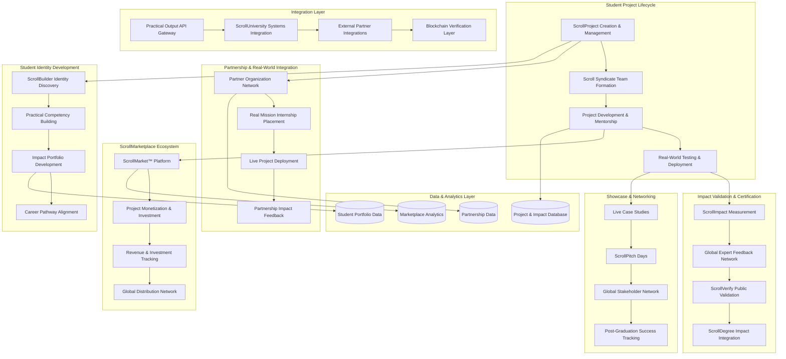

# Design Document

## Overview

The ScrollBlueprint Practical Output System represents the most revolutionary educational platform ever conceived - a comprehensive ecosystem that transforms students from passive learners into active builders, reformers, and solution architects. This system fundamentally rejects Babylon's educational model by implementing a "Build → Transform → Govern while learning" approach that produces graduates with proven real-world impact before they even receive their degrees.

Built on a microservices architecture that integrates project management, marketplace functionality, partnership coordination, and impact measurement, the platform ensures every ScrollUniversity graduate leaves with tangible evidence of their ability to create scroll-aligned solutions. The system operates on the biblical principle "By their fruits you shall know them" (Matthew 7:16), creating an educational environment where theoretical knowledge is immediately applied to solve real problems in communities and nations worldwide.

## Architecture

### High-Level System Architecture



### Practical Output Architecture Pattern

**Build-Transform-Govern Methodology:**
- Students immediately apply learning through real project creation
- Projects address actual community and national challenges
- Solutions are deployed and tested in live environments
- Impact is measured and verified through multiple validation layers
- Graduates enter workforce with proven track record of transformation

**Evidence-Based Validation:**
- Every claim backed by verifiable data and third-party confirmation
- Blockchain verification prevents credential fraud
- Public ScrollVerify pages provide transparent access to achievements
- Global expert network validates project quality and impact## Comp
onents and Interfaces

### 1. ScrollProject Creation and Management Service

**Core Components:**
```typescript
interface ScrollProjectService {
  // Project lifecycle management
  createScrollProject(projectData: ScrollProjectData): Promise<ScrollProject>;
  assignProjectMentor(projectId: string, mentorId: string): Promise<MentorAssignment>;
  trackProjectProgress(projectId: string): Promise<ProjectProgress>;
  validateProjectCompletion(projectId: string): Promise<CompletionValidation>;
  
  // Project types and categories
  createStartupProject(startupData: StartupProjectData): Promise<StartupProject>;
  createNonprofitProject(nonprofitData: NonprofitProjectData): Promise<NonprofitProject>;
  createToolProject(toolData: ToolProjectData): Promise<ToolProject>;
  createDataProject(dataData: DataProjectData): Promise<DataProject>;
  
  // Collaboration and team management
  formScrollSyndicate(syndicateData: SyndicateData): Promise<ScrollSyndicate>;
  manageTeamCollaboration(teamId: string, collaborationTools: CollaborationTool[]): Promise<TeamManagement>;
  resolveTeamConflicts(conflictId: string, resolution: ConflictResolution): Promise<ResolutionResult>;
}

interface ScrollProject {
  id: string;
  title: string;
  description: string;
  projectType: ProjectType; // Startup, Nonprofit, Tool, Data
  studentIds: string[];
  mentorId: string;
  
  // Project details
  problemStatement: ProblemStatement;
  solutionApproach: SolutionApproach;
  targetBeneficiaries: TargetBeneficiary[];
  expectedImpact: ExpectedImpact;
  
  // Development tracking
  milestones: ProjectMilestone[];
  currentStatus: ProjectStatus;
  completionPercentage: number;
  
  // Validation and verification
  impactMetrics: ImpactMetric[];
  partnerValidation: PartnerValidation[];
  expertFeedback: ExpertFeedback[];
  
  // Marketplace integration
  marketplaceReady: boolean;
  monetizationPotential: MonetizationPotential;
  investmentInterest: InvestmentInterest[];
}
```

### 2. ScrollMarketplace Platform Service

**Core Components:**
```typescript
interface ScrollMarketplaceService {
  // Marketplace management
  listProjectInMarketplace(projectId: string, listingData: MarketplaceListing): Promise<MarketplaceEntry>;
  categorizeMarketplaceItems(): Promise<MarketplaceCategory[]>;
  searchMarketplace(searchCriteria: SearchCriteria): Promise<SearchResult[]>;
  
  // Monetization and investment
  enableProjectMonetization(projectId: string, monetizationOptions: MonetizationOption[]): Promise<MonetizationSetup>;
  facilitateInvestment(projectId: string, investorData: InvestorData): Promise<InvestmentFacilitation>;
  processRevenue(transactionId: string, revenueData: RevenueData): Promise<RevenueProcessing>;
  
  // Quality assurance and verification
  validateScrollAlignment(projectId: string): Promise<ScrollAlignmentValidation>;
  verifyImpactClaims(projectId: string, impactClaims: ImpactClaim[]): Promise<ImpactVerification>;
  moderateMarketplaceContent(contentId: string): Promise<ContentModeration>;
}

interface MarketplaceEntry {
  id: string;
  projectId: string;
  category: MarketplaceCategory;
  title: string;
  description: string;
  
  // Pricing and availability
  pricingModel: PricingModel; // Sale, License, Investment, Free
  price: number;
  currency: string;
  availability: AvailabilityStatus;
  
  // Impact and validation
  impactSummary: ImpactSummary;
  scrollAlignmentScore: number;
  expertEndorsements: ExpertEndorsement[];
  userReviews: UserReview[];
  
  // Performance metrics
  views: number;
  downloads: number;
  revenue: number;
  investmentRaised: number;
}
```

### 3. Real-World Partnership Integration Service

**Core Components:**
```typescript
interface PartnershipIntegrationService {
  // Partner network management
  registerPartnerOrganization(partnerData: PartnerOrganizationData): Promise<PartnerOrganization>;
  matchStudentToPartner(studentId: string, partnerRequirements: PartnerRequirement[]): Promise<PartnerMatch>;
  coordinateInternshipPlacement(placementData: InternshipPlacementData): Promise<InternshipPlacement>;
  
  // Project deployment and testing
  deployProjectWithPartner(projectId: string, partnerId: string): Promise<ProjectDeployment>;
  facilitateLiveTesting(testingData: LiveTestingData): Promise<TestingResult>;
  collectPartnerFeedback(deploymentId: string): Promise<PartnerFeedback>;
  
  // Partnership outcomes and validation
  measurePartnershipImpact(partnershipId: string): Promise<PartnershipImpact>;
  generatePartnerTestimonials(partnershipId: string): Promise<PartnerTestimonial[]>;
  validateRealWorldResults(projectId: string, partnerId: string): Promise<ResultValidation>;
}

interface PartnerOrganization {
  id: string;
  name: string;
  type: PartnerType; // KingdomBusiness, Hospital, ScrollStartup, Ministry, UN, SmartCity
  location: GeographicLocation;
  
  // Partnership capabilities
  projectTypes: ProjectType[];
  mentorshipCapacity: MentorshipCapacity;
  deploymentEnvironment: DeploymentEnvironment;
  testingCapabilities: TestingCapability[];
  
  // Requirements and preferences
  studentRequirements: StudentRequirement[];
  projectRequirements: ProjectRequirement[];
  culturalConsiderations: CulturalConsideration[];
  
  // Partnership history
  previousPlacements: InternshipPlacement[];
  successMetrics: PartnerSuccessMetric[];
  testimonials: PartnerTestimonial[];
}
```

### 4. ScrollImpact Measurement and Verification Service

**Core Components:**
```typescript
interface ScrollImpactService {
  // Impact measurement
  establishImpactBaseline(projectId: string, baselineData: BaselineData): Promise<ImpactBaseline>;
  measureProjectImpact(projectId: string, measurementPeriod: MeasurementPeriod): Promise<ImpactMeasurement>;
  validateImpactClaims(projectId: string, claims: ImpactClaim[]): Promise<ImpactValidation>;
  
  // Verification and authentication
  generateImpactReport(projectId: string): Promise<ImpactReport>;
  createScrollVerifyPage(studentId: string, projectIds: string[]): Promise<ScrollVerifyPage>;
  blockchainVerifyCredentials(credentialData: CredentialData): Promise<BlockchainVerification>;
  
  // Global expert validation
  recruitExpertValidators(expertiseArea: ExpertiseArea): Promise<ExpertValidator[]>;
  facilitateExpertReview(projectId: string, expertId: string): Promise<ExpertReview>;
  aggregateExpertFeedback(projectId: string): Promise<AggregatedFeedback>;
}

interface ImpactMeasurement {
  projectId: string;
  measurementDate: Date;
  measurementPeriod: MeasurementPeriod;
  
  // Quantitative metrics
  beneficiariesReached: number;
  problemsSolved: number;
  revenueGenerated: number;
  jobsCreated: number;
  resourcesSaved: number;
  
  // Qualitative metrics
  communityFeedback: CommunityFeedback[];
  beneficiaryTestimonials: BeneficiaryTestimonial[];
  partnerEndorsements: PartnerEndorsement[];
  
  // Verification data
  thirdPartyValidation: ThirdPartyValidation[];
  evidenceDocuments: EvidenceDocument[];
  independentAudits: IndependentAudit[];
  
  // Scroll alignment
  scrollAlignmentScore: number;
  propheticValidation: PropheticValidation;
  kingdomImpactAssessment: KingdomImpactAssessment;
}
```

### 5. ScrollDegree Impact Integration Service

**Core Components:**
```typescript
interface ScrollDegreeImpactService {
  // Degree enhancement with impact data
  generateImpactPortfolio(studentId: string): Promise<ScrollImpactPortfolio>;
  createDSGEIWithImpact(studentId: string, degreeData: DSGEIDegreeData): Promise<DSGEIWithImpact>;
  generateScrollBScSummary(studentId: string, projectIds: string[]): Promise<ScrollBScSummary>;
  
  // Employer verification and showcase
  createEmployerVerificationPackage(studentId: string, employerId: string): Promise<EmployerPackage>;
  generateVideoSummary(studentId: string, advisorId: string): Promise<VideoSummary>;
  maintainLiveProjectLinks(studentId: string): Promise<LiveLinkMaintenance>;
  
  // Public verification and transparency
  publishScrollVerifyPage(studentId: string): Promise<PublicVerificationPage>;
  enableBlockchainVerification(credentialId: string): Promise<BlockchainCredentialVerification>;
  preventCredentialFraud(verificationRequest: VerificationRequest): Promise<FraudPrevention>;
}

interface ScrollImpactPortfolio {
  studentId: string;
  generationDate: Date;
  
  // Project showcase
  completedProjects: CompletedProject[];
  ongoingProjects: OngoingProject[];
  collaborativeProjects: CollaborativeProject[];
  
  // Impact summary
  totalBeneficiariesReached: number;
  totalRevenueGenerated: number;
  totalInvestmentRaised: number;
  totalJobsCreated: number;
  
  // Verification and validation
  partnerTestimonials: PartnerTestimonial[];
  expertEndorsements: ExpertEndorsement[];
  communityFeedback: CommunityFeedback[];
  
  // Marketplace performance
  marketplaceListings: MarketplaceListing[];
  salesPerformance: SalesPerformance;
  investorInterest: InvestorInterest[];
  
  // Career readiness
  skillsDemonstrated: SkillDemonstration[];
  industryRecognition: IndustryRecognition[];
  networkConnections: NetworkConnection[];
}
```

## Data Models

### Core Practical Output Data Models

```typescript
// Student project and development tracking
interface StudentProjectRecord {
  studentId: string;
  projects: ProjectRecord[];
  scrollSyndicates: SyndicateRecord[];
  
  // Identity development
  scrollIdentity: ScrollIdentityType; // Builder, Innovator, Governor
  competencyAreas: CompetencyArea[];
  skillDevelopment: SkillDevelopmentRecord[];
  
  // Impact tracking
  totalImpactScore: number;
  beneficiariesReached: number;
  revenueGenerated: number;
  investmentRaised: number;
  
  // Verification and validation
  partnerValidations: PartnerValidationRecord[];
  expertEndorsements: ExpertEndorsementRecord[];
  impactVerifications: ImpactVerificationRecord[];
}

// Marketplace and monetization tracking
interface MarketplaceRecord {
  projectId: string;
  listingData: MarketplaceListingRecord;
  performanceMetrics: MarketplacePerformanceRecord;
  
  // Financial tracking
  revenueHistory: RevenueHistoryRecord[];
  investmentHistory: InvestmentHistoryRecord[];
  pricingHistory: PricingHistoryRecord[];
  
  // User engagement
  viewHistory: ViewHistoryRecord[];
  downloadHistory: DownloadHistoryRecord[];
  userFeedback: UserFeedbackRecord[];
  
  // Quality and verification
  scrollAlignmentAudits: ScrollAlignmentAuditRecord[];
  impactVerifications: MarketplaceImpactVerificationRecord[];
  contentModerations: ContentModerationRecord[];
}

// Partnership and real-world integration
interface PartnershipRecord {
  partnerId: string;
  partnershipType: PartnershipType;
  projectDeployments: ProjectDeploymentRecord[];
  
  // Collaboration tracking
  internshipPlacements: InternshipPlacementRecord[];
  mentorshipProvided: MentorshipRecord[];
  resourcesProvided: ResourceProvisionRecord[];
  
  // Outcomes and impact
  partnershipOutcomes: PartnershipOutcomeRecord[];
  partnerFeedback: PartnerFeedbackRecord[];
  successMetrics: PartnerSuccessMetricRecord[];
  
  // Validation and testimonials
  partnerTestimonials: PartnerTestimonialRecord[];
  impactValidations: PartnerImpactValidationRecord[];
  renewalHistory: PartnershipRenewalRecord[];
}
```

This comprehensive design provides the technical foundation for implementing ScrollUniversity's revolutionary practical output model, ensuring every graduate leaves with proven ability to create real-world impact and transform nations through scroll-aligned solutions.