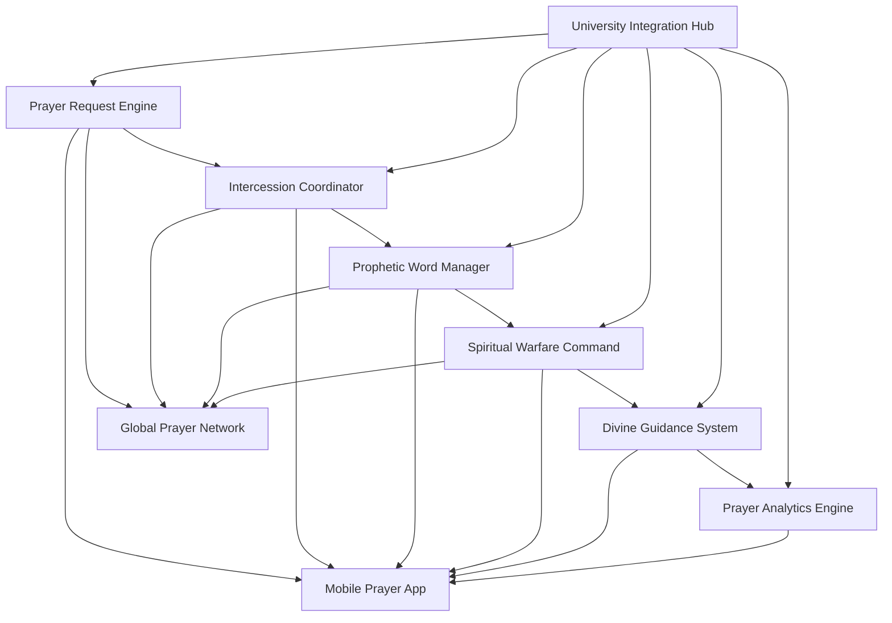
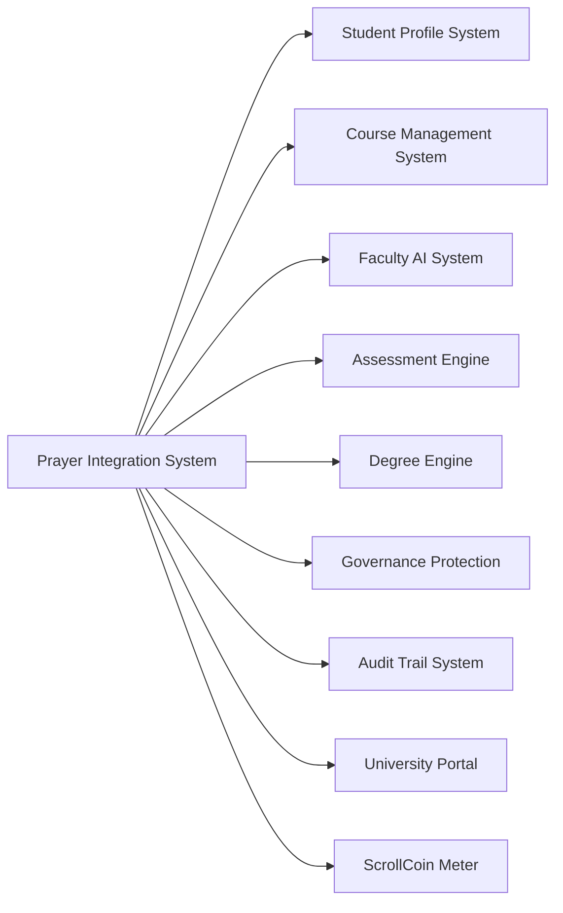

# ScrollUniversity Prayer Integration System Design

## Overview

The Prayer Integration System serves as the spiritual infrastructure of ScrollUniversity, providing comprehensive prayer coverage, prophetic guidance management, and spiritual warfare coordination. This system ensures that all educational activities operate under divine blessing and spiritual protection while facilitating community-wide intercession and prophetic ministry.

## Architecture

### Core Components



### System Integration Architecture



## Components and Interfaces

### 1. Prayer Request Engine

**Purpose:** Manages prayer request lifecycle from submission to testimony

**Key Interfaces:**
- `PrayerRequestService`: CRUD operations for prayer requests
- `PrayerCategoryManager`: Categorization and routing logic
- `TestimonyTracker`: Answered prayer documentation
- `UrgencyProcessor`: Priority-based request handling

**Data Models:**
```typescript
interface PrayerRequest {
  id: string;
  requesterId: string;
  title: string;
  description: string;
  category: PrayerCategory;
  urgencyLevel: UrgencyLevel;
  privacyLevel: PrivacyLevel;
  status: RequestStatus;
  assignedIntercessors: string[];
  createdAt: Date;
  updatedAt: Date;
  answeredAt?: Date;
  testimony?: string;
}

enum PrayerCategory {
  ACADEMIC = 'academic',
  PERSONAL = 'personal',
  MINISTRY = 'ministry',
  UNIVERSITY_OPERATIONS = 'university_operations',
  GLOBAL = 'global'
}

enum UrgencyLevel {
  LOW = 'low',
  MEDIUM = 'medium',
  HIGH = 'high',
  CRITICAL = 'critical'
}
```

### 2. Intercession Coordinator

**Purpose:** Manages intercessor network and prayer assignments

**Key Interfaces:**
- `IntercessorProfileService`: Intercessor gift and availability management
- `PrayerAssignmentEngine`: Automated prayer assignment logic
- `CoverageCoordinator`: 24/7 prayer coverage management
- `TeamFormationService`: Prayer team creation and coordination

**Data Models:**
```typescript
interface Intercessor {
  id: string;
  userId: string;
  prayerGifts: PrayerGift[];
  availability: AvailabilitySchedule;
  specializations: PrayerSpecialization[];
  effectiveness: IntercessorMetrics;
  activeAssignments: PrayerAssignment[];
  prayerHours: number;
  breakthroughCount: number;
}

interface PrayerAssignment {
  id: string;
  intercessorId: string;
  prayerRequestId: string;
  assignedAt: Date;
  duration: number;
  status: AssignmentStatus;
  insights: string[];
  breakthrough: boolean;
}
```

### 3. Prophetic Word Manager

**Purpose:** Handles prophetic word submission, validation, and distribution

**Key Interfaces:**
- `PropheticWordService`: Prophetic word lifecycle management
- `ValidationEngine`: Elder validation and confirmation process
- `DistributionManager`: Appropriate routing and delivery
- `FulfillmentTracker`: Prophetic accuracy and timing tracking

**Data Models:**
```typescript
interface PropheticWord {
  id: string;
  prophetId: string;
  recipient: RecipientContext;
  content: string;
  scope: PropheticScope;
  validationStatus: ValidationStatus;
  validatedBy: string[];
  distributedAt?: Date;
  fulfillmentStatus: FulfillmentStatus;
  accuracy: number;
  timing: TimingAccuracy;
}

enum PropheticScope {
  PERSONAL = 'personal',
  COURSE = 'course',
  UNIVERSITY = 'university',
  GLOBAL = 'global'
}

interface RecipientContext {
  type: 'student' | 'faculty' | 'course' | 'university' | 'global';
  targetId: string;
  context: string;
}
```

### 4. Spiritual Warfare Command

**Purpose:** Coordinates spiritual warfare campaigns and defensive strategies

**Key Interfaces:**
- `WarfareCampaignManager`: Campaign creation and management
- `PrayerShiftCoordinator`: 24/7 warfare coverage
- `AttackDetectionSystem`: Spiritual opposition identification
- `VictoryTracker`: Breakthrough documentation and analysis

**Data Models:**
```typescript
interface WarfareCampaign {
  id: string;
  name: string;
  description: string;
  targetArea: WarfareTarget;
  strategy: WarfareStrategy;
  assignedWarriors: string[];
  prayerShifts: PrayerShift[];
  startDate: Date;
  endDate?: Date;
  status: CampaignStatus;
  victories: Victory[];
}

interface PrayerShift {
  id: string;
  campaignId: string;
  warriorId: string;
  startTime: Date;
  endTime: Date;
  coverage: CoverageArea;
  insights: string[];
  breakthrough: boolean;
}
```

### 5. Divine Guidance System

**Purpose:** Facilitates seeking and receiving divine direction for decisions

**Key Interfaces:**
- `GuidanceRequestService`: Decision guidance request management
- `SeerCoordinator`: Prophetic council coordination
- `DirectionCompiler`: Unified guidance compilation
- `OutcomeValidator`: Decision outcome tracking

**Data Models:**
```typescript
interface GuidanceRequest {
  id: string;
  requesterId: string;
  decisionContext: DecisionContext;
  urgency: GuidanceUrgency;
  assignedSeers: string[];
  guidanceReceived: PropheticGuidance[];
  unifiedDirection: string;
  decisionMade: boolean;
  outcome: DecisionOutcome;
  accuracyRating: number;
}

interface PropheticGuidance {
  seerId: string;
  guidance: string;
  confidence: number;
  timing: string;
  conditions: string[];
  receivedAt: Date;
}
```

### 6. Prayer Analytics Engine

**Purpose:** Analyzes prayer patterns and provides spiritual intelligence

**Key Interfaces:**
- `PrayerMetricsCollector`: Prayer data aggregation
- `TrendAnalyzer`: Spiritual trend identification
- `EffectivenessCalculator`: Prayer effectiveness measurement
- `IntelligenceReporter`: Spiritual intelligence reporting

**Data Models:**
```typescript
interface PrayerAnalytics {
  period: AnalyticsPeriod;
  totalRequests: number;
  answeredPrayers: number;
  averageResponseTime: number;
  categoryBreakdown: CategoryMetrics[];
  intercessorEffectiveness: IntercessorMetrics[];
  propheticAccuracy: PropheticMetrics;
  spiritualTrends: TrendAnalysis[];
}

interface TrendAnalysis {
  trend: string;
  strength: number;
  duration: number;
  impact: TrendImpact;
  recommendations: string[];
}
```

## Data Models

### Core Prayer Entities

```sql
-- Prayer Requests Table
CREATE TABLE prayer_requests (
    id UUID PRIMARY KEY DEFAULT gen_random_uuid(),
    requester_id UUID NOT NULL REFERENCES users(id),
    title VARCHAR(255) NOT NULL,
    description TEXT NOT NULL,
    category prayer_category NOT NULL,
    urgency_level urgency_level NOT NULL,
    privacy_level privacy_level NOT NULL,
    status request_status NOT NULL DEFAULT 'pending',
    created_at TIMESTAMP DEFAULT CURRENT_TIMESTAMP,
    updated_at TIMESTAMP DEFAULT CURRENT_TIMESTAMP,
    answered_at TIMESTAMP,
    testimony TEXT
);

-- Intercessors Table
CREATE TABLE intercessors (
    id UUID PRIMARY KEY DEFAULT gen_random_uuid(),
    user_id UUID NOT NULL REFERENCES users(id),
    prayer_gifts prayer_gift[] NOT NULL,
    specializations prayer_specialization[] NOT NULL,
    total_prayer_hours INTEGER DEFAULT 0,
    breakthrough_count INTEGER DEFAULT 0,
    effectiveness_rating DECIMAL(3,2) DEFAULT 0.00,
    created_at TIMESTAMP DEFAULT CURRENT_TIMESTAMP,
    updated_at TIMESTAMP DEFAULT CURRENT_TIMESTAMP
);

-- Prophetic Words Table
CREATE TABLE prophetic_words (
    id UUID PRIMARY KEY DEFAULT gen_random_uuid(),
    prophet_id UUID NOT NULL REFERENCES users(id),
    content TEXT NOT NULL,
    scope prophetic_scope NOT NULL,
    recipient_type VARCHAR(50) NOT NULL,
    recipient_id UUID,
    validation_status validation_status NOT NULL DEFAULT 'pending',
    distributed_at TIMESTAMP,
    fulfillment_status fulfillment_status NOT NULL DEFAULT 'pending',
    accuracy_rating DECIMAL(3,2),
    created_at TIMESTAMP DEFAULT CURRENT_TIMESTAMP
);

-- Warfare Campaigns Table
CREATE TABLE warfare_campaigns (
    id UUID PRIMARY KEY DEFAULT gen_random_uuid(),
    name VARCHAR(255) NOT NULL,
    description TEXT NOT NULL,
    target_area warfare_target NOT NULL,
    strategy TEXT NOT NULL,
    status campaign_status NOT NULL DEFAULT 'active',
    start_date TIMESTAMP NOT NULL,
    end_date TIMESTAMP,
    created_at TIMESTAMP DEFAULT CURRENT_TIMESTAMP
);
```

## Error Handling

### Prayer Request Errors
- **PrayerRequestNotFound**: When accessing non-existent prayer requests
- **InvalidPrayerCategory**: When submitting requests with invalid categories
- **IntercessorUnavailable**: When no intercessors are available for assignment
- **TestimonyUpdateFailed**: When testimony submission fails

### Prophetic Word Errors
- **PropheticWordValidationFailed**: When prophetic word fails validation
- **ConflictingPropheticWords**: When prophetic words contradict each other
- **UnauthorizedPropheticSubmission**: When non-authorized users submit prophetic words
- **DistributionFailed**: When prophetic word distribution fails

### Spiritual Warfare Errors
- **CampaignCreationFailed**: When warfare campaign creation fails
- **InsufficientWarriors**: When not enough prayer warriors are available
- **CoverageGapDetected**: When prayer coverage gaps are identified
- **WarfareIntelligenceFailed**: When spiritual intelligence gathering fails

## Testing Strategy

### Unit Testing
- Prayer request lifecycle management
- Intercessor assignment algorithms
- Prophetic word validation logic
- Warfare campaign coordination
- Analytics calculation accuracy

### Integration Testing
- University system integration
- Mobile app synchronization
- Global prayer network connectivity
- Real-time notification delivery
- Cross-timezone coordination

### Spiritual Testing
- Prayer effectiveness validation
- Prophetic accuracy measurement
- Spiritual breakthrough documentation
- Divine guidance confirmation
- Warfare victory verification

### Performance Testing
- High-volume prayer request handling
- Real-time intercessor coordination
- Global network synchronization
- Mobile app responsiveness
- Analytics processing speed

### Security Testing
- Prayer request privacy protection
- Prophetic word access control
- Intercessor identity verification
- Spiritual authority validation
- Data encryption and protection