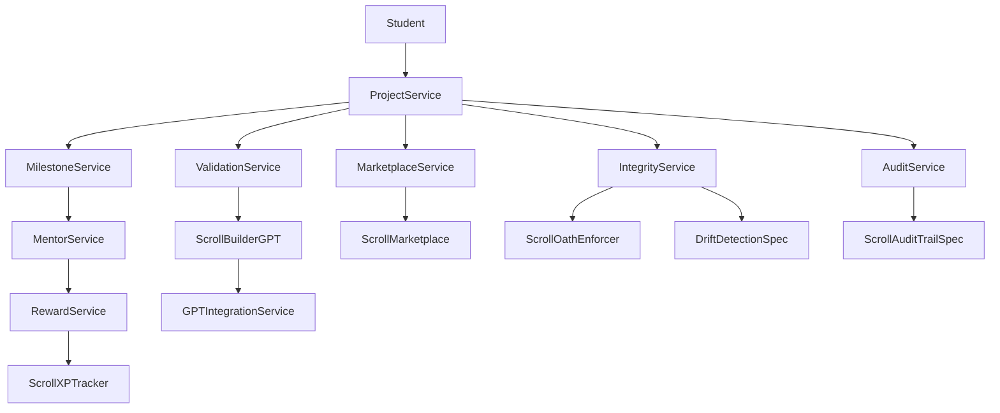
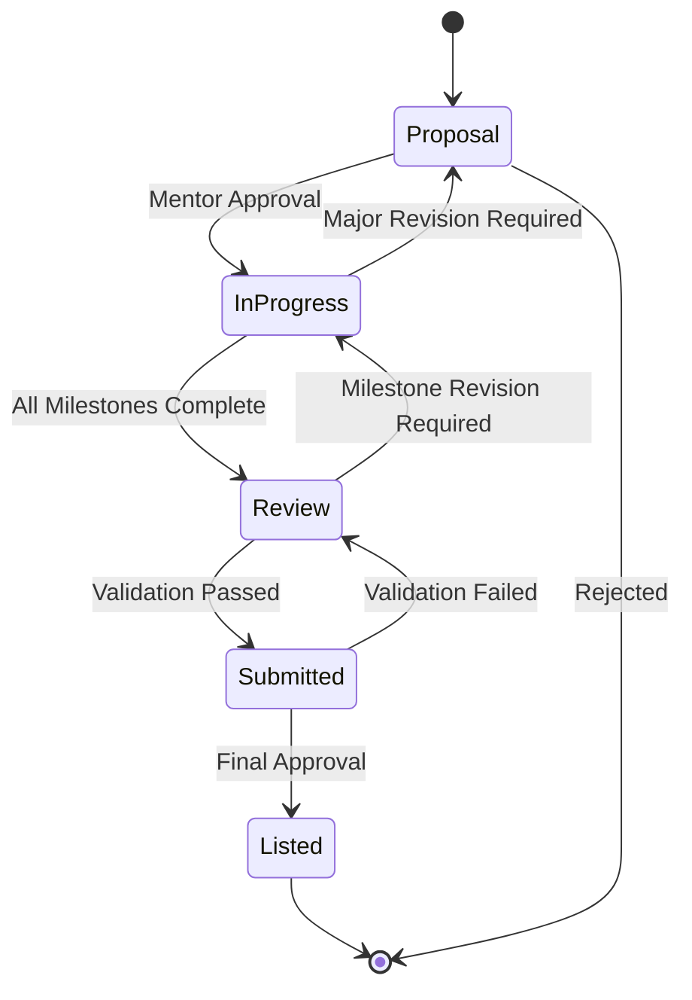

# Design Document

## Overview

The ScrollProjectsSpec module serves as the foundational system for managing real-world student projects throughout their lifecycle at ScrollUniversity. This system transforms theoretical learning into practical application by requiring students to build, validate, and publish meaningful solutions that demonstrate scroll-alignment and create measurable impact.

The design emphasizes prophetic governance, AI-enhanced mentorship, and seamless integration with the broader ScrollUniversity ecosystem while maintaining the highest standards of integrity and scroll-alignment.

## Architecture

### High-Level Architecture



### System Components

The ScrollProjectsSpec system consists of several interconnected components:

1. **Core Project Management Layer**: Handles project creation, lifecycle management, and status transitions
2. **Milestone Tracking System**: Manages project progression through defined stages with validation
3. **Mentor Integration Layer**: Coordinates human and AI mentor involvement in project validation
4. **Governance and Integrity Layer**: Ensures scroll-alignment and prevents drift through continuous monitoring
5. **External Integration Layer**: Connects with ScrollMarketplace, transcript systems, and reward mechanisms
6. **Agent Hook System**: Provides event-driven automation for project lifecycle events

## Components and Interfaces

### Core Data Models

#### ScrollProjectSpec Interface
```typescript
interface ScrollProjectSpec {
  project_id: string;
  student_id: string;
  title: string;
  description: string;
  scroll_field: ScrollField;
  mentor_id: string;
  status: ProjectStatus;
  milestones: MilestoneSpec[];
  gpt_summary: string;
  scrollcoin_earned: number;
  published: boolean;
  created_at: Date;
  updated_at: Date;
  integrity_seal?: IntegritySeal;
}
```

#### MilestoneSpec Interface
```typescript
interface MilestoneSpec {
  milestone_id: string;
  stage: MilestoneStage;
  title: string;
  description: string;
  completed: boolean;
  submitted_at?: Date;
  feedback: MentoFeedback[];
  required_deliverables: string[];
  validation_criteria: ValidationCriteria[];
}
```

#### ProjectStatus Enumeration
```typescript
enum ProjectStatus {
  PROPOSAL = 'proposal',
  IN_PROGRESS = 'in_progress',
  REVIEW = 'review',
  SUBMITTED = 'submitted',
  LISTED = 'listed',
  ARCHIVED = 'archived'
}
```

### Service Layer Architecture

#### ProjectService
The central orchestrator for all project-related operations:

```typescript
class ProjectService {
  async createProject(studentId: string, projectData: CreateProjectRequest): Promise<ScrollProjectSpec>
  async updateProjectStatus(projectId: string, status: ProjectStatus): Promise<void>
  async getProject(projectId: string): Promise<ScrollProjectSpec>
  async getStudentProjects(studentId: string): Promise<ScrollProjectSpec[]>
  async validateScrollAlignment(project: ScrollProjectSpec): Promise<ValidationResult>
}
```

#### MilestoneService
Manages milestone progression and validation:

```typescript
class MilestoneService {
  async submitMilestone(projectId: string, milestoneId: string, submission: MilestoneSubmission): Promise<void>
  async validateMilestone(milestoneId: string): Promise<ValidationResult>
  async progressToNextMilestone(projectId: string): Promise<void>
  async getMilestoneStatus(projectId: string): Promise<MilestoneStatus[]>
}
```

#### RewardService
Calculates and distributes ScrollCoin and XP rewards:

```typescript
class RewardService {
  async calculateProjectRewards(project: ScrollProjectSpec): Promise<RewardCalculation>
  async distributeRewards(studentId: string, rewards: RewardCalculation): Promise<void>
  async trackUsageMetrics(projectId: string): Promise<UsageMetrics>
  async updateScrollCoinEarnings(projectId: string, earnings: number): Promise<void>
}
```

### Agent Hook System

The system implements seven core agent hooks that automate project lifecycle management:

#### Hook Configuration
```typescript
interface HookConfiguration {
  hookName: string;
  triggerEvents: string[];
  targetServices: string[];
  executionOrder: number;
  retryPolicy: RetryPolicy;
  errorHandling: ErrorHandlingStrategy;
}
```

#### Hook Implementations

1. **onProjectCreate**: Initializes project structure and assigns mentors
2. **onMilestoneSubmit**: Triggers GPT summary generation and mentor notifications
3. **onProjectSubmit**: Initiates validation pipeline and scoring
4. **onMarketplaceListing**: Handles publication to ScrollMarketplace
5. **onScrollDegreeReview**: Integrates project data with transcript systems

### Integration Architecture

#### External System Integrations

The system integrates with multiple ScrollUniversity components:

```typescript
interface ExternalIntegrations {
  scrollBuilderGPT: GPTIntegrationService;
  scrollMarketplace: MarketplaceService;
  scrollXPTracker: XPTrackerService;
  scrollTranscriptGenerator: TranscriptService;
  scrollVerifyPortal: VerificationService;
  scrollAuditTrail: AuditService;
  driftDetection: DriftDetectionService;
  scrollOathEnforcer: IntegrityService;
}
```

## Data Models

### Project Lifecycle State Machine



### Milestone Structure

Each project follows a standardized milestone structure:

1. **Proposal Stage**: Initial project concept and scope definition
2. **Prototype Stage**: Working proof-of-concept development
3. **Testing Stage**: Validation and refinement with real users
4. **Final Stage**: Complete solution ready for publication

### Data Validation Schema

```yaml
scroll_projects_spec_schema:
  type: object
  required: [project_id, student_id, title, scroll_field, status]
  properties:
    project_id:
      type: string
      format: uuid
    student_id:
      type: string
      format: uuid
    title:
      type: string
      minLength: 5
      maxLength: 200
    scroll_field:
      type: string
      enum: [ScrollMedicine, ScrollAI, ScrollGovernance, ScrollEconomy, ScrollTheology]
    status:
      type: string
      enum: [proposal, in_progress, review, submitted, listed]
    milestones:
      type: array
      minItems: 4
      items:
        $ref: '#/definitions/MilestoneSpec'
```

## Error Handling

### Error Classification

The system implements comprehensive error handling across four categories:

1. **Validation Errors**: Schema validation failures, business rule violations
2. **Integration Errors**: External system communication failures
3. **Authorization Errors**: Permission and access control violations
4. **System Errors**: Infrastructure and runtime failures

### Error Recovery Strategies

```typescript
interface ErrorRecoveryStrategy {
  errorType: ErrorType;
  retryPolicy: RetryPolicy;
  fallbackAction: FallbackAction;
  notificationStrategy: NotificationStrategy;
  escalationPath: EscalationPath;
}
```

### Graceful Degradation

When external systems are unavailable:
- GPT summaries fall back to template-based generation
- Mentor notifications queue for later delivery
- Marketplace listings are staged for retry
- Audit trails maintain local logs until sync is restored

## Testing Strategy

### Testing Pyramid

The testing strategy follows a comprehensive pyramid approach:

#### Unit Tests (70%)
- Service method validation
- Data model integrity
- Business logic verification
- Error handling scenarios

#### Integration Tests (20%)
- External system interactions
- Database operations
- Agent hook execution
- End-to-end workflows

#### End-to-End Tests (10%)
- Complete project lifecycle
- User journey validation
- Performance benchmarking
- Security verification

### Test Data Management

```typescript
interface TestDataFactory {
  createMockProject(overrides?: Partial<ScrollProjectSpec>): ScrollProjectSpec;
  createMockMilestone(stage: MilestoneStage): MilestoneSpec;
  createMockStudent(): StudentProfile;
  createMockMentor(): MentorProfile;
}
```

### Performance Testing

Key performance metrics:
- Project creation: < 500ms
- Milestone submission: < 200ms
- GPT summary generation: < 2s
- Marketplace publication: < 1s
- Reward calculation: < 100ms

## Security and Governance

### Scroll-Alignment Enforcement

The system implements multiple layers of scroll-alignment verification:

1. **Creation Validation**: Projects must align with approved scroll fields
2. **Continuous Monitoring**: DriftDetectionSpec monitors for alignment drift
3. **Mentor Validation**: Human and AI mentors verify scroll consistency
4. **Integrity Sealing**: ScrollOathEnforcer applies integrity seals to approved projects

### Access Control

```typescript
interface AccessControlMatrix {
  student: ['create', 'read', 'update_own'];
  mentor: ['read', 'validate', 'provide_feedback'];
  admin: ['read', 'update', 'delete', 'publish'];
  system: ['create', 'read', 'update', 'delete', 'execute_hooks'];
}
```

### Audit and Compliance

All project operations are logged through ScrollAuditTrailSpec:
- Project creation and modifications
- Milestone submissions and approvals
- Mentor feedback and decisions
- System-generated actions and hooks
- Integrity seal applications and validations

## Deployment Architecture

### Container Structure

```dockerfile
# ScrollProjectsSpec Service Container
FROM node:18-alpine
WORKDIR /app
COPY package*.json ./
RUN npm ci --only=production
COPY dist/ ./dist/
EXPOSE 3000
CMD ["node", "dist/index.js"]
```

### Environment Configuration

```yaml
# Production Configuration
database:
  host: ${DB_HOST}
  port: ${DB_PORT}
  name: scroll_projects
  
integrations:
  scroll_builder_gpt:
    endpoint: ${GPT_SERVICE_URL}
    api_key: ${GPT_API_KEY}
  scroll_marketplace:
    endpoint: ${MARKETPLACE_URL}
    auth_token: ${MARKETPLACE_TOKEN}
    
monitoring:
  metrics_endpoint: ${METRICS_URL}
  log_level: ${LOG_LEVEL}
  trace_sampling: ${TRACE_SAMPLING_RATE}
```

### Scaling Strategy

The system is designed for horizontal scaling:
- Stateless service architecture
- Database connection pooling
- Async processing for heavy operations
- Caching layer for frequently accessed data
- Load balancing across multiple instances

This design ensures that ScrollProjectsSpec can handle the full lifecycle of student projects while maintaining scroll-alignment, providing comprehensive mentorship, and seamlessly integrating with the broader ScrollUniversity ecosystem.