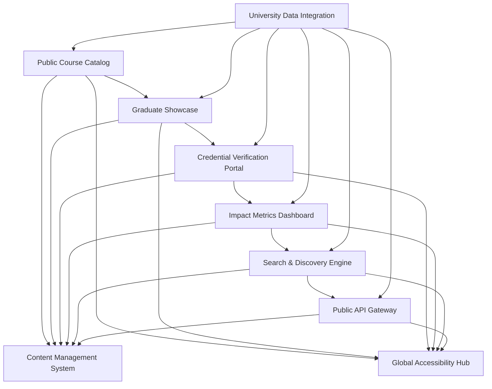
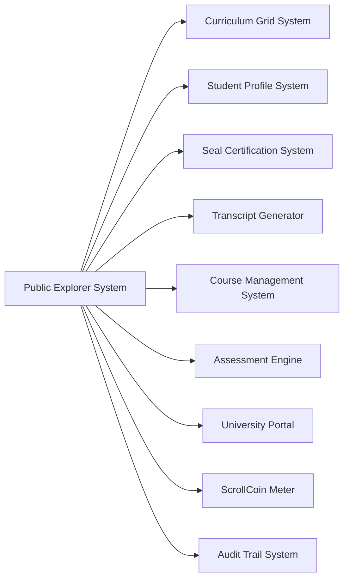

# ScrollUniversity Public Explorer System Design

## Overview

The Public Explorer System provides transparent, accessible public access to ScrollUniversity's course catalog, graduate achievements, and institutional information. This system showcases the university's impact, enables public verification of credentials, and serves as a gateway for prospective students and employers.

## Architecture

### Core Components



### System Integration Architecture



## Components and Interfaces

### 1. Public Course Catalog

**Purpose:** Provides comprehensive public access to course information and curriculum

**Key Interfaces:**
- `CourseCatalogService`: Public course information management
- `CurriculumBrowser`: Curriculum navigation and exploration
- `CourseDetailProvider`: Detailed course information delivery
- `PreviewGenerator`: Course preview and sample content

**Data Models:**
```typescript
interface PublicCourse {
  id: string;
  title: string;
  description: string;
  category: CourseCategory;
  level: AcademicLevel;
  duration: CourseDuration;
  prerequisites: Prerequisite[];
  learningOutcomes: LearningOutcome[];
  instructor: PublicInstructorInfo;
  syllabus: PublicSyllabus;
  sampleContent: SampleContent[];
  reviews: CourseReview[];
  enrollment: EnrollmentInfo;
  certification: CertificationInfo;
  spiritualFocus: SpiritualFocus;
}

interface PublicSyllabus {
  overview: string;
  modules: SyllabusModule[];
  assessments: AssessmentOverview[];
  resources: ResourceOverview[];
  schedule: ScheduleOverview;
  spiritualComponents: SpiritualComponent[];
}

interface CourseReview {
  id: string;
  reviewerId: string;
  rating: number;
  title: string;
  content: string;
  date: Date;
  verified: boolean;
  helpful: number;
  spiritualImpact: SpiritualImpactRating;
}
```

### 2. Graduate Showcase

**Purpose:** Showcases graduate achievements, testimonials, and success stories

**Key Interfaces:**
- `GraduateProfileService`: Graduate profile management
- `AchievementShowcase`: Achievement display and highlighting
- `TestimonialManager`: Graduate testimonial management
- `SuccessStoryGenerator`: Success story creation and curation

**Data Models:**
```typescript
interface PublicGraduateProfile {
  id: string;
  name: string;
  graduationYear: number;
  degree: DegreeInfo;
  specializations: Specialization[];
  achievements: Achievement[];
  testimonial: GraduateTestimonial;
  currentRole: CurrentRole;
  ministryImpact: MinistryImpact[];
  projects: PublicProject[];
  skills: SkillEndorsement[];
  spiritualJourney: SpiritualJourney;
  privacy: PrivacySettings;
}

interface Achievement {
  id: string;
  type: AchievementType;
  title: string;
  description: string;
  date: Date;
  verification: VerificationStatus;
  impact: ImpactMeasurement;
  recognition: RecognitionLevel;
  spiritualSignificance: SpiritualSignificance;
}

interface GraduateTestimonial {
  content: string;
  highlights: TestimonialHighlight[];
  transformation: TransformationStory;
  recommendations: string[];
  spiritualGrowth: SpiritualGrowthStory;
  futureVision: FutureVision;
  date: Date;
  featured: boolean;
}
```

### 3. Credential Verification Portal

**Purpose:** Enables public verification of ScrollUniversity credentials and certificates

**Key Interfaces:**
- `CredentialVerifier`: Credential verification and validation
- `CertificateValidator`: Certificate authenticity checking
- `BlockchainVerifier`: Blockchain-based verification
- `VerificationReporter`: Verification result reporting

**Data Models:**
```typescript
interface CredentialVerification {
  id: string;
  credentialId: string;
  verificationType: VerificationType;
  verificationMethod: VerificationMethod;
  result: VerificationResult;
  details: VerificationDetails;
  timestamp: Date;
  verifier: VerifierInfo;
  blockchainProof: BlockchainProof;
  spiritualValidation: SpiritualValidation;
}

interface VerificationResult {
  status: VerificationStatus;
  authenticity: AuthenticityScore;
  validity: ValidityStatus;
  issueDate: Date;
  expirationDate: Date;
  revocationStatus: RevocationStatus;
  additionalInfo: AdditionalInfo[];
  warnings: VerificationWarning[];
}

interface BlockchainProof {
  transactionHash: string;
  blockNumber: number;
  contractAddress: string;
  merkleProof: MerkleProof;
  timestamp: Date;
  confirmations: number;
  networkValidation: NetworkValidation;
}
```

### 4. Impact Metrics Dashboard

**Purpose:** Displays university impact metrics and global transformation data

**Key Interfaces:**
- `ImpactCalculator`: Impact metrics calculation
- `MetricsDashboard`: Metrics visualization and display
- `GlobalImpactTracker`: Global impact monitoring
- `TransformationReporter`: Transformation story reporting

**Data Models:**
```typescript
interface UniversityImpact {
  period: TimePeriod;
  studentMetrics: StudentMetrics;
  graduateMetrics: GraduateMetrics;
  globalReach: GlobalReachMetrics;
  ministryImpact: MinistryImpactMetrics;
  economicImpact: EconomicImpactMetrics;
  spiritualImpact: SpiritualImpactMetrics;
  transformationStories: TransformationStory[];
  testimonials: ImpactTestimonial[];
}

interface GlobalReachMetrics {
  countriesServed: number;
  languagesSupported: number;
  culturalAdaptations: number;
  regionalImpact: RegionalImpact[];
  crossCulturalSuccess: CrossCulturalMetrics;
  globalPartnerships: PartnershipMetrics;
}

interface SpiritualImpactMetrics {
  spiritualTransformations: number;
  ministryPlacements: number;
  kingdomAdvancement: KingdomMetrics;
  prayerAnswers: PrayerMetrics;
  propheticFulfillments: PropheticMetrics;
  spiritualBreakthroughs: BreakthroughMetrics;
}
```

### 5. Search & Discovery Engine

**Purpose:** Provides powerful search and discovery capabilities for public content

**Key Interfaces:**
- `SearchEngine`: Advanced search functionality
- `DiscoveryAlgorithm`: Content discovery and recommendation
- `FilterManager`: Search filtering and refinement
- `RecommendationEngine`: Personalized content recommendations

**Data Models:**
```typescript
interface SearchQuery {
  id: string;
  query: string;
  filters: SearchFilter[];
  sorting: SortingCriteria;
  pagination: PaginationSettings;
  userContext: UserContext;
  timestamp: Date;
  results: SearchResult[];
  suggestions: SearchSuggestion[];
}

interface SearchResult {
  id: string;
  type: ContentType;
  title: string;
  description: string;
  relevanceScore: number;
  url: string;
  metadata: ResultMetadata;
  highlights: SearchHighlight[];
  relatedContent: RelatedContent[];
  spiritualRelevance: SpiritualRelevance;
}

interface DiscoveryRecommendation {
  id: string;
  userId: string;
  recommendationType: RecommendationType;
  content: RecommendedContent[];
  reasoning: RecommendationReasoning;
  confidence: ConfidenceScore;
  personalization: PersonalizationFactors;
  spiritualAlignment: SpiritualAlignment;
}
```

### 6. Public API Gateway

**Purpose:** Provides programmatic access to public university data

**Key Interfaces:**
- `PublicAPIManager`: Public API management and routing
- `DataExposureController`: Data exposure control and filtering
- `RateLimitManager`: API rate limiting and quota management
- `DocumentationGenerator`: API documentation generation

**Data Models:**
```typescript
interface PublicAPIEndpoint {
  id: string;
  path: string;
  method: HTTPMethod;
  description: string;
  parameters: APIParameter[];
  responses: APIResponse[];
  rateLimit: RateLimit;
  authentication: AuthenticationRequirement;
  dataScope: DataScope;
  privacyCompliance: PrivacyCompliance;
  spiritualOversight: SpiritualOversight;
}

interface DataScope {
  includedData: DataCategory[];
  excludedData: DataCategory[];
  privacyLevel: PrivacyLevel;
  sensitivityLevel: SensitivityLevel;
  accessRestrictions: AccessRestriction[];
  spiritualRestrictions: SpiritualRestriction[];
}

interface APIUsageMetrics {
  endpoint: string;
  requestCount: number;
  uniqueUsers: number;
  averageResponseTime: number;
  errorRate: number;
  dataTransferred: number;
  geographicDistribution: GeographicUsage[];
  usagePatterns: UsagePattern[];
}
```

## Data Models

### Core Public Explorer Entities

```sql
-- Public Courses Table
CREATE TABLE public_courses (
    id UUID PRIMARY KEY DEFAULT gen_random_uuid(),
    course_id UUID NOT NULL REFERENCES courses(id),
    title VARCHAR(255) NOT NULL,
    description TEXT NOT NULL,
    category course_category NOT NULL,
    level academic_level NOT NULL,
    duration JSONB NOT NULL,
    prerequisites JSONB NOT NULL,
    learning_outcomes JSONB NOT NULL,
    instructor_info JSONB NOT NULL,
    syllabus JSONB NOT NULL,
    sample_content JSONB NOT NULL,
    reviews JSONB NOT NULL,
    enrollment_info JSONB NOT NULL,
    certification_info JSONB NOT NULL,
    spiritual_focus JSONB NOT NULL,
    visibility_status visibility_status NOT NULL DEFAULT 'public',
    last_updated TIMESTAMP DEFAULT CURRENT_TIMESTAMP
);

-- Public Graduate Profiles Table
CREATE TABLE public_graduate_profiles (
    id UUID PRIMARY KEY DEFAULT gen_random_uuid(),
    graduate_id UUID NOT NULL REFERENCES users(id),
    name VARCHAR(255) NOT NULL,
    graduation_year INTEGER NOT NULL,
    degree_info JSONB NOT NULL,
    specializations JSONB NOT NULL,
    achievements JSONB NOT NULL,
    testimonial JSONB NOT NULL,
    current_role JSONB NOT NULL,
    ministry_impact JSONB NOT NULL,
    projects JSONB NOT NULL,
    skills JSONB NOT NULL,
    spiritual_journey JSONB NOT NULL,
    privacy_settings JSONB NOT NULL,
    featured BOOLEAN DEFAULT FALSE,
    created_at TIMESTAMP DEFAULT CURRENT_TIMESTAMP,
    updated_at TIMESTAMP DEFAULT CURRENT_TIMESTAMP
);

-- Credential Verifications Table
CREATE TABLE credential_verifications (
    id UUID PRIMARY KEY DEFAULT gen_random_uuid(),
    credential_id VARCHAR(255) NOT NULL,
    verification_type verification_type NOT NULL,
    verification_method verification_method NOT NULL,
    result JSONB NOT NULL,
    details JSONB NOT NULL,
    timestamp TIMESTAMP NOT NULL DEFAULT CURRENT_TIMESTAMP,
    verifier_info JSONB NOT NULL,
    blockchain_proof JSONB NOT NULL,
    spiritual_validation JSONB NOT NULL
);

-- University Impact Metrics Table
CREATE TABLE university_impact_metrics (
    id UUID PRIMARY KEY DEFAULT gen_random_uuid(),
    period JSONB NOT NULL,
    student_metrics JSONB NOT NULL,
    graduate_metrics JSONB NOT NULL,
    global_reach JSONB NOT NULL,
    ministry_impact JSONB NOT NULL,
    economic_impact JSONB NOT NULL,
    spiritual_impact JSONB NOT NULL,
    transformation_stories JSONB NOT NULL,
    testimonials JSONB NOT NULL,
    calculated_at TIMESTAMP DEFAULT CURRENT_TIMESTAMP
);

-- Search Queries Table
CREATE TABLE search_queries (
    id UUID PRIMARY KEY DEFAULT gen_random_uuid(),
    query TEXT NOT NULL,
    filters JSONB NOT NULL,
    sorting JSONB NOT NULL,
    pagination JSONB NOT NULL,
    user_context JSONB NOT NULL,
    timestamp TIMESTAMP NOT NULL DEFAULT CURRENT_TIMESTAMP,
    results JSONB NOT NULL,
    suggestions JSONB NOT NULL,
    result_count INTEGER NOT NULL,
    response_time INTEGER NOT NULL
);

-- Public API Usage Table
CREATE TABLE public_api_usage (
    id UUID PRIMARY KEY DEFAULT gen_random_uuid(),
    endpoint VARCHAR(255) NOT NULL,
    method http_method NOT NULL,
    user_id VARCHAR(255),
    ip_address INET NOT NULL,
    user_agent TEXT,
    timestamp TIMESTAMP NOT NULL DEFAULT CURRENT_TIMESTAMP,
    response_time INTEGER NOT NULL,
    status_code INTEGER NOT NULL,
    data_transferred INTEGER NOT NULL,
    geolocation JSONB
);
```

## Error Handling

### Course Catalog Errors
- **CourseNotFound**: When requested course doesn't exist
- **CourseNotPublic**: When course is not available for public viewing
- **PreviewGenerationFailed**: When course preview generation fails
- **CatalogUpdateFailed**: When catalog update fails

### Graduate Showcase Errors
- **GraduateProfileNotFound**: When graduate profile doesn't exist
- **PrivacyRestrictionViolation**: When privacy restrictions are violated
- **TestimonialValidationFailed**: When testimonial validation fails
- **AchievementVerificationFailed**: When achievement verification fails

### Credential Verification Errors
- **CredentialNotFound**: When credential cannot be found
- **VerificationFailed**: When credential verification fails
- **BlockchainVerificationError**: When blockchain verification fails
- **InvalidCredentialFormat**: When credential format is invalid

### Search & Discovery Errors
- **SearchIndexUnavailable**: When search index is unavailable
- **QueryProcessingFailed**: When query processing fails
- **RecommendationGenerationFailed**: When recommendation generation fails
- **FilterValidationError**: When search filter validation fails

## Testing Strategy

### Unit Testing
- Course catalog data processing
- Graduate profile management
- Credential verification logic
- Search and discovery algorithms
- Impact metrics calculation

### Integration Testing
- University system data integration
- Blockchain verification connectivity
- Search engine integration
- API gateway functionality
- Multi-language support

### User Experience Testing
- Public interface usability
- Search functionality effectiveness
- Mobile responsiveness
- Accessibility compliance
- Cross-cultural usability

### Performance Testing
- High-volume public access
- Search query performance
- Large dataset handling
- Concurrent user support
- API response times

### Security Testing
- Data privacy protection
- Access control validation
- API security verification
- Credential verification security
- Public data exposure control