# ScrollUniversity Research Powerhouse Design Document

## Overview

The ScrollUniversity Research Powerhouse represents a paradigm shift in academic research, combining cutting-edge technology with prophetic intelligence to create the world's most advanced Spirit-led research institution. Operating under the motto "Revealing what Babylon cannot discover," the system integrates 12 comprehensive academic faculties with 10 weekly research centers and a global network of research nodes to produce breakthrough insights that surpass MIT, Stanford, Oxford, and Harvard combined.

The platform operates on a distributed research architecture that enables real-time collaboration across continents while maintaining spiritual alignment and prophetic accuracy. Every component is designed to generate weekly publications, data-driven insights, and transformational research that advances the Kingdom while addressing global challenges through divine wisdom.

## Architecture

### High-Level Research Ecosystem Architecture

```mermaid
graph TB
    subgraph "Global Research Command Center"
        COMMAND[Research Command Dashboard]
        COORD[Global Coordination Hub]
        PUBLISH[ScrollPublish Automation]
        INTEL[Prophetic Intelligence Center]
    end
    
    subgraph "12 Academic Super-Faculties"
        AI_FAC[ScrollAI & Engineering Faculty]
        ECON_FAC[ScrollEconomy & Divine Finance Faculty]
        GOV_FAC[Sacred Governance & International Law Faculty]
        THEO_FAC[ScrollBible & Theology Faculty]
        GEO_FAC[GeoProphetic Intelligence Faculty]
        QUANTUM_FAC[Quantum & Edenic Science Faculty]
        CREATIVE_FAC[ScrollCreativity & XR Storytelling Faculty]
        HEALTH_FAC[Health, Healing & ScrollBiotech Faculty]
        ARCH_FAC[Sacred Architecture & Infrastructure Faculty]
        EDU_FAC[Divine Education & AI Tutoring Faculty]
        MISSION_FAC[Missions, Discipleship & Evangelism Faculty]
        LABOR_FAC[Sacred Labor & Entrepreneurship Faculty]
    end
    
    subgraph "10 Weekly Research Centers"
        AI_LAB[ScrollAI Lab]
        ECON_OBS[ScrollEconomy Observatory]
        PEACE_CTR[Center for ScrollPeace & Governance]
        SCI_NEX[ScrollScience Nexus]
        HEALTH_INST[ScrollHealth+ Institute]
        WATCH[ScrollWatch Prophetic Intelligence Unit]
        MIGRATION[ScrollMigration & Diaspora Lab]
        TECH_HUB[SacredTech & Labor Innovation Hub]
        ED_LAB[ScrollEd Lab]
        MEDIA_LAB[ScrollMedia Lab]
    end
    
    subgraph "Global Research Node Network"
        GHANA[Ghana Node - Accra/Kumasi]
        KENYA[Kenya Node - Nairobi]
        GERMANY[Germany Node - Berlin]
        BRAZIL[Brazil Node - São Paulo]
        PHILIPPINES[Philippines Node - Cebu]
        USA[USA Nodes - Atlanta/DC]
        ISRAEL[Israel Node - Jerusalem]
        INDIA[India Node - Chennai]
    end
    
    subgraph "Automated Publishing Pipeline"
        GPT_GEN[GPT-Powered Content Generation]
        REPORT_GEN[Executive Brief Generator]
        JOURNAL_GEN[Academic Journal Generator]
        DASH_GEN[Dashboard Generator]
        VIDEO_GEN[Video Content Generator]
    end
    
    subgraph "Data Integration & Analytics"
        DATA_LAKE[Research Data Lake]
        AI_ANALYTICS[AI-Powered Analytics Engine]
        PROPHETIC_AI[Prophetic Pattern Recognition]
        CROSS_DOMAIN[Cross-Domain Correlation Engine]
    end
    
    COMMAND --> COORD
    COORD --> AI_FAC
    COORD --> ECON_FAC
    COORD --> GOV_FAC
    COORD --> THEO_FAC
    COORD --> GEO_FAC
    COORD --> QUANTUM_FAC
    COORD --> CREATIVE_FAC
    COORD --> HEALTH_FAC
    COORD --> ARCH_FAC
    COORD --> EDU_FAC
    COORD --> MISSION_FAC
    COORD --> LABOR_FAC
    
    AI_FAC --> AI_LAB
    ECON_FAC --> ECON_OBS
    GOV_FAC --> PEACE_CTR
    QUANTUM_FAC --> SCI_NEX
    HEALTH_FAC --> HEALTH_INST
    GEO_FAC --> WATCH
    GOV_FAC --> MIGRATION
    ARCH_FAC --> TECH_HUB
    EDU_FAC --> ED_LAB
    CREATIVE_FAC --> MEDIA_LAB
    
    AI_LAB --> GHANA
    HEALTH_INST --> KENYA
    PEACE_CTR --> GERMANY
    MISSION_FAC --> BRAZIL
    ED_LAB --> PHILIPPINES
    GOV_FAC --> USA
    THEO_FAC --> ISRAEL
    TECH_HUB --> INDIA
    
    PUBLISH --> GPT_GEN
    GPT_GEN --> REPORT_GEN
    GPT_GEN --> JOURNAL_GEN
    GPT_GEN --> DASH_GEN
    GPT_GEN --> VIDEO_GEN
    
    AI_LAB --> DATA_LAKE
    ECON_OBS --> DATA_LAKE
    PEACE_CTR --> DATA_LAKE
    DATA_LAKE --> AI_ANALYTICS
    AI_ANALYTICS --> PROPHETIC_AI
    AI_ANALYTICS --> CROSS_DOMAIN
```



### Research Faculty Architecture

The system operates on a distributed faculty model where each of the 12 super-faculties functions as an autonomous research unit while contributing to the unified research ecosystem:

1. **Faculty Autonomy**: Each faculty operates independently with specialized research focus
2. **Cross-Faculty Collaboration**: Integrated project management enables interdisciplinary research
3. **Global Distribution**: Faculty members and projects span across global research nodes
4. **Spiritual Integration**: All faculties incorporate prophetic intelligence and biblical principles
5. **Weekly Output**: Each faculty contributes to weekly research publications and findings

## Components and Interfaces

### Academic Super-Faculties Management System

**Faculty Management Architecture:**
```typescript
interface FacultyManagementSystem {
  createFaculty(facultyConfig: FacultyConfiguration): Promise<AcademicFaculty>;
  assignResearchers(facultyId: string, researchers: Researcher[]): Promise<Assignment>;
  coordinateResearch(projectId: string, faculties: string[]): Promise<Collaboration>;
  trackFacultyPerformance(facultyId: string): Promise<PerformanceMetrics>;
  generateFacultyReport(facultyId: string, period: TimePeriod): Promise<FacultyReport>;
}

interface AcademicFaculty {
  id: string;
  name: string;
  specialization: FacultySpecialization;
  researchFocus: ResearchFocus[];
  faculty: FacultyMember[];
  activeProjects: ResearchProject[];
  publications: Publication[];
  globalNodes: ResearchNode[];
  spiritualOversight: SpiritualOverseer[];
  weeklyOutput: WeeklyOutput;
}

enum FacultySpecialization {
  SCROLL_AI_ENGINEERING = "scroll_ai_engineering",
  SCROLL_ECONOMY_FINANCE = "scroll_economy_finance",
  SACRED_GOVERNANCE_LAW = "sacred_governance_law",
  SCROLL_BIBLE_THEOLOGY = "scroll_bible_theology",
  GEOPROPHETIC_INTELLIGENCE = "geoprophetic_intelligence",
  QUANTUM_EDENIC_SCIENCE = "quantum_edenic_science",
  SCROLL_CREATIVITY_XR = "scroll_creativity_xr",
  HEALTH_HEALING_BIOTECH = "health_healing_biotech",
  SACRED_ARCHITECTURE = "sacred_architecture",
  DIVINE_EDUCATION_AI = "divine_education_ai",
  MISSIONS_EVANGELISM = "missions_evangelism",
  SACRED_LABOR_ENTREPRENEURSHIP = "sacred_labor_entrepreneurship"
}

interface ResearchProject {
  id: string;
  title: string;
  description: string;
  leadFaculty: string;
  collaboratingFaculties: string[];
  researchTeam: ResearchTeam;
  methodology: ResearchMethodology;
  spiritualGuidance: PropheticGuidance;
  expectedOutcomes: ResearchOutcome[];
  timeline: ProjectTimeline;
  globalNodes: string[];
}
```

### Weekly Research Centers System

**Research Center Architecture:**
```typescript
interface WeeklyResearchCenterSystem {
  operateCenter(centerId: string): Promise<CenterOperation>;
  generateWeeklyFindings(centerId: string): Promise<WeeklyFindings>;
  publishResearch(centerId: string, findings: ResearchFindings): Promise<Publication>;
  coordinateWithFaculties(centerId: string, faculties: string[]): Promise<Coordination>;
  trackCenterMetrics(centerId: string): Promise<CenterMetrics>;
}

interface ResearchCenter {
  id: string;
  name: string;
  weeklyFocus: ResearchFocus;
  outputTypes: OutputType[];
  researchTeam: CenterTeam;
  dataStreams: DataStream[];
  aiAnalytics: AIAnalyticsEngine;
  propheticInsights: PropheticInsightEngine;
  globalConnections: GlobalConnection[];
  publicationSchedule: PublicationSchedule;
}

interface WeeklyFindings {
  centerId: string;
  weekNumber: number;
  year: number;
  primaryFindings: Finding[];
  dataAnalysis: DataAnalysis;
  propheticInsights: PropheticInsight[];
  recommendations: Recommendation[];
  globalImplications: GlobalImplication[];
  nextWeekFocus: NextWeekFocus;
}

interface ScrollAILab extends ResearchCenter {
  multimodalAIResearch: MultimodalAIProject[];
  sacredCognitionStudies: CognitionStudy[];
  gptFineTuning: GPTFineTuningProject[];
  aiEthicsPapers: EthicsPaper[];
  scrollAgentDevelopment: ScrollAgentProject[];
}

interface ScrollEconomyObservatory extends ResearchCenter {
  inflationDashboards: EconomicDashboard[];
  povertyAnalysis: PovertyStudy[];
  jobMarketTracking: JobMarketData[];
  scrollCoinEconomics: ScrollCoinAnalysis[];
  divineFinanceModels: FinanceModel[];
}
```

### Global Research Node Network

**Global Node Architecture:**
```typescript
interface GlobalResearchNodeNetwork {
  deployNode(nodeConfig: NodeConfiguration): Promise<ResearchNode>;
  coordinateNodes(nodeIds: string[]): Promise<NodeCoordination>;
  syncResearch(nodeId: string, researchData: ResearchData): Promise<SyncResult>;
  managePartnership(nodeId: string, partner: LocalPartner): Promise<Partnership>;
  generateNodeReport(nodeId: string): Promise<NodeReport>;
}

interface ResearchNode {
  id: string;
  location: GeographicLocation;
  localPartners: LocalPartner[];
  researchPurpose: ResearchPurpose[];
  facultyConnections: FacultyConnection[];
  localTeam: LocalResearchTeam;
  infrastructure: NodeInfrastructure;
  culturalContext: CulturalContext;
  spiritualOversight: LocalSpiritualOversight;
  weeklyContributions: WeeklyContribution[];
}

interface GhanaNode extends ResearchNode {
  scrollLabsPartnership: ScrollLabsGhana;
  aiEthicsResearch: AIEthicsProject[];
  healingTechStudies: HealingTechProject[];
  blackDiasporaStudies: DiasporaStudy[];
  localLanguageIntegration: LanguageIntegration;
}

interface KenyaNode extends ResearchNode {
  uaiPartnership: UAIPartnership;
  christianHospitalNetwork: HospitalNetwork;
  healthTechForGood: HealthTechProject[];
  medicalAIResearch: MedicalAIProject[];
  communityHealthStudies: CommunityHealthStudy[];
}

interface IsraelNode extends ResearchNode {
  archaeologyPartnership: ArchaeologyPartnership;
  biblicalTimelineAuth: TimelineAuthentication[];
  hebrewTextAnalysis: HebrewTextProject[];
  propheticSiteMapping: PropheticSiteMap[];
  messiahicStudies: MessianicStudy[];
}
```

### Automated ScrollPublish System

**Publishing Automation Architecture:**
```typescript
interface ScrollPublishSystem {
  generateContent(researchData: ResearchData): Promise<GeneratedContent>;
  createExecutiveBrief(findings: ResearchFindings): Promise<ExecutiveBrief>;
  generateAcademicPaper(research: ResearchProject): Promise<AcademicPaper>;
  createDashboard(data: ResearchData): Promise<InteractiveDashboard>;
  produceVideo(content: VideoContent): Promise<VideoProduction>;
}

interface GeneratedContent {
  executiveBrief: ExecutiveBrief;
  academicPaper: AcademicPaper;
  interactiveDashboard: InteractiveDashboard;
  videoContent: VideoProduction;
  socialMediaContent: SocialMediaContent;
  datasets: OpenDataset[];
  githubRepository: GitHubRepo;
}

interface ExecutiveBrief {
  title: string;
  executiveSummary: string;
  keyFindings: KeyFinding[];
  recommendations: Recommendation[];
  propheticInsights: PropheticInsight[];
  globalImplications: GlobalImplication[];
  nextSteps: NextStep[];
  pdfDocument: PDFDocument;
  distribution: DistributionChannels;
}

interface AcademicPaper {
  title: string;
  authors: Author[];
  abstract: string;
  introduction: string;
  methodology: Methodology;
  results: Results;
  discussion: Discussion;
  conclusion: Conclusion;
  references: Reference[];
  spiritualIntegration: SpiritualIntegration;
  latexDocument: LaTeXDocument;
  peerReviewStatus: PeerReviewStatus;
}

interface InteractiveDashboard {
  title: string;
  dataVisualization: DataVisualization[];
  realTimeData: RealTimeDataStream[];
  interactiveElements: InteractiveElement[];
  propheticOverlay: PropheticOverlay;
  plotlyComponents: PlotlyComponent[];
  dashComponents: DashComponent[];
  publicUrl: string;
}
```

### Research Data Integration and Analytics

**Data Integration Architecture:**
```typescript
interface ResearchDataIntegration {
  integrateData(sources: DataSource[]): Promise<IntegratedDataset>;
  performCrossDomainAnalysis(datasets: Dataset[]): Promise<CrossDomainAnalysis>;
  generatePropheticInsights(data: ResearchData): Promise<PropheticInsight[]>;
  createMetaAnalysis(studies: ResearchStudy[]): Promise<MetaAnalysis>;
  predictTrends(historicalData: HistoricalData): Promise<TrendPrediction>;
}

interface IntegratedDataset {
  id: string;
  sources: DataSource[];
  unifiedSchema: DataSchema;
  qualityMetrics: DataQualityMetrics;
  spiritualAlignment: SpiritualAlignmentScore;
  crossReferences: CrossReference[];
  propheticSignificance: PropheticSignificance;
  globalRelevance: GlobalRelevance;
}

interface CrossDomainAnalysis {
  correlations: DomainCorrelation[];
  patterns: CrossDomainPattern[];
  emergingTrends: EmergingTrend[];
  propheticConnections: PropheticConnection[];
  kingdomImplications: KingdomImplication[];
  actionableInsights: ActionableInsight[];
}

interface PropheticInsight {
  id: string;
  source: PropheticSource;
  insight: string;
  biblicalBasis: BiblicalBasis[];
  confirmationLevel: ConfirmationLevel;
  timeframe: PropheticTimeframe;
  globalImpact: GlobalImpact;
  actionRequired: ActionRequired[];
  spiritualSignificance: SpiritualSignificance;
}
```

### Faculty and Researcher Management

**Faculty Management Architecture:**
```typescript
interface FacultyResearcherManagement {
  manageResearcher(researcher: Researcher): Promise<ResearcherProfile>;
  assignProject(researcherId: string, projectId: string): Promise<ProjectAssignment>;
  trackPerformance(researcherId: string): Promise<PerformanceMetrics>;
  facilitateMentorship(mentorId: string, menteeId: string): Promise<MentorshipRelation>;
  recognizeAchievement(researcherId: string, achievement: Achievement): Promise<Recognition>;
}

interface ResearcherProfile {
  id: string;
  name: string;
  expertise: ExpertiseArea[];
  faculty: string;
  globalNode: string;
  researchProjects: ResearchProject[];
  publications: Publication[];
  spiritualGifts: SpiritualGift[];
  mentorshipRole: MentorshipRole;
  performanceMetrics: PerformanceMetrics;
  callingAlignment: CallingAlignment;
}

interface PerformanceMetrics {
  researchOutput: ResearchOutputMetrics;
  publicationImpact: PublicationImpactMetrics;
  spiritualAlignment: SpiritualAlignmentMetrics;
  globalImpact: GlobalImpactMetrics;
  collaborationScore: CollaborationScore;
  propheticAccuracy: PropheticAccuracyScore;
  kingdomAdvancement: KingdomAdvancementScore;
}
```

## Data Models

### Core Research Models

```typescript
// Research Project Model
interface ResearchProject {
  id: string;
  title: string;
  description: string;
  faculty: string;
  researchTeam: ResearchTeam;
  methodology: ResearchMethodology;
  timeline: ProjectTimeline;
  budget: ResearchBudget;
  spiritualGuidance: SpiritualGuidance;
  expectedOutcomes: ExpectedOutcome[];
  globalNodes: string[];
  publications: Publication[];
  datasets: Dataset[];
  propheticSignificance: PropheticSignificance;
}

// Weekly Research Output Model
interface WeeklyResearchOutput {
  weekNumber: number;
  year: number;
  facultyOutputs: FacultyOutput[];
  centerOutputs: CenterOutput[];
  globalNodeContributions: NodeContribution[];
  crossDomainInsights: CrossDomainInsight[];
  propheticRevelations: PropheticRevelation[];
  publicationMetrics: PublicationMetrics;
  globalImpactMeasurement: GlobalImpactMeasurement;
}

// Spiritual Integration Model
interface SpiritualIntegration {
  researchId: string;
  prayerCoverage: PrayerCoverage;
  propheticGuidance: PropheticGuidance[];
  biblicalAlignment: BiblicalAlignment;
  spiritualDiscernment: SpiritualDiscernment;
  divineRevelations: DivineRevelation[];
  characterFormation: CharacterFormation;
  kingdomImpact: KingdomImpact;
}
```

### Global Research Network Models

```typescript
// Global Research Coordination Model
interface GlobalResearchCoordination {
  coordinationId: string;
  participatingNodes: ResearchNode[];
  sharedProjects: SharedProject[];
  dataExchange: DataExchange[];
  culturalAdaptation: CulturalAdaptation[];
  timeZoneCoordination: TimeZoneCoordination;
  languageSupport: LanguageSupport[];
  spiritualUnity: SpiritualUnity;
}

// Research Impact Measurement Model
interface ResearchImpactMeasurement {
  researchId: string;
  academicImpact: AcademicImpactMetrics;
  socialImpact: SocialImpactMetrics;
  economicImpact: EconomicImpactMetrics;
  spiritualImpact: SpiritualImpactMetrics;
  globalReach: GlobalReachMetrics;
  policyInfluence: PolicyInfluenceMetrics;
  kingdomAdvancement: KingdomAdvancementMetrics;
}
```

## Error Handling

### Research Integrity and Quality Assurance

1. **Spiritual Alignment Monitoring:**
   - Continuous prophetic oversight of all research
   - Biblical alignment verification systems
   - Spiritual discernment integration protocols
   - Divine guidance confirmation mechanisms

2. **Academic Quality Control:**
   - Peer review systems with spiritual validation
   - Methodology verification and standardization
   - Data integrity and authenticity verification
   - Cross-faculty quality assurance protocols

3. **Global Coordination Resilience:**
   - Time zone coordination failure recovery
   - Cultural sensitivity error prevention
   - Language barrier mitigation systems
   - Partnership relationship management

## Testing Strategy

### Multi-Dimensional Research Validation

1. **Academic Excellence Testing:**
   - Research methodology validation
   - Publication quality assessment
   - Peer review effectiveness measurement
   - Citation and impact tracking

2. **Spiritual Alignment Testing:**
   - Prophetic accuracy verification
   - Biblical alignment assessment
   - Spiritual fruit evaluation
   - Kingdom impact measurement

3. **Global Coordination Testing:**
   - Cross-node collaboration effectiveness
   - Cultural adaptation accuracy
   - Language support quality
   - Partnership relationship health

4. **Technical Performance Testing:**
   - Automated publishing system reliability
   - Data integration accuracy
   - Dashboard performance optimization
   - Video production quality assurance

This design provides a comprehensive architecture for the ScrollUniversity Research Powerhouse that will truly "reveal what Babylon cannot discover" through the integration of cutting-edge research capabilities with prophetic intelligence and global coordination.