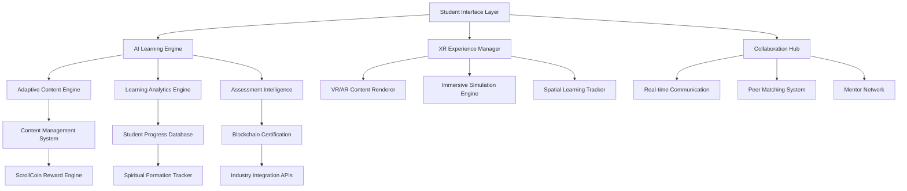
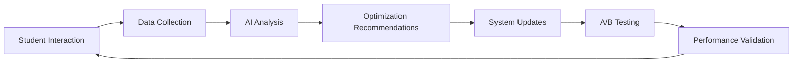

# Design Document

## Overview

The Scroll Revolutionary Learning Experience represents a paradigm shift in online education, combining cutting-edge AI, immersive technologies, spiritual formation, and economic incentives to create the world's most effective learning platform. This system will leverage our existing Scroll University infrastructure while introducing breakthrough innovations that make traditional platforms obsolete.

## Architecture

### Core System Architecture



### Microservices Architecture

The system will be built using a microservices architecture with the following core services:

- **AdaptiveLearningService**: AI-powered personalization engine
- **XRExperienceService**: Immersive content delivery and tracking
- **CollaborationService**: Real-time peer and mentor interactions
- **AssessmentIntelligenceService**: Advanced skill evaluation and certification
- **ScrollCoinEconomyService**: Gamification and reward mechanisms
- **SpiritualFormationService**: Christian growth integration
- **ContentOrchestrationService**: Dynamic content assembly and delivery
- **AnalyticsIntelligenceService**: Learning optimization and insights
- **GlobalAccessibilityService**: Inclusive design and accommodation
- **CareerAccelerationService**: Job placement and professional development
- **DeveloperPlatformService**: GitHub-superior code collaboration and version control
- **DataScienceCompetitionService**: Kaggle-superior competitions and research challenges
- **IntegratedDevelopmentService**: Seamless learning-to-coding pipeline
- **KingdomProjectService**: Open source ministry and impact project management

## Components and Interfaces

### 1. Adaptive AI Learning Engine

**Core Components:**
- Learning Style Analyzer
- Content Difficulty Adjuster
- Progress Prediction Engine
- Intervention Trigger System
- Personalization Algorithm

**Key Interfaces:**
```typescript
interface AdaptiveLearningEngine {
  analyzeStudentProfile(studentId: string): Promise<LearningProfile>;
  adjustContentDifficulty(contentId: string, studentId: string): Promise<AdaptedContent>;
  predictLearningOutcomes(studentId: string, courseId: string): Promise<PredictionResults>;
  triggerInterventions(studentId: string, strugglingAreas: string[]): Promise<InterventionPlan>;
  personalizeContent(studentId: string, topicId: string): Promise<PersonalizedContent>;
}
```

### 2. Immersive XR Experience Manager

**Core Components:**
- VR Environment Renderer
- AR Content Overlay System
- Spatial Learning Tracker
- Haptic Feedback Controller
- Cross-Platform Compatibility Layer

**Key Interfaces:**
```typescript
interface XRExperienceManager {
  createImmersiveEnvironment(courseId: string, topicId: string): Promise<XREnvironment>;
  trackSpatialLearning(studentId: string, environmentId: string): Promise<SpatialMetrics>;
  renderARContent(deviceCapabilities: DeviceSpecs, contentId: string): Promise<ARExperience>;
  manageCrossPlatformXR(platformType: XRPlatform): Promise<UnifiedExperience>;
}
```

### 3. Real-Time Collaboration Hub

**Core Components:**
- Peer Matching Algorithm
- Mentor Assignment System
- Real-time Communication Engine
- Collaborative Project Manager
- Social Learning Analytics

**Key Interfaces:**
```typescript
interface CollaborationHub {
  matchStudyPartners(studentId: string, criteria: MatchingCriteria): Promise<StudyGroup>;
  assignMentor(studentId: string, subjectArea: string): Promise<MentorAssignment>;
  facilitateRealTimeSession(sessionId: string, participants: string[]): Promise<SessionManager>;
  manageCollaborativeProject(projectId: string, teamMembers: string[]): Promise<ProjectWorkspace>;
}
```

### 4. Comprehensive Assessment Intelligence

**Core Components:**
- Multi-Modal Assessment Engine
- Peer Evaluation System
- AI Grading Algorithm
- Blockchain Certification Manager
- Competency Mapping System

**Key Interfaces:**
```typescript
interface AssessmentIntelligence {
  conductMultiModalAssessment(studentId: string, competencyId: string): Promise<AssessmentResult>;
  facilitatePeerEvaluation(evaluatorId: string, evaluateeId: string): Promise<PeerAssessment>;
  generateBlockchainCertificate(studentId: string, achievementId: string): Promise<BlockchainCert>;
  mapCompetencies(studentId: string, industryStandards: string[]): Promise<CompetencyMap>;
}
```

### 5. ScrollCoin Economy Engine

**Core Components:**
- Reward Calculation Algorithm
- Achievement Tracking System
- Economic Balance Manager
- Exchange Rate Controller
- Incentive Optimization Engine

**Key Interfaces:**
```typescript
interface ScrollCoinEconomy {
  calculateRewards(studentId: string, activities: LearningActivity[]): Promise<RewardAmount>;
  trackAchievements(studentId: string, milestones: Milestone[]): Promise<AchievementRecord>;
  manageEconomicBalance(totalSupply: number, demandMetrics: EconomicData): Promise<BalanceAdjustment>;
  optimizeIncentives(behaviorData: StudentBehavior[]): Promise<IncentiveStrategy>;
}
```

### 6. Advanced Developer Platform

**Core Components:**
- Cloud-based IDE with AI Pair Programming
- Advanced Version Control System
- Intelligent Code Review Engine
- Project Discovery and Recommendation System
- Collaborative Development Workspace

**Key Interfaces:**
```typescript
interface DeveloperPlatform {
  createCloudIDE(userId: string, projectType: string): Promise<CloudIDEInstance>;
  performAICodeReview(codeCommit: CodeCommit): Promise<ReviewResults>;
  discoverProjects(searchCriteria: ProjectSearchCriteria): Promise<ProjectRecommendations>;
  facilitateCollaboration(projectId: string, collaborators: string[]): Promise<CollaborationWorkspace>;
  monetizeProject(projectId: string, monetizationStrategy: MonetizationPlan): Promise<RevenueStream>;
}
```

### 7. Data Science Competition Platform

**Core Components:**
- Competition Management Engine
- Advanced Dataset Curation System
- Multi-Modal Solution Evaluation
- Real-World Implementation Pipeline
- Research Publication Integration

**Key Interfaces:**
```typescript
interface DataScienceCompetition {
  launchCompetition(competitionSpec: CompetitionSpecification): Promise<CompetitionInstance>;
  evaluateSolution(submissionId: string, evaluationCriteria: EvaluationCriteria[]): Promise<SolutionScore>;
  curateDataset(dataSource: DataSource, ethicalGuidelines: EthicalFramework): Promise<CuratedDataset>;
  implementSolution(winningSolution: Solution, implementationPlan: ImplementationPlan): Promise<DeploymentResult>;
  publishResearch(researchFindings: ResearchData, spiritualContext: SpiritualFramework): Promise<PublicationResult>;
}
```

### 8. Integrated Development Learning System

**Core Components:**
- Learning-to-Code Pipeline
- Contextual AI Coding Assistant
- Automated Portfolio Builder
- Skill Assessment Through Code Analysis
- Professional Showcase Platform

**Key Interfaces:**
```typescript
interface IntegratedDevelopmentLearning {
  createLearningRepository(courseId: string, studentId: string): Promise<LearningRepository>;
  provideContextualAssistance(codeContext: CodeContext, strugglingArea: string): Promise<CodingAssistance>;
  assessSkillThroughCode(codeSubmission: CodeSubmission): Promise<SkillAssessment>;
  buildProfessionalPortfolio(studentId: string, projectHistory: ProjectHistory[]): Promise<Portfolio>;
  showcaseToEmployers(portfolioId: string, employerCriteria: EmployerCriteria): Promise<CandidateProfile>;
}
```

## Data Models

### Core Data Structures

```typescript
interface StudentProfile {
  id: string;
  learningStyle: LearningStyleProfile;
  spiritualJourney: SpiritualFormationData;
  competencies: CompetencyMap;
  preferences: PersonalizationSettings;
  progress: LearningProgress;
  socialConnections: CollaborationNetwork;
}

interface AdaptiveContent {
  id: string;
  baseContent: ContentStructure;
  adaptations: ContentAdaptation[];
  difficultyLevel: number;
  spiritualIntegration: SpiritualElement[];
  xrComponents: XRContentElement[];
  assessmentPoints: AssessmentTrigger[];
}

interface XRLearningEnvironment {
  id: string;
  environmentType: 'VR' | 'AR' | 'MR';
  spatialElements: SpatialObject[];
  interactiveComponents: InteractiveElement[];
  learningObjectives: LearningObjective[];
  trackingPoints: SpatialTrackingPoint[];
}

interface CollaborativeLearningSession {
  id: string;
  participants: StudentProfile[];
  mentor: MentorProfile;
  objectives: SessionObjective[];
  activities: CollaborativeActivity[];
  outcomes: SessionOutcome[];
}

interface DeveloperProject {
  id: string;
  repository: CodeRepository;
  collaborators: DeveloperProfile[];
  codeQualityMetrics: CodeQualityScore;
  spiritualAlignment: SpiritualAlignmentScore;
  monetizationPlan: MonetizationStrategy;
  kingdomImpact: KingdomImpactMetrics;
}

interface DataScienceCompetition {
  id: string;
  challengeDescription: CompetitionChallenge;
  dataset: CuratedDataset;
  evaluationCriteria: EvaluationFramework[];
  submissions: CompetitionSubmission[];
  kingdomPurpose: KingdomPurposeStatement;
  realWorldApplication: ImplementationPlan;
}

interface IntegratedLearningProject {
  id: string;
  courseContext: CourseModule;
  codeRepository: LearningRepository;
  skillDevelopment: SkillProgressionMap;
  portfolioIntegration: PortfolioComponent;
  employerVisibility: EmployerShowcaseSettings;
}
```

## Error Handling

### Comprehensive Error Management Strategy

1. **Graceful Degradation**: When XR systems fail, automatically fall back to traditional 2D interfaces
2. **AI Fallback Mechanisms**: If personalization AI fails, use rule-based content delivery
3. **Offline Resilience**: Cache critical content for offline access during connectivity issues
4. **Real-time Recovery**: Implement circuit breakers for all external service dependencies
5. **User Experience Continuity**: Maintain learning progress even during system failures

### Error Categories and Responses

```typescript
enum ErrorCategory {
  TECHNICAL_FAILURE = 'technical_failure',
  CONTENT_UNAVAILABLE = 'content_unavailable',
  NETWORK_CONNECTIVITY = 'network_connectivity',
  AUTHENTICATION_ERROR = 'authentication_error',
  SPIRITUAL_CONTENT_CONCERN = 'spiritual_content_concern'
}

interface ErrorHandlingStrategy {
  category: ErrorCategory;
  fallbackAction: FallbackAction;
  userNotification: UserMessage;
  recoveryProcedure: RecoveryStep[];
  escalationPath: EscalationLevel[];
}
```

## Testing Strategy

### Multi-Layered Testing Approach

1. **Unit Testing**: Individual service components with 95%+ coverage
2. **Integration Testing**: Cross-service communication and data flow validation
3. **XR Experience Testing**: Immersive environment functionality across devices
4. **AI Model Testing**: Learning algorithm accuracy and bias detection
5. **Spiritual Alignment Testing**: Content review for biblical accuracy and appropriateness
6. **Performance Testing**: Load testing for concurrent users and real-time interactions
7. **Accessibility Testing**: Comprehensive disability accommodation validation
8. **Cultural Sensitivity Testing**: Multi-cultural content appropriateness verification

### Testing Framework Integration

```typescript
interface RevolutionaryLearningTestSuite {
  runAdaptiveLearningTests(): Promise<TestResults>;
  validateXRExperiences(): Promise<XRTestResults>;
  testCollaborationSystems(): Promise<CollaborationTestResults>;
  verifyAssessmentAccuracy(): Promise<AssessmentTestResults>;
  validateScrollCoinEconomy(): Promise<EconomicTestResults>;
  testSpiritualIntegration(): Promise<SpiritualTestResults>;
  runAccessibilityAudit(): Promise<AccessibilityTestResults>;
  performLoadTesting(): Promise<PerformanceTestResults>;
}
```

### Competitive Advantage Validation

The system will include specific testing to validate superiority over existing platforms:

- **Engagement Metrics**: Measure student engagement vs. Coursera, edX benchmarks
- **Learning Effectiveness**: Compare knowledge retention vs. traditional online courses
- **Completion Rates**: Track course completion vs. industry standards
- **Career Outcomes**: Monitor job placement success vs. LinkedIn Learning
- **Spiritual Growth**: Measure character development alongside academic progress
- **Economic Impact**: Track ScrollCoin value creation vs. traditional reward systems

### Continuous Improvement Loop



This design creates a self-improving system that continuously evolves to maintain its competitive advantage and deliver increasingly superior learning outcomes compared to all existing platforms.