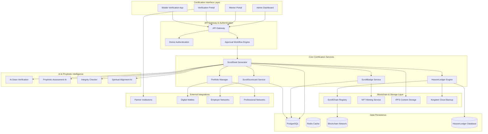

# ScrollSeal™ Certification System Design Document

## Overview

ScrollSeal™ represents a paradigm shift in credentialing, combining blockchain immutability, prophetic validation, and divine purpose alignment to create credentials that transcend traditional academic certificates. The system operates on a hybrid architecture that integrates earthly verification systems with heavenly record-keeping, ensuring that each credential carries both temporal recognition and eternal significance.

The platform is designed as a distributed certification ecosystem that can operate independently or integrate seamlessly with ScrollUniversity and other educational platforms. It prioritizes divine approval workflows, immutable record-keeping, and global accessibility while maintaining the highest standards of security and integrity.

## Architecture

### High-Level System Architecture



### Microservices Architecture

The ScrollSeal™ system is built on the following core microservices:

1. **ScrollSeal Generator Service**: Creates and manages all certification formats
2. **HeavenLedger Engine**: Maintains immutable academic and spiritual records
3. **Divine Approval Service**: Manages prophetic verification workflows
4. **ScrollBadge Service**: Issues and manages NFT micro-credentials
5. **ScrollScorecard Service**: Tracks holistic student development
6. **Verification Service**: Handles QR scanning and credential validation
7. **Global Recognition Service**: Manages partner integrations and job placement

## Components and Interfaces

### ScrollSeal™ Generator API

**Core Generator Interface:**
```typescript
interface ScrollSealGenerator {
  generateCertificate(request: CertificationRequest): Promise<ScrollSeal>;
  createPhysicalDiploma(sealId: string): Promise<PhysicalDiploma>;
  mintNFTCredential(sealId: string): Promise<NFTCredential>;
  generatePDFCertificate(sealId: string): Promise<PDFCertificate>;
  batchGenerate(requests: CertificationRequest[]): Promise<ScrollSeal[]>;
}

interface CertificationRequest {
  studentId: string;
  programId: string;
  completionDate: Date;
  mentorApproval: DivineApproval;
  academicRecord: AcademicTranscript;
  spiritualFormation: SpiritualMetrics;
  portfolioItems: PortfolioItem[];
  scrollCoinEarned: number;
}

interface ScrollSeal {
  id: string;
  heavenLedgerId: string;
  blockchainHash: string;
  certificationType: CertificationType;
  recipient: StudentProfile;
  program: DegreeProgram;
  signatures: DivineSignature[];
  qrVerificationCode: string;
  issuanceDate: Date;
  expirationDate?: Date;
  formats: CertificateFormat[];
}
```

**Certificate Types:**
```typescript
enum CertificationType {
  SCROLL_DIPLOMA = "scroll_diploma",
  SCROLL_MASTERY = "scroll_mastery", 
  SCROLL_DOCTORATE = "scroll_doctorate",
  SCROLL_EXOUSIA_HONOR = "scroll_exousia_honor"
}

interface CertificateFormat {
  type: FormatType;
  url: string;
  hash: string;
  metadata: FormatMetadata;
}

enum FormatType {
  PHYSICAL_SCROLL = "physical_scroll",
  PDF_CERTIFICATE = "pdf_certificate",
  NFT_TOKEN = "nft_token",
  DIGITAL_WALLET = "digital_wallet"
}
```

### HeavenLedger™ Immutable Record Engine

**HeavenLedger Architecture:**
```typescript
interface HeavenLedgerEngine {
  createRecord(record: AcademicRecord): Promise<HeavenLedgerEntry>;
  updateRecord(id: string, updates: RecordUpdate): Promise<HeavenLedgerEntry>;
  getRecord(id: string): Promise<HeavenLedgerEntry>;
  verifyIntegrity(id: string): Promise<IntegrityVerification>;
  syncToBlockchain(id: string): Promise<BlockchainSync>;
}

interface HeavenLedgerEntry {
  id: string;
  studentId: string;
  academicHistory: CourseCompletion[];
  spiritualFormation: SpiritualGrowthRecord[];
  propheticConfirmations: PropheticConfirmation[];
  characterAssessments: CharacterMetrics[];
  callingClarification: CallingRecord[];
  divineApprovals: DivineApproval[];
  createdAt: Date;
  lastUpdated: Date;
  integrityHash: string;
  blockchainReference: string;
}

interface PropheticConfirmation {
  mentorId: string;
  confirmationType: ConfirmationType;
  spiritualGift: SpiritualGift;
  callingAlignment: CallingAlignment;
  characterWitness: CharacterWitness;
  kingdomReadiness: ReadinessLevel;
  propheticWord: string;
  confirmationDate: Date;
  witnessSignature: string;
}
```

### Divine Approval Workflow System

**Approval Workflow Engine:**
```typescript
interface DivineApprovalWorkflow {
  initiateApproval(request: ApprovalRequest): Promise<ApprovalProcess>;
  assignMentor(processId: string, mentorId: string): Promise<MentorAssignment>;
  submitAssessment(processId: string, assessment: SpiritualAssessment): Promise<AssessmentResult>;
  providePropheticConfirmation(processId: string, confirmation: PropheticConfirmation): Promise<ConfirmationResult>;
  finalizeApproval(processId: string): Promise<ApprovalDecision>;
}

interface ApprovalRequest {
  studentId: string;
  programId: string;
  academicCompletion: AcademicMetrics;
  spiritualReadiness: SpiritualReadiness;
  characterDevelopment: CharacterAssessment;
  callingClarity: CallingAssessment;
  portfolioEvidence: PortfolioEvidence[];
}

interface SpiritualAssessment {
  biblicalKnowledge: KnowledgeScore;
  characterIntegrity: IntegrityScore;
  spiritualMaturity: MaturityLevel;
  callingConfirmation: CallingConfirmation;
  kingdomImpactPotential: ImpactPotential;
  propheticGiftOperation: GiftOperation;
  leadershipReadiness: LeadershipReadiness;
}
```

### ScrollBadge™ NFT Micro-Credentialing

**NFT Badge System:**
```typescript
interface ScrollBadgeService {
  mintBadge(courseCompletion: CourseCompletion): Promise<ScrollBadge>;
  verifyBadge(tokenId: string): Promise<BadgeVerification>;
  getBadgeCollection(studentId: string): Promise<ScrollBadge[]>;
  transferBadge(tokenId: string, newOwner: string): Promise<TransferResult>;
  updateBadgeMetadata(tokenId: string, metadata: BadgeMetadata): Promise<UpdateResult>;
}

interface ScrollBadge {
  tokenId: string;
  contractAddress: string;
  owner: string;
  courseId: string;
  competencies: Competency[];
  spiritualGrowth: SpiritualGrowthMetrics;
  assessmentResults: AssessmentResult[];
  mentorEndorsement: MentorEndorsement;
  mintDate: Date;
  metadata: NFTMetadata;
  verificationUrl: string;
}

interface Competency {
  skill: string;
  proficiencyLevel: ProficiencyLevel;
  assessmentMethod: AssessmentMethod;
  verificationEvidence: Evidence[];
  spiritualApplication: SpiritualApplication;
}
```

### QR Verification and Portfolio System

**Verification Interface:**
```typescript
interface VerificationSystem {
  scanQRCode(qrData: string): Promise<VerificationResult>;
  getVerifiedProfile(sealId: string): Promise<VerifiedProfile>;
  validateCredential(credentialId: string): Promise<ValidationResult>;
  getPortfolio(studentId: string): Promise<StudentPortfolio>;
  generateVerificationReport(sealId: string): Promise<VerificationReport>;
}

interface VerifiedProfile {
  student: StudentInformation;
  credentials: ScrollSeal[];
  academicTranscript: DetailedTranscript;
  spiritualFormation: SpiritualJourney;
  portfolio: PortfolioShowcase;
  mentorTestimonies: MentorTestimony[];
  divineImpactScore: ImpactScore;
  characterAssessment: CharacterProfile;
  callingConfirmation: CallingProfile;
}

interface PortfolioShowcase {
  codeProjects: CodeProject[];
  designWork: DesignProject[];
  writings: WritingPortfolio[];
  builds: BuildProject[];
  prophecies: PropheticWord[];
  leadershipExperience: LeadershipRecord[];
  kingdomImpact: ImpactProject[];
}
```

### ScrollScorecard™ Dynamic Assessment

**Scorecard System:**
```typescript
interface ScrollScorecardService {
  generateScorecard(studentId: string): Promise<ScrollScorecard>;
  updateScorecard(studentId: string, updates: ScorecardUpdate): Promise<ScrollScorecard>;
  getProgressHistory(studentId: string): Promise<ProgressHistory>;
  compareScorecard(studentId: string, benchmarks: Benchmark[]): Promise<ComparisonResult>;
  generateInsights(studentId: string): Promise<DevelopmentInsights>;
}

interface ScrollScorecard {
  studentId: string;
  wisdomAcquisition: WisdomMetrics;
  practicalSkills: SkillsAssessment;
  characterDevelopment: CharacterMetrics;
  purposeAlignment: PurposeMetrics;
  overallScore: number;
  growthTrajectory: GrowthProjection;
  recommendations: DevelopmentRecommendation[];
  lastUpdated: Date;
}

interface WisdomMetrics {
  biblicalKnowledge: number;
  spiritualDiscernment: number;
  practicalWisdom: number;
  culturalIntelligence: number;
  propheticInsight: number;
}
```

## Data Models

### Core Certification Models

```typescript
// Student Spiritual Profile
interface SpiritualProfile {
  id: string;
  studentId: string;
  salvationDate: Date;
  baptismDate?: Date;
  spiritualGifts: SpiritualGift[];
  callingClarification: CallingJourney;
  characterDevelopment: CharacterGrowth;
  propheticWords: PropheticWord[];
  mentorRelationships: MentorRelationship[];
  kingdomImpact: ImpactRecord[];
}

// Divine Signature System
interface DivineSignature {
  signatureType: SignatureType;
  signerId: string;
  signerRole: SignerRole;
  signatureData: string;
  timestamp: Date;
  spiritualAuthority: AuthorityLevel;
  propheticConfirmation?: string;
}

enum SignatureType {
  CHANCELLOR_SIGNATURE = "chancellor",
  SCROLL_DEAN_SIGNATURE = "scroll_dean", 
  PROPHETIC_WITNESS = "prophetic_witness",
  DIVINE_SEAL = "divine_seal"
}

// Global Recognition Network
interface RecognitionPartner {
  id: string;
  organizationName: string;
  partnerType: PartnerType;
  recognitionLevel: RecognitionLevel;
  integrationEndpoint: string;
  credentialMapping: CredentialMapping;
  activeStatus: boolean;
}

enum PartnerType {
  UN_SDG_SCHOOL = "un_sdg",
  FAITH_EMPLOYER = "faith_employer",
  DIGITAL_WALLET = "digital_wallet",
  SCROLLCOIN_EMPLOYER = "scrollcoin_employer",
  PROFESSIONAL_NETWORK = "professional_network"
}
```

### Blockchain Integration Models

```typescript
// ScrollChain Registry
interface ScrollChainEntry {
  blockHash: string;
  transactionHash: string;
  sealId: string;
  studentAddress: string;
  certificationData: CertificationData;
  propheticValidation: PropheticValidation;
  timestamp: number;
  gasUsed: number;
  confirmations: number;
}

// NFT Metadata Standard
interface ScrollSealNFTMetadata {
  name: string;
  description: string;
  image: string;
  external_url: string;
  attributes: NFTAttribute[];
  spiritual_attributes: SpiritualAttribute[];
  verification_data: VerificationData;
  kingdom_impact: KingdomImpactData;
}

interface SpiritualAttribute {
  trait_type: string;
  value: string | number;
  prophetic_confirmation: boolean;
  mentor_witness: string;
  spiritual_significance: string;
}
```

## Error Handling

### Comprehensive Error Management

1. **Divine Approval Failures:**
   - Spiritual readiness assessment failures
   - Character development concerns
   - Calling clarity issues
   - Mentor availability problems

2. **Blockchain Integration Errors:**
   - Network congestion handling
   - Gas fee optimization
   - Transaction failure recovery
   - Smart contract upgrade management

3. **Verification System Failures:**
   - QR code corruption handling
   - Database synchronization issues
   - Partner integration failures
   - Credential tampering detection

### Error Recovery Strategies

```typescript
interface ErrorRecoverySystem {
  spiritualGuidance: SpiritualRecoveryPlan;
  technicalFailover: TechnicalRecoveryPlan;
  mentorIntervention: MentorInterventionProtocol;
  divineGrace: GraceRecoveryMechanism;
}
```

## Testing Strategy

### Multi-Dimensional Testing Approach

1. **Spiritual Integrity Testing:**
   - Prophetic confirmation accuracy
   - Character assessment validation
   - Calling alignment verification
   - Divine approval workflow testing

2. **Technical Performance Testing:**
   - Blockchain transaction testing
   - NFT minting and verification
   - QR code generation and scanning
   - Global accessibility testing

3. **Integration Testing:**
   - Partner system integration
   - Digital wallet compatibility
   - Professional network synchronization
   - ScrollUniversity platform integration

4. **Security and Fraud Prevention:**
   - Credential tampering detection
   - Identity verification testing
   - Blockchain security auditing
   - Divine signature validation

This design provides a comprehensive architecture for ScrollSeal™ that truly transcends traditional credentialing by integrating divine approval, blockchain immutability, and global recognition into a unified system that serves both earthly and heavenly purposes.