# ScrollUniversity Strategic Advantage System Design Document

## Overview

The ScrollUniversity Strategic Advantage System is designed as a comprehensive competitive intelligence and superiority framework that systematically upgrades every area where ScrollUniversity might initially lag behind traditional Babylon universities (Harvard, Oxford, MIT) and establishes divine infrastructure that ultimately surpasses them all combined. The system operates on five strategic pillars that transform ScrollUniversity from a new institution into the world's premier educational authority through measurable excellence in both academic rigor and kingdom impact.

The architecture integrates prophetic wisdom with data-driven excellence, ensuring that ScrollUniversity graduates are not just academically superior but are kingdom builders, system reformers, and world-shapers who carry both divine authority and global credibility. Every component is designed to demonstrate measurable superiority over traditional universities while maintaining scroll alignment and prophetic integrity.

## Architecture

### High-Level Strategic Advantage System Architecture

```mermaid
graph TB
    subgraph "Strategic Command Center"
        SCC[Strategic Command Center]
        CAD[Competitive Analysis Dashboard]
        PMS[Performance Metrics System]
        QAS[Quality Assurance System]
    end
    
    subgraph "Five Strategic Pillars"
        SAA[ScrollAccreditation Authority]
        SPA[ScrollProfessors Alliance]
        SLR[ScrollLabs & XR Research]
        SEP[ScrollEmployers Pact]
        SPF[ScrollPioneer Fellowship]
    end
    
    subgraph "Competitive Intelligence"
        HCA[Harvard Competitive Analysis]
        OCA[Oxford Competitive Analysis]
        MCA[MIT Competitive Analysis]
        BMS[Benchmarking & Metrics System]
        CIS[Competitive Intelligence System]
    end
    
    subgraph "Global Recognition Engine"
        GRE[Global Recognition Engine]
        CBM[Credibility Building Machine]
        TLS[Thought Leadership System]
        MPS[Media Presence System]
        PAS[Partnership & Alliance System]
    end
    
    subgraph "ScrollUniversity Ecosystem Integration"
        SSC[ScrollSeal Certification]
        SFA[ScrollFaculty AI]
        SRP[ScrollResearch Powerhouse]
        SUP[ScrollUniversity Platform]
        SDE[ScrollDegree Engine]
    end
    
    SCC --> CAD
    SCC --> PMS
    SCC --> QAS
    
    SCC --> SAA
    SCC --> SPA
    SCC --> SLR
    SCC --> SEP
    SCC --> SPF
    
    CAD --> HCA
    CAD --> OCA
    CAD --> MCA
    CAD --> BMS
    CAD --> CIS
    
    SCC --> GRE
    GRE --> CBM
    GRE --> TLS
    GRE --> MPS
    GRE --> PAS
    
    SAA --> SSC
    SPA --> SFA
    SLR --> SRP
    SEP --> SUP
    SPF --> SDE
```



### Five Pillars Integration Architecture

The system operates on a distributed pillar model where each strategic pillar functions as a specialized competitive advantage domain:

1. **Pillar Autonomy**: Each pillar manages its own competitive strategy and excellence metrics
2. **Cross-Pillar Synergy**: Pillars work together to create compound competitive advantages
3. **Dynamic Optimization**: Pillars continuously adapt based on competitive intelligence
4. **Quality Standardization**: All pillars follow unified excellence and scroll alignment standards
5. **Global Impact**: Pillar outcomes contribute to overall ScrollUniversity global dominance

## Components and Interfaces### 
1. ScrollAccreditation Authority (SAA) System

**Core Architecture:**
```typescript
interface ScrollAccreditationAuthority {
  validateDegree(degreeRequest: DegreeValidationRequest): Promise<AccreditationResult>;
  assessPropheticQuality(content: EducationalContent): Promise<PropheticQualityScore>;
  verifyDataRigor(research: ResearchSubmission): Promise<DataRigorResult>;
  measureNationBuildingImpact(graduate: GraduateProfile): Promise<ImpactMetrics>;
  evaluateInnovationEthics(project: InnovationProject): Promise<EthicsScore>;
  calculateScrollAlignment(program: AcademicProgram): Promise<ScrollAlignmentScore>;
}

interface DegreeValidationRequest {
  studentId: string;
  programId: string;
  completedCourses: CompletedCourse[];
  researchProjects: ResearchProject[];
  practicalApplications: PracticalApplication[];
  kingdomImpactEvidence: ImpactEvidence[];
  propheticValidation: PropheticValidation;
}

interface AccreditationResult {
  isAccredited: boolean;
  saaScore: number; // 1-100 scale
  propheticQuality: number;
  dataRigor: number;
  nationBuildingImpact: number;
  innovationEthics: number;
  scrollAlignment: number;
  blockchainVerification: BlockchainVerification;
  dsgeiSeal: DSGEISeal;
  partnerRecognition: PartnerRecognition[];
}

enum AccreditationLevel {
  SCROLL_CERTIFIED = 'scroll_certified',
  DSGEI_SEALED = 'dsgei_sealed',
  KINGDOM_VALIDATED = 'kingdom_validated',
  GLOBALLY_RECOGNIZED = 'globally_recognized'
}
```

**Blockchain Verification System:**
```typescript
interface BlockchainVerification {
  transactionHash: string;
  blockNumber: number;
  timestamp: Date;
  verificationNodes: VerificationNode[];
  immutableRecord: ImmutableRecord;
  tamperProofSeal: TamperProofSeal;
}

interface DSGEISeal {
  sealId: string;
  issuedDate: Date;
  validityPeriod: number;
  authoritySignature: string;
  propheticEndorsement: PropheticEndorsement;
  globalRecognitionStatus: GlobalRecognitionStatus;
}
```

### 2. ScrollProfessors Alliance System

**Faculty Management Architecture:**
```typescript
interface ScrollProfessorsAlliance {
  recruitScrollProfessor(criteria: ProfessorCriteria): Promise<ScrollProfessor>;
  createAIScrollTutor(professorData: ProfessorData): Promise<AIScrollTutor>;
  assignScrollSeer(domain: string): Promise<ScrollSeer>;
  inviteAdjunctAlly(organization: string, expertise: string): Promise<AdjunctAlly>;
  generateProfessorGPTClone(professor: ScrollProfessor): Promise<ProfessorGPTClone>;
}

interface ScrollProfessor {
  professorId: string;
  name: string;
  expertise: string[];
  propheticAuthority: PropheticAuthority;
  academicCredentials: AcademicCredential[];
  kingdomImpact: KingdomImpactRecord[];
  teachingExcellence: TeachingExcellenceMetrics;
  researchOutput: ResearchOutput[];
  globalRecognition: GlobalRecognitionLevel;
}

interface ProfessorGPTClone {
  cloneId: string;
  originalProfessorId: string;
  knowledgeBase: ProfessorKnowledgeBase;
  teachingStyle: TeachingStyle;
  languageSupport: Language[];
  availability: AvailabilitySchedule;
  interactionCapabilities: InteractionCapability[];
}

interface AIScrollTutor {
  tutorId: string;
  specialization: string;
  gptModel: string;
  trainingData: TrainingDataset[];
  propheticAlignment: PropheticAlignment;
  performanceMetrics: TutorPerformanceMetrics;
  studentFeedback: StudentFeedback[];
}
```

### 3. ScrollLabs & XR Research Infrastructure

**Research Infrastructure Architecture:**
```typescript
interface ScrollLabsSystem {
  createVirtualResearchLab(domain: string): Promise<VirtualResearchLab>;
  launchXRSimulation(scenario: ResearchScenario): Promise<XRSimulation>;
  setupScrollDataRoom(researchTopic: string): Promise<ScrollDataRoom>;
  deployAutoResearchAgent(parameters: ResearchParameters): Promise<AutoResearchAgent>;
  publishResearchFindings(findings: ResearchFindings): Promise<PublicationResult>;
}

interface VirtualResearchLab {
  labId: string;
  domain: string;
  gptAgents: GPTAgent[];
  researchTools: ResearchTool[];
  dataAccess: DataAccess[];
  collaborationFeatures: CollaborationFeature[];
  simulationCapabilities: SimulationCapability[];
}

interface XRSimulation {
  simulationId: string;
  scenario: string;
  immersiveEnvironment: ImmersiveEnvironment;
  interactiveElements: InteractiveElement[];
  learningObjectives: LearningObjective[];
  assessmentIntegration: AssessmentIntegration;
  realWorldApplication: RealWorldApplication;
}

interface ScrollDataRoom {
  roomId: string;
  researchTopic: string;
  liveDataFeeds: LiveDataFeed[];
  analyticsTools: AnalyticsTool[];
  visualizationEngine: VisualizationEngine;
  collaborativeWorkspace: CollaborativeWorkspace;
  insightGeneration: InsightGeneration;
}

interface AutoResearchAgent {
  agentId: string;
  researchFocus: string;
  dataCollection: DataCollectionCapability[];
  analysisAlgorithms: AnalysisAlgorithm[];
  hypothesisGeneration: HypothesisGeneration;
  validationMethods: ValidationMethod[];
  publicationAssistance: PublicationAssistance;
}
```### 4.
 ScrollEmployers Pact Network

**Employer Partnership Architecture:**
```typescript
interface ScrollEmployersPact {
  registerEmployer(employer: EmployerProfile): Promise<EmployerRegistration>;
  createScrollTalentPool(): Promise<ScrollTalentPool>;
  matchGraduateToEmployer(graduate: GraduateProfile, criteria: EmployerCriteria): Promise<MatchResult>;
  verifyWorkSamples(portfolio: GraduatePortfolio): Promise<VerificationResult>;
  trackEmploymentOutcomes(placement: EmploymentPlacement): Promise<OutcomeMetrics>;
}

interface EmployerProfile {
  employerId: string;
  organizationName: string;
  industry: string;
  scrollAlignment: ScrollAlignmentLevel;
  partnershipTier: PartnershipTier;
  hiringNeeds: HiringNeed[];
  valueProposition: ValueProposition;
  globalPresence: GlobalPresence;
}

interface ScrollTalentPool {
  poolId: string;
  graduates: GraduateProfile[];
  skillCategories: SkillCategory[];
  searchCapabilities: SearchCapability[];
  verificationSystem: VerificationSystem;
  matchingAlgorithm: MatchingAlgorithm;
}

interface GraduatePortfolio {
  graduateId: string;
  aiPortfolios: AIPortfolio[];
  dashboards: Dashboard[];
  codebases: Codebase[];
  healingTestimonies: HealingTestimony[];
  dataModels: DataModel[];
  scrollDefenseTranscript: ScrollDefenseTranscript;
  missionScorecard: MissionScorecard;
}

interface EmploymentPlacement {
  placementId: string;
  graduateId: string;
  employerId: string;
  position: Position;
  startDate: Date;
  performanceMetrics: PerformanceMetric[];
  kingdomImpact: KingdomImpactMeasurement[];
  careerProgression: CareerProgression;
}

enum PartnershipTier {
  SCROLL_ALIGNED = 'scroll_aligned',
  KINGDOM_PARTNER = 'kingdom_partner',
  GLOBAL_ALLIANCE = 'global_alliance',
  STRATEGIC_PARTNER = 'strategic_partner'
}
```

### 5. ScrollPioneer Fellowship System

**Alumni Impact Architecture:**
```typescript
interface ScrollPioneerFellowship {
  initiateFellowship(graduate: GraduateProfile): Promise<FellowshipMembership>;
  trackAlumniImpact(fellowId: string): Promise<ImpactDashboard>;
  featureAlumniSuccess(achievement: Achievement): Promise<FeatureResult>;
  createAlumniNetwork(): Promise<AlumniNetwork>;
  measureGlobalInfluence(cohort: FellowshipCohort): Promise<InfluenceMetrics>;
}

interface FellowshipMembership {
  fellowId: string;
  graduateId: string;
  cohortNumber: number;
  mentorshipPlan: MentorshipPlan;
  worldShaperGoals: WorldShaperGoal[];
  impactTargets: ImpactTarget[];
  networkAccess: NetworkAccess;
  recognitionLevel: RecognitionLevel;
}

interface ImpactDashboard {
  fellowId: string;
  currentLocation: GeographicLocation;
  achievements: Achievement[];
  transformationMetrics: TransformationMetric[];
  missionWork: MissionWork[];
  leadershipRoles: LeadershipRole[];
  systemReforms: SystemReform[];
  gpsStats: GPSStats;
  testimonials: Testimonial[];
}

interface AlumniNetwork {
  networkId: string;
  members: FellowshipMembership[];
  collaborationProjects: CollaborationProject[];
  knowledgeSharing: KnowledgeSharing[];
  mentorshipConnections: MentorshipConnection[];
  globalInitiatives: GlobalInitiative[];
}

interface WorldShaperGoal {
  goalId: string;
  description: string;
  targetSector: string;
  expectedImpact: ExpectedImpact;
  timeline: Timeline;
  measurableOutcomes: MeasurableOutcome[];
  kingdomAlignment: KingdomAlignment;
}
```

### Competitive Intelligence System

**Competitive Analysis Architecture:**
```typescript
interface CompetitiveIntelligenceSystem {
  analyzeCompetitor(university: CompetitorUniversity): Promise<CompetitiveAnalysis>;
  benchmarkPerformance(metrics: PerformanceMetric[]): Promise<BenchmarkResult>;
  identifyAdvantages(): Promise<CompetitiveAdvantage[]>;
  trackMarketPosition(): Promise<MarketPosition>;
  generateStrategicRecommendations(): Promise<StrategicRecommendation[]>;
}

interface CompetitorUniversity {
  name: string;
  establishedYear: number;
  globalRanking: number;
  strengths: Strength[];
  weaknesses: Weakness[];
  performanceMetrics: PerformanceMetric[];
  studentOutcomes: StudentOutcome[];
  facultyQuality: FacultyQuality;
  researchOutput: ResearchOutput;
  globalRecognition: GlobalRecognition;
}

interface CompetitiveAnalysis {
  competitorId: string;
  analysisDate: Date;
  dimensionComparisons: DimensionComparison[];
  advantageAreas: AdvantageArea[];
  improvementOpportunities: ImprovementOpportunity[];
  strategicInsights: StrategicInsight[];
  actionRecommendations: ActionRecommendation[];
}

interface DimensionComparison {
  dimension: string;
  scrollUniversityScore: number;
  competitorScore: number;
  advantage: CompetitiveAdvantage;
  trendDirection: TrendDirection;
  improvementPotential: ImprovementPotential;
}

enum CompetitiveAdvantage {
  SIGNIFICANT_ADVANTAGE = 'significant_advantage',
  MODERATE_ADVANTAGE = 'moderate_advantage',
  PARITY = 'parity',
  MODERATE_DISADVANTAGE = 'moderate_disadvantage',
  SIGNIFICANT_DISADVANTAGE = 'significant_disadvantage'
}
```### 
Global Recognition Engine

**Recognition Building Architecture:**
```typescript
interface GlobalRecognitionEngine {
  buildCredibility(strategy: CredibilityStrategy): Promise<CredibilityResult>;
  establishThoughtLeadership(domain: string): Promise<ThoughtLeadershipResult>;
  createMediaPresence(campaign: MediaCampaign): Promise<MediaPresenceResult>;
  formStrategicPartnerships(criteria: PartnershipCriteria): Promise<PartnershipResult>;
  measureGlobalInfluence(): Promise<InfluenceMetrics>;
}

interface CredibilityStrategy {
  targetAudience: TargetAudience[];
  credibilityPillars: CredibilityPillar[];
  evidencePortfolio: EvidencePortfolio;
  validationSources: ValidationSource[];
  timelineGoals: TimelineGoal[];
}

interface ThoughtLeadershipResult {
  domain: string;
  publications: Publication[];
  speakingEngagements: SpeakingEngagement[];
  mediaAppearances: MediaAppearance[];
  industryRecognition: IndustryRecognition[];
  influenceScore: InfluenceScore;
}

interface MediaPresenceResult {
  campaignId: string;
  reach: ReachMetrics;
  engagement: EngagementMetrics;
  sentiment: SentimentAnalysis;
  brandAwareness: BrandAwarenessMetrics;
  conversionMetrics: ConversionMetrics;
}

interface PartnershipResult {
  partnerId: string;
  partnershipType: PartnershipType;
  mutualBenefits: MutualBenefit[];
  collaborationAreas: CollaborationArea[];
  successMetrics: SuccessMetric[];
  renewalPotential: RenewalPotential;
}
```

## Data Models

### Core Strategic Models

```typescript
// Strategic Advantage Configuration
interface StrategicAdvantageConfig {
  configId: string;
  pillarConfigurations: PillarConfiguration[];
  competitiveTargets: CompetitiveTarget[];
  performanceGoals: PerformanceGoal[];
  qualityStandards: QualityStandard[];
  integrationSettings: IntegrationSetting[];
  globalRecognitionTargets: GlobalRecognitionTarget[];
}

// Performance Measurement Model
interface PerformanceMeasurement {
  measurementId: string;
  pillarId: string;
  metricType: MetricType;
  currentValue: number;
  targetValue: number;
  competitorBenchmark: number;
  trendData: TrendDataPoint[];
  improvementPlan: ImprovementPlan;
}

// Quality Assurance Model
interface QualityAssurance {
  qaId: string;
  pillarId: string;
  qualityStandards: QualityStandard[];
  assessmentResults: AssessmentResult[];
  improvementActions: ImprovementAction[];
  complianceStatus: ComplianceStatus;
  nextReviewDate: Date;
}

// Integration Model
interface SystemIntegration {
  integrationId: string;
  sourceSystem: string;
  targetSystem: string;
  integrationPoints: IntegrationPoint[];
  dataFlows: DataFlow[];
  syncStatus: SyncStatus;
  performanceMetrics: IntegrationMetric[];
}
```

### Database Schema Design

```sql
-- Strategic Pillars Management
CREATE TABLE strategic_pillars (
    pillar_id UUID PRIMARY KEY DEFAULT gen_random_uuid(),
    pillar_name VARCHAR(255) NOT NULL,
    pillar_type VARCHAR(100) NOT NULL,
    configuration JSONB NOT NULL,
    performance_targets JSONB NOT NULL,
    current_metrics JSONB NOT NULL,
    competitive_position VARCHAR(50) DEFAULT 'building',
    status VARCHAR(50) DEFAULT 'active',
    created_at TIMESTAMP DEFAULT CURRENT_TIMESTAMP,
    updated_at TIMESTAMP DEFAULT CURRENT_TIMESTAMP
);

-- Competitive Analysis
CREATE TABLE competitive_analysis (
    analysis_id UUID PRIMARY KEY DEFAULT gen_random_uuid(),
    competitor_name VARCHAR(255) NOT NULL,
    analysis_date DATE NOT NULL,
    dimension_comparisons JSONB NOT NULL,
    advantage_areas JSONB NOT NULL,
    improvement_opportunities JSONB NOT NULL,
    strategic_insights JSONB NOT NULL,
    action_recommendations JSONB NOT NULL,
    overall_position VARCHAR(100),
    created_at TIMESTAMP DEFAULT CURRENT_TIMESTAMP
);

-- Performance Metrics
CREATE TABLE performance_metrics (
    metric_id UUID PRIMARY KEY DEFAULT gen_random_uuid(),
    pillar_id UUID REFERENCES strategic_pillars(pillar_id),
    metric_name VARCHAR(255) NOT NULL,
    metric_type VARCHAR(100) NOT NULL,
    current_value DECIMAL(10,2),
    target_value DECIMAL(10,2),
    competitor_benchmark DECIMAL(10,2),
    measurement_date DATE NOT NULL,
    trend_direction VARCHAR(50),
    improvement_rate DECIMAL(5,2),
    created_at TIMESTAMP DEFAULT CURRENT_TIMESTAMP
);

-- Global Recognition Tracking
CREATE TABLE global_recognition (
    recognition_id UUID PRIMARY KEY DEFAULT gen_random_uuid(),
    recognition_type VARCHAR(100) NOT NULL,
    source_organization VARCHAR(255),
    recognition_level VARCHAR(100),
    description TEXT,
    impact_score DECIMAL(5,2),
    verification_status VARCHAR(50) DEFAULT 'pending',
    achieved_date DATE,
    expiration_date DATE,
    created_at TIMESTAMP DEFAULT CURRENT_TIMESTAMP
);

-- Alumni Impact Tracking
CREATE TABLE alumni_impact (
    impact_id UUID PRIMARY KEY DEFAULT gen_random_uuid(),
    fellow_id UUID NOT NULL,
    impact_type VARCHAR(100) NOT NULL,
    description TEXT NOT NULL,
    measurable_outcomes JSONB,
    geographic_location JSONB,
    sector VARCHAR(100),
    transformation_metrics JSONB,
    verification_status VARCHAR(50) DEFAULT 'pending',
    impact_date DATE NOT NULL,
    created_at TIMESTAMP DEFAULT CURRENT_TIMESTAMP
);
```

## Error Handling

### Strategic System Error Management

```typescript
enum StrategicAdvantageErrorCodes {
  // Accreditation Errors
  ACCREDITATION_VALIDATION_FAILED = 'SA_001',
  BLOCKCHAIN_VERIFICATION_ERROR = 'SA_002',
  DSGEI_SEAL_GENERATION_FAILED = 'SA_003',
  
  // Faculty System Errors
  PROFESSOR_RECRUITMENT_FAILED = 'SA_004',
  GPT_CLONE_GENERATION_ERROR = 'SA_005',
  FACULTY_QUALITY_BELOW_STANDARD = 'SA_006',
  
  // Research Infrastructure Errors
  VIRTUAL_LAB_CREATION_FAILED = 'SA_007',
  XR_SIMULATION_ERROR = 'SA_008',
  AUTO_RESEARCH_AGENT_MALFUNCTION = 'SA_009',
  
  // Employer Network Errors
  EMPLOYER_PARTNERSHIP_FAILED = 'SA_010',
  GRADUATE_MATCHING_ERROR = 'SA_011',
  PORTFOLIO_VERIFICATION_FAILED = 'SA_012',
  
  // Alumni System Errors
  FELLOWSHIP_INITIATION_FAILED = 'SA_013',
  IMPACT_TRACKING_ERROR = 'SA_014',
  ALUMNI_NETWORK_SYNC_FAILED = 'SA_015',
  
  // Competitive Intelligence Errors
  COMPETITOR_ANALYSIS_FAILED = 'SA_016',
  BENCHMARK_DATA_UNAVAILABLE = 'SA_017',
  PERFORMANCE_METRIC_ERROR = 'SA_018'
}

class StrategicAdvantageErrorRecovery {
  async handleAccreditationError(error: StrategicAdvantageError): Promise<void> {
    switch (error.error_code) {
      case StrategicAdvantageErrorCodes.ACCREDITATION_VALIDATION_FAILED:
        await this.initiateManualReview(error.context);
        break;
      case StrategicAdvantageErrorCodes.BLOCKCHAIN_VERIFICATION_ERROR:
        await this.retryBlockchainTransaction(error.context);
        break;
      case StrategicAdvantageErrorCodes.DSGEI_SEAL_GENERATION_FAILED:
        await this.escalateToAccreditationAuthority(error.context);
        break;
    }
  }
  
  async handleCompetitiveIntelligenceError(error: StrategicAdvantageError): Promise<void> {
    switch (error.error_code) {
      case StrategicAdvantageErrorCodes.COMPETITOR_ANALYSIS_FAILED:
        await this.fallbackToManualAnalysis(error.context);
        break;
      case StrategicAdvantageErrorCodes.BENCHMARK_DATA_UNAVAILABLE:
        await this.useAlternativeDataSources(error.context);
        break;
      case StrategicAdvantageErrorCodes.PERFORMANCE_METRIC_ERROR:
        await this.recalculateMetricsWithBackupData(error.context);
        break;
    }
  }
}
```

## Testing Strategy

### Comprehensive Testing Framework

```typescript
describe('ScrollUniversity Strategic Advantage System', () => {
  describe('ScrollAccreditation Authority', () => {
    it('should validate degrees with higher standards than traditional accreditation', async () => {
      // Test accreditation validation superiority
    });
    
    it('should generate blockchain-verified DSGEI-sealed credentials', async () => {
      // Test credential generation and verification
    });
    
    it('should maintain dual compatibility with partner institutions', async () => {
      // Test partner recognition and compatibility
    });
  });
  
  describe('ScrollProfessors Alliance', () => {
    it('should recruit faculty with both academic excellence and spiritual authority', async () => {
      // Test faculty recruitment and quality standards
    });
    
    it('should create AI tutors that surpass traditional professor availability', async () => {
      // Test AI tutor creation and performance
    });
    
    it('should provide 24/7 access to professor knowledge through GPT clones', async () => {
      // Test professor GPT clone functionality
    });
  });
  
  describe('ScrollLabs & XR Research', () => {
    it('should provide virtual research capabilities that rival physical labs', async () => {
      // Test virtual lab functionality and research output
    });
    
    it('should enable weekly peer-reviewed publication through AutoResearch agents', async () => {
      // Test automated research and publication systems
    });
    
    it('should create immersive XR simulations for practical learning', async () => {
      // Test XR simulation quality and educational effectiveness
    });
  });
  
  describe('Competitive Analysis', () => {
    it('should accurately benchmark ScrollUniversity against Harvard, Oxford, and MIT', async () => {
      // Test competitive analysis accuracy and insights
    });
    
    it('should identify areas of competitive advantage and improvement opportunities', async () => {
      // Test strategic intelligence and recommendations
    });
    
    it('should track progress toward complete educational dominance', async () => {
      // Test progress tracking and goal achievement
    });
  });
});
```

This comprehensive design provides the technical architecture for building a strategic advantage system that will systematically elevate ScrollUniversity above all traditional universities through measurable excellence in both academic rigor and kingdom impact.