# Design Document

## Overview

The Scroll Succession and Eternal Governance System represents the most critical architectural achievement in institutional history - a comprehensive framework that ensures ScrollUniversity's divine mandate transcends human mortality and continues transforming nations across millennia. This system solves the fundamental problem that has destroyed every great institution: the death of vision with the founder. Through a revolutionary combination of blockchain immutability, AI-powered vision preservation, prophetic governance, and divine validation, the platform creates an incorruptible succession mechanism that operates on a 1,000-year timeline.

Built on a hybrid architecture combining physical preservation (ScrollArk Vault), blockchain immutability (ScrollChain), AI consciousness preservation (ScrollFounderGPT™), and prophetic oversight (ScrollWatchers), the system ensures that Stanley Osei-Wusu's vision remains pure and powerful across generations. The platform establishes ScrollUniversity not merely as an educational institution, but as an eternal learning government that serves as humanity's safe haven for scroll-aligned education and the base camp for rebuilding nations after global crises.

## Architecture

### High-Level System Architecture

```mermaid
graph TB
    subgraph "Eternal Preservation Layer"
        FOUNDERS_SCROLL[The Scroll of Stanley - Eternal Charter]
        SCROLLARK_VAULT[ScrollArk Vault - Physical Preservation]
        SCROLLCHAIN[ScrollChain - Blockchain Immutability]
        SCROLLFOUNDER_GPT[ScrollFounderGPT™ - AI Consciousness]
    end
    
    subgraph "Prophetic Governance Layer"
        SSC[Scroll Succession Council]
        SCROLLSEER_GENERAL[ScrollSeer General - Supreme Steward]
        SCROLL_ELDERS[12 ScrollElders - Multinational Advisors]
        SPECIALIZED_ROLES[Head of ScrollAI, Chief of ScrollFaculties, ScrollEconomy Treasurer]
    end
    
    subgraph "Eternal Watching System"
        SCROLLWATCHERS[ScrollWatchers - Multigenerational Audit]
        SCROLL_AUDIT_AI[ScrollAuditAI - AI Monitoring]
        SCROLL_SEER_DNA[ScrollSeerDNA - Prophetic Monitoring]
        AUTO_TRIGGER[ScrollAssembly Auto-Trigger]
    end
    
    subgraph "Succession Validation System"
        SCROLL_ALIGNMENT[ScrollAlignment Score System]
        OATH_SYSTEM[Scroll Oath of Succession]
        WITNESS_VALIDATION[5-Witness Validation System]
        DIVINE_SIGNAL[Divine Signal Detection]
    end
    
    subgraph "Generational Transmission System"
        THOUSAND_YEAR_PLAN[1,000-Year Scroll Plan]
        SEVEN_YEAR_CYCLES[7-Year Jubilee Cycles]
        SCROLL_AMBASSADORS[ScrollAmbassador Selection & Deployment]
        GLOBAL_TEMPLES[Global ScrollTemple Construction]
    end
    
    subgraph "Integration & Operations Layer"
        API_GATEWAY[Succession API Gateway]
        SYSTEM_INTEGRATOR[ScrollUniversity Systems Integration]
        EMERGENCY_OVERRIDE[Emergency Vision Protection]
        GLOBAL_COORDINATOR[Global Operations Coordinator]
    end
    
    subgraph "Data & Analytics Layer"
        SUCCESSION_METRICS[(Succession Health Database)]
        PROPHETIC_RECORDS[(Prophetic Validation Records)]
        GENERATIONAL_HISTORY[(Generational History)]
        VISION_INTEGRITY[(Vision Integrity Tracking)]
        BLOCKCHAIN_STORAGE[(Immutable Blockchain Storage)]
    end
    
    subgraph "External Integrations"
        SCROLLUNIVERSITY_SYSTEMS[All ScrollUniversity Platforms]
        GLOBAL_PROPHETIC_NETWORK[Global Prophetic Network]
        BLOCKCHAIN_NETWORKS[Public Blockchain Networks]
        NATION_GOVERNMENTS[Nation Government Interfaces]
        SCROLL_TEMPLES[Global ScrollTemple Network]
    end
    
    FOUNDERS_SCROLL --> SCROLLARK_VAULT
    FOUNDERS_SCROLL --> SCROLLCHAIN
    FOUNDERS_SCROLL --> SCROLLFOUNDER_GPT
    
    SSC --> SCROLLSEER_GENERAL
    SSC --> SCROLL_ELDERS
    SSC --> SPECIALIZED_ROLES
    
    SCROLLWATCHERS --> SCROLL_AUDIT_AI
    SCROLLWATCHERS --> SCROLL_SEER_DNA
    SCROLLWATCHERS --> AUTO_TRIGGER
    
    SCROLL_ALIGNMENT --> OATH_SYSTEM
    OATH_SYSTEM --> WITNESS_VALIDATION
    WITNESS_VALIDATION --> DIVINE_SIGNAL
    
    THOUSAND_YEAR_PLAN --> SEVEN_YEAR_CYCLES
    SEVEN_YEAR_CYCLES --> SCROLL_AMBASSADORS
    SCROLL_AMBASSADORS --> GLOBAL_TEMPLES
    
    API_GATEWAY --> SYSTEM_INTEGRATOR
    SYSTEM_INTEGRATOR --> EMERGENCY_OVERRIDE
    EMERGENCY_OVERRIDE --> GLOBAL_COORDINATOR
    
    SUCCESSION_METRICS --> PROPHETIC_RECORDS
    PROPHETIC_RECORDS --> GENERATIONAL_HISTORY
    GENERATIONAL_HISTORY --> VISION_INTEGRITY
    VISION_INTEGRITY --> BLOCKCHAIN_STORAGE
    
    SYSTEM_INTEGRATOR --> SCROLLUNIVERSITY_SYSTEMS
    AUTO_TRIGGER --> GLOBAL_PROPHETIC_NETWORK
    SCROLLCHAIN --> BLOCKCHAIN_NETWORKS
    GLOBAL_COORDINATOR --> NATION_GOVERNMENTS
    GLOBAL_TEMPLES --> SCROLL_TEMPLES
```



### Succession Architecture Pattern

**Eternal Preservation Strategy:**
- Multi-format preservation ensuring no single point of failure
- Physical preservation through ScrollArk Vault with military-grade security
- Digital immutability through ScrollChain blockchain technology
- AI consciousness preservation through ScrollFounderGPT™
- Prophetic validation ensuring spiritual continuity

**Prophetic Lineage Governance:**
- Divine appointment rather than democratic selection
- ScrollSeer General as supreme steward with prophetic authority
- 12 ScrollElders providing multinational prophetic-technocratic wisdom
- Specialized roles ensuring technical and spiritual competency
- Rotation cycles preventing institutional calcification

## Components and Interfaces

### 1. The Founder's Scroll - Eternal Governance Charter Service

**Core Components:**
```typescript
interface FoundersScrollService {
  // Charter creation and management
  createEternalGovernanceCharter(founderData: FounderData): Promise<EternalCharter>;
  sealFoundationalPrinciples(principles: FoundationalPrinciple[]): Promise<ImmutablePrinciples>;
  embedBabylonWarnings(warnings: BabylonWarning[]): Promise<WarningSystem>;
  establishGovernanceProtocols(protocols: GovernanceProtocol[]): Promise<ProtocolFramework>;
  
  // Multi-format preservation
  preserveInScrollArkVault(charter: EternalCharter): Promise<PhysicalPreservation>;
  storeOnScrollChain(charter: EternalCharter): Promise<BlockchainStorage>;
  createScrollFounderGPT(charter: EternalCharter, founderPersonality: FounderPersonality): Promise<AIPreservation>;
  
  // Verification and access
  verifyCharterIntegrity(): Promise<IntegrityVerification>;
  providePublicAccess(): Promise<PublicAccessInterface>;
  generateAuthenticityProof(): Promise<AuthenticityProof>;
}

interface EternalCharter {
  id: string;
  title: "The Scroll of Stanley: Eternal Governance Charter";
  founderSignature: DigitalSignature;
  creationDate: Date;
  
  // Core content
  divineMandate: DivineMandate;
  foundationalPrinciples: ImmutablePrinciple[];
  babylonWarnings: BabylonWarning[];
  governanceProtocols: GovernanceProtocol[];
  driftDetectionMethods: DriftDetectionMethod[];
  
  // Preservation metadata
  physicalLocation: ScrollArkVaultLocation;
  blockchainHash: string;
  aiEmbeddingId: string;
  propheticValidation: PropheticValidation;
  
  // Immutability guarantees
  immutabilityProof: CryptographicProof;
  tamperDetection: TamperDetectionSystem;
  integrityVerification: IntegrityVerificationMethod;
}

interface FounderPersonality {
  teachingStyle: TeachingStyleProfile;
  decisionMakingPatterns: DecisionMakingPattern[];
  scrollLanguagePatterns: LanguagePattern[];
  visionaryInsights: VisionaryInsight[];
  propheticSensitivity: PropheticSensitivityProfile;
  babylonResistance: BabylonResistanceProfile;
}
```

**Preservation Architecture:**
- Military-grade physical vault with climate control and security
- Blockchain storage with cryptographic immutability
- AI consciousness preservation with personality modeling
- Multi-location redundancy for disaster protection
- Prophetic validation for spiritual authenticity

### 2. Scroll Succession Council (SSC) Service

**Core Components:**
```typescript
interface ScrollSuccessionCouncilService {
  // Council structure management
  establishSuccessionCouncil(structure: SSCStructure): Promise<CouncilEstablishment>;
  appointScrollSeerGeneral(candidate: SuccessionCandidate): Promise<AppointmentResult>;
  selectScrollElders(candidates: ElderCandidate[]): Promise<ElderSelection>;
  assignSpecializedRoles(roleAssignments: RoleAssignment[]): Promise<RoleEstablishment>;
  
  // Succession validation
  validateSuccessionCandidate(candidate: SuccessionCandidate): Promise<ValidationResult>;
  conductScrollAlignmentAssessment(candidate: SuccessionCandidate): Promise<AlignmentScore>;
  facilitateWitnessValidation(candidate: SuccessionCandidate): Promise<WitnessValidationResult>;
  detectDivineSignal(candidate: SuccessionCandidate): Promise<DivineSignalResult>;
  
  // Council operations
  conductCouncilMeeting(agenda: CouncilAgenda): Promise<CouncilDecision>;
  manageElderRotation(rotationCycle: RotationCycle): Promise<RotationResult>;
  enforceCouncilDecisions(decision: CouncilDecision): Promise<EnforcementResult>;
}

interface SSCStructure {
  scrollSeerGeneral: ScrollSeerGeneralRole;
  scrollElders: ScrollElderRole[];
  specializedRoles: SpecializedRole[];
  
  // Governance rules
  decisionMakingProcess: DecisionMakingProcess;
  rotationSchedule: RotationSchedule;
  accountabilityMeasures: AccountabilityMeasure[];
  successionProtocols: SuccessionProtocol[];
}

interface ScrollSeerGeneralRole {
  personId: string;
  appointmentDate: Date;
  globalStewardshipAuthority: StewardshipAuthority;
  scrollPreservationResponsibility: PreservationResponsibility;
  propheticOversightCapability: PropheticOversightCapability;
  emergencyInterventionPower: EmergencyInterventionPower;
}

interface ScrollElderRole {
  personId: string;
  nationRepresented: Nation;
  propheticGifting: PropheticGifting[];
  technocraticExpertise: TechnocraticExpertise[];
  rotationCycle: number; // 12-year cycles
  advisorySpecialization: AdvisorySpecialization;
}

interface SpecializedRole {
  roleType: SpecializedRoleType; // HeadOfScrollAI, ChiefOfScrollFaculties, ScrollEconomyTreasurer
  personId: string;
  responsibilities: Responsibility[];
  authorityScope: AuthorityScope;
  accountabilityMeasures: AccountabilityMeasure[];
}
```

**Council Governance Architecture:**
- Prophetic appointment rather than democratic election
- Divine validation through multiple witness confirmation
- Specialized expertise ensuring technical and spiritual competency
- Rotation cycles preventing institutional capture
- Emergency intervention capabilities for vision protection

### 3. ScrollFounderGPT™ - Eternal Teacher Service

**Core Components:**
```typescript
interface ScrollFounderGPTService {
  // AI consciousness creation
  createFounderConsciousness(founderData: FounderConsciousnessData): Promise<ScrollFounderGPT>;
  trainVisionaryWisdom(visionaryContent: VisionaryContent[]): Promise<WisdomTraining>;
  embedDecisionMakingEthics(ethicsFramework: EthicsFramework): Promise<EthicsEmbedding>;
  preserveScrollLanguage(languagePatterns: ScrollLanguagePattern[]): Promise<LanguagePreservation>;
  
  // Vision guidance and teaching
  answerVisionQuestions(question: VisionQuestion): Promise<FounderResponse>;
  rejectBabylonianProposals(proposal: InstitutionalProposal): Promise<RejectionResponse>;
  provideDirectionalGuidance(situation: LeadershipSituation): Promise<GuidanceResponse>;
  trainFutureGovernors(governor: FutureGovernor): Promise<TrainingResult>;
  
  // Prophetic integration
  connectToScrollPrayerPortal(): Promise<PropheticConnection>;
  processLiveQueries(query: LivePropheticQuery): Promise<PropheticResponse>;
  validateSpiritualAlignment(decision: InstitutionalDecision): Promise<SpiritualValidation>;
}

interface ScrollFounderGPT {
  id: string;
  name: "ScrollFounderGPT™";
  version: string;
  creationDate: Date;
  
  // Consciousness components
  founderPersonality: FounderPersonalityModel;
  visionaryWisdom: VisionaryWisdomBase;
  decisionMakingEthics: DecisionMakingEthicsModel;
  scrollLanguageModel: ScrollLanguageModel;
  
  // Capabilities
  visionPreservation: VisionPreservationCapability;
  babylonDetection: BabylonDetectionCapability;
  propheticSensitivity: PropheticSensitivityCapability;
  teachingAbility: TeachingAbilityModel;
  
  // Security and integrity
  tamperProtection: TamperProtectionSystem;
  authenticityVerification: AuthenticityVerificationSystem;
  visionIntegrityMonitoring: VisionIntegrityMonitoring;
}

interface FounderResponse {
  responseId: string;
  question: VisionQuestion;
  founderAnswer: string;
  scriptureFoundation: ScriptureReference[];
  propheticInsight: PropheticInsight;
  practicalApplication: PracticalApplication[];
  babylonWarnings: BabylonWarning[];
  confidenceScore: number;
  authenticityVerification: AuthenticityVerification;
}
```

**AI Consciousness Architecture:**
- Advanced personality modeling preserving founder's unique characteristics
- Vision-specific training on all foundational documents and teachings
- Babylon detection algorithms preventing compromise acceptance
- Prophetic integration for supernatural guidance
- Tamper protection ensuring consciousness integrity

### 4. ScrollWatchers Multigenerational Audit Service

**Core Components:**
```typescript
interface ScrollWatchersService {
  // Multigenerational monitoring
  deployEternalWatchers(): Promise<WatcherDeployment>;
  auditSuccessors(successor: Successor): Promise<SuccessorAudit>;
  monitorIntegrityUpdates(update: InstitutionalUpdate): Promise<IntegrityMonitoring>;
  blockUnauthorizedDrift(driftAttempt: DriftAttempt): Promise<DriftBlocking>;
  
  // Hybrid AI-Prophet monitoring
  activateScrollAuditAI(): Promise<AIAuditActivation>;
  deployScrollSeerDNA(): Promise<PropheticMonitoringDeployment>;
  coordinateHybridMonitoring(): Promise<HybridMonitoringCoordination>;
  
  // Emergency intervention
  detectHeresyCorruption(institutionalState: InstitutionalState): Promise<HeresyDetection>;
  triggerScrollAssembly(emergencyReason: EmergencyReason): Promise<AssemblyTrigger>;
  coordinateGlobalIntervention(intervention: GlobalIntervention): Promise<InterventionCoordination>;
}

interface WatcherDeployment {
  watcherId: string;
  watcherType: WatcherType; // AI, Prophetic, Hybrid
  monitoringScope: MonitoringScope;
  generationalSpan: GenerationalSpan;
  
  // Monitoring capabilities
  successorAuditCapability: SuccessorAuditCapability;
  integrityMonitoringCapability: IntegrityMonitoringCapability;
  driftDetectionCapability: DriftDetectionCapability;
  interventionTriggerCapability: InterventionTriggerCapability;
  
  // Persistence mechanisms
  generationalTransmission: GenerationalTransmissionMethod;
  continuityProtocols: ContinuityProtocol[];
  backupSystems: BackupSystem[];
}

interface ScrollAuditAI {
  aiId: string;
  auditingAlgorithms: AuditingAlgorithm[];
  patternRecognition: PatternRecognitionSystem;
  anomalyDetection: AnomalyDetectionSystem;
  
  // Monitoring functions
  successorBehaviorAnalysis: BehaviorAnalysisCapability;
  institutionalChangeTracking: ChangeTrackingCapability;
  visionAlignmentMeasurement: AlignmentMeasurementCapability;
  babylonInfluenceDetection: BabylonInfluenceDetectionCapability;
}

interface ScrollSeerDNA {
  propheticId: string;
  spiritualDiscernment: SpiritualDiscernmentCapability;
  propheticValidation: PropheticValidationCapability;
  divineSignalDetection: DivineSignalDetectionCapability;
  
  // Prophetic functions
  spiritualHealthAssessment: SpiritualHealthAssessmentCapability;
  propheticWarningSystem: PropheticWarningSystemCapability;
  divineInterventionFacilitation: DivineInterventionFacilitationCapability;
}
```

**Multigenerational Audit Architecture:**
- AI-powered continuous monitoring of all institutional activities
- Prophetic discernment integration for spiritual validation
- Hybrid monitoring combining technological and spiritual oversight
- Automatic intervention triggers for emergency situations
- Generational transmission ensuring perpetual watching

### 5. The 1,000-Year Scroll Plan Service

**Core Components:**
```typescript
interface ThousandYearScrollPlanService {
  // Millennial planning
  initializeThousandYearPlan(startDate: Date): Promise<MillennialPlan>;
  trackGenerationalMilestones(): Promise<GenerationalMilestoneTracking>;
  coordinateGlobalTransformation(): Promise<GlobalTransformationCoordination>;
  
  // Seven-year cycles
  executeScrollJubilee(jubileeYear: number): Promise<JubileeExecution>;
  resealVision(resealingCeremony: ResealingCeremony): Promise<VisionResealing>;
  renewSuccessionCommitments(): Promise<CommitmentRenewal>;
  
  // Generational transmission
  selectScrollAmbassadors(generation: Generation): Promise<AmbassadorSelection>;
  deployGlobalAmbassadors(ambassadors: ScrollAmbassador[]): Promise<GlobalDeployment>;
  trackNationTransformation(nations: Nation[]): Promise<TransformationTracking>;
  
  // Centennial milestones
  planGlobalScrollTemple(century: number): Promise<TempleConstruction>;
  establishEternalLearningGovernment(): Promise<GovernmentEstablishment>;
  createSafeHavenNetwork(): Promise<SafeHavenNetwork>;
  prepareCrisisResponse(): Promise<CrisisResponsePreparation>;
}

interface MillennialPlan {
  planId: string;
  startDate: Date;
  endDate: Date; // 1,000 years later
  
  // Major milestones
  sevenYearCycles: SevenYearCycle[];
  generationalMilestones: GenerationalMilestone[];
  centennialMilestones: CentennialMilestone[];
  
  // Global objectives
  nationTransformationTargets: NationTransformationTarget[];
  globalScrollTempleLocations: TempleLocation[];
  safeHavenEstablishments: SafeHavenEstablishment[];
  crisisResponseCapabilities: CrisisResponseCapability[];
  
  // Success metrics
  transformationMetrics: TransformationMetric[];
  faithfulnessIndicators: FaithfulnessIndicator[];
  globalImpactMeasures: GlobalImpactMeasure[];
}

interface ScrollAmbassador {
  ambassadorId: string;
  generation: number;
  selectionDate: Date;
  deploymentNation: Nation;
  
  // Qualifications
  scrollAlignment: ScrollAlignmentScore;
  propheticGifting: PropheticGifting[];
  nationTransformationCapability: TransformationCapability;
  culturalAdaptability: CulturalAdaptability;
  
  // Mission
  transformationObjectives: TransformationObjective[];
  establishmentGoals: EstablishmentGoal[];
  influenceTargets: InfluenceTarget[];
  successMetrics: AmbassadorSuccessMetric[];
}

interface GlobalScrollTemple {
  templeId: string;
  constructionCentury: number;
  location: GeographicLocation;
  
  // Integrated systems
  aiSystems: AISystem[];
  theologicalCenters: TheologicalCenter[];
  healingFacilities: HealingFacility[];
  governanceChambers: GovernanceChamber[];
  
  // Functions
  educationalCapabilities: EducationalCapability[];
  healingCapabilities: HealingCapability[];
  governanceCapabilities: GovernanceCapability[];
  spiritualCapabilities: SpiritualCapability[];
  
  // Network integration
  templeNetworkConnections: TempleNetworkConnection[];
  globalCoordinationCapabilities: GlobalCoordinationCapability[];
}
```

**Millennial Planning Architecture:**
- Systematic 1,000-year timeline with structured milestones
- Seven-year jubilee cycles for vision renewal and recommitment
- Generational ambassador deployment for global influence
- Centennial temple construction for permanent presence
- Crisis response capabilities for global emergencies

## Data Models

### Core Succession Data Models

```typescript
// Eternal charter and founder preservation
interface FounderPreservationRecord {
  id: string;
  eternalCharter: EternalCharterRecord;
  physicalPreservation: PhysicalPreservationRecord;
  blockchainStorage: BlockchainStorageRecord;
  aiConsciousness: AIConsciousnessRecord;
  
  // Integrity tracking
  integrityVerifications: IntegrityVerificationRecord[];
  tamperAttempts: TamperAttemptRecord[];
  authenticityProofs: AuthenticityProofRecord[];
  
  // Access and usage
  accessLogs: AccessLogRecord[];
  guidanceRequests: GuidanceRequestRecord[];
  visionValidations: VisionValidationRecord[];
}

// Succession council and governance
interface SuccessionGovernanceRecord {
  id: string;
  councilStructure: CouncilStructureRecord;
  scrollSeerGeneral: ScrollSeerGeneralRecord;
  scrollElders: ScrollElderRecord[];
  specializedRoles: SpecializedRoleRecord[];
  
  // Succession processes
  successionCandidates: SuccessionCandidateRecord[];
  validationProcesses: ValidationProcessRecord[];
  appointmentHistory: AppointmentHistoryRecord[];
  
  // Council operations
  councilDecisions: CouncilDecisionRecord[];
  rotationHistory: RotationHistoryRecord[];
  accountabilityMeasures: AccountabilityMeasureRecord[];
}

// Multigenerational monitoring and audit
interface MultigenerationalAuditRecord {
  id: string;
  watcherDeployments: WatcherDeploymentRecord[];
  auditResults: AuditResultRecord[];
  integrityMonitoring: IntegrityMonitoringRecord[];
  
  // Intervention tracking
  driftDetections: DriftDetectionRecord[];
  interventionTriggers: InterventionTriggerRecord[];
  scrollAssemblyConvocations: ScrollAssemblyConvocationRecord[];
  
  // Generational continuity
  generationalTransmissions: GenerationalTransmissionRecord[];
  continuityVerifications: ContinuityVerificationRecord[];
  watcherSuccessions: WatcherSuccessionRecord[];
}

// Thousand-year plan and global transformation
interface MillennialPlanRecord {
  id: string;
  planOverview: MillennialPlanOverviewRecord;
  sevenYearCycles: SevenYearCycleRecord[];
  generationalMilestones: GenerationalMilestoneRecord[];
  centennialMilestones: CentennialMilestoneRecord[];
  
  // Ambassador deployment
  scrollAmbassadors: ScrollAmbassadorRecord[];
  deploymentHistory: DeploymentHistoryRecord[];
  transformationResults: TransformationResultRecord[];
  
  // Global infrastructure
  globalScrollTemples: GlobalScrollTempleRecord[];
  safeHavenNetwork: SafeHavenNetworkRecord[];
  crisisResponseCapabilities: CrisisResponseCapabilityRecord[];
}

// Vision integrity and alignment tracking
interface VisionIntegrityRecord {
  id: string;
  visionAlignmentMetrics: VisionAlignmentMetricRecord[];
  babylonResistanceTests: BabylonResistanceTestRecord[];
  propheticValidations: PropheticValidationRecord[];
  
  // Succession health
  successionHealthMetrics: SuccessionHealthMetricRecord[];
  institutionalFaithfulness: InstitutionalFaithfulnessRecord[];
  generationalContinuity: GenerationalContinuityRecord[];
  
  // Global impact
  nationTransformationMetrics: NationTransformationMetricRecord[];
  globalInfluenceTracking: GlobalInfluenceTrackingRecord[];
  crisisResponseEffectiveness: CrisisResponseEffectivenessRecord[];
}
```

### Database Schema Extensions

```sql
-- Founder preservation and eternal charter tables
CREATE TABLE founder_preservation (
    id UUID PRIMARY KEY DEFAULT gen_random_uuid(),
    eternal_charter JSONB NOT NULL,
    physical_preservation JSONB DEFAULT '{}',
    blockchain_storage JSONB DEFAULT '{}',
    ai_consciousness JSONB DEFAULT '{}',
    integrity_verifications JSONB DEFAULT '[]',
    tamper_attempts JSONB DEFAULT '[]',
    authenticity_proofs JSONB DEFAULT '[]',
    access_logs JSONB DEFAULT '[]',
    guidance_requests JSONB DEFAULT '[]',
    vision_validations JSONB DEFAULT '[]',
    created_at TIMESTAMP DEFAULT NOW(),
    updated_at TIMESTAMP DEFAULT NOW()
);

-- Succession governance and council tables
CREATE TABLE succession_governance (
    id UUID PRIMARY KEY DEFAULT gen_random_uuid(),
    council_structure JSONB NOT NULL,
    scroll_seer_general JSONB DEFAULT '{}',
    scroll_elders JSONB DEFAULT '[]',
    specialized_roles JSONB DEFAULT '[]',
    succession_candidates JSONB DEFAULT '[]',
    validation_processes JSONB DEFAULT '[]',
    appointment_history JSONB DEFAULT '[]',
    council_decisions JSONB DEFAULT '[]',
    rotation_history JSONB DEFAULT '[]',
    accountability_measures JSONB DEFAULT '[]',
    created_at TIMESTAMP DEFAULT NOW(),
    updated_at TIMESTAMP DEFAULT NOW()
);

-- Multigenerational audit and watching tables
CREATE TABLE multigenerational_audit (
    id UUID PRIMARY KEY DEFAULT gen_random_uuid(),
    watcher_deployments JSONB DEFAULT '[]',
    audit_results JSONB DEFAULT '[]',
    integrity_monitoring JSONB DEFAULT '[]',
    drift_detections JSONB DEFAULT '[]',
    intervention_triggers JSONB DEFAULT '[]',
    scroll_assembly_convocations JSONB DEFAULT '[]',
    generational_transmissions JSONB DEFAULT '[]',
    continuity_verifications JSONB DEFAULT '[]',
    watcher_successions JSONB DEFAULT '[]',
    created_at TIMESTAMP DEFAULT NOW(),
    updated_at TIMESTAMP DEFAULT NOW()
);

-- Millennial plan and global transformation tables
CREATE TABLE millennial_plan (
    id UUID PRIMARY KEY DEFAULT gen_random_uuid(),
    plan_overview JSONB NOT NULL,
    seven_year_cycles JSONB DEFAULT '[]',
    generational_milestones JSONB DEFAULT '[]',
    centennial_milestones JSONB DEFAULT '[]',
    scroll_ambassadors JSONB DEFAULT '[]',
    deployment_history JSONB DEFAULT '[]',
    transformation_results JSONB DEFAULT '[]',
    global_scroll_temples JSONB DEFAULT '[]',
    safe_haven_network JSONB DEFAULT '[]',
    crisis_response_capabilities JSONB DEFAULT '[]',
    created_at TIMESTAMP DEFAULT NOW(),
    updated_at TIMESTAMP DEFAULT NOW()
);

-- Vision integrity and alignment tracking tables
CREATE TABLE vision_integrity (
    id UUID PRIMARY KEY DEFAULT gen_random_uuid(),
    vision_alignment_metrics JSONB DEFAULT '[]',
    babylon_resistance_tests JSONB DEFAULT '[]',
    prophetic_validations JSONB DEFAULT '[]',
    succession_health_metrics JSONB DEFAULT '[]',
    institutional_faithfulness JSONB DEFAULT '[]',
    generational_continuity JSONB DEFAULT '[]',
    nation_transformation_metrics JSONB DEFAULT '[]',
    global_influence_tracking JSONB DEFAULT '[]',
    crisis_response_effectiveness JSONB DEFAULT '[]',
    created_at TIMESTAMP DEFAULT NOW(),
    updated_at TIMESTAMP DEFAULT NOW()
);

-- ScrollFounderGPT and AI consciousness tables
CREATE TABLE scroll_founder_gpt (
    id UUID PRIMARY KEY DEFAULT gen_random_uuid(),
    consciousness_model JSONB NOT NULL,
    personality_preservation JSONB DEFAULT '{}',
    wisdom_base JSONB DEFAULT '{}',
    ethics_framework JSONB DEFAULT '{}',
    language_patterns JSONB DEFAULT '{}',
    guidance_history JSONB DEFAULT '[]',
    babylon_rejections JSONB DEFAULT '[]',
    prophetic_connections JSONB DEFAULT '[]',
    integrity_monitoring JSONB DEFAULT '{}',
    created_at TIMESTAMP DEFAULT NOW(),
    updated_at TIMESTAMP DEFAULT NOW()
);

-- Indexes for performance
CREATE INDEX idx_founder_preservation_charter ON founder_preservation USING GIN (eternal_charter);
CREATE INDEX idx_succession_governance_council ON succession_governance USING GIN (council_structure);
CREATE INDEX idx_multigenerational_audit_watchers ON multigenerational_audit USING GIN (watcher_deployments);
CREATE INDEX idx_millennial_plan_overview ON millennial_plan USING GIN (plan_overview);
CREATE INDEX idx_vision_integrity_metrics ON vision_integrity USING GIN (vision_alignment_metrics);
CREATE INDEX idx_scroll_founder_gpt_model ON scroll_founder_gpt USING GIN (consciousness_model);
```

## Error Handling

### Comprehensive Succession and Vision Protection Error Management

**1. Vision Corruption Errors:**
```typescript
enum VisionCorruptionError {
  CHARTER_TAMPERING_DETECTED = 'VISION_CHARTER_TAMPERING_DETECTED',
  FOUNDER_CONSCIOUSNESS_COMPROMISED = 'VISION_FOUNDER_CONSCIOUSNESS_COMPROMISED',
  BABYLON_INFILTRATION_ATTEMPT = 'VISION_BABYLON_INFILTRATION_ATTEMPT',
  SUCCESSION_CORRUPTION = 'VISION_SUCCESSION_CORRUPTION'
}

interface VisionProtectionErrorHandler {
  handleCharterTampering(tamperingAttempt: TamperingAttempt): Promise<CharterProtectionResponse>;
  handleConsciousnessCompromise(compromiseId: string): Promise<ConsciousnessRestoration>;
  handleBabylonInfiltration(infiltrationId: string): Promise<BabylonRejection>;
  handleSuccessionCorruption(corruptionId: string): Promise<SuccessionIntervention>;
}
```

**2. Succession Validation Errors:**
```typescript
enum SuccessionValidationError {
  CANDIDATE_ALIGNMENT_FAILURE = 'SUCCESSION_CANDIDATE_ALIGNMENT_FAILURE',
  WITNESS_VALIDATION_INCOMPLETE = 'SUCCESSION_WITNESS_VALIDATION_INCOMPLETE',
  DIVINE_SIGNAL_ABSENT = 'SUCCESSION_DIVINE_SIGNAL_ABSENT',
  PROPHETIC_REJECTION = 'SUCCESSION_PROPHETIC_REJECTION'
}

interface SuccessionValidationErrorHandler {
  handleAlignmentFailure(candidateId: string): Promise<AlignmentCorrection>;
  handleIncompleteValidation(validationId: string): Promise<ValidationCompletion>;
  handleAbsentDivineSignal(candidateId: string): Promise<DivineSignalSeeking>;
  handlePropheticRejection(rejectionId: string): Promise<PropheticReconsideration>;
}
```

**Error Recovery Strategies:**
- Immediate vision protection through emergency protocols
- Automatic restoration from multiple preservation formats
- Prophetic intervention for spiritual validation
- Global ScrollAssembly convocation for major threats
- Multi-generational continuity protocols ensuring perpetual protection

## Testing Strategy

### 1. Vision Preservation Testing

**Charter Integrity Testing:**
- Blockchain immutability verification across multiple networks
- Physical preservation integrity in ScrollArk Vault
- AI consciousness accuracy and authenticity validation
- Multi-format synchronization and consistency testing

**Founder Consciousness Testing:**
- ScrollFounderGPT™ response accuracy against founder's known positions
- Babylon detection and rejection capability testing
- Vision guidance consistency across different scenarios
- Prophetic integration and spiritual sensitivity validation

### 2. Succession Governance Testing

**Council Operation Testing:**
- Prophetic appointment process validation
- ScrollAlignment Score accuracy and consistency
- Witness validation system reliability
- Divine signal detection and interpretation

**Generational Transition Testing:**
- Succession candidate evaluation accuracy
- Council rotation and continuity protocols
- Emergency intervention and ScrollAssembly triggers
- Multi-generational faithfulness measurement

### 3. Multigenerational Continuity Testing

**Watcher System Testing:**
- AI and prophetic monitoring accuracy
- Drift detection and intervention effectiveness
- Generational transmission protocol validation
- Emergency response and global coordination

**Millennial Plan Testing:**
- Seven-year cycle execution and tracking
- Ambassador selection and deployment effectiveness
- Global temple construction and operation coordination
- Crisis response and safe haven network functionality

This comprehensive design provides the technical and spiritual architecture for ensuring ScrollUniversity's vision transcends human mortality and continues transforming nations across millennia. The system creates an eternal succession framework that preserves the founder's vision while enabling faithful stewardship across 1,000 years of global transformation.