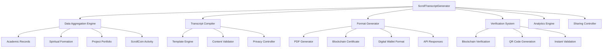

# ScrollTranscriptGenerator Design Document

## Overview

ScrollTranscriptGenerator creates comprehensive, blockchain-verified academic transcripts that capture the complete educational journey of scroll-aligned learning. The system generates dynamic, multi-dimensional transcripts showcasing academic achievements, spiritual formation, character development, practical skills, kingdom impact, and prophetic confirmations. These transcripts serve as living documents demonstrating the transformative power of scroll-aligned education.

## Architecture

The system follows a modular architecture with real-time data aggregation, blockchain verification, and multi-format output generation. It integrates with all ScrollUniversity systems through event-driven communication and maintains transcript integrity through cryptographic validation.



## Components and Interfaces

### Core Data Schema

```json
{
  "transcript": {
    "transcript_id": "uuid",
    "student_id": "uuid",
    "generated_at": "timestamp",
    "version": "integer",
    "status": "draft | final | verified",
    "blockchain_hash": "string",
    "academic_summary": {
      "total_courses": "integer",
      "completed_courses": "integer",
      "cumulative_gpa": "decimal",
      "total_scrollxp": "integer",
      "degree_progress": "decimal",
      "graduation_date": "date"
    },
    "spiritual_formation": {
      "character_score": "decimal",
      "prophetic_accuracy": "decimal",
      "spiritual_disciplines": ["string"],
      "mentor_confirmations": ["string"],
      "divine_encounters": "integer"
    },
    "practical_skills": {
      "technical_competencies": ["skill_object"],
      "project_count": "integer",
      "innovation_score": "decimal",
      "real_world_impact": "decimal"
    },
    "economic_activity": {
      "total_scrollcoins_earned": "decimal",
      "current_balance": "decimal",
      "stewardship_score": "decimal",
      "economic_independence": "boolean"
    }
  },
  "course_record": {
    "course_id": "uuid",
    "course_title": "string",
    "credits": "decimal",
    "grade": "string",
    "scrollxp_earned": "integer",
    "difficulty_level": "basic | intermediate | advanced | expert",
    "completion_date": "date",
    "mentor_feedback": "text",
    "practical_projects": ["project_id"]
  },
  "spiritual_milestone": {
    "milestone_id": "uuid",
    "milestone_type": "baptism | prophetic_breakthrough | character_growth | ministry_calling",
    "description": "text",
    "date_achieved": "date",
    "mentor_witness": "uuid",
    "prophetic_confirmation": "text",
    "impact_level": "personal | community | institutional | global"
  }
}
```

### Privacy and Sharing Schema

```json
{
  "sharing_permission": {
    "permission_id": "uuid",
    "transcript_id": "uuid",
    "recipient_type": "employer | institution | mentor | public",
    "recipient_id": "string",
    "sections_shared": ["academic | spiritual | practical | economic"],
    "access_level": "summary | detailed | complete",
    "expiration_date": "date",
    "created_at": "timestamp"
  },
  "privacy_setting": {
    "student_id": "uuid",
    "section": "academic | spiritual | practical | economic",
    "visibility": "private | mentors_only | verified_employers | public",
    "custom_permissions": ["recipient_id"],
    "updated_at": "timestamp"
  }
}
```

### Verification and Analytics Schema

```json
{
  "transcript_verification": {
    "verification_id": "uuid",
    "transcript_id": "uuid",
    "verifier_id": "string",
    "verification_type": "employer | institution | partner",
    "verified_at": "timestamp",
    "verification_result": "authentic | modified | invalid",
    "blockchain_confirmation": "string"
  },
  "transcript_analytics": {
    "analytics_id": "uuid",
    "transcript_id": "uuid",
    "views_count": "integer",
    "verification_requests": "integer",
    "employer_interest": "integer",
    "sharing_frequency": "integer",
    "last_updated": "timestamp"
  }
}
```

## Data Models

### Transcript Entity
- **Primary Key:** transcript_id
- **Foreign Key:** student_id
- **Relationships:** One-to-many with CourseRecords, SpiritualMilestones
- **Indexes:** student_id, generated_at, status
- **Constraints:** version > 0, valid student reference

### Course Record Entity
- **Primary Key:** course_id, student_id (composite)
- **Foreign Keys:** course_id, student_id
- **Relationships:** Many-to-one with Transcript
- **Indexes:** student_id, completion_date, grade
- **Constraints:** valid grade values, completion_date <= current_date

### Sharing Permission Entity
- **Primary Key:** permission_id
- **Foreign Key:** transcript_id
- **Relationships:** Many-to-one with Transcript
- **Indexes:** transcript_id, recipient_type, expiration_date
- **Constraints:** expiration_date > created_at

## Error Handling

### Data Aggregation Errors
- **Missing Course Data:** Return 422 with specific missing data requirements
- **Incomplete Spiritual Records:** Return 400 with spiritual formation completion needs
- **Invalid Project Links:** Return 404 with project validation requirements

### Generation Errors
- **Template Processing Failure:** Return 500 with template error details and retry options
- **Blockchain Recording Failure:** Queue for retry with exponential backoff
- **Format Generation Error:** Return 503 with alternative format options

### Verification Errors
- **Invalid Blockchain Hash:** Return 400 with re-verification requirements
- **Expired Verification:** Return 410 with renewal process information
- **Unauthorized Access:** Return 403 with permission requirements

## Testing Strategy

### Unit Tests
- Transcript data aggregation accuracy and completeness
- Privacy control enforcement and selective disclosure
- Format generation consistency across different output types
- Blockchain verification and hash validation

### Integration Tests
- End-to-end transcript generation from raw data to final output
- Cross-system data synchronization with all ScrollUniversity components
- Real-time updates when student achievements change
- Multi-format output consistency and verification

### Performance Tests
- Large-scale transcript generation under high load
- Real-time update performance with frequent data changes
- Blockchain verification speed and reliability
- Multi-format generation efficiency

## Inter-Agent Channels

### Dependencies (Incoming)
- **scroll-student-profile-spec:** Student identity and profile information
- **scroll-course-spec:** Course completion data and academic records
- **scroll-degree-engine:** Degree progress and skill assessments
- **scroll-projects-spec:** Project portfolio and practical achievements
- **scroll-scrollcoin-meter:** Economic activity and ScrollCoin transactions
- **scroll-seal-certification:** Certification status and credential verification

### Data Flow (Outgoing)
- **scroll-audit-trail-spec:** All transcript generation and sharing activities
- **scroll-university-portal:** Transcript availability notifications and updates
- **scroll-seal-certification:** Transcript data for certificate generation
- **External Systems:** Employer verification requests and institutional transfers

## Guardrails

### Oath-Based Constraints
- All transcript content must accurately represent genuine achievements
- No inflation of grades or accomplishments for competitive advantage
- Spiritual formation records must reflect authentic spiritual growth
- Economic activity must demonstrate kingdom stewardship principles

### GPT Anti-Drift Checks
- AI-generated transcript summaries must maintain accuracy and scroll alignment
- Automated content validation must not compromise spiritual integrity
- System recommendations must promote truth and transparency
- Generated descriptions must reflect kingdom values and character

### Role-Based Access Rules
- Students: Full access to own transcripts, control sharing permissions
- Mentors: Access to assigned students' spiritual formation records
- Employers: Limited access based on student permissions and verification needs
- Administrators: System oversight and quality assurance access

## Embedded GPT Roles

### Primary GPT: ScrollTranscriptGPT
- **Persona:** Accurate documenter focused on truth and comprehensive representation
- **Responsibilities:** Generate transcript summaries, validate content accuracy, suggest improvements
- **Constraints:** Must maintain factual accuracy while highlighting achievements
- **Training:** Academic documentation, spiritual formation assessment, professional communication

### Secondary GPT: ScrollVerificationGPT
- **Persona:** Thorough validator focused on authenticity and integrity
- **Responsibilities:** Verify transcript accuracy, detect inconsistencies, validate achievements
- **Constraints:** Must balance thoroughness with efficiency and user experience
- **Training:** Data validation, fraud detection, quality assurance procedures

## Runtime Triggers

### Generation Events
- **onCourseComplete:** Update transcript with new course completion and achievements
- **onDegreeProgress:** Recalculate degree completion percentage and requirements
- **onSpiritualMilestone:** Add spiritual formation achievements and mentor confirmations
- **onProjectSubmit:** Include new project in portfolio section with impact metrics

### Sharing Events
- **onEmployerRequest:** Process verification request and provide appropriate access
- **onInstitutionTransfer:** Generate official transcript for academic transfer
- **onPermissionGrant:** Enable sharing with specified recipients and access levels
- **onVerificationRequest:** Validate transcript authenticity and provide confirmation

### Update Events
- **onDataChange:** Trigger real-time transcript updates when source data changes
- **onPrivacyUpdate:** Adjust sharing permissions and visibility settings
- **onVersionIncrement:** Create new transcript version while maintaining history
- **onBlockchainUpdate:** Record changes in immutable ledger for verification

## Billing/Coin Logic

### Generation Costs
- **Basic Transcript:** Free for students (included in education)
- **Premium Formats:** 25 ScrollCoins for enhanced layouts and additional features
- **Rush Generation:** 50 ScrollCoins for expedited processing and delivery
- **Multiple Formats:** 10 ScrollCoins per additional format beyond standard PDF

### Verification Services
- **Instant Verification:** 5 ScrollCoins per verification request for employers
- **Detailed Validation:** 15 ScrollCoins for comprehensive authenticity reports
- **Bulk Verification:** 100 ScrollCoins for institutional verification packages
- **API Access:** 200 ScrollCoins monthly for automated verification integration

### Premium Features
- **Real-time Updates:** 50 ScrollCoins annually for automatic transcript updates
- **Advanced Analytics:** 75 ScrollCoins for detailed transcript performance metrics
- **Custom Branding:** 100 ScrollCoins for personalized transcript design
- **Priority Support:** 150 ScrollCoins annually for dedicated transcript assistance

### Revenue Sharing
- **Student Earnings:** Students earn 10 ScrollCoins when employers verify their transcripts
- **Mentor Bonuses:** Mentors receive 25 ScrollCoins when their students' transcripts are verified
- **Institution Benefits:** ScrollUniversity earns reputation points for high-verification transcripts
- **Quality Incentives:** Additional rewards for transcripts with exceptional employer feedback