# Design Document

## Overview

The ScrollUniversity Tuition System is designed as a revolutionary educational payment and access platform that breaks from traditional university models of exclusion and debt creation. The system implements a covenant-based approach where tuition funds mission rather than profit, integrating ScrollCoin cryptocurrency, work-trade programs, and global equity pricing to ensure universal access while maintaining sustainable operations.

The architecture follows a microservices approach with clear separation between payment processing, access control, value delivery, and integration with the broader ScrollUniversity ecosystem. The system prioritizes transparency, accessibility, and kingdom impact over traditional profit metrics.

## Architecture

### High-Level System Architecture

```mermaid
graph TB
    subgraph "Frontend Layer"
        UI[Tuition Portal UI]
        Mobile[Mobile App]
        API_Gateway[API Gateway]
    end
    
    subgraph "Core Services"
        Auth[Authentication Service]
        Payment[Payment Processing Service]
        Access[Access Control Service]
        Pricing[Dynamic Pricing Service]
        Scholarship[Scholarship Management]
    end
    
    subgraph "Payment Integrations"
        Stripe[Stripe Integration]
        Flutter[Flutterwave Integration]
        ScrollCoin[ScrollCoin Wallet]
        Crypto[Crypto Wallet Integration]
        WorkTrade[Work-Trade System]
    end
    
    subgraph "ScrollUniversity Ecosystem"
        Gamification[Gamification Engine]
        Curriculum[Curriculum Grid]
        Certification[ScrollSeal System]
        Research[Research Powerhouse]
        Faculty[Faculty AI System]
    end
    
    subgraph "External Systems"
        Blockchain[HeavenLedger Blockchain]
        Employers[ScrollEmployers Network]
        Partners[UN/NGO Partners]
    end
    
    UI --> API_Gateway
    Mobile --> API_Gateway
    API_Gateway --> Auth
    API_Gateway --> Payment
    API_Gateway --> Access
    API_Gateway --> Pricing
    API_Gateway --> Scholarship
    
    Payment --> Stripe
    Payment --> Flutter
    Payment --> ScrollCoin
    Payment --> Crypto
    Payment --> WorkTrade
    
    Access --> Gamification
    Access --> Curriculum
    Access --> Certification
    Access --> Research
    Access --> Faculty
    
    Payment --> Blockchain
    Access --> Employers
    Scholarship --> Partners
```



### Service Architecture Patterns

The system follows Domain-Driven Design (DDD) principles with clear bounded contexts:

- **Payment Context**: Handles all payment processing, currency conversion, and transaction management
- **Access Context**: Manages program access, tier validation, and content unlocking
- **Pricing Context**: Implements dynamic pricing, global equity adjustments, and discount calculations
- **Integration Context**: Coordinates with ScrollUniversity ecosystem and external systems

## Components and Interfaces

### 1. Payment Processing Service

**Responsibilities:**
- Process payments across multiple methods (fiat, crypto, ScrollCoin)
- Handle currency conversion and exchange rate management
- Manage payment verification and confirmation
- Track payment history and generate receipts

**Key Interfaces:**
```typescript
interface PaymentProcessor {
  processPayment(paymentRequest: PaymentRequest): Promise<PaymentResult>
  validatePayment(transactionId: string): Promise<ValidationResult>
  refundPayment(transactionId: string, reason: string): Promise<RefundResult>
  getPaymentHistory(userId: string): Promise<PaymentHistory[]>
}

interface PaymentRequest {
  userId: string
  programId: string
  amount: number
  currency: Currency
  paymentMethod: PaymentMethod
  metadata?: PaymentMetadata
}

enum PaymentMethod {
  CREDIT_CARD = 'credit_card',
  SCROLL_COIN = 'scroll_coin',
  CRYPTOCURRENCY = 'cryptocurrency',
  WORK_TRADE = 'work_trade',
  SCHOLARSHIP = 'scholarship'
}
```

### 2. Dynamic Pricing Service

**Responsibilities:**
- Calculate location-based pricing adjustments
- Apply ScrollCoin discounts and work-trade credits
- Manage scholarship eligibility and application
- Handle tier-based pricing logic

**Key Interfaces:**
```typescript
interface PricingEngine {
  calculatePrice(pricingRequest: PricingRequest): Promise<PricingResult>
  applyDiscounts(basePrice: number, discounts: Discount[]): Promise<number>
  validateScholarshipEligibility(userId: string, scholarshipType: ScholarshipType): Promise<boolean>
  getGlobalEquityMultiplier(location: string): Promise<number>
}

interface PricingRequest {
  userId: string
  programTier: ProgramTier
  userLocation: string
  scrollCoinBalance: number
  workTradeCredits: number
  scholarshipCodes: string[]
}

enum ProgramTier {
  SCROLL_OPEN = 'scroll_open',
  SCROLL_STARTER = 'scroll_starter',
  SCROLL_DEGREE = 'scroll_degree',
  SCROLL_DOCTORATE = 'scroll_doctorate',
  SCROLL_SCHOLARSHIP = 'scroll_scholarship'
}
```

### 3. Access Control Service

**Responsibilities:**
- Manage program access based on payment status
- Coordinate with ScrollUniversity ecosystem for content unlocking
- Track and validate user permissions
- Handle access revocation and restoration

**Key Interfaces:**
```typescript
interface AccessController {
  grantAccess(userId: string, programId: string, accessLevel: AccessLevel): Promise<void>
  validateAccess(userId: string, resourceId: string): Promise<boolean>
  revokeAccess(userId: string, programId: string, reason: string): Promise<void>
  getAccessSummary(userId: string): Promise<AccessSummary>
}

interface AccessLevel {
  tier: ProgramTier
  features: string[]
  expirationDate?: Date
  restrictions?: AccessRestriction[]
}
```

### 4. ScrollCoin Integration Service

**Responsibilities:**
- Interface with ScrollCoin blockchain
- Track ScrollCoin earnings and spending
- Manage work-trade credit calculations
- Handle ScrollCoin-to-fiat conversions

**Key Interfaces:**
```typescript
interface ScrollCoinService {
  getBalance(userId: string): Promise<number>
  transferScrollCoin(fromUser: string, toUser: string, amount: number): Promise<TransactionResult>
  awardScrollCoin(userId: string, activity: ScrollCoinActivity, amount: number): Promise<void>
  convertToFiat(scrollCoinAmount: number, targetCurrency: string): Promise<number>
}

enum ScrollCoinActivity {
  DAILY_XP_STREAK = 'daily_xp_streak',
  COURSE_COMPLETION = 'course_completion',
  RESEARCH_PUBLICATION = 'research_publication',
  MENTORING = 'mentoring',
  TRANSLATION = 'translation',
  TOOL_BUILDING = 'tool_building',
  MISSION_SERVICE = 'mission_service'
}
```

### 5. Work-Trade Management Service

**Responsibilities:**
- Track work-trade contributions and credits
- Validate work completion and quality
- Calculate tuition credit values
- Manage work-trade opportunities

**Key Interfaces:**
```typescript
interface WorkTradeManager {
  createWorkOpportunity(opportunity: WorkOpportunity): Promise<string>
  assignWork(userId: string, opportunityId: string): Promise<void>
  validateWorkCompletion(submissionId: string): Promise<ValidationResult>
  calculateTuitionCredit(workType: WorkType, hoursCompleted: number): Promise<number>
}

enum WorkType {
  SCROLL_BUILDING = 'scroll_building',
  TRANSLATION = 'translation',
  RESEARCH = 'research',
  CODING = 'coding',
  ADMINISTRATION = 'administration',
  AI_DEVELOPMENT = 'ai_development',
  DESIGN = 'design',
  MISSIONS = 'missions'
}
```

## Data Models

### Core Entities

```typescript
interface User {
  id: string
  email: string
  location: string
  scholarshipStatus: ScholarshipStatus
  scrollCoinBalance: number
  workTradeCredits: number
  paymentHistory: PaymentRecord[]
  accessLevels: AccessLevel[]
  createdAt: Date
  updatedAt: Date
}

interface Program {
  id: string
  name: string
  tier: ProgramTier
  basePriceUSD: number
  scrollCoinPrice: number
  description: string
  features: ProgramFeature[]
  prerequisites: string[]
  duration: number
  isActive: boolean
}

interface PaymentRecord {
  id: string
  userId: string
  programId: string
  amount: number
  currency: string
  paymentMethod: PaymentMethod
  status: PaymentStatus
  transactionId: string
  processedAt: Date
  metadata: PaymentMetadata
}

interface ScholarshipApplication {
  id: string
  userId: string
  scholarshipType: ScholarshipType
  status: ApplicationStatus
  documentation: string[]
  approvedBy?: string
  approvedAt?: Date
  reason?: string
}

enum ScholarshipType {
  ORPHAN = 'orphan',
  MISSIONARY = 'missionary',
  REFUGEE = 'refugee',
  GLOBAL_SOUTH = 'global_south',
  SCROLL_WITNESS = 'scroll_witness'
}
```

### Database Schema Design

The system uses a hybrid approach with PostgreSQL for transactional data and MongoDB for flexible document storage:

**PostgreSQL Tables:**
- `users` - Core user information and authentication
- `programs` - Program definitions and pricing
- `payments` - Payment transactions and history
- `access_grants` - User access permissions and expiration
- `scholarship_applications` - Scholarship requests and approvals

**MongoDB Collections:**
- `user_profiles` - Extended user information and preferences
- `work_trade_submissions` - Work-trade project submissions and evaluations
- `scroll_coin_transactions` - ScrollCoin transaction history
- `pricing_adjustments` - Location-based pricing modifications

## Error Handling

### Payment Processing Errors

The system implements comprehensive error handling for payment scenarios:

```typescript
enum PaymentErrorType {
  INSUFFICIENT_FUNDS = 'insufficient_funds',
  INVALID_PAYMENT_METHOD = 'invalid_payment_method',
  CURRENCY_CONVERSION_FAILED = 'currency_conversion_failed',
  SCROLL_COIN_NETWORK_ERROR = 'scroll_coin_network_error',
  EXTERNAL_GATEWAY_ERROR = 'external_gateway_error',
  FRAUD_DETECTION = 'fraud_detection'
}

interface PaymentError {
  type: PaymentErrorType
  message: string
  retryable: boolean
  suggestedAction?: string
  supportContact?: string
}
```

### Error Recovery Strategies

1. **Payment Failures**: Automatic retry with exponential backoff for transient errors
2. **Access Revocation**: Grace period before access removal for payment issues
3. **ScrollCoin Network Issues**: Fallback to cached exchange rates and manual verification
4. **External Service Outages**: Queue transactions for processing when services recover

### User-Friendly Error Messages

All errors are translated into actionable guidance:
- Payment declined → Suggest alternative payment methods or ScrollCoin
- Insufficient ScrollCoin → Display earning opportunities and current balance
- Geographic restrictions → Explain global equity pricing and alternatives
- Scholarship rejection → Provide feedback and reapplication guidance

## Testing Strategy

### Unit Testing

Each service component has comprehensive unit tests covering:
- Payment processing logic with mock payment gateways
- Pricing calculations with various discount scenarios
- Access control validation with different user types
- ScrollCoin integration with simulated blockchain responses

### Integration Testing

End-to-end testing scenarios include:
- Complete payment flow from selection to access grant
- Cross-service communication between payment and access systems
- External API integration with Stripe, Flutterwave, and crypto wallets
- ScrollUniversity ecosystem integration for seamless user experience

### Load Testing

Performance testing focuses on:
- Concurrent payment processing during enrollment periods
- ScrollCoin transaction throughput during high-activity periods
- Database performance with large user bases
- API response times under various load conditions

### Security Testing

Security validation includes:
- Payment data encryption and PCI compliance
- ScrollCoin wallet security and transaction validation
- User authentication and authorization flows
- Protection against common payment fraud patterns

### User Acceptance Testing

Testing with real users covers:
- Payment flow usability across different cultures and languages
- Mobile payment experience in various global regions
- Scholarship application and approval processes
- Work-trade submission and credit calculation accuracy

## Security Considerations

### Payment Security

- **PCI DSS Compliance**: All credit card processing through certified gateways
- **Encryption**: End-to-end encryption for all payment data
- **Tokenization**: Payment method tokenization to avoid storing sensitive data
- **Fraud Detection**: Real-time fraud monitoring and risk assessment

### ScrollCoin Security

- **Wallet Integration**: Secure connection to ScrollCoin blockchain
- **Transaction Verification**: Multi-signature validation for large transactions
- **Private Key Management**: Hardware security module (HSM) for key storage
- **Audit Trail**: Immutable transaction logging on HeavenLedger

### Access Control Security

- **JWT Tokens**: Secure token-based authentication with short expiration
- **Role-Based Access**: Granular permissions based on payment tier
- **Session Management**: Secure session handling with automatic timeout
- **API Security**: Rate limiting and DDoS protection for all endpoints

### Data Privacy

- **GDPR Compliance**: Full compliance with European data protection regulations
- **Data Minimization**: Collect only necessary information for service delivery
- **Right to Erasure**: Ability to delete user data upon request
- **Cross-Border Transfers**: Secure data handling across global regions

## Performance Optimization

### Caching Strategy

- **Redis Caching**: Cache frequently accessed pricing and program data
- **CDN Integration**: Global content delivery for static resources
- **Database Indexing**: Optimized indexes for payment and access queries
- **Query Optimization**: Efficient database queries with minimal joins

### Scalability Design

- **Microservices Architecture**: Independent scaling of payment and access services
- **Load Balancing**: Distribute traffic across multiple service instances
- **Database Sharding**: Partition user data across multiple database instances
- **Async Processing**: Background processing for non-critical operations

### Monitoring and Alerting

- **Real-time Metrics**: Payment success rates, response times, and error rates
- **Business Metrics**: Revenue tracking, conversion rates, and user engagement
- **System Health**: Service availability, database performance, and resource usage
- **Alert Management**: Automated alerts for critical issues and threshold breaches

## Integration Points

### ScrollUniversity Ecosystem Integration

The tuition system integrates seamlessly with other ScrollUniversity components:

1. **Gamification Engine**: Payment triggers unlock ScrollXP, badges, and achievements
2. **Curriculum Grid**: Access control coordinates with course availability
3. **ScrollSeal Certification**: Payment tier determines certification levels available
4. **Research Powerhouse**: Program access enables research tools and publishing
5. **Faculty AI System**: Payment unlocks different levels of AI tutor interaction

### External System Integration

1. **HeavenLedger Blockchain**: Immutable record of all transactions and credentials
2. **ScrollEmployers Network**: Graduate placement based on program completion
3. **UN/NGO Partners**: Scholarship code distribution and validation
4. **Global Payment Networks**: Multi-region payment processing and compliance

### API Design

RESTful APIs with GraphQL for complex queries:

```typescript
// REST Endpoints
POST /api/v1/payments/process
GET /api/v1/payments/history/{userId}
POST /api/v1/access/grant
GET /api/v1/pricing/calculate

// GraphQL Schema
type Query {
  user(id: ID!): User
  program(id: ID!): Program
  calculatePricing(request: PricingRequest!): PricingResult
}

type Mutation {
  processPayment(request: PaymentRequest!): PaymentResult
  grantAccess(userId: ID!, programId: ID!): AccessResult
  applyScholarship(application: ScholarshipApplication!): ApplicationResult
}
```

This design ensures the ScrollUniversity Tuition System delivers on its revolutionary promise of universal access while maintaining operational sustainability and seamless integration with the broader educational ecosystem.