# Design Document

## Overview

The ScrollUniversity Tutoring and Lecture System is a revolutionary multi-dimensional learning platform that transcends traditional educational models. Built on a microservices architecture with AI-first design principles, the system integrates seamlessly with the existing ScrollUniversity ecosystem while introducing cutting-edge capabilities for personalized, immersive, and spiritually-aligned education.

The platform leverages the existing Node.js/Express backend, React frontend, PostgreSQL database, and Redis caching infrastructure, while extending capabilities through specialized AI services, real-time communication systems, and XR integration layers. The design emphasizes scalability, real-time performance, and multi-modal content delivery to support global learners across diverse contexts and learning preferences.

## Architecture

### High-Level System Architecture

```mermaid
graph TB
    subgraph "Client Layer"
        WEB[Web Portal - React]
        MOBILE[Mobile App - Flutter]
        XR[XR Clients - Unity/WebXR]
        VOICE[Voice Interfaces]
    end
    
    subgraph "API Gateway & Load Balancer"
        GATEWAY[API Gateway]
        LB[Load Balancer]
    end
    
    subgraph "Core Services"
        AUTH[Authentication Service]
        COURSE[Course Management]
        USER[User Management]
        PROGRESS[Progress Tracking]
    end
    
    subgraph "Tutoring & Lecture Services"
        AI_TUTOR[ScrollMentorGPT Service]
        VIDEO[Video Lecture Service]
        LIVE[Live Streaming Service]
        XR_SERVICE[XR Experience Service]
        VOICE_SERVICE[Voice Processing Service]
        LAB[Hands-On Lab Service]
        COLLAB[Collaboration Service]
    end
    
    subgraph "AI & ML Layer"
        GPT4[GPT-4o Integration]
        CLAUDE[Claude-3 Integration]
        SPEECH[Speech-to-Text/TTS]
        VISION[Computer Vision]
        PERSONALIZATION[Learning Personalization]
    end
    
    subgraph "Real-Time Communication"
        WEBSOCKET[WebSocket Server]
        WEBRTC[WebRTC Signaling]
        STREAMING[Media Streaming]
    end
    
    subgraph "Data Layer"
        POSTGRES[(PostgreSQL)]
        REDIS[(Redis Cache)]
        MEDIA_STORAGE[(Media Storage)]
        VECTOR_DB[(Vector Database)]
    end
    
    subgraph "External Integrations"
        OPENAI[OpenAI API]
        ANTHROPIC[Anthropic API]
        UNITY[Unity Cloud]
        CDN[Content Delivery Network]
    end
    
    WEB --> GATEWAY
    MOBILE --> GATEWAY
    XR --> GATEWAY
    VOICE --> GATEWAY
    
    GATEWAY --> LB
    LB --> AUTH
    LB --> COURSE
    LB --> USER
    LB --> PROGRESS
    
    LB --> AI_TUTOR
    LB --> VIDEO
    LB --> LIVE
    LB --> XR_SERVICE
    LB --> VOICE_SERVICE
    LB --> LAB
    LB --> COLLAB
    
    AI_TUTOR --> GPT4
    AI_TUTOR --> CLAUDE
    VOICE_SERVICE --> SPEECH
    XR_SERVICE --> VISION
    
    LIVE --> WEBSOCKET
    LIVE --> WEBRTC
    VIDEO --> STREAMING
    
    AI_TUTOR --> OPENAI
    AI_TUTOR --> ANTHROPIC
    XR_SERVICE --> UNITY
    VIDEO --> CDN
    
    POSTGRES --> REDIS
    AI_TUTOR --> VECTOR_DB
    VIDEO --> MEDIA_STORAGE
```



### Service Architecture Patterns

**Microservices Design:**
- Each tutoring and lecture component operates as an independent service
- Event-driven communication between services using Redis pub/sub
- API-first design with OpenAPI specifications
- Horizontal scaling capabilities for high-demand services

**Real-Time Architecture:**
- WebSocket connections for live interactions
- WebRTC for peer-to-peer video/audio in group sessions
- Server-Sent Events for progress updates and notifications
- Redis streams for event sourcing and replay capabilities

## Components and Interfaces

### 1. ScrollMentorGPT AI Tutoring Service

**Core Components:**
```typescript
interface ScrollMentorGPTService {
  // Course-specific tutor management
  createCourseTutor(courseId: string, config: TutorConfig): Promise<TutorInstance>;
  getTutorForCourse(courseId: string, studentId: string): Promise<TutorInstance>;
  
  // Multi-modal interaction handling
  processTextQuery(query: TextQuery): Promise<TutorResponse>;
  processVoiceQuery(audioData: AudioData): Promise<TutorResponse>;
  processImageQuery(imageData: ImageData, context: string): Promise<TutorResponse>;
  processScrollQuery(scrollData: ScrollQuery): Promise<TutorResponse>;
  
  // Conversation management
  maintainContext(conversationId: string, context: ConversationContext): Promise<void>;
  generateVisualAids(topic: string, learningStyle: LearningStyle): Promise<VisualAid[]>;
  
  // Personalization
  adaptToLearningStyle(studentId: string, interactions: Interaction[]): Promise<PersonalizationUpdate>;
  trackLearningProgress(studentId: string, courseId: string): Promise<ProgressMetrics>;
}

interface TutorConfig {
  courseContent: CourseContent;
  learningObjectives: LearningObjective[];
  assessmentCriteria: AssessmentCriteria[];
  culturalContext: CulturalContext;
  spiritualAlignment: SpiritualAlignment;
  languagePreferences: LanguagePreference[];
}

interface TutorResponse {
  textResponse?: string;
  audioResponse?: AudioData;
  visualAids?: VisualAid[];
  interactiveElements?: InteractiveElement[];
  followUpQuestions?: string[];
  learningAssessment?: LearningAssessment;
}
```

**AI Integration Architecture:**
- Primary: GPT-4o for comprehensive tutoring and visual understanding
- Secondary: Claude-3 for complex reasoning and ethical discussions
- Specialized models for voice processing and image analysis
- Vector database for course content embeddings and semantic search
- Fine-tuning capabilities for ScrollUniversity-specific knowledge

### 2. Video Lecture System (ScrollClass)

**Core Components:**
```typescript
interface VideoLectureService {
  // Content management
  createLecture(lectureData: LectureData): Promise<Lecture>;
  organizeLecturePlaylist(courseId: string, lectures: Lecture[]): Promise<Playlist>;
  generateChapters(videoId: string): Promise<Chapter[]>;
  
  // Accessibility and localization
  generateSubtitles(videoId: string, languages: string[]): Promise<Subtitle[]>;
  createTranscript(videoId: string): Promise<Transcript>;
  generateKeyConceptTimestamps(videoId: string): Promise<Timestamp[]>;
  
  // Progress tracking
  saveWatchProgress(studentId: string, videoId: string, progress: WatchProgress): Promise<void>;
  getWatchHistory(studentId: string, courseId: string): Promise<WatchHistory>;
  
  // Interactive features
  addInteractiveElements(videoId: string, elements: InteractiveElement[]): Promise<void>;
  processQuizResponses(studentId: string, responses: QuizResponse[]): Promise<QuizResult>;
}

interface Lecture {
  id: string;
  title: string;
  description: string;
  duration: number;
  videoUrl: string;
  thumbnailUrl: string;
  chapters: Chapter[];
  subtitles: Subtitle[];
  transcript: Transcript;
  interactiveElements: InteractiveElement[];
  learningObjectives: LearningObjective[];
}

interface Chapter {
  id: string;
  title: string;
  startTime: number;
  endTime: number;
  keyTopics: string[];
  summary: string;
}
```

**Video Infrastructure:**
- CDN integration for global content delivery
- Adaptive bitrate streaming for various connection speeds
- Support for multiple video formats and resolutions
- Integration with existing media storage systems
- Real-time analytics for engagement tracking

### 3. Live Streaming System (ScrollLive)

**Core Components:**
```typescript
interface LiveStreamingService {
  // Session management
  createLiveSession(sessionData: LiveSessionData): Promise<LiveSession>;
  startStream(sessionId: string): Promise<StreamInfo>;
  endStream(sessionId: string): Promise<RecordingInfo>;
  
  // Real-time interaction
  handleChatMessage(sessionId: string, message: ChatMessage): Promise<void>;
  processQAQuestion(sessionId: string, question: Question): Promise<void>;
  moderateContent(sessionId: string, content: Content): Promise<ModerationResult>;
  
  // Multi-presenter support
  addPresenter(sessionId: string, presenterId: string): Promise<void>;
  enableScreenShare(sessionId: string, presenterId: string): Promise<void>;
  switchCamera(sessionId: string, cameraId: string): Promise<void>;
  
  // Recording and replay
  generateRecording(sessionId: string): Promise<Recording>;
  preserveInteractiveElements(sessionId: string): Promise<InteractiveSession>;
}

interface LiveSession {
  id: string;
  title: string;
  description: string;
  scheduledTime: Date;
  duration: number;
  presenters: Presenter[];
  maxParticipants: number;
  interactionSettings: InteractionSettings;
  recordingSettings: RecordingSettings;
}

interface StreamInfo {
  streamUrl: string;
  chatRoomId: string;
  qaChannelId: string;
  participantCount: number;
  qualitySettings: QualitySettings;
}
```

**Real-Time Infrastructure:**
- WebRTC for low-latency video streaming
- Socket.io for real-time chat and interactions
- Redis for session state management
- Horizontal scaling for high-concurrency sessions
- Global time zone handling and notifications

### 4. XR Experience Service

**Core Components:**
```typescript
interface XRExperienceService {
  // Environment management
  createXREnvironment(environmentData: XREnvironmentData): Promise<XREnvironment>;
  loadHistoricalScene(sceneId: string, context: HistoricalContext): Promise<XRScene>;
  
  // Avatar interaction
  initializeAvatar(avatarId: string, personality: AvatarPersonality): Promise<Avatar>;
  processAvatarConversation(avatarId: string, input: ConversationInput): Promise<AvatarResponse>;
  
  // Multi-user collaboration
  createCollaborativeSession(sessionData: CollaborativeSessionData): Promise<XRSession>;
  synchronizeUserActions(sessionId: string, actions: UserAction[]): Promise<void>;
  
  // Learning assessment
  trackXRLearningObjectives(sessionId: string, objectives: LearningObjective[]): Promise<void>;
  assessXRPerformance(studentId: string, sessionId: string): Promise<PerformanceAssessment>;
  
  // Platform compatibility
  generateWebXRExperience(environmentId: string): Promise<WebXRPackage>;
  createVRHeadsetExperience(environmentId: string): Promise<VRPackage>;
}

interface XREnvironment {
  id: string;
  name: string;
  description: string;
  historicalPeriod?: HistoricalPeriod;
  geographicalLocation?: GeographicalLocation;
  assets: XRAsset[];
  interactiveObjects: InteractiveObject[];
  learningObjectives: LearningObjective[];
  navigationPoints: NavigationPoint[];
}

interface Avatar {
  id: string;
  name: string;
  historicalFigure?: HistoricalFigure;
  personality: AvatarPersonality;
  knowledgeBase: KnowledgeBase;
  conversationCapabilities: ConversationCapability[];
  visualAppearance: VisualAppearance;
}
```

**XR Technology Stack:**
- Unity for high-fidelity 3D environments
- WebXR for browser-based experiences
- A-Frame for lightweight web VR
- AI-powered avatar conversations using GPT-4o
- Spatial audio for immersive experiences
- Cross-platform compatibility (VR headsets, mobile AR, web)

### 5. Voice Processing Service

**Core Components:**
```typescript
interface VoiceProcessingService {
  // Speech recognition
  processVoiceInput(audioData: AudioData, language: string): Promise<TranscriptionResult>;
  detectIntent(transcription: string, context: ConversationContext): Promise<Intent>;
  
  // Text-to-speech
  generateSpeechResponse(text: string, voiceSettings: VoiceSettings): Promise<AudioData>;
  createMultilingualResponse(text: string, targetLanguages: string[]): Promise<MultilingualAudio>;
  
  // Conversation management
  maintainVoiceContext(conversationId: string, context: VoiceContext): Promise<void>;
  processVoiceCommands(command: VoiceCommand): Promise<CommandResult>;
  
  // Accessibility features
  provideVoiceNavigation(currentContext: NavigationContext): Promise<VoiceNavigation>;
  convertTextToSpeech(text: string, accessibilitySettings: AccessibilitySettings): Promise<AudioData>;
}

interface VoiceSettings {
  language: string;
  accent: string;
  speed: number;
  pitch: number;
  emotionalTone: EmotionalTone;
  culturalContext: CulturalContext;
}

interface TranscriptionResult {
  text: string;
  confidence: number;
  language: string;
  detectedIntent: Intent;
  entities: Entity[];
  sentiment: SentimentAnalysis;
}
```

**Voice Technology Integration:**
- OpenAI Whisper for speech-to-text
- Azure Cognitive Services for multi-language support
- Custom voice models for ScrollUniversity personalities
- Real-time voice processing with low latency
- Noise cancellation and audio enhancement

### 6. Hands-On Laboratory Service

**Core Components:**
```typescript
interface HandsOnLabService {
  // Lab environment management
  createLabEnvironment(labConfig: LabConfig): Promise<LabEnvironment>;
  provideDatasets(labId: string, requirements: DataRequirements): Promise<Dataset[]>;
  setupDevelopmentTools(labId: string, toolRequirements: ToolRequirement[]): Promise<DevEnvironment>;
  
  // Project management
  initializeProject(studentId: string, labId: string): Promise<Project>;
  trackProjectProgress(projectId: string): Promise<ProjectProgress>;
  
  // AI assistance
  provideAIGuidance(projectId: string, currentState: ProjectState): Promise<AIGuidance>;
  debugCode(code: string, context: DebuggingContext): Promise<DebuggingResult>;
  
  // Assessment and feedback
  assessLabWork(projectId: string, submission: LabSubmission): Promise<LabAssessment>;
  generateFeedback(assessment: LabAssessment): Promise<DetailedFeedback>;
  
  // Portfolio integration
  addToPortfolio(studentId: string, project: CompletedProject): Promise<PortfolioEntry>;
}

interface LabEnvironment {
  id: string;
  name: string;
  description: string;
  tools: DevelopmentTool[];
  datasets: Dataset[];
  apis: APIAccess[];
  computeResources: ComputeResource[];
  collaborationFeatures: CollaborationFeature[];
}

interface Project {
  id: string;
  studentId: string;
  labId: string;
  title: string;
  objectives: ProjectObjective[];
  milestones: Milestone[];
  resources: Resource[];
  currentState: ProjectState;
  aiAssistant: AIAssistant;
}
```

**Lab Infrastructure:**
- Containerized development environments using Docker
- Integration with existing GPT-4o AI services
- Real-time collaboration tools
- Version control integration (Git)
- Automated testing and deployment pipelines
- Resource monitoring and scaling

## Data Models

### Core Tutoring System Models

```typescript
// Student learning profile
interface StudentLearningProfile {
  studentId: string;
  learningStyles: LearningStyle[];
  preferredLanguages: string[];
  culturalContext: CulturalContext;
  spiritualAlignment: SpiritualAlignment;
  accessibilityNeeds: AccessibilityNeed[];
  devicePreferences: DevicePreference[];
  timeZone: string;
  availabilitySchedule: AvailabilitySchedule;
  learningGoals: LearningGoal[];
  progressMetrics: ProgressMetric[];
}

// Course tutoring configuration
interface CourseTutoringConfig {
  courseId: string;
  tutorPersonality: TutorPersonality;
  contentScope: ContentScope;
  assessmentMethods: AssessmentMethod[];
  interactionModes: InteractionMode[];
  culturalAdaptations: CulturalAdaptation[];
  spiritualIntegration: SpiritualIntegration;
  multimodalSettings: MultimodalSettings;
}

// Live session data
interface LiveSessionData {
  id: string;
  courseId: string;
  title: string;
  description: string;
  presenters: Presenter[];
  scheduledStartTime: Date;
  estimatedDuration: number;
  maxParticipants: number;
  interactionSettings: {
    chatEnabled: boolean;
    qaEnabled: boolean;
    pollsEnabled: boolean;
    breakoutRoomsEnabled: boolean;
  };
  recordingSettings: {
    autoRecord: boolean;
    saveChat: boolean;
    preserveInteractions: boolean;
  };
  notificationSettings: NotificationSettings;
}

// XR experience data
interface XRExperienceData {
  id: string;
  name: string;
  type: XRExperienceType;
  environment: XREnvironment;
  avatars: Avatar[];
  learningObjectives: LearningObjective[];
  interactiveElements: InteractiveElement[];
  assessmentCriteria: AssessmentCriteria[];
  platformCompatibility: PlatformCompatibility[];
  contentRating: ContentRating;
}

// Voice interaction session
interface VoiceInteractionSession {
  sessionId: string;
  studentId: string;
  courseId: string;
  language: string;
  conversationHistory: ConversationTurn[];
  contextData: VoiceContext;
  preferences: VoicePreferences;
  accessibilitySettings: VoiceAccessibilitySettings;
}

// Lab project data
interface LabProjectData {
  projectId: string;
  studentId: string;
  labId: string;
  title: string;
  description: string;
  objectives: ProjectObjective[];
  resources: ProjectResource[];
  milestones: ProjectMilestone[];
  collaborators: Collaborator[];
  aiAssistanceLevel: AIAssistanceLevel;
  submissionRequirements: SubmissionRequirement[];
}
```

### Database Schema Extensions

```sql
-- Tutoring system tables
CREATE TABLE tutor_instances (
    id UUID PRIMARY KEY DEFAULT gen_random_uuid(),
    course_id UUID REFERENCES courses(id),
    student_id UUID REFERENCES users(id),
    tutor_config JSONB NOT NULL,
    conversation_history JSONB DEFAULT '[]',
    learning_progress JSONB DEFAULT '{}',
    created_at TIMESTAMP DEFAULT NOW(),
    updated_at TIMESTAMP DEFAULT NOW()
);

CREATE TABLE live_sessions (
    id UUID PRIMARY KEY DEFAULT gen_random_uuid(),
    course_id UUID REFERENCES courses(id),
    title VARCHAR(255) NOT NULL,
    description TEXT,
    presenter_ids UUID[] DEFAULT '{}',
    scheduled_start_time TIMESTAMP NOT NULL,
    actual_start_time TIMESTAMP,
    end_time TIMESTAMP,
    max_participants INTEGER DEFAULT 100,
    interaction_settings JSONB DEFAULT '{}',
    recording_settings JSONB DEFAULT '{}',
    stream_url VARCHAR(500),
    recording_url VARCHAR(500),
    status VARCHAR(50) DEFAULT 'scheduled',
    created_at TIMESTAMP DEFAULT NOW()
);

CREATE TABLE xr_experiences (
    id UUID PRIMARY KEY DEFAULT gen_random_uuid(),
    course_id UUID REFERENCES courses(id),
    name VARCHAR(255) NOT NULL,
    description TEXT,
    experience_type VARCHAR(100) NOT NULL,
    environment_data JSONB NOT NULL,
    avatar_configs JSONB DEFAULT '[]',
    learning_objectives JSONB DEFAULT '[]',
    platform_compatibility JSONB DEFAULT '[]',
    content_rating VARCHAR(50) DEFAULT 'general',
    created_at TIMESTAMP DEFAULT NOW()
);

CREATE TABLE voice_sessions (
    id UUID PRIMARY KEY DEFAULT gen_random_uuid(),
    student_id UUID REFERENCES users(id),
    course_id UUID REFERENCES courses(id),
    session_language VARCHAR(10) NOT NULL,
    conversation_data JSONB DEFAULT '[]',
    voice_preferences JSONB DEFAULT '{}',
    accessibility_settings JSONB DEFAULT '{}',
    started_at TIMESTAMP DEFAULT NOW(),
    ended_at TIMESTAMP
);

CREATE TABLE lab_projects (
    id UUID PRIMARY KEY DEFAULT gen_random_uuid(),
    student_id UUID REFERENCES users(id),
    lab_id UUID NOT NULL,
    course_id UUID REFERENCES courses(id),
    title VARCHAR(255) NOT NULL,
    description TEXT,
    project_data JSONB NOT NULL,
    progress_data JSONB DEFAULT '{}',
    submission_data JSONB DEFAULT '{}',
    ai_assistance_log JSONB DEFAULT '[]',
    status VARCHAR(50) DEFAULT 'active',
    created_at TIMESTAMP DEFAULT NOW(),
    submitted_at TIMESTAMP
);

-- Indexes for performance
CREATE INDEX idx_tutor_instances_student_course ON tutor_instances(student_id, course_id);
CREATE INDEX idx_live_sessions_scheduled_time ON live_sessions(scheduled_start_time);
CREATE INDEX idx_xr_experiences_course ON xr_experiences(course_id);
CREATE INDEX idx_voice_sessions_student ON voice_sessions(student_id);
CREATE INDEX idx_lab_projects_student_status ON lab_projects(student_id, status);
```

## Error Handling

### Error Classification and Response Strategy

**1. AI Service Errors:**
```typescript
enum AIServiceError {
  API_RATE_LIMIT = 'AI_API_RATE_LIMIT',
  MODEL_UNAVAILABLE = 'AI_MODEL_UNAVAILABLE',
  CONTEXT_TOO_LARGE = 'AI_CONTEXT_TOO_LARGE',
  INAPPROPRIATE_CONTENT = 'AI_INAPPROPRIATE_CONTENT',
  LANGUAGE_NOT_SUPPORTED = 'AI_LANGUAGE_NOT_SUPPORTED'
}

interface AIErrorHandler {
  handleRateLimit(error: RateLimitError): Promise<AIFallbackResponse>;
  handleModelUnavailable(error: ModelError): Promise<AlternativeModelResponse>;
  handleContextOverflow(error: ContextError): Promise<ContextOptimizedResponse>;
  handleContentModeration(error: ContentError): Promise<ModeratedResponse>;
}
```

**2. Real-Time Communication Errors:**
```typescript
enum StreamingError {
  CONNECTION_LOST = 'STREAMING_CONNECTION_LOST',
  BANDWIDTH_INSUFFICIENT = 'STREAMING_BANDWIDTH_INSUFFICIENT',
  DEVICE_INCOMPATIBLE = 'STREAMING_DEVICE_INCOMPATIBLE',
  PERMISSION_DENIED = 'STREAMING_PERMISSION_DENIED'
}

interface StreamingErrorHandler {
  handleConnectionLoss(sessionId: string): Promise<ReconnectionStrategy>;
  handleBandwidthIssues(sessionId: string): Promise<QualityAdjustment>;
  handleDeviceIncompatibility(deviceInfo: DeviceInfo): Promise<FallbackOptions>;
  handlePermissionDenied(permissionType: PermissionType): Promise<AlternativeAccess>;
}
```

**3. XR Experience Errors:**
```typescript
enum XRError {
  ENVIRONMENT_LOAD_FAILED = 'XR_ENVIRONMENT_LOAD_FAILED',
  AVATAR_INITIALIZATION_FAILED = 'XR_AVATAR_INITIALIZATION_FAILED',
  TRACKING_LOST = 'XR_TRACKING_LOST',
  PERFORMANCE_DEGRADED = 'XR_PERFORMANCE_DEGRADED'
}

interface XRErrorHandler {
  handleEnvironmentLoadFailure(environmentId: string): Promise<FallbackEnvironment>;
  handleAvatarFailure(avatarId: string): Promise<AlternativeAvatar>;
  handleTrackingLoss(sessionId: string): Promise<TrackingRecovery>;
  handlePerformanceDegradation(sessionId: string): Promise<PerformanceOptimization>;
}
```

**Error Recovery Strategies:**
- Graceful degradation to simpler interaction modes
- Automatic fallback to alternative AI models
- Offline mode capabilities for critical content
- User notification with clear next steps
- Automatic retry mechanisms with exponential backoff
- Error logging and monitoring for continuous improvement

## Testing Strategy

### 1. AI Tutoring Testing

**Unit Testing:**
- Individual tutor response generation
- Context maintenance across conversations
- Multi-language support validation
- Learning style adaptation algorithms

**Integration Testing:**
- AI service integration (OpenAI, Anthropic)
- Database persistence of conversations
- Real-time response delivery
- Cross-service communication

**Performance Testing:**
- Concurrent tutor sessions (1000+ simultaneous)
- Response time under load (<2 seconds)
- Memory usage optimization
- API rate limit handling

**User Experience Testing:**
- Multi-modal interaction flows
- Accessibility compliance (WCAG 2.1)
- Cultural sensitivity validation
- Learning effectiveness measurement

### 2. Live Streaming Testing

**Functional Testing:**
- Stream quality across different bandwidths
- Real-time chat and Q&A functionality
- Multi-presenter coordination
- Recording and playback accuracy

**Load Testing:**
- Concurrent viewer capacity (10,000+ viewers)
- Chat message throughput
- WebRTC connection stability
- CDN performance under load

**Reliability Testing:**
- Network interruption recovery
- Presenter connection failures
- Server failover scenarios
- Data consistency during failures

### 3. XR Experience Testing

**Compatibility Testing:**
- VR headset compatibility (Oculus, HTC Vive, etc.)
- Mobile AR functionality (iOS, Android)
- WebXR browser support
- Performance across device specifications

**Immersion Testing:**
- Avatar conversation quality
- Environmental realism
- Interaction responsiveness
- Spatial audio accuracy

**Learning Effectiveness Testing:**
- Knowledge retention in XR vs traditional methods
- Engagement metrics in immersive environments
- Accessibility in XR contexts
- Multi-user collaboration effectiveness

### 4. Voice Processing Testing

**Accuracy Testing:**
- Speech recognition across accents and languages
- Intent detection accuracy
- Noise cancellation effectiveness
- Voice command recognition

**Performance Testing:**
- Real-time processing latency (<500ms)
- Concurrent voice session handling
- Audio quality under various conditions
- Battery usage optimization on mobile devices

### 5. End-to-End Testing

**Learning Journey Testing:**
- Complete course progression with all modalities
- Cross-platform synchronization
- Progress tracking accuracy
- Assessment integration

**Accessibility Testing:**
- Screen reader compatibility
- Voice navigation functionality
- Visual impairment accommodations
- Motor disability accommodations

**Security Testing:**
- Voice data privacy protection
- Video stream encryption
- AI conversation data security
- User authentication across services

This comprehensive design provides the technical foundation for implementing the revolutionary ScrollUniversity Tutoring and Lecture System, ensuring scalability, reliability, and an exceptional learning experience across all modalities.