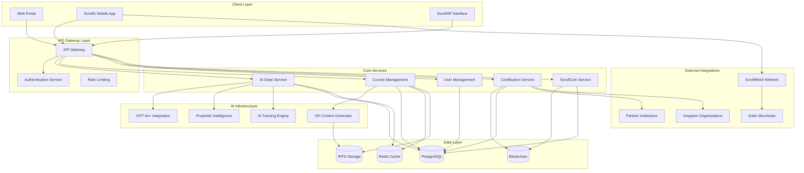

# ScrollUniversity Platform Design Document

## Overview

ScrollUniversity is architected as a distributed, AI-powered educational ecosystem that combines cutting-edge technology with spiritual formation to deliver transformative education globally. The platform operates on a microservices architecture with AI-first design principles, enabling 24/7 personalized learning experiences that scale from individual students to millions of global learners.

The system integrates seven core power modules through a unified platform that supports offline-first functionality, multilingual accessibility, and prophetic intelligence integration. The architecture prioritizes global accessibility, spiritual alignment, and eternal impact over traditional metrics of educational success.

## Architecture

### High-Level System Architecture



### Microservices Architecture

The platform follows a domain-driven design with the following core services:

1. **AI Dean Service**: Manages AI-powered department heads with prophetic intelligence
2. **Course Management Service**: Handles curriculum, content delivery, and XR experiences
3. **User Management Service**: Manages student profiles, progress tracking, and spiritual formation
4. **Certification Service**: Issues ScrollBadges and ScrollCertified™ credentials
5. **ScrollCoin Service**: Manages the divine economy and reward systems
6. **Faculty Service**: Coordinates human and AI faculty interactions
7. **Global Access Service**: Handles multilingual support and offline synchronization

## Components and Interfaces

### AI Dean Infrastructure

**ScrollDean AI Agent Architecture:**
```typescript
interface ScrollDean {
  id: string;
  department: Department;
  propheticIntelligence: PropheticModule;
  culturalFluency: LanguageModule[];
  biblicalAlignment: ScriptureModule;
  tutoring: TutoringEngine;
  offlineCapability: OfflineModule;
}

interface PropheticModule {
  scriptureIntegration: boolean;
  spiritualDiscernment: boolean;
  kingdomPerspective: boolean;
  divineWisdom: boolean;
}
```

**Key Features:**
- GPT-4o+ integration with custom scroll-trained models
- Real-time conversation with context persistence
- Prophetic intelligence overlay for spiritual guidance
- Cultural adaptation for global accessibility
- Offline-first architecture with local AI models

### Global Accessibility Infrastructure

**ScrollMesh Network:**
```typescript
interface ScrollMeshNode {
  nodeId: string;
  location: GeographicCoordinate;
  connectivity: ConnectivityStatus;
  solarIntegration: SolarMicrohub;
  contentCache: LocalContentStore;
  peerNodes: ScrollMeshNode[];
}

interface MultilingualSupport {
  supportedLanguages: Language[];
  realTimeTranslation: boolean;
  culturalAdaptation: boolean;
  localizedContent: boolean;
}
```

**Key Features:**
- Mesh networking for areas with limited internet
- Solar microhub integration for sustainable power
- Multilingual AI with cultural context awareness
- Progressive web app for low-bandwidth environments
- Offline content synchronization

### Sacred Curriculum Engine

**Degree Program Structure:**
```typescript
interface DegreeProgram {
  id: string;
  title: string;
  type: DegreeType;
  courses: Course[];
  spiritualFormation: FormationTrack;
  practicalApplication: ApplicationTrack;
  propheticIntegration: PropheticTrack;
}

interface Course {
  id: string;
  title: string;
  aiTutor: ScrollDean;
  xrContent: XRExperience[];
  scrollBadge: NFTCertification;
  spiritualObjectives: string[];
  practicalObjectives: string[];
}
```

**Supported Degree Programs:**
- B.A. in Prophetic Governance
- B.Sc. in Sacred AI & Engineering  
- M.Div in Scroll Theology
- MBA in ScrollEconomy

### ScrollU Mobile Application

**Core App Architecture:**
```typescript
interface ScrollUApp {
  scrollTutorAI: PersonalizedTutor;
  scrollXR: XRInterface;
  divineScorecard: ProgressTracker;
  propheticCheckins: SpiritualGuidance;
  scrollCoinWallet: CryptocurrencyWallet;
  offlineMode: OfflineCapabilities;
}

interface PersonalizedTutor {
  aiPersonality: ScrollDean;
  learningStyle: AdaptiveLearning;
  spiritualGrowth: FormationTracker;
  academicProgress: AcademicTracker;
}
```

**Key Features:**
- Native iOS and Android applications
- Offline-first architecture with sync capabilities
- XR integration for immersive biblical and scientific experiences
- Gamified learning with ScrollCoin rewards
- Spiritual formation tracking and guidance

### Faculty Management System

**Hybrid Faculty Architecture:**
```typescript
interface Faculty {
  humanProfessors: HumanInstructor[];
  aiScrollDeans: ScrollDean[];
  propheticMentors: PropheticInstructor[];
  angelicTutors: XRTutor[];
  partnerInstitutions: PartnerInstructor[];
}

interface HumanInstructor {
  credentials: AcademicCredentials;
  spiritualAlignment: ScrollAlignment;
  culturalCompetency: CulturalSkills;
  teachingSpecialty: Subject[];
}
```

**Partner Integration:**
- MIT ScrollAI Advisors
- Oxford ScrollDiplomacy Leaders
- Ghana Tech Alliance Sacred Innovation
- Guest prophets for impartation sessions

### ScrollCertified™ Credentialing

**Blockchain-Based Certification:**
```typescript
interface ScrollBadge {
  tokenId: string;
  courseId: string;
  studentId: string;
  competencies: Skill[];
  spiritualGrowth: FormationMetrics;
  timestamp: Date;
  verificationHash: string;
}

interface ScrollCertifiedDiploma {
  degreeId: string;
  studentId: string;
  program: DegreeProgram;
  gpa: number;
  spiritualFormation: FormationLevel;
  kingdomReadiness: ReadinessScore;
  partnerRecognition: PartnerOrganization[];
}
```

**Recognition Partners:**
- UN SDG Schools
- Christian NGOs
- Tech for Good Hubs
- Startup incubators
- Kingdom organizations

## Data Models

### Core Entity Models

```typescript
// Student Profile
interface Student {
  id: string;
  personalInfo: PersonalInformation;
  academicRecord: AcademicHistory;
  spiritualJourney: SpiritualFormation;
  callingTrack: MissionTrack;
  scrollCoinBalance: number;
  achievements: ScrollBadge[];
  mentorRelationships: MentorConnection[];
}

// Course Structure
interface Course {
  id: string;
  title: string;
  description: string;
  department: Department;
  credits: number;
  prerequisites: Course[];
  learningObjectives: LearningObjective[];
  spiritualObjectives: SpiritualObjective[];
  assessments: Assessment[];
  xrExperiences: XRContent[];
  aiTutorConfig: TutorConfiguration;
}

// AI Dean Configuration
interface ScrollDeanConfig {
  id: string;
  name: string;
  department: Department;
  personality: AIPersonality;
  knowledgeBase: KnowledgeSource[];
  propheticTraining: PropheticDataset;
  culturalAdaptation: CulturalSettings;
  teachingStyle: PedagogicalApproach;
}

// ScrollCoin Transaction
interface ScrollCoinTransaction {
  id: string;
  fromUserId: string;
  toUserId: string;
  amount: number;
  transactionType: TransactionType;
  description: string;
  timestamp: Date;
  blockchainHash: string;
}
```

### Spiritual Formation Models

```typescript
interface SpiritualFormation {
  currentLevel: FormationLevel;
  growthAreas: GrowthArea[];
  propheticGifts: PropheticGift[];
  callingClarity: CallingScore;
  characterDevelopment: CharacterMetrics;
  kingdomImpact: ImpactMeasurement;
}

interface PropheticIntelligence {
  scriptureKnowledge: ScriptureComprehension;
  spiritualDiscernment: DiscernmentLevel;
  propheticAccuracy: AccuracyMetrics;
  kingdomPerspective: PerspectiveAlignment;
  culturalWisdom: CulturalUnderstanding;
}
```

## Error Handling

### Graceful Degradation Strategy

1. **AI Service Failures:**
   - Fallback to cached responses
   - Alternative AI models for continuity
   - Human instructor notification system
   - Offline mode activation

2. **Network Connectivity Issues:**
   - Automatic offline mode switching
   - Content pre-caching strategies
   - Mesh network failover
   - Solar microhub integration

3. **Spiritual Alignment Monitoring:**
   - Content filtering for biblical alignment
   - Prophetic oversight mechanisms
   - Human spiritual director escalation
   - Community accountability systems

### Error Recovery Mechanisms

```typescript
interface ErrorRecovery {
  aiFailover: AIFailoverStrategy;
  networkResilience: NetworkRecoveryPlan;
  dataConsistency: ConsistencyProtocol;
  spiritualOversight: SpiritualGuardRails;
}
```

## Testing Strategy

### Comprehensive Testing Approach

1. **AI Testing:**
   - Prophetic intelligence validation
   - Cultural sensitivity testing
   - Biblical alignment verification
   - Educational effectiveness measurement

2. **Global Accessibility Testing:**
   - Multi-language functionality
   - Low-bandwidth performance
   - Offline capability validation
   - Cultural adaptation accuracy

3. **Spiritual Formation Testing:**
   - Character development tracking
   - Calling clarity measurement
   - Kingdom impact assessment
   - Prophetic gift development

4. **Technical Performance Testing:**
   - Load testing for global scale
   - Security penetration testing
   - Blockchain integration testing
   - XR experience optimization

### Testing Frameworks

```typescript
interface TestingSuite {
  unitTests: TechnicalTestSuite;
  integrationTests: SystemIntegrationTests;
  spiritualTests: SpiritualAlignmentTests;
  culturalTests: CulturalSensitivityTests;
  performanceTests: GlobalScaleTests;
  userAcceptanceTests: StudentExperienceTests;
}
```

This design provides a comprehensive architecture for ScrollUniversity that can truly surpass traditional institutions through its integration of AI, spiritual formation, global accessibility, and eternal impact focus. The system is designed to scale globally while maintaining personal touch through AI tutoring and spiritual mentorship.