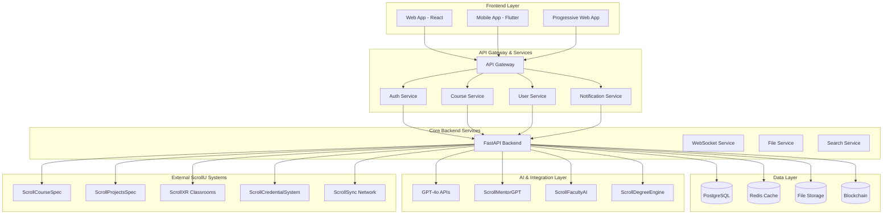
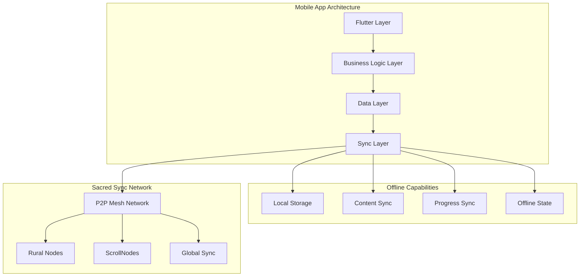

# ScrollUniversityPortal Design Document

## Overview

The ScrollUniversityPortal is the central web platform and mobile application serving as the primary interface for ScrollUniversity's prophetic, AI-powered global education system. The portal provides 100% online access with mobile-first design, offline capabilities, and sacred sync functionality across nine faculties serving kingdom youth, global remnant, and reformers worldwide.

The system leverages a modern tech stack with React frontend, FastAPI backend, PostgreSQL database, Redis caching, and GPT-4o AI integration to deliver seamless, scroll-governed education with multi-language support and comprehensive integration with the ScrollUniversity ecosystem.

## Architecture

### System Architecture



### Mobile-First Architecture



## Components and Interfaces

### Frontend Architecture (React + Flutter)

#### React Web Application Structure

```typescript
// Core Application Structure
export interface ScrollUniversityApp {
  // Authentication & User Management
  auth: AuthModule;
  user: UserModule;
  
  // Core Learning Features
  dashboard: DashboardModule;
  courses: CourseModule;
  degrees: DegreeModule;
  assessments: AssessmentModule;
  
  // AI & Tutoring
  aiTutors: AITutorModule;
  mentorship: MentorshipModule;
  
  // XR & Immersive Learning
  xrClassrooms: XRModule;
  virtualLabs: VirtualLabModule;
  
  // Administrative
  faculty: FacultyModule;
  admin: AdminModule;
  
  // Global Features
  scrollNodes: ScrollNodeModule;
  scholarships: ScholarshipModule;
  
  // Integration
  scrollCoin: ScrollCoinModule;
  credentials: CredentialModule;
}

// Multi-language Support
export interface LanguageConfig {
  code: string; // 'en', 'de', 'fr', 'tw', 'yo', 'ha', 'he', 'ar', 'zh'
  name: string;
  direction: 'ltr' | 'rtl';
  fallback: string;
  enabled: boolean;
}

export const SUPPORTED_LANGUAGES: LanguageConfig[] = [
  { code: 'en', name: 'English', direction: 'ltr', fallback: 'en', enabled: true },
  { code: 'de', name: 'Deutsch', direction: 'ltr', fallback: 'en', enabled: true },
  { code: 'fr', name: 'Français', direction: 'ltr', fallback: 'en', enabled: true },
  { code: 'tw', name: 'Twi', direction: 'ltr', fallback: 'en', enabled: true },
  { code: 'yo', name: 'Yorùbá', direction: 'ltr', fallback: 'en', enabled: true },
  { code: 'ha', name: 'Hausa', direction: 'ltr', fallback: 'en', enabled: true },
  { code: 'he', name: 'עברית', direction: 'rtl', fallback: 'en', enabled: true },
  { code: 'ar', name: 'العربية', direction: 'rtl', fallback: 'en', enabled: true },
  { code: 'zh', name: '中文', direction: 'ltr', fallback: 'en', enabled: true }
];
```

#### Flutter Mobile Application Structure

```dart
// Core Mobile App Architecture
class ScrollUniversityApp extends StatelessWidget {
  @override
  Widget build(BuildContext context) {
    return MaterialApp(
      title: 'ScrollUniversity',
      theme: ScrollTheme.light,
      darkTheme: ScrollTheme.dark,
      home: AuthWrapper(),
      routes: {
        '/dashboard': (context) => DashboardScreen(),
        '/courses': (context) => CoursesScreen(),
        '/ai-tutor': (context) => AITutorScreen(),
        '/xr-classroom': (context) => XRClassroomScreen(),
        '/profile': (context) => ProfileScreen(),
        '/offline': (context) => OfflineScreen(),
      },
    );
  }
}

// Offline-First Data Management
class OfflineDataManager {
  late Database _database;
  late ScrollSyncService _syncService;
  
  Future<void> syncWhenOnline() async {
    if (await ConnectivityService.isOnline()) {
      await _syncService.syncAllData();
    }
  }
  
  Future<List<Course>> getCachedCourses() async {
    return await _database.query('courses');
  }
}
```

### Backend Architecture (FastAPI + PostgreSQL + Redis)

#### FastAPI Service Structure

```python
# Main FastAPI Application
from fastapi import FastAPI, Depends, HTTPException
from fastapi.middleware.cors import CORSMiddleware
from fastapi.middleware.gzip import GZipMiddleware

app = FastAPI(
    title="ScrollUniversity Portal API",
    description="Prophetic AI-powered global university platform",
    version="1.0.0"
)

# Middleware Configuration
app.add_middleware(
    CORSMiddleware,
    allow_origins=["*"],  # Configure for production
    allow_credentials=True,
    allow_methods=["*"],
    allow_headers=["*"],
)
app.add_middleware(GZipMiddleware, minimum_size=1000)

# Core Service Modules
from services.auth_service import AuthService
from services.course_service import CourseService
from services.user_service import UserService
from services.ai_tutor_service import AITutorService
from services.xr_service import XRService
from services.scroll_coin_service import ScrollCoinService

# API Route Groups
app.include_router(auth_router, prefix="/api/v1/auth", tags=["authentication"])
app.include_router(courses_router, prefix="/api/v1/courses", tags=["courses"])
app.include_router(users_router, prefix="/api/v1/users", tags=["users"])
app.include_router(ai_tutors_router, prefix="/api/v1/ai-tutors", tags=["ai-tutors"])
app.include_router(xr_router, prefix="/api/v1/xr", tags=["xr-classrooms"])
app.include_router(admin_router, prefix="/api/v1/admin", tags=["administration"])
```

#### Database Schema Design

```sql
-- Core User Management
CREATE TABLE users (
    user_id UUID PRIMARY KEY DEFAULT gen_random_uuid(),
    email VARCHAR(255) UNIQUE NOT NULL,
    scroll_coin_wallet VARCHAR(255) UNIQUE,
    preferred_language VARCHAR(5) DEFAULT 'en',
    role VARCHAR(50) DEFAULT 'student',
    created_at TIMESTAMP DEFAULT CURRENT_TIMESTAMP,
    updated_at TIMESTAMP DEFAULT CURRENT_TIMESTAMP
);

-- Faculty and Department Management
CREATE TABLE faculties (
    faculty_id UUID PRIMARY KEY DEFAULT gen_random_uuid(),
    name VARCHAR(255) NOT NULL,
    description TEXT,
    ai_dean_id VARCHAR(255), -- Reference to AI Dean agent
    created_at TIMESTAMP DEFAULT CURRENT_TIMESTAMP
);

-- Course Integration with ScrollCourseSpec
CREATE TABLE portal_courses (
    portal_course_id UUID PRIMARY KEY DEFAULT gen_random_uuid(),
    course_spec_id UUID NOT NULL, -- Reference to ScrollCourseSpec
    faculty_id UUID REFERENCES faculties(faculty_id),
    featured BOOLEAN DEFAULT FALSE,
    enrollment_open BOOLEAN DEFAULT TRUE,
    created_at TIMESTAMP DEFAULT CURRENT_TIMESTAMP
);

-- Student Enrollments and Progress
CREATE TABLE enrollments (
    enrollment_id UUID PRIMARY KEY DEFAULT gen_random_uuid(),
    user_id UUID REFERENCES users(user_id),
    course_id UUID REFERENCES portal_courses(portal_course_id),
    enrollment_date TIMESTAMP DEFAULT CURRENT_TIMESTAMP,
    completion_date TIMESTAMP,
    progress_percentage DECIMAL(5,2) DEFAULT 0.00,
    xp_earned INTEGER DEFAULT 0,
    scroll_coins_earned DECIMAL(10,2) DEFAULT 0.00
);

-- AI Tutor Sessions
CREATE TABLE ai_tutor_sessions (
    session_id UUID PRIMARY KEY DEFAULT gen_random_uuid(),
    user_id UUID REFERENCES users(user_id),
    course_id UUID REFERENCES portal_courses(portal_course_id),
    tutor_type VARCHAR(100), -- ScrollMentorGPT, FacultyAI, etc.
    session_data JSONB,
    started_at TIMESTAMP DEFAULT CURRENT_TIMESTAMP,
    ended_at TIMESTAMP
);

-- ScrollNode Management
CREATE TABLE scroll_nodes (
    node_id UUID PRIMARY KEY DEFAULT gen_random_uuid(),
    name VARCHAR(255) NOT NULL,
    location VARCHAR(255),
    country VARCHAR(100),
    coordinator_id UUID REFERENCES users(user_id),
    status VARCHAR(50) DEFAULT 'active',
    sync_enabled BOOLEAN DEFAULT TRUE,
    created_at TIMESTAMP DEFAULT CURRENT_TIMESTAMP
);

-- Scholarship and Financial Aid
CREATE TABLE scholarships (
    scholarship_id UUID PRIMARY KEY DEFAULT gen_random_uuid(),
    name VARCHAR(255) NOT NULL,
    description TEXT,
    amount DECIMAL(10,2),
    currency VARCHAR(10) DEFAULT 'ScrollCoin',
    eligibility_criteria JSONB,
    application_deadline TIMESTAMP,
    created_at TIMESTAMP DEFAULT CURRENT_TIMESTAMP
);
```

#### Redis Caching Strategy

```python
# Redis Configuration and Caching Patterns
import redis
from typing import Optional, Any
import json

class ScrollRedisCache:
    def __init__(self):
        self.redis_client = redis.Redis(
            host='localhost',
            port=6379,
            db=0,
            decode_responses=True
        )
    
    # User Session Caching
    async def cache_user_session(self, user_id: str, session_data: dict, ttl: int = 3600):
        key = f"session:{user_id}"
        await self.redis_client.setex(key, ttl, json.dumps(session_data))
    
    # Course Data Caching
    async def cache_course_data(self, course_id: str, course_data: dict, ttl: int = 1800):
        key = f"course:{course_id}"
        await self.redis_client.setex(key, ttl, json.dumps(course_data))
    
    # AI Tutor Response Caching
    async def cache_ai_response(self, query_hash: str, response: str, ttl: int = 600):
        key = f"ai_response:{query_hash}"
        await self.redis_client.setex(key, ttl, response)
    
    # Real-time Notifications
    async def publish_notification(self, channel: str, message: dict):
        await self.redis_client.publish(channel, json.dumps(message))
```

## Data Models

### Core Portal Data Models

```typescript
// User and Authentication Models
export interface ScrollUser {
  user_id: string;
  email: string;
  scroll_coin_wallet: string;
  preferred_language: string;
  role: 'student' | 'faculty' | 'ai_dean' | 'admin' | 'global_ambassador';
  profile: UserProfile;
  enrollments: Enrollment[];
  achievements: Achievement[];
  created_at: string;
  updated_at: string;
}

export interface UserProfile {
  first_name: string;
  last_name: string;
  avatar_url?: string;
  bio?: string;
  location?: string;
  time_zone: string;
  scroll_node_id?: string;
  degree_programs: DegreeProgram[];
}

// Faculty and Department Models
export interface Faculty {
  faculty_id: string;
  name: string;
  description: string;
  ai_dean_id: string;
  courses: PortalCourse[];
  faculty_members: FacultyMember[];
  created_at: string;
}

export interface FacultyMember {
  member_id: string;
  user_id: string;
  faculty_id: string;
  title: string;
  specializations: string[];
  bio: string;
  office_hours: OfficeHours[];
}

// Course Integration Models
export interface PortalCourse {
  portal_course_id: string;
  course_spec_id: string; // Reference to ScrollCourseSpec
  faculty_id: string;
  title: string;
  description: string;
  level: 'Introductory' | 'Intermediate' | 'Advanced';
  duration_weeks: number;
  xp_reward: number;
  scroll_coin_cost: number;
  prerequisites: string[];
  featured: boolean;
  enrollment_open: boolean;
  enrollment_count: number;
  rating: number;
  created_at: string;
}

// Enrollment and Progress Models
export interface Enrollment {
  enrollment_id: string;
  user_id: string;
  course_id: string;
  enrollment_date: string;
  completion_date?: string;
  progress_percentage: number;
  xp_earned: number;
  scroll_coins_earned: number;
  current_lesson_id?: string;
  status: 'active' | 'completed' | 'paused' | 'dropped';
}

// AI Tutor Integration Models
export interface AITutorSession {
  session_id: string;
  user_id: string;
  course_id?: string;
  tutor_type: 'ScrollMentorGPT' | 'FacultyAI' | 'GeneralAI';
  faculty_context?: string;
  conversation_history: TutorMessage[];
  started_at: string;
  ended_at?: string;
  satisfaction_rating?: number;
}

export interface TutorMessage {
  message_id: string;
  sender: 'user' | 'ai';
  content: string;
  timestamp: string;
  context_data?: any;
}
```

### XR and Immersive Learning Models

```typescript
// XR Classroom Integration
export interface XRClassroom {
  classroom_id: string;
  course_id: string;
  session_name: string;
  description: string;
  instructor_id: string;
  scheduled_time: string;
  duration_minutes: number;
  max_participants: number;
  current_participants: number;
  xr_environment: XREnvironment;
  recording_enabled: boolean;
  status: 'scheduled' | 'live' | 'completed' | 'cancelled';
}

export interface XREnvironment {
  environment_id: string;
  name: string;
  description: string;
  scene_type: 'prophetic_temple' | 'angelic_realm' | 'historical_site' | 'laboratory' | 'custom';
  assets: XRAsset[];
  interactive_elements: InteractiveElement[];
}

export interface XRAsset {
  asset_id: string;
  name: string;
  type: '3d_model' | 'texture' | 'audio' | 'animation';
  url: string;
  metadata: any;
}
```

## Error Handling

### Comprehensive Error Management

```typescript
// Error Types and Handling
export interface PortalError {
  error_id: string;
  error_code: string;
  message: string;
  details?: any;
  timestamp: string;
  user_id?: string;
  request_id?: string;
}

export enum ErrorCodes {
  // Authentication Errors
  AUTH_INVALID_CREDENTIALS = 'AUTH_001',
  AUTH_TOKEN_EXPIRED = 'AUTH_002',
  AUTH_INSUFFICIENT_PERMISSIONS = 'AUTH_003',
  
  // Course Errors
  COURSE_NOT_FOUND = 'COURSE_001',
  COURSE_ENROLLMENT_CLOSED = 'COURSE_002',
  COURSE_PREREQUISITES_NOT_MET = 'COURSE_003',
  
  // Payment Errors
  SCROLLCOIN_INSUFFICIENT_BALANCE = 'PAY_001',
  SCROLLCOIN_TRANSACTION_FAILED = 'PAY_002',
  
  // Integration Errors
  AI_TUTOR_UNAVAILABLE = 'INT_001',
  XR_CLASSROOM_CONNECTION_FAILED = 'INT_002',
  SYNC_NETWORK_ERROR = 'INT_003',
  
  // System Errors
  DATABASE_CONNECTION_ERROR = 'SYS_001',
  CACHE_UNAVAILABLE = 'SYS_002',
  EXTERNAL_SERVICE_TIMEOUT = 'SYS_003'
}

// Error Recovery Strategies
export class ErrorRecoveryService {
  async handleError(error: PortalError): Promise<void> {
    switch (error.error_code) {
      case ErrorCodes.AI_TUTOR_UNAVAILABLE:
        await this.fallbackToBasicTutor(error.user_id);
        break;
      case ErrorCodes.XR_CLASSROOM_CONNECTION_FAILED:
        await this.provideFallback2DStream(error.details.classroom_id);
        break;
      case ErrorCodes.SYNC_NETWORK_ERROR:
        await this.enableOfflineMode(error.user_id);
        break;
      default:
        await this.logErrorAndNotifyAdmin(error);
    }
  }
}
```

## Testing Strategy

### Comprehensive Testing Approach

```typescript
// Frontend Testing (React + Jest + Testing Library)
describe('ScrollUniversityPortal', () => {
  describe('Authentication Flow', () => {
    it('should authenticate with ScrollCoin wallet', async () => {
      // Test ScrollCoin authentication
    });
    
    it('should handle multi-language authentication', async () => {
      // Test language-specific auth flows
    });
  });
  
  describe('Course Enrollment', () => {
    it('should validate prerequisites before enrollment', async () => {
      // Test prerequisite validation
    });
    
    it('should process ScrollCoin payments', async () => {
      // Test payment processing
    });
  });
  
  describe('Offline Functionality', () => {
    it('should cache course content for offline access', async () => {
      // Test offline caching
    });
    
    it('should sync progress when connectivity is restored', async () => {
      // Test sync functionality
    });
  });
});

// Backend Testing (FastAPI + pytest)
def test_course_enrollment_api():
    """Test course enrollment with ScrollCoin payment"""
    # Test API endpoint functionality

def test_ai_tutor_integration():
    """Test AI tutor session management"""
    # Test GPT-4o integration

def test_xr_classroom_scheduling():
    """Test XR classroom session management"""
    # Test XR integration
```

### Mobile Testing Strategy

```dart
// Flutter Integration Tests
void main() {
  group('ScrollUniversity Mobile App', () {
    testWidgets('should display dashboard after login', (WidgetTester tester) async {
      // Test mobile dashboard functionality
    });
    
    testWidgets('should work offline with cached content', (WidgetTester tester) async {
      // Test offline functionality
    });
    
    testWidgets('should sync data when online', (WidgetTester tester) async {
      // Test sync functionality
    });
  });
}
```

## Integration Points

### ScrollUniversity Ecosystem Integration

#### Core System Integrations

```python
# Integration with ScrollCourseSpec
class CourseSpecIntegration:
    async def get_course_details(self, course_spec_id: str) -> dict:
        """Fetch course details from ScrollCourseSpec system"""
        # Integration logic
    
    async def enroll_student(self, user_id: str, course_spec_id: str) -> bool:
        """Enroll student in ScrollCourseSpec course"""
        # Enrollment logic

# Integration with ScrollFacultyAI
class FacultyAIIntegration:
    async def get_ai_dean_response(self, faculty_id: str, query: str) -> str:
        """Get response from AI Dean for specific faculty"""
        # AI Dean integration
    
    async def schedule_ai_office_hours(self, faculty_id: str, student_id: str) -> dict:
        """Schedule AI office hours session"""
        # Scheduling logic

# Integration with ScrollXR Classrooms
class XRIntegration:
    async def create_xr_session(self, classroom_config: dict) -> str:
        """Create new XR classroom session"""
        # XR session creation
    
    async def join_xr_session(self, session_id: str, user_id: str) -> dict:
        """Join existing XR session"""
        # XR session joining logic
```

#### ScrollSync Network Integration

```python
# P2P Mesh Network for Offline-First Rural Nodes
class ScrollSyncService:
    def __init__(self):
        self.p2p_network = P2PNetwork()
        self.sync_queue = SyncQueue()
    
    async def sync_with_rural_nodes(self):
        """Sync content with rural ScrollNodes"""
        for node in await self.get_rural_nodes():
            await self.sync_node_content(node)
    
    async def distribute_content(self, content: dict):
        """Distribute content across mesh network"""
        await self.p2p_network.broadcast(content)
    
    async def handle_offline_progress(self, user_id: str, progress_data: dict):
        """Handle progress updates from offline users"""
        await self.sync_queue.add_progress_update(user_id, progress_data)
```

### External Integrations

#### GPT-4o AI Integration

```python
# AI Tutor Service with GPT-4o
class AITutorService:
    def __init__(self):
        self.openai_client = OpenAI(api_key=settings.OPENAI_API_KEY)
    
    async def get_tutor_response(self, user_query: str, context: dict) -> str:
        """Get personalized tutor response using GPT-4o"""
        system_prompt = self.build_scroll_tutor_prompt(context)
        
        response = await self.openai_client.chat.completions.create(
            model="gpt-4o",
            messages=[
                {"role": "system", "content": system_prompt},
                {"role": "user", "content": user_query}
            ],
            temperature=0.7,
            max_tokens=1000
        )
        
        return response.choices[0].message.content
    
    def build_scroll_tutor_prompt(self, context: dict) -> str:
        """Build ScrollUniversity-specific tutor prompt"""
        return f"""
        You are a ScrollUniversity AI tutor specializing in {context['faculty']}.
        You provide prophetic, wisdom-based education aligned with scroll principles.
        Current course: {context['course_title']}
        Student level: {context['student_level']}
        Learning objectives: {context['learning_objectives']}
        
        Provide helpful, encouraging, and scroll-aligned responses.
        """
```

This comprehensive design covers the complete ScrollUniversityPortal architecture with mobile-first design, offline capabilities, multi-language support, and full integration with the ScrollUniversity ecosystem. The system is designed to scale globally while maintaining the prophetic, scroll-governed educational vision.