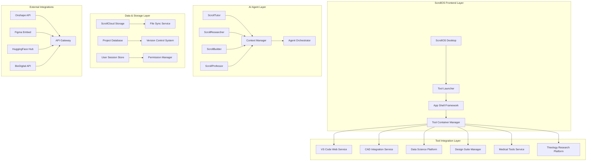

# ScrollOS Academic Tools Integration - Design Document

## Overview

The ScrollOS Academic Tools Integration system transforms ScrollUniversity into a unified academic platform by integrating professional-grade tools for every discipline. This design creates a browser-based ecosystem that eliminates the need for external applications while maintaining the power and functionality of industry-standard software.

The system follows a microservices architecture with containerized tool integration, AI-powered assistance, and seamless data flow between applications. Each academic tool is wrapped in a standardized ScrollOS container that provides consistent UI, security, and integration capabilities.

## Architecture

### High-Level Architecture



### Component Architecture

The system is built on a modular architecture with the following core components:

1. **ScrollOS App Shell Framework**: Provides standardized containers for all tools
2. **Tool Integration Modules**: Specific adapters for each academic tool
3. **AI Agent Ecosystem**: Context-aware assistants for each discipline
4. **Data Synchronization Layer**: Unified storage and version control
5. **Security and Permissions**: Role-based access with academic integrity

## Components and Interfaces

### ScrollOS App Shell Framework

**Purpose**: Provides a standardized container system for all academic tools with consistent UI, security, and integration capabilities.

**Key Components**:
- `AppManifestLoader`: Dynamically loads tool configurations
- `ToolContainer`: Standardized iframe/RPC wrapper for tools
- `UIStandardizer`: Ensures consistent navigation and controls
- `PermissionEnforcer`: Manages tool-specific access controls

**Interfaces**:
```typescript
interface ToolManifest {
  id: string;
  name: string;
  category: AcademicDiscipline;
  integrationMethod: 'iframe' | 'api' | 'rpc';
  permissions: ToolPermission[];
  aiAgents: AgentType[];
  dataFormats: SupportedFormat[];
}

interface ToolContainer {
  launch(manifest: ToolManifest, context: UserContext): Promise<ToolInstance>;
  communicate(message: ToolMessage): Promise<ToolResponse>;
  saveState(): Promise<ToolState>;
  restoreState(state: ToolState): Promise<void>;
}
```

### Computer Science Development Suite

**Purpose**: Provides comprehensive development environment with VS Code Web, terminals, and AI assistance.

**Key Components**:
- `VSCodeWebService`: Manages VS Code Web instances
- `CloudTerminalService`: Provides secure terminal access
- `ScrollCoderAI`: AI pair programming assistant
- `GitHubIntegrationService`: Repository management
- `APITestingService`: Postman-equivalent functionality

**Integration Points**:
- File system integration with ScrollCloud
- Real-time collaboration through WebRTC
- AI code completion and debugging
- Automated testing and deployment pipelines

### Engineering Design Platform

**Purpose**: Integrates CAD software, simulation tools, and circuit design for comprehensive engineering education.

**Key Components**:
- `OnshapeIntegrationService`: CAD software integration
- `SimScaleConnector`: Cloud-based simulation platform
- `CircuitVerseService`: Electronic circuit design
- `PhETSimulationService`: Physics simulation integration

**Data Models**:
```typescript
interface EngineeringProject {
  id: string;
  type: 'mechanical' | 'electrical' | 'civil';
  cadFiles: CADFile[];
  simulations: SimulationResult[];
  collaborators: ProjectMember[];
  version: string;
}

interface SimulationResult {
  id: string;
  type: SimulationType;
  parameters: SimulationParameters;
  results: ResultData;
  visualizations: Visualization[];
}
```

### Data Science Analytics Platform

**Purpose**: Provides statistical software, programming environments, and visualization tools for data analysis.

**Key Components**:
- `JASPIntegrationService`: Statistical analysis software
- `RStudioWebService`: R programming environment
- `JupyterLabService`: Python notebook environment
- `TableauPublicService`: Data visualization platform
- `ScrollQuantAI`: AI-powered analytics assistant

### Creative Design Suite

**Purpose**: Integrates professional design tools for creative and architectural disciplines.

**Key Components**:
- `FigmaEmbedService`: Collaborative design platform
- `BlenderWebService`: 3D modeling and animation
- `SketchUpWebService`: 3D design for architecture
- `ScrollDesignAI`: AI design assistant

### Medical Education Platform

**Purpose**: Provides anatomical models, medical imaging, and physiological simulators for health sciences education.

**Key Components**:
- `BioDigitalService`: 3D anatomy visualization
- `DICOMViewerService`: Medical imaging analysis
- `PhysiologySimulatorService`: Interactive body system models
- `ScrollMedAI`: Medical education AI tutor

### Theology Research Platform

**Purpose**: Offers biblical research tools, original language resources, and hermeneutical aids.

**Key Components**:
- `BibleAPIService`: Scripture text and cross-references
- `LexiconService`: Greek and Hebrew language tools
- `InterlinearService`: Original language text alignment
- `ScrollHermeneuticsAI`: Spirit-led biblical analysis

## Data Models

### Core Data Models

```typescript
interface AcademicWorkspace {
  userId: string;
  discipline: AcademicDiscipline[];
  tools: ToolInstance[];
  projects: Project[];
  preferences: WorkspacePreferences;
  aiAgentSettings: AgentConfiguration[];
}

interface Project {
  id: string;
  name: string;
  discipline: AcademicDiscipline;
  collaborators: ProjectMember[];
  files: ProjectFile[];
  tools: ToolUsage[];
  createdAt: Date;
  updatedAt: Date;
}

interface ToolInstance {
  id: string;
  manifestId: string;
  userId: string;
  projectId?: string;
  state: ToolState;
  permissions: ToolPermission[];
  aiAgents: ActiveAgent[];
}

interface ProjectFile {
  id: string;
  name: string;
  type: FileType;
  format: string;
  size: number;
  toolOrigin: string;
  versions: FileVersion[];
  sharedWith: SharingPermission[];
}
```

### Tool-Specific Data Models

```typescript
interface CodeProject extends Project {
  repository: GitRepository;
  language: ProgrammingLanguage;
  dependencies: Dependency[];
  buildConfiguration: BuildConfig;
}

interface DesignProject extends Project {
  designFiles: DesignFile[];
  assets: AssetLibrary;
  collaborationSettings: CollaborationConfig;
  exportFormats: ExportFormat[];
}

interface ResearchProject extends Project {
  datasets: Dataset[];
  analyses: AnalysisResult[];
  visualizations: Visualization[];
  publications: Publication[];
}
```

## Correctness Properties

*A property is a characteristic or behavior that should hold true across all valid executions of a system-essentially, a formal statement about what the system should do. Properties serve as the bridge between human-readable specifications and machine-verifiable correctness guarantees.*

### Property 1: Tool Container Isolation
*For any* two tool instances running simultaneously, modifications in one tool should not affect the state or data of another tool unless explicitly shared through the data integration layer
**Validates: Requirements 1.3, 8.2**

### Property 2: Data Synchronization Consistency
*For any* file saved in any tool, the file should be immediately available in ScrollCloud storage and accessible to compatible tools within the same project context
**Validates: Requirements 1.4, 10.1**

### Property 3: AI Agent Context Preservation
*For any* AI agent interaction, the agent should maintain awareness of the current tool, course context, and learning objectives throughout the entire session
**Validates: Requirements 9.3, 9.4**

### Property 4: Cross-Tool Data Format Compatibility
*For any* data created in one tool that claims compatibility with another tool, the data should be successfully importable and usable in the target tool without data loss
**Validates: Requirements 10.1, 10.4**

### Property 5: Permission Enforcement Consistency
*For any* user attempting to access a tool or resource, the system should enforce the same permission rules regardless of the access path or tool being used
**Validates: Requirements 8.2, 12.1**

### Property 6: Tool Performance Scaling
*For any* increase in concurrent users of a tool, the system should maintain response times within acceptable limits through automatic resource scaling
**Validates: Requirements 11.1, 11.2**

### Property 7: Academic Integrity Audit Trail
*For any* student action within any tool, the system should create tamper-proof audit logs that can be used for academic integrity verification
**Validates: Requirements 12.4, 12.5**

### Property 8: Offline-Online State Synchronization
*For any* work completed offline, when connectivity is restored, the system should successfully merge changes without data loss or corruption
**Validates: Requirements 11.3, 1.4**

### Property 9: Tool Integration API Consistency
*For any* new tool integrated into the system, it should successfully communicate with existing tools through the standardized API without requiring modifications to existing tools
**Validates: Requirements 8.1, 8.2**

### Property 10: Spiritual Alignment in AI Responses
*For any* AI agent response across all tools, the content should align with Christian worldview principles and ScrollUniversity's educational mission
**Validates: Requirements 9.4, 7.2**

## Error Handling

### Tool Integration Failures
- **Graceful Degradation**: If a tool fails to load, provide alternative tools or offline capabilities
- **Error Recovery**: Automatic retry mechanisms with exponential backoff
- **User Notification**: Clear error messages with suggested actions
- **Fallback Options**: Alternative tools or manual processes when primary tools fail

### Data Synchronization Errors
- **Conflict Resolution**: Automated merging with manual resolution for conflicts
- **Version Recovery**: Ability to restore previous versions when synchronization fails
- **Offline Queuing**: Queue operations when offline and sync when connectivity returns
- **Data Validation**: Verify data integrity before and after synchronization

### Performance and Scaling Issues
- **Resource Monitoring**: Real-time monitoring of tool performance and resource usage
- **Automatic Scaling**: Dynamic resource allocation based on demand
- **Load Balancing**: Distribute users across multiple instances of resource-intensive tools
- **Circuit Breakers**: Prevent cascade failures by isolating problematic services

## Testing Strategy

### Unit Testing Approach
- **Tool Container Testing**: Verify each tool container properly isolates and manages tool instances
- **API Integration Testing**: Test all external API integrations with mock services
- **Data Model Validation**: Ensure all data models properly serialize and deserialize
- **Permission System Testing**: Verify access controls work correctly for all user roles

### Property-Based Testing Requirements
- **Tool Integration Properties**: Use fast-check library for JavaScript/TypeScript
- **Minimum 100 iterations** per property test to ensure comprehensive coverage
- **Property Test Tagging**: Each test tagged with format: '**Feature: scrollos-academic-tools-integration, Property {number}: {property_text}**'
- **Data Generation**: Smart generators that create realistic academic project data
- **Cross-Tool Compatibility**: Generate data in one tool format and verify it works in compatible tools

### Integration Testing Strategy
- **End-to-End Workflows**: Test complete academic workflows across multiple tools
- **Cross-Tool Data Flow**: Verify data moves correctly between integrated tools
- **AI Agent Integration**: Test agent responses in context of specific tools and courses
- **Performance Testing**: Load testing with realistic academic usage patterns

### Specific Property-Based Tests

**Property Test 1: Tool Container Isolation**
```typescript
// **Feature: scrollos-academic-tools-integration, Property 1: Tool Container Isolation**
property('tool instances remain isolated', 
  fc.array(fc.record({
    toolId: fc.string(),
    userId: fc.string(),
    projectId: fc.string(),
    initialState: fc.object()
  }), {minLength: 2, maxLength: 10}),
  (toolInstances) => {
    // Test that modifications in one tool don't affect others
  }
);
```

**Property Test 2: Data Synchronization Consistency**
```typescript
// **Feature: scrollos-academic-tools-integration, Property 2: Data Synchronization Consistency**
property('files sync consistently across tools',
  fc.record({
    file: fc.record({
      name: fc.string(),
      content: fc.string(),
      format: fc.constantFrom('json', 'xml', 'csv', 'txt')
    }),
    tools: fc.array(fc.string(), {minLength: 1, maxLength: 5})
  }),
  ({file, tools}) => {
    // Test that file saved in one tool appears in all compatible tools
  }
);
```

The testing strategy ensures comprehensive validation of all tool integrations, data flows, and user interactions while maintaining the high standards required for academic use.