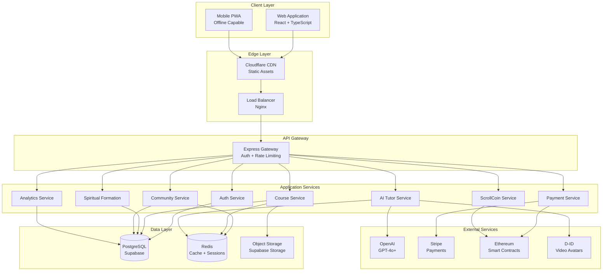
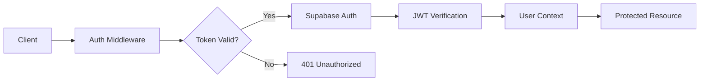
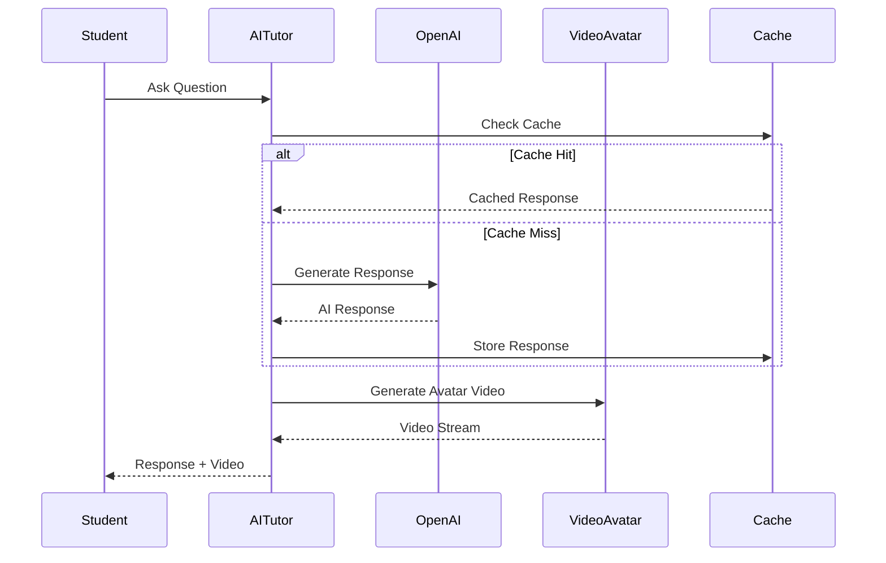
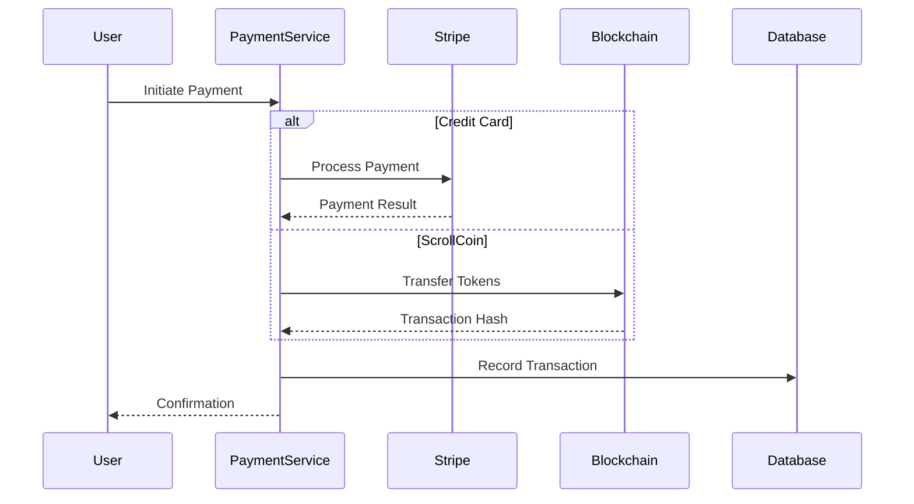
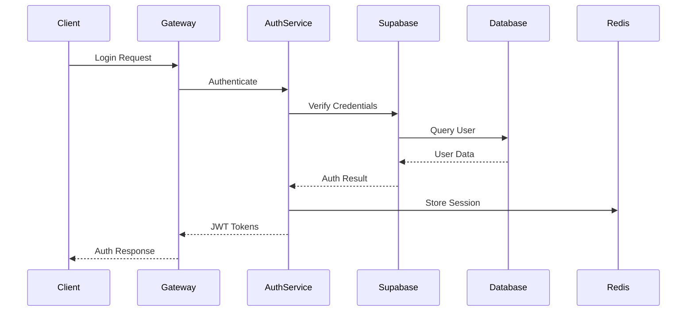
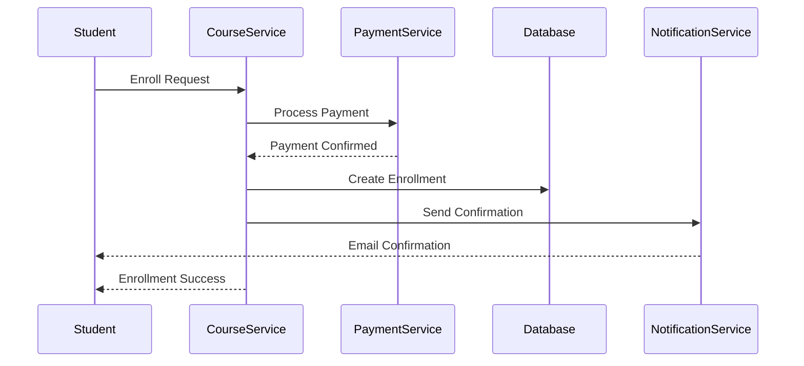
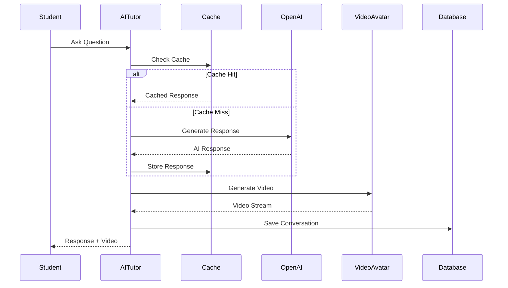
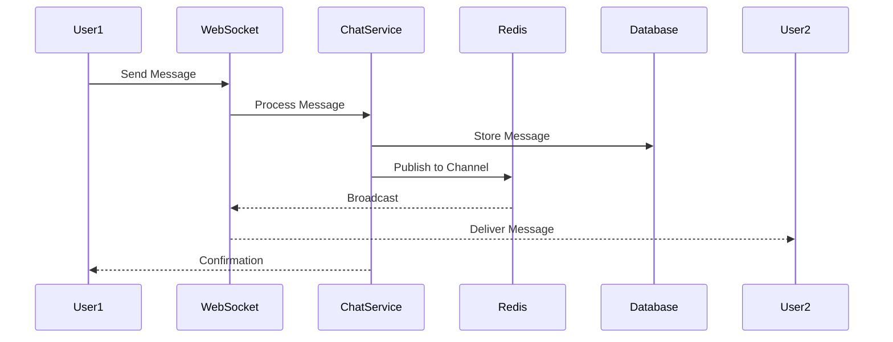

# ScrollUniversity Architecture Documentation

## Table of Contents

1. [System Overview](#system-overview)
2. [High-Level Architecture](#high-level-architecture)
3. [Component Architecture](#component-architecture)
4. [Data Flow](#data-flow)
5. [Security Architecture](#security-architecture)
6. [Scalability & Performance](#scalability--performance)
7. [Integration Architecture](#integration-architecture)

---

## System Overview

ScrollUniversity is built on a modern microservices architecture with the following key characteristics:

- **Scalable**: Horizontal scaling for all services
- **Resilient**: Circuit breakers and fallback mechanisms
- **Secure**: End-to-end encryption and RBAC
- **Observable**: Comprehensive monitoring and logging
- **Spiritual**: Kingdom-focused features integrated throughout

### Core Principles

1. **Service-Oriented Architecture**: Independent, loosely-coupled services
2. **API-First Design**: Well-defined contracts between services
3. **Event-Driven**: Real-time updates via WebSocket and Supabase Realtime
4. **Cloud-Native**: Containerized deployment on Kubernetes
5. **Spiritual Alignment**: All features support Kingdom education

---

## High-Level Architecture




## Component Architecture

### Backend Services

#### 1. Authentication Service
**Responsibility**: User authentication and authorization



**Key Features:**
- JWT token management with refresh rotation
- Social authentication (Google, Microsoft)
- Role-based access control (RBAC)
- Session management with Redis
- Email verification and password reset

#### 2. Course Service
**Responsibility**: Course content management and delivery

**Components:**
- Course CRUD operations
- Module and lecture management
- Video processing pipeline
- PDF generation for materials
- Content versioning
- Enrollment management

**Data Model:**
```
Course
├── Modules
│   ├── Lectures
│   │   ├── Video
│   │   ├── Notes (PDF)
│   │   ├── Transcript
│   │   └── Quizzes
│   ├── Assignments
│   └── Discussions
└── Metadata
```

#### 3. AI Tutor Service
**Responsibility**: AI-powered personalized tutoring



**Features:**
- Real-time conversation with context
- Video avatar integration
- Slide generation
- Quiz creation
- Lesson summarization
- Multiple tutor personalities


#### 4. Payment Service
**Responsibility**: Payment processing and financial transactions

**Integration Points:**
- Stripe for credit card processing
- Ethereum blockchain for ScrollCoin
- Database for transaction records
- Email service for receipts

**Transaction Flow:**


#### 5. Spiritual Formation Service
**Responsibility**: Spiritual growth and formation tools

**Components:**
- Daily devotion delivery
- Prayer journal management
- Scripture memory system
- Prophetic check-ins
- Growth tracking and analytics

**Features:**
- Timezone-aware devotion delivery
- Private and shared prayer requests
- Spaced repetition for scripture memory
- AI-powered spiritual guidance
- Progress visualization

---

## Data Flow

### User Authentication Flow



### Course Enrollment Flow



### AI Tutor Interaction Flow



### Real-time Chat Flow



---

## Security Architecture

### Authentication & Authorization

**Multi-Layer Security:**
```
┌─────────────────────────────────────────┐
│         Client Application              │
│  - JWT Token Storage                    │
│  - Automatic Token Refresh              │
└─────────────────────────────────────────┘
                  │
                  ▼
┌─────────────────────────────────────────┐
│          API Gateway                    │
│  - Rate Limiting                        │
│  - CORS Configuration                   │
│  - Request Validation                   │
└─────────────────────────────────────────┘
                  │
                  ▼
┌─────────────────────────────────────────┐
│      Authentication Middleware          │
│  - JWT Verification                     │
│  - Token Expiration Check               │
│  - User Context Loading                 │
└─────────────────────────────────────────┘
                  │
                  ▼
┌─────────────────────────────────────────┐
│      Authorization Middleware           │
│  - Role-Based Access Control            │
│  - Resource-Level Permissions           │
│  - Action Authorization                 │
└─────────────────────────────────────────┘
                  │
                  ▼
┌─────────────────────────────────────────┐
│         Protected Resource              │
└─────────────────────────────────────────┘
```

**Security Measures:**
1. **JWT Tokens**: Short-lived access tokens (15 min) with refresh rotation
2. **HTTPS Only**: All communications encrypted with TLS 1.3
3. **CORS**: Strict origin validation
4. **Rate Limiting**: Per-user and per-IP limits
5. **Input Validation**: All inputs sanitized and validated
6. **SQL Injection Prevention**: Parameterized queries via Prisma
7. **XSS Protection**: Content Security Policy headers
8. **CSRF Protection**: Token-based CSRF prevention

### Data Security

**Encryption:**
- **In Transit**: TLS 1.3 for all communications
- **At Rest**: AES-256 encryption for sensitive data
- **Database**: Encrypted database connections
- **Backups**: Encrypted backup storage

**Data Privacy:**
- **GDPR Compliance**: Data export and deletion capabilities
- **FERPA Compliance**: Student data protection
- **Audit Logging**: All sensitive operations logged
- **Data Minimization**: Only collect necessary data
- **Anonymization**: User data anonymized when deleted

---

## Scalability & Performance

### Horizontal Scaling

**Application Tier:**
```
┌──────────────────────────────────────────┐
│         Load Balancer (Nginx)            │
│      - Round Robin Distribution          │
│      - Health Checks                     │
│      - SSL Termination                   │
└──────────────────────────────────────────┘
                  │
        ┌─────────┼─────────┐
        │         │         │
        ▼         ▼         ▼
    ┌─────┐   ┌─────┐   ┌─────┐
    │App 1│   │App 2│   │App 3│
    └─────┘   └─────┘   └─────┘
        │         │         │
        └─────────┼─────────┘
                  │
                  ▼
        ┌──────────────────┐
        │  Database Cluster │
        └──────────────────┘
```

**Scaling Strategy:**
- **Auto-scaling**: Based on CPU and memory metrics
- **Stateless Services**: No server-side session state
- **Shared Cache**: Redis for distributed caching
- **Database Replication**: Read replicas for scaling reads
- **CDN**: Static assets served from edge locations

### Caching Strategy

**Multi-Level Caching:**
```
┌─────────────────────────────────────────┐
│         Browser Cache                   │
│  - Static assets (24 hours)             │
│  - API responses (5 minutes)            │
└─────────────────────────────────────────┘
                  │
                  ▼
┌─────────────────────────────────────────┐
│         CDN Cache                       │
│  - Images, videos, CSS, JS              │
│  - Edge caching (7 days)                │
└─────────────────────────────────────────┘
                  │
                  ▼
┌─────────────────────────────────────────┐
│         Redis Cache                     │
│  - API responses (1 hour)               │
│  - Session data (24 hours)              │
│  - AI responses (7 days)                │
└─────────────────────────────────────────┘
                  │
                  ▼
┌─────────────────────────────────────────┐
│         Database                        │
└─────────────────────────────────────────┘
```

**Cache Invalidation:**
- Time-based expiration
- Event-based invalidation
- Manual cache clearing
- Cache warming for popular content

### Performance Optimization

**Backend:**
- Database query optimization with indexes
- Connection pooling (max 100 connections)
- Async/await for non-blocking operations
- Batch processing for bulk operations
- Compression for API responses

**Frontend:**
- Code splitting by route
- Lazy loading of components
- Image optimization and lazy loading
- Virtual scrolling for long lists
- Service worker for offline caching

**Database:**
- Proper indexing on frequently queried fields
- Query optimization and EXPLAIN analysis
- Read replicas for read-heavy operations
- Partitioning for large tables
- Regular VACUUM and ANALYZE

---

## Integration Architecture

### External Service Integration

**OpenAI Integration:**
```typescript
interface OpenAIIntegration {
  model: 'gpt-4o-plus';
  maxTokens: 4000;
  temperature: 0.7;
  caching: true;
  fallback: 'gpt-4';
}
```

**Stripe Integration:**
```typescript
interface StripeIntegration {
  webhooks: {
    paymentSuccess: '/api/webhooks/stripe/payment-success';
    paymentFailed: '/api/webhooks/stripe/payment-failed';
    subscriptionUpdated: '/api/webhooks/stripe/subscription-updated';
  };
  retryLogic: {
    maxRetries: 3;
    backoff: 'exponential';
  };
}
```

**Blockchain Integration:**
```typescript
interface BlockchainIntegration {
  network: 'ethereum-mainnet';
  provider: 'infura';
  contracts: {
    scrollCoin: '0x...';
    scrollBadge: '0x...';
  };
  confirmations: 12;
}
```

### API Gateway Pattern

**Request Flow:**
```
Client Request
    │
    ▼
┌─────────────────┐
│  Rate Limiter   │
└─────────────────┘
    │
    ▼
┌─────────────────┐
│  Authentication │
└─────────────────┘
    │
    ▼
┌─────────────────┐
│  Authorization  │
└─────────────────┘
    │
    ▼
┌─────────────────┐
│  Request Logger │
└─────────────────┘
    │
    ▼
┌─────────────────┐
│  Service Router │
└─────────────────┘
    │
    ├─► Auth Service
    ├─► Course Service
    ├─► AI Tutor Service
    ├─► Payment Service
    └─► Other Services
```

---

## Monitoring & Observability

### Metrics Collection

**Application Metrics:**
- Request rate and latency
- Error rates by endpoint
- Database query performance
- Cache hit/miss rates
- AI service response times

**Business Metrics:**
- User registrations
- Course enrollments
- Payment transactions
- ScrollCoin circulation
- AI tutor usage

**Infrastructure Metrics:**
- CPU and memory usage
- Network throughput
- Disk I/O
- Database connections
- Redis memory usage

### Logging Strategy

**Log Levels:**
- **ERROR**: Application errors requiring attention
- **WARN**: Potential issues or degraded performance
- **INFO**: Important business events
- **DEBUG**: Detailed diagnostic information

**Log Aggregation:**
```
Application Logs
    │
    ▼
Winston Logger
    │
    ▼
Log Aggregation Service
    │
    ├─► Elasticsearch (storage)
    ├─► Kibana (visualization)
    └─► Alerting System
```

### Alerting

**Alert Categories:**
- **Critical**: Immediate action required (page on-call)
- **High**: Urgent attention needed (Slack notification)
- **Medium**: Should be addressed soon (email)
- **Low**: Informational (dashboard only)

**Alert Channels:**
- PagerDuty for critical alerts
- Slack for high-priority alerts
- Email for medium-priority alerts
- Dashboard for all alerts

---

## Disaster Recovery

### Backup Strategy

**Database Backups:**
- Full backup: Daily at 2 AM UTC
- Incremental backup: Every 6 hours
- Retention: 30 days
- Storage: Encrypted S3 buckets

**File Storage Backups:**
- Full backup: Daily at 3 AM UTC
- Retention: 30 days
- Storage: Separate S3 bucket

**Configuration Backups:**
- Version controlled in Git
- Automated backups weekly
- Retention: Indefinite

### Recovery Procedures

**Recovery Time Objectives (RTO):**
- Critical services: 1 hour
- Non-critical services: 4 hours
- Full system: 8 hours

**Recovery Point Objectives (RPO):**
- Database: 6 hours (incremental backup)
- File storage: 24 hours
- Configuration: Real-time (Git)

---

## Future Architecture Considerations

### Planned Enhancements

1. **Microservices Migration**: Gradual migration to full microservices
2. **Event-Driven Architecture**: Implement event sourcing for key domains
3. **GraphQL API**: Add GraphQL alongside REST
4. **Service Mesh**: Implement Istio for service-to-service communication
5. **Multi-Region Deployment**: Deploy to multiple geographic regions
6. **Edge Computing**: Move computation closer to users
7. **AI Model Hosting**: Self-host AI models for cost optimization

### Scalability Roadmap

**Phase 1 (Current)**: Monolithic with service layer
**Phase 2 (6 months)**: Microservices for AI and payment
**Phase 3 (12 months)**: Full microservices architecture
**Phase 4 (18 months)**: Multi-region deployment
**Phase 5 (24 months)**: Edge computing and CDN optimization

---

*Last Updated: December 2024*
*Version: 1.0.0*

